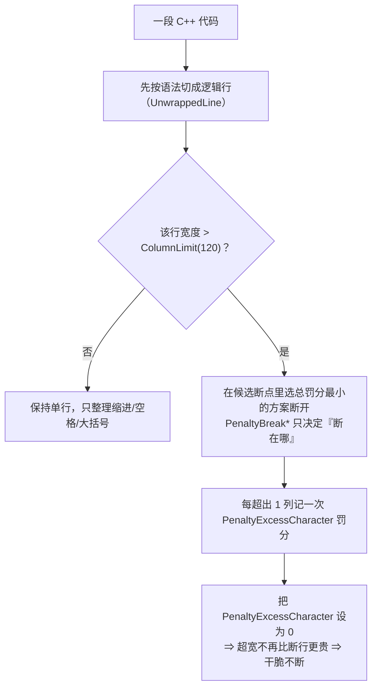

# clang-format：让「函数定义不被截断（折行）」——手工实施指南

> 本文件是「古法编程模式」（`.agents/skills/ancient-programming/SKILL.md`）的产出：只做只读分析 + 手把手教程。
> **仓库文件尚未被修改**：`.clang-format`、`.vscode/settings.json`、所有源码保持原样，下面每一步都由你亲手执行。
> 文中标注「实测」的结论，是 2026-09-13 在本机用两个 clang-format 版本对 `/tmp` 下的临时副本跑出的真实结果（命令见 [附录 A](#附录-a本次实验的可复现命令)，未触碰仓库文件）。

---

## 1. 结论速查

**问**：能不能加一条「函数定义不截断（不换行）」的规则？

**答**：**clang-format 没有「只对函数定义豁免列宽」的官方开关**。`ColumnLimit` 是全局的，而且一旦某行超宽，clang-format 会在最近的可断点**强制**断开；把各种 `Penalty*` 断行惩罚调大都改不了这一点（实测）。能真正达到效果的是下面这些做法：

| 方案 | 一句话说明 | 改动量 | 影响面 | 实测结果（135 列的函数定义） |
|---|---|---|---|---|
| **A** `// clang-format off` … `// clang-format on` | 给个别定义加两行注释 | 0 行配置 | 只影响被包裹的代码块 | 保持单行 139 列 ✅，块内一切格式都不再改动 |
| **B** `OneLineFormatOffRegex` + `// nowrap` 标记 | 配置 +1 行，定义上方 +1 行注释 | `.clang-format` 加 1 行 | 只影响带标记的那一行 | 保持单行 141 列 ✅，其它代码照常折行 |
| **C** `PenaltyExcessCharacter: 0` | 保留 120 列当「人类参考上限」，但不再因超宽而自动折行 | `.clang-format` 加 1 行 | **全局** | 保持单行 137 列 ✅；还会把已手写折行的定义**合并回单行** ✅ |
| **D** `ColumnLimit: 0` | 彻底取消列宽 | 改现有 1 行 | **全局** | 保持单行 ✅，但**不会**合并已有折行 ❌；带尾逗号的初始化列表会被炸成一列一行 ❌ |
| **E** 目录级 `.clang-format` | 只对某些目录放宽/关闭 | 新增 1 个文件 | 按目录划分 | 不能按「函数定义」划分 |
| **F** `BinPackParameters: false` | 断得更整齐（一个参数一行） | 改现有 1 行 | 需要断行时改变断法 | 仍然是折行（4 行），**不是**「不截断」 |

**推荐路线**

- 只有少数几个超长定义想保留单行 → **方案 A**（零配置、任何 clang-format 版本可用）。
- 希望「只要我加个标记就不折行」这种像规则一样的用法 → **方案 B**（需要 clang-format ≥ 21，本机 23.1.0 / 22.1.8 都满足）。
- 整个仓库都不希望被自动折行，并希望历史折行也被合回单行 → **方案 C**。
- 如果你其实想要的是「参数换行要整齐」而不是「不许换行」 → **方案 F**。

---

## 2. 现状核对（先确认事实，别凭印象改）

| 事实 | 依据 |
|---|---|
| 风格文件：仓库根 `.clang-format`，共 63 行 | `wc -l .clang-format` |
| `ColumnLimit: 120` 在第 6 行 | `grep -n ColumnLimit .clang-format` |
| `BinPackParameters: true` 第 40 行、`AllowAllParametersOfDeclarationOnNextLine: true` 第 42 行、`PenaltyBreakBeforeFirstCallParameter: 100000` 第 43 行 | 同上 |
| 文件最后一行（第 63 行）是 `...` | `tail -1 .clang-format` |
| VS Code 保存即格式化：`[c]` / `[cpp]` 的 `editor.formatOnSave: true`，`C_Cpp.clang_format_style: "file"`，`C_Cpp.clang_format_fallbackStyle: "none"` | `.vscode/settings.json` |
| **实际执行格式化的程序是 cpptools 内置的 clang-format 23.1.0**：`~/.vscode-server/extensions/ms-vscode.cpptools-1.34.4-linux-x64/LLVM/bin/clang-format` | 扩展自带文档说明：未设置 `C_Cpp.clang_format_path` 时，比较 PATH 中的版本与内置版本，**取较新的那个**；本机 PATH 是 22.1.8，内置 23.1.0 |
| 系统 `clang-format` = 22.1.8；`~/skywalker_ws/.venv/bin/clang-format` 也是 22.1.8 | `clang-format --version` |
| 仓库内没有任何 CI / 脚本调用 clang-format | `grep -rn clang-format`（无命中） |
| `.clang-format` 当前唯一的未提交改动是第 27 行 `BeforeElse: false → true`；末尾的 `...` 在 HEAD 里就已存在（不是本地误操作） | `git diff -- .clang-format`、`git show HEAD:.clang-format` |
| ⚠️ **当前工作区有大量未提交改动**：`drivers/`、`include/control/`、`lib/control/`、`samples/` 均有修改，还有一批新增/删除文件 | `git status --short` |

**含义**：你在编辑器里按保存时，用的是 23.1.0 的规则；用命令行验证时最好也显式用同一个二进制（下面命令里记为 `$CF`），否则可能「命令行说没问题、保存后结果不同」。

```bash
# 建议在每个终端会话开头设置一次
CF=/home/shm-white/.vscode-server/extensions/ms-vscode.cpptools-1.34.4-linux-x64/LLVM/bin/clang-format
"$CF" --version   # 期望：clang-format version 23.1.0
```

### 2.1 现状影响面（实测统计，只读预演）

用**当前配置 + 23.1.0** 对整个仓库做 `--dry-run`（不写盘）：

| 指标 | 数值 |
|---|---|
| 会被改写的文件 | **78 个** |
| 会被改写的具体位置（报告条数） | **2756 处** |
| 源码中已经超过 120 列的行 | **266 行** |

**结论**：这个仓库目前**远未**处于「clang-format 干净」状态。任何一次全量格式化都会产生巨大 diff，并把你手写的长行折开——例如 `include/control/motor_velocity.h:58` 那条参数很多的声明就在改写清单里，这正是你想解决的现象。所以：

- 先按 §11 走「dry-run → 单文件 → 全量」，别一步到位；
- 更不要把它和你手上未提交的功能改动混在一起。

换用其它方案后，影响面并不会变小（同一份预演命令，只替换风格文件路径）：

| 配置 | 报告位置数 | 涉及文件数 |
|---|---|---|
| 现状（`ColumnLimit: 120`） | 2756 | 78 |
| `PenaltyExcessCharacter: 0` | 2853 | 89 |
| `ColumnLimit: 0` | 2626 | 68 |
| `BinPackParameters: false` | 2847 | 86 |

原因：这些数字里既有「折行」类改写，也有缩进/空格类改写；方案 C 还会把历史折行合并回单行，所以改写点反而略有增加。

---

## 3. 机制：为什么「只让函数定义不换行」这么别扭



- `ColumnLimit` 不是「建议」，而是「超了就一定要找地方断」的**硬约束**。所以 `AllowAllParametersOfDeclarationOnNextLine`、`BinPackParameters`、`PenaltyBreakBeforeFirstCallParameter`、`PenaltyReturnTypeOnItsOwnLine` 这些参数只能影响**断点位置**，无法阻止断行（实测：把若干 `PenaltyBreak*` 全设为 0 后仍然照断）。
- 官方文档对 `PenaltyExcessCharacter` 的定义是「每超出一列的罚分」。把它设为 0，等于告诉 clang-format「超出列宽不扣分」，于是「不断行」成为最优解（实测吻合）。
- `ColumnLimit: 0` 的官方定义是「没有列宽限制；此时 clang-format 会尊重输入里已有的换行决定，除非与你其它规则冲突」。这正好解释了实测差异：它不会把已有折行合并，而 `PenaltyExcessCharacter: 0` 会。

> 术语：**逻辑行（UnwrappedLine）** 指 clang-format 眼里「属于同一句话」的 token 串，例如一条完整的函数定义（含参数列表和大括号）算一条逻辑行；换行只是把它排版成多行显示。

---

## 4. 方案 A：`// clang-format off` / `// clang-format on`（推荐给「少数长定义」）

**适用**：只有个别函数定义不想被拆行；不想动配置文件；不想受 clang-format 版本影响。

**怎么改**：在源码里给该定义（或一小段代码）加两行注释，例如 `lib/control/dm_motor_backend.cpp`：

```cpp
// clang-format off
void DmMotorBackend::updateFromFeedback(const dm_motor_feedback &feedback, uint32_t stamp_us, const dm_limits &limits, bool strict_mode)
{
    // ...
}
// clang-format on
```

**行为（实测）**：

- 区间内**完全不格式化**：不折行、不调整缩进、不动大括号位置（因此 `{` 放在哪一行由你自己决定）。
- 区间外照旧按 120 列处理。

**注意（容易踩）**：

1. `// clang-format on` 必须显式写回来；忘了写，它后面**整份文件**都不会再被格式化，而保存时不会有任何提示。
2. 注释可以带原因，例如 `// clang-format off // 长签名保持单行`。
3. 它也会关掉缩进整理，所以别把大段代码包进去，否则以后得手工对齐。

---

## 5. 方案 B：`OneLineFormatOffRegex` + `// nowrap` 标记（推荐的「规则」形态）

**适用**：想把「不折行」变成一条可随手使用的规则：只要在定义上一行写一句标记，就不折行。

**前提**：clang-format ≥ 21。本机两个版本（23.1.0 内置、22.1.8 系统）都满足（实测）。

### 5.1 改配置文件（唯一需要动的配置）

打开仓库根的 `.clang-format`，在**第 62 行 `FixNamespaceComments: false` 之后、第 63 行 `...` 之前**插入两行：

```yaml
# 允许用一行 `// nowrap` 标记豁免紧随其后那一行的换行处理（clang-format >= 21）。
OneLineFormatOffRegex: '^// *nowrap$'
```

改完后文件结尾应长这样：

```yaml
SortIncludes: false
IncludeBlocks: Preserve
ReflowComments: false
FixNamespaceComments: false

# 允许用一行 `// nowrap` 标记豁免紧随其后那一行的换行处理（clang-format >= 21）。
OneLineFormatOffRegex: '^// *nowrap$'
...
```

> ⚠️ **两个必须遵守的位置纪律**
> 1. 新键必须写在最后一行的 `...` **之前**。`...` 是 YAML 的「文档结束」标记（仓库 HEAD 里原本就有这一行）；写在它后面的内容会被丢弃，甚至直接报错 `Error reading .clang-format: Invalid argument`（实测）。
> 2. 不要重复写已有的键（例如再加一条 `ColumnLimit:`）。重复键会让 clang-format **完全拒绝工作**：`error: duplicated mapping key 'ColumnLimit'`（实测）。`PenaltyExcessCharacter` 当前不存在，可以放心新增。

### 5.2 在源码里使用

```cpp
// nowrap
void DmMotorBackend::updateFromFeedback(const dm_motor_feedback &feedback, uint32_t stamp_us, const dm_limits &limits, bool strict_mode)
{
    // ... 函数体仍然会被正常格式化
}
```

**行为（实测）**：被标记的下一行不再因超宽而断开（141 列保持单行）；文件其它位置仍按 120 列正常折行；函数体、缩进照常整理。

**细则（来自官方文档）**：

- 当匹配的注释**独占一行**时，clang-format 跳过该注释与**下一行**。
- 当匹配出现在**行尾**时，clang-format 跳过**本行**。

**风险**：

- 正则写错会有两种极端：完全不生效，或命中太多行导致大片代码不再排版。建议就用示例里的 `'^// *nowrap$'`，并且只写这一个正则。
- 若将来团队成员用 clang-format ≤ 20 格式化（例如 CI 固定了旧版本），该键是未知键，会导致配置文件解析失败 → 格式化整体失效。改用方案 A 可以规避这个版本问题。

---

## 6. 方案 C：`PenaltyExcessCharacter: 0`（全局「不再折行」，保留 120 当参考）

**适用**：整份代码都不想被自动折行；并且希望历史上被折开的定义也**自动合回单行**。

### 6.1 改配置文件

同样在 `.clang-format` 的 `FixNamespaceComments: false` 之后、`...` 之前插入：

```yaml
# 不再因超出 120 列而自动折行：把「超宽罚分」清零（ColumnLimit 仅作为人工参考）。
PenaltyExcessCharacter: 0
```

### 6.2 实测效果与代价

| 输入 | 现状 | 加了 `PenaltyExcessCharacter: 0` |
|---|---|---|
| 135 列的函数定义（单行） | 断成 109 + 53 两行 | 保持单行 137 列（含 `{`） |
| 已手写折行的函数定义（103 + 47） | 保持折行 | **合并回单行 131 列** |
| 126 列的函数调用语句 | 折成 2 行 | 保持单行 |
| 122 列的加法表达式语句 | 折成 2 行 | 保持单行 |
| 多行数组初始化表（每行 20 个数） | 保持 2 行 | 保持 2 行（未被破坏） |

**结论**：这实际上是「全项目取消自动折行」。它符合 `.clang-format` 顶部注释「Prefer horizontal readability」的精神，但请同步修改注释避免误导：

```yaml
# Prefer horizontal readability. 列宽 120 仅作人工参考；
# 超宽不再自动折行（见文件末尾 PenaltyExcessCharacter），以保持函数定义等长签名完整可读。
ColumnLimit: 120
```

**何时不适合**：如果团队里有人依赖自动折行来控制行宽（比如 review、并排 diff、121+ 列的终端），这条路会把所有长行留下来。

---

## 7. 方案 D：`ColumnLimit: 0`（彻底关闭列宽）——与 C 的关键差异

改**第 6 行**：

```yaml
ColumnLimit: 0
```

（必须**修改这一行**，绝对不能在文件末尾再追加一条 `ColumnLimit:`，否则重复键报错、格式化整体失效。）

**与方案 C 的实测差异**：

- 不会合并已存在的折行：把 103 + 47 的折行定义喂给它，输出仍是折开的（方案 C 会合成一行）。
- 会把带结尾逗号的多行初始化列表「炸开」成每行一个元素（实测），可能和你的排版预期冲突。
- 想真正「格式化器不再决定换行」时用它；想「尽量保持单行」用方案 C。

---

## 8. 方案 E：目录级 `.clang-format`（只能按目录划分，不能按函数）

**适用**：只想让某几个目录（例如 `lib/control/`、`applications/sentry_chassis/`）采用不同策略，其它目录保持现状。

在目标目录下新建同名文件（例如 `lib/control/.clang-format`）：

```yaml
---
BasedOnStyle: InheritParentConfig
# 只覆盖要改的键；其余全部继承仓库根 .clang-format
PenaltyExcessCharacter: 0
---
Language: Cpp
```

**注意**：

- 子目录里的 `.clang-format` 默认**会取代**父目录的配置；一定要写 `BasedOnStyle: InheritParentConfig` 才是「继承 + 覆盖」，否则你会在该目录里退回 LLVM 默认风格（缩进 2、列宽 80）。
- 它只能按目录生效，无法区分「这一行是函数定义还是普通语句」。

---

## 9. 方案 F：如果其实想要「断得整齐」而不是「不截断」

把**第 40 行**改成：

```yaml
BinPackParameters: false
```

实测输出（135 列定义）：

```cpp
static void swerve_update(const swerve_kinematics_input *input,
                          swerve_chassis_odometry *out,
                          uint32_t ts_us,
                          const swerve_config *cfg) {
```

也就是「一个参数一行、对齐在左括号后面」。这仍然是截断，只是截得整齐——如果你要的是这个观感，选它。

---

## 10. 常见误解（别踩）

| 你可能会想用的选项 | 实际作用 |
|---|---|
| `BreakFunctionDefinitionParameters` | 名字很像，但它是 **强制**换行（`true` 时），默认 `false`；它不能用来「不换行」。 |
| `BreakAfterOpenBracketFunction: true` | 强制 `foo(\n    args)` 风格（clang-format ≥ 22），同样与目标相反。 |
| `AllowAllParametersOfDeclarationOnNextLine` / `BinPackParameters` / `PenaltyBreak*` / `PenaltyReturnTypeOnItsOwnLine` | 只影响「断在哪、怎么断」；无法阻止超过 120 列后的断行（实测）。 |
| 在 `.clang-format` 末尾追加新键 | 文件末尾那行 `...` 是 YAML 文档结束符；追加在其后的规则会被丢弃或报错（实测）。 |
| 再加一条 `ColumnLimit:` | 重复键 → `duplicated mapping key` → clang-format 拒绝格式化，编辑器表现为「保存时什么都没发生」。 |
| 把 `ColumnLimit` 调大到 200 | 有用但不精准：它同时放宽所有代码，也仍然会在超过 200 时断行。 |

---

## 11. 施工步骤（以方案 B 为例；A / C / D / F 只需替换第 3 步的编辑内容）

1. **先处理未提交改动**（非常重要）：
   ```bash
   cd /home/shm-white/skywalker_ws/skywalker_code
   git status --short
   ```
   **实测当前工作区已经很"脏"**：`drivers/`、`include/control/`、`lib/control/`、`samples/` 等多处被修改，还有新增/删除文件。此时**不要**执行全量 `clang-format -i`——格式化 diff 会和这些未完成的改动混在一起，之后无法分辨、无法回滚。
   正确顺序：先把现有工作 `git add -A && git commit`（或 `git stash`），确认干净后再继续。方案 A（只加源码注释）不受影响，但注释本身也应随你当前的改动一起提交。

2. **想清楚要走的方案**：A（源码注释）/ B（标记 + 配置）/ C（全局罚分）/ D（全局列宽）/ F（整齐折行）。

3. **编辑 `.clang-format`**（方案 B/C 都是在 `FixNamespaceComments: false` 与 `...` 之间插入；方案 D 改第 6 行；方案 F 改第 40 行）。

4. **验证配置真的被读到**（这一步能立刻发现 `...` 陷阱和重复键问题）：
   ```bash
   cd /home/shm-white/skywalker_ws/skywalker_code
   CF=/home/shm-white/.vscode-server/extensions/ms-vscode.cpptools-1.34.4-linux-x64/LLVM/bin/clang-format
   "$CF" -style=file -assume-filename=lib/control/motor_control.cpp -dump-config \
     | grep -nE "ColumnLimit|PenaltyExcessCharacter|OneLineFormatOffRegex|BinPackParameters"
   ```
   期望：能看到你写的键和值；若报 `Error reading .clang-format`，回到第 3 步检查位置/重复键。

5. **单文件试跑**（不要一上来就全量格式化）：
   ```bash
   "$CF" -style=file -i lib/control/motor_control.cpp   # -i 表示就地修改
   git --no-pager diff --stat
   git --no-pager diff lib/control/motor_control.cpp
   ```
   不满意就 `git checkout -- lib/control/motor_control.cpp` 再来。

6. **全仓库预演**（只报告「哪些文件会被改」，不写盘）：
   ```bash
   cd /home/shm-white/skywalker_ws/skywalker_code
   find . \( -name .git -o -name build -o -name .venv \) -prune -o -type f \
     \( -name '*.c' -o -name '*.cpp' -o -name '*.h' -o -name '*.hpp' \) -print0 \
   | xargs -0 "$CF" -style=file --dry-run -Werror 2>&1 | head -40
   ```
   `-Werror` 会让「需要改动」变成报错输出，每条形如：
   ```text
   ./include/control/motor_velocity.h:58:114: error: code should be clang-formatted [-Wclang-format-violations]
   ```
   并会打印该行源码；据此可以逐条判断「这条改写我能否接受」。

7. **正式全量格式化**（确认无误后）：
   ```bash
   cd /home/shm-white/skywalker_ws/skywalker_code
   find . \( -name .git -o -name build -o -name .venv \) -prune -o -type f \
     \( -name '*.c' -o -name '*.cpp' -o -name '*.h' -o -name '*.hpp' \) -print0 \
   | xargs -0 "$CF" -style=file -i
   git --no-pager diff --stat
   ```

8. **分两次提交**（好 review、好回滚）：
   ```bash
   git add .clang-format && git commit -m "chore: 函数定义不再自动折行"
   git add -A && git commit -m "style: 应用新的格式化规则"
   ```

9. **让编辑器使用新规则**：保存任一 `.cpp` 观察签名是否保持单行。若行为没变，先回到第 4 步确认配置可解析；仍有问题再执行命令面板的 `Developer: Reload Window`。

10. **回滚**：
    ```bash
    git revert <提交哈希>            # 温和回滚（推荐）
    # 或彻底丢弃：
    git checkout HEAD~2 -- .clang-format && git checkout HEAD~2 -- .
    ```

---

## 12. 自检清单

- [ ] `"$CF" -style=file -assume-filename=lib/control/motor_control.cpp -dump-config` 无报错，且能看到新增键。
- [ ] `.clang-format` 中新增的键位于 `FixNamespaceComments: false` 之后、`...` 之前。
- [ ] `.clang-format` 中没有重复键（同一键只出现一次）。
- [ ] 单文件试跑后 `git diff` 的内容符合预期（例如方案 B：只有带 `// nowrap` 的定义没被折行）。
- [ ] 未给已有折行定义造成意外合并（方案 C/D 的差异见 §6/§7）。
- [ ] 全仓库 dry-run 列表里没有 `build/`、第三方代码等不该动的目录。
- [ ] 配置改动与格式化结果分成了两个提交。
- [ ] 保存任意 `.cpp` 文件，编辑器行为与命令行一致。

---

## 13. 风险与安全说明

- **格式化是大范围操作**：全量 `-i` 可能产生成百上千行 diff，务必在干净工作区、单独分支上做，先 dry-run 再执行。
- **不要连带格式化生成物和第三方代码**：`build/`、`modules/`、Zephyr 上游源码不应被本仓库的 `.clang-format` 改。
- **配置解析失败 = 静默失效**：`.vscode/settings.json` 里 `C_Cpp.clang_format_fallbackStyle` 是 `none`；一旦 `.clang-format` 有 YAML 错误，保存时不会套用任何风格（你只会看到「代码没被整理」）。
- **版本依赖**：方案 B 的 `OneLineFormatOffRegex` 需要 clang-format ≥ 21。若其他同事 / CI 使用更旧版本，会因未知键导致配置解析失败；这种情况请改用方案 A。
- **本指南不涉及电机、上电、CAN 等硬件操作**；格式化只在主机侧修改文本，不改语义，但仍建议提交后编译一次确认（`west build` 由你手动执行）。
- 不要用编辑器「保存即格式化」批量重排尚未提交的调试代码，容易把调试改动混进格式化 diff。

---

## 附录 A：本次实验的可复现命令

实验全部在 `/tmp/skyfmt` 下进行，仓库文件只读。

```bash
CF=/home/shm-white/.vscode-server/extensions/ms-vscode.cpptools-1.34.4-linux-x64/LLVM/bin/clang-format
BASE=/home/shm-white/skywalker_ws/skywalker_code/.clang-format

mkdir -p /tmp/skyfmt/{base,excess0,nolimit,off}
for d in base excess0 nolimit off; do sed '$d' "$BASE" > /tmp/skyfmt/$d/.clang-format; done   # 去掉末尾 ...
printf 'PenaltyExcessCharacter: 0\n' >> /tmp/skyfmt/excess0/.clang-format
sed -i 's/^ColumnLimit: 120$/ColumnLimit: 0/' /tmp/skyfmt/nolimit/.clang-format
printf "OneLineFormatOffRegex: '^// *nowrap$'\n" >> /tmp/skyfmt/off/.clang-format

cat > /tmp/skyfmt/t.cpp <<'EOF'
static void swerve_update(const swerve_kinematics_input *input, swerve_chassis_odometry *out, uint32_t ts_us, const swerve_config *cfg)
{
    (void)input;
}
EOF

for d in base excess0 nolimit; do
  echo "===== $d =====";
  "$CF" -style=file -assume-filename=/tmp/skyfmt/$d/t.cpp < /tmp/skyfmt/t.cpp | awk '{printf "%3d|%s\n", length($0), $0}';
done
```

关键观察（行长标注为实测值）：

| 变体 | 输出行长 | 说明 |
|---|---|---|
| `base` | `109|… uint32_t ts_us,` + `53|… const swerve_config *cfg) {` | 超 120 被拆成两行 |
| `excess0` | `137|static void swerve_update(…) {` | 单行完整保留 |
| `nolimit` | `137|static void swerve_update(…) {` | 单行完整保留（但不会合并已有折行） |
| `off` + `// nowrap` | `141|…` | 仅标记行豁免 |
| 任意变体 + `// clang-format off/on` | `139|…` | 区间内原样保留 |

失败示例（用于自查）：

```bash
# 在 ... 之后追加 → Error reading .clang-format: Invalid argument
# 重复写 ColumnLimit  → error: duplicated mapping key 'ColumnLimit'
```
