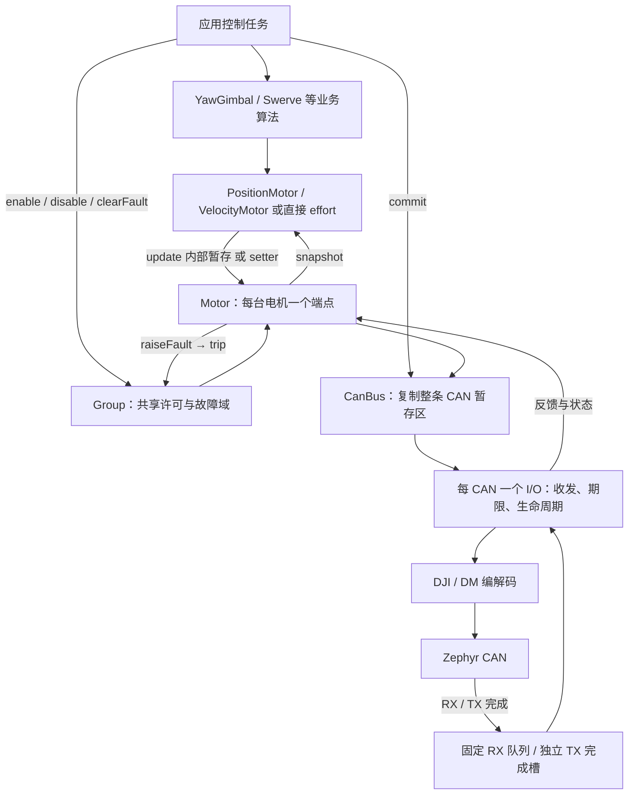
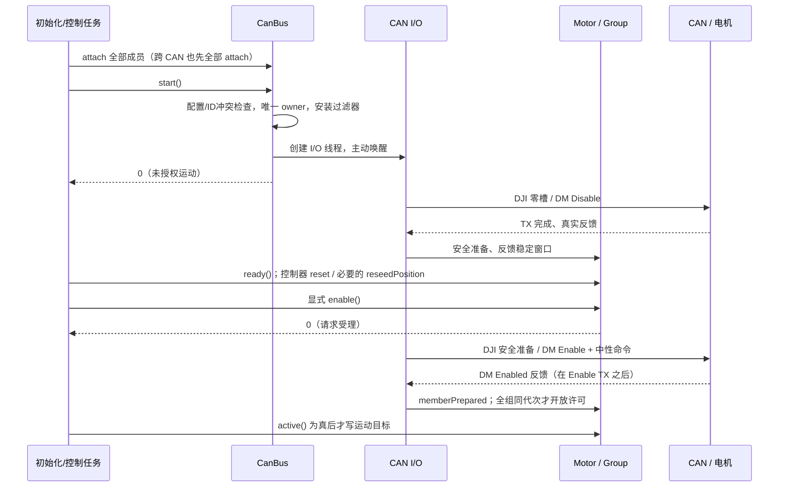
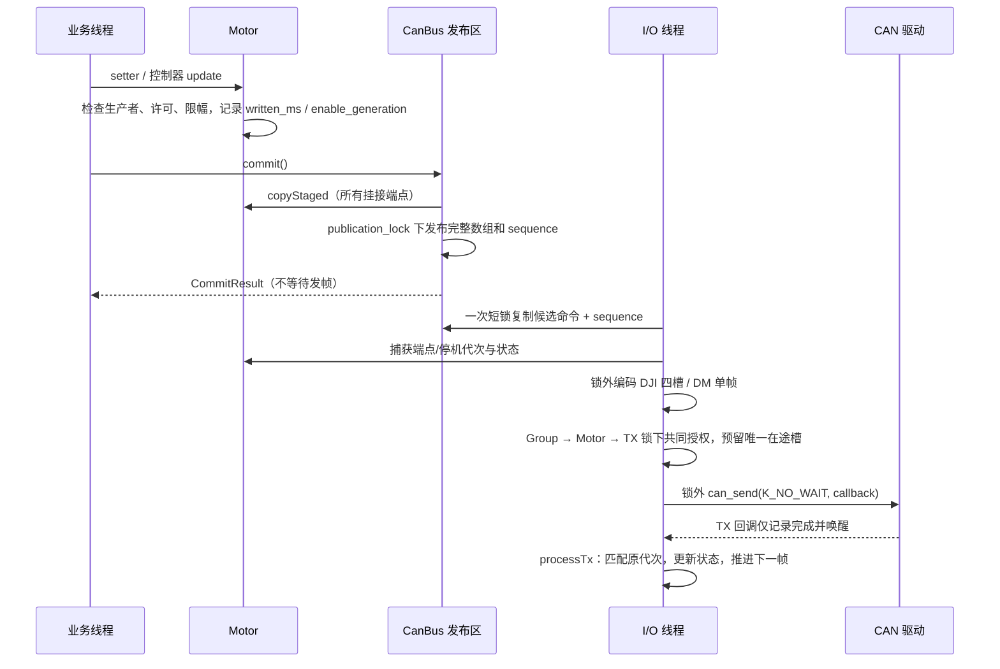
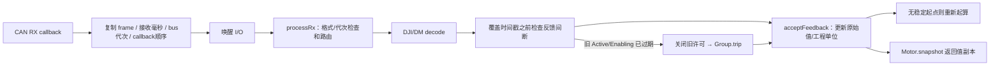
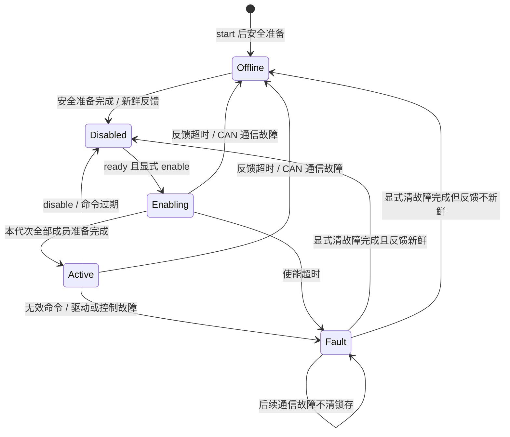

# 17 电机驱动工作链路、并发与调用示例

本文对应当前工作区的统一电机驱动，包含发送候选、反馈超时、故障锁存和期限调度修复。公开 API 保持 `Motor / Group / CanBus / PositionMotor / VelocityMotor`。图表示调用关系和异步事件，不表示电机已在真实硬件上完成验收。

交互入口：[架构浏览器的电机工作链路](architecture-browser/index.html#motor-workflow)。先读对象关系，再按启动、命令、反馈、停机和恢复顺序阅读。型号与字节编码分别见 [DJI](04-drivers-motor-dji.md)、[DM](05-drivers-motor-dm.md)，控制器参数见 [09 控制封装](09-motor-wrapper.md)。

## 1. 谁负责什么

| 模块 | 输入 → 输出 | 执行上下文 | 源码 |
| --- | --- | --- | --- |
| 应用 / robotics | 遥控、策略、状态 → 目标、启停请求 | 应用配置的控制线程 | `samples/robotics/gimbal_control/src/main.cpp`、`lib/robotics/` |
| PositionMotor / VelocityMotor | 目标、真实 dt、Motor 快照 → A 或 N·m | 调用 update 的业务线程 | `lib/control/motor_control.cpp` |
| Motor | 配置、反馈、命令 → 暂存区、状态与停机报告 | 业务 API 与所属 CAN I/O；短锁保护数据 | `drivers/motor/motor.cpp` |
| Group | 使能请求、成员准备/故障 → 全组许可与代次 | 请求线程或任一成员 I/O | `drivers/motor/group.cpp` |
| CanBus | 所有端点暂存命令 → 发布快照、CAN 帧 | commit 在调用方，发送/恢复在 I/O | `drivers/motor/can_bus.cpp` |
| DJI / DM 编解码 | 工程单位 / 字节 → CAN 帧 / 反馈 | I/O 线程调用普通函数 | `drivers/motor/{dji,dm}/` |
| Zephyr CAN | 帧、发送请求 → RX/TX 回调 | 底层驱动；RX 按 ISR 约束，TX 也可能在取消调用中 | 锁定版本的 `zephyr/include/zephyr/drivers/can.h` |



每个物理 CAN 只有一个 CanBus owner；同一 CAN 可以同时挂 DJI 与 DM，多个 Group 可以共享帧。Group 不拥有 CAN、PID 或线程，跨 CAN 的 Group 也不保证各成员同时收到命令。

## 2. 启动与使能



`start()` 成功时 I/O 已可能运行；初始化后不能再修改绑定关系。对象应静态存活到应用结束。控制器 `configure()` 在 start 之后调用，但不必等首次反馈；reset、使能和目标更新各有自己的反馈条件。

DM 的中性命令按持久模式选择：MIT 零增益/零前馈、速度零、位置速度模式当前原生位置加零速度上限。其机械行为仍需对应固件和机构验证。

## 3. 一个控制周期怎样发出去



诊断兼容性：普通目标的 `TxResult.sequence` 对应 commit 序号；独立安全、Enable、Probe 和 ClearFault 的公开序号仍为 0，结合 `purpose` 和端点停机代次判断动作。内部候选仍保留编码时使用的发布序号，安全 DJI 帧中的健康槽也不会逐槽混批。

三个不同含义不能混淆：setter 成功是“暂存成功”；commit 成功是“发布成功”；TX 成功是“这帧完成发送”。它们都不等于电机已经到位或停止。

### 候选与授权为什么分开

`TxCandidate` 保存在 CanBus 内部，包含帧、sequence、bus generation，以及实际涉及端点的命令、状态、enable generation 和 stop generation。一次编码只读这份候选，不逐槽重读不断变化的发布区。

发送前按固定顺序获取涉及的 Group 锁，再取端点锁，最后取 TX 锁。在同一临界区验证候选仍属于当前代次、运动许可和时间有效，并预留唯一发送槽。Group 采用统一地址顺序，跨 CAN 的 worker 也遵循同一顺序。锁外调用 CAN API，不持锁等待硬件。

若候选已失效，内部返回 `-EAGAIN` 并重新安排处理。普通目标恢复待处理机会，安全请求则始终保存在端点上；不会通过给旧帧补上新代次来“修正”它。这个内部重试不改变公开 commit 的含义。

### DJI 同帧、不同 Group

四个 slot 取自同一发布快照，再按各端点许可过滤：需要停机的 slot 为零，健康独立组的 slot 可以继续非零。安全完成只结算帧中确实承载安全动作的端点。故障组不能用邻居的非零 slot 来确认自己已经停机。

## 4. 反馈链与时间



时间戳保留回调接收时刻，不以线程处理时刻刷新；积压的旧帧不应冒充新鲜反馈。超时阈值采用严格 `间隔 > timeout_ms`，不是相等即到期。DM 用回调顺序号区分同一毫秒内 RX 与 TX 的先后。

反馈恢复只能开始恢复观察，不能抹掉已经发生的超时。通信稳定计时与连续位置参考独立：即使快速 CAN stop/start 后反馈间隔未超过时限，清空的稳定起点也会重新起算；位置参考不会因此自动变可信。

## 5. 停机、故障和恢复



图简化了所有状态都可接收的停机请求。`Disabled` 不等于 ready，ready 还要求安全准备、反馈新鲜和稳定窗口等条件。位置控制另外要求可信参考。

| 事件 | 驱动动作 | 恢复责任 |
| --- | --- | --- |
| 单端点反馈过期 | 撤销该端点/Group，安排安全输出 | 稳定反馈、可信参考、业务显式 enable |
| 命令写入或 commit 停止 | 已发布命令按原 written_ms 过期；反复 commit 不续命 | 新业务意图和新使能 |
| CAN TX 错误 / RX 溢出 / bus-off | 整 CAN 撤销，传播跨 CAN Group，清发布区，stop/取消后 start | I/O 恢复通信；应用决定重新运动 |
| InvalidCommand / DriveFault / ControlRejected 等 | 锁存 Fault，保存首次需清除的根因 | clearFault → 安全准备/稳定 → 显式 enable |
| Fault 后再通信故障 | 保留 Fault 与根因，继续撤销输出 | 通信恢复不能代替 clearFault |

CAN stop 失败或取消回调未终结时，不复用旧在途槽。新提交与旧回调以 bus generation 分隔。默认 `BusOptions` 的 TX 时限为 2 ms，恢复失败重试间隔为 100 ms，具体容差应结合 tick、调度和负载测试。

### 停机报告

| `StopProgress` | 含义 |
| --- | --- |
| None | 当前没有需要报告的停机动作 |
| Pending | 安全请求已保存，等待对应帧 |
| TxComplete | 对应代次的安全帧已发送完成 |
| DriveConfirmed | DM 在安全 TX 之后反馈 Disabled |
| Unreachable | 已完成安全 TX，但在等待窗口内未获得需要的确认 |

`disable()` 返回时许可已关闭，但关闭前已经取得授权的一帧可能仍发送。之后仍必须完成真正的安全动作；不能把残留旧帧当作新停机完成。TX/驱动确认也不表示机械刹停，失能机构可能自由运动。

## 6. 线程数量与提交协调

应用线程总数不固定。可为底盘、云台、通信、规划分别建线程；每台电机/控制器的普通目标仍须由明确的写入方负责。驱动默认每条已 start 的 CAN 一个 I/O 线程，Motor、Group 和控制器本身不创建线程。

- 不同控制线程管理不同 CAN：可以各自 update/setter/commit。
- 多个线程共享 CAN：推荐指定一个发布者，或用共同应用互斥锁串行化相关 setter/update 和 commit；不能只看到内部有 spinlock 就假定整批业务操作具备事务性。
- `commit()` 收集整条 CAN，而非“本线程的电机”。不协调就可能发布新 yaw 加旧 pitch，多个 commit 还可能出现收集旧值的线程最后发布。
- 同一个 PID 控制器的 configure/reset/update 必须串行。telemetry 的短锁只保护读取快照，不使 PID 内部历史支持多写入方。
- 对需要同周期配对的轴，应用需设置批次屏障；允许各轴最新值的独立控制不必强制配对。
- 共享目标消息保留来源时间，发布者先检查年龄，不能每轮把已过期输入重新写成“新命令”。

I/O 每轮有界处理 RX、TX 完成、期限和发送。仍有队列数据或可推进工作时继续处理；无工作才按最近软件期限等待。控制器状态暂未使用回调，仍以最多请求等待 2 ms 的探测周期检查；这是混合调度，实际响应还受 tick 和调度影响。恢复重试等待不会因旧 TX 已过期而空转。

I/O 优先级必须是系统范围内的可抢占优先级。RAM 够用后还要检查栈高水位、控制周期抖动、RX 队列峰值、最坏 I/O 延迟和 CAN 带宽。静态 CanBus 即使未 start，其内嵌栈和队列仍占用存储。

## 7. 调用示例

### 7.1 两台 DJI 共享 CAN、共同启停

以下是可复用的初始化/周期函数片段，放在已有应用中；控制周期、板级电源、操作输入与错误显示由调用方安排。`new_enable_request` 和 `clear_request` 必须是明确的新请求，不应每轮自动置真。

```cpp
#include <cerrno>
#include <zephyr/device.h>
#include <drivers/motor/can_bus.hpp>
#include <drivers/motor/group.hpp>
using namespace skywalker;

static motor::Motor yaw{motor::dji::m3508({
    .id = 1, .current_limit_a = 0.3f, .gear_ratio = 19.2032f,
    .timing = {20, 20, 30, 100},
})};
static motor::Motor pitch{motor::dji::m2006({
    .id = 2, .current_limit_a = 0.3f, .gear_ratio = 36.0f,
    .timing = {20, 20, 30, 100},
})};
static motor::Group axes{yaw, pitch};
static motor::CanBus bus{DEVICE_DT_GET(DT_NODELABEL(can1))};

int initMotors() {
    int error = bus.attach(yaw, pitch);
    return error < 0 ? error : bus.start();
}

int tickMotors(bool allow, bool new_enable_request, bool clear_request,
               float yaw_a, float pitch_a) {
    if (!allow) {
        const auto status = axes.status();
        if (status.active || status.enable_pending)
            axes.disable();
        return 0;
    }
    if (clear_request) {
        axes.disable();
        return axes.clearFault(); // 受理后继续等待 ready，不自动 enable。
    }
    if (new_enable_request)
        return axes.ready() ? axes.enable() : -EAGAIN;
    if (!axes.active())
        return -EAGAIN;
    int error = yaw.setCurrent(yaw_a);
    if (error == 0) error = pitch.setCurrent(pitch_a);
    if (error == 0) error = bus.commit().error;
    if (error < 0) axes.disable();
    return error;
}
```

这些型号和数值仅示范 API。调用 allow 前仍需检查机构、反馈速度/温度和业务输入年龄。示例避免每轮重复 disable；重复停机请求会产生新 stop generation，应在真正的新停机事件或仍 Active/Enabling 时调用。

### 7.2 现有双轴云台：同 CAN / 跨 CAN

```cpp
// yaw_drive、pitch_drive、gimbal Group 和两条 CanBus 已静态构造。
const bool split_buses = board_config::yaw_can != board_config::pitch_can;
int ret = split_buses ? yaw_bus.attach(yaw_drive)
                      : yaw_bus.attach(yaw_drive, pitch_drive);
if (ret == 0 && split_buses) ret = pitch_bus.attach(pitch_drive);
if (ret == 0) ret = yaw_bus.start();
if (ret == 0 && split_buses) ret = pitch_bus.start();
// 检查 ret 后配置控制器、等待反馈、准备参考并显式 gimbal.enable()。
// 在 active 控制周期中：
ret = yaw.update(yaw_rate, remote.stamp, dt);
if (ret == 0) ret = pitch.update(pitch_rate, remote.stamp, dt);
if (ret == 0) ret = yaw_bus.commit().error;
if (ret == 0 && split_buses) ret = pitch_bus.commit().error;
if (ret < 0) gimbal.disable();
```

这是两个独立阶段的片段，第二阶段只能在初始化成功且 active 后运行。完整输入门控见 [gimbal_control/main.cpp](../samples/robotics/gimbal_control/src/main.cpp)。同 CAN 时不要 start `pitch_bus`；它不是“pitch 电机专属 CAN owner”。

### 7.3 DM 原生命令与软件 PID

```cpp
// 三者按实际模式三选一；drive 已 active，随后检查 commit 返回值。
int error = drive.setTorque(torque_nm);             // MIT：前馈力矩，其余字段为零
// int error = drive.setVelocity(velocity_rad_s);     // 原生速度模式
// int error = drive.setPositionVelocity(rad, vmax); // 原生位置速度模式
if (error == 0) error = bus.commit().error;
if (error < 0) (void)drive.disable(); // 组内改用 group.disable()
```

使用 `PositionMotor`/`VelocityMotor` 时，改为 `axis.update(target, dt)` 后 commit，不再直接 setter。配置参考 [09](09-motor-wrapper.md) 及具体样例，不要将 DM 原生闭环与电流/力矩控制器随意嵌套。

## 8. 诊断和验证

| 现象 | 先看什么 |
| --- | --- |
| commit 成功但未输出 | Group/Motor active、命令原始年龄、BusStatus.last_tx、CAN 抓包 |
| 恢复后 ready 为 false | Fault 是否锁存、安全输出/Disabled 确认、稳定时间、反馈新鲜度 |
| ready 但位置控制无法使能 | position_reference_valid、所需绝对反馈、速度温度、reset/reseed 返回值 |
| 一台掉线连带另一 CAN 停机 | 是否属于同一 Group；查询 GroupStatus.last_fault.source_motor |
| 健康邻居也停机 | 是否同组、是否整 CAN 控制器故障、应用是否主动撤销整个输出域 |
| 线程多时偶发超时 | 栈、优先级、周期抖动、提交协调、RX 溢出和 CAN 负载 |

确定性回归测试位于 [tests/motor/regression](../tests/motor/regression/)，使用实际驱动实现与可控 CAN 发送替身，直接插入交错点；它验证软件状态和帧，不能替代电气/机械测试。

```bash
west build -b native_sim/native/64 tests/motor/regression -d /tmp/skywalker-motor-regression
/tmp/skywalker-motor-regression/zephyr/zephyr.exe
west build -b dm_mc02/stm32h723xx samples/motor/mixed_topology -d /tmp/skywalker-motor-mixed
west build -b dm_mc02/stm32h723xx samples/robotics/gimbal_control -d /tmp/skywalker-gimbal
```

上机先检查型号、接线、波特率、终端、电源与单位；动力关闭时核对安全帧，机构可靠支撑且低限幅时验证主动停机，再注入反馈断流、CAN 故障和恢复。记录帧、许可、代次、StopProgress 与时延，不仅看日志中的 ready。

## 9. 本次修复范围与调用兼容性

| 原审查编号 | 当前实现 |
| --- | --- |
| F1 / F4 | 帧、命令快照与操作代次共同捕获；一次锁读取发布批次，最终共同授权；只确认实际承载的安全动作 |
| F2 | 覆盖反馈时间戳前处理有效期断裂；旧 Active/Enabling 撤销后，新帧才作为恢复观察；控制器拒绝过期反馈也会触发撤销 |
| F3 | 稳定起点为空时由下一合格反馈重新建立；不自动恢复连续位置参考 |
| F5 | 需清除的故障单独锁存；通信恢复保持 Fault；清故障 TX 与完成阶段核对原请求代次 |
| F6 | 队列有余量/软件可推进时继续有界处理；空闲按软件期限等待，保留 CAN 状态的 2 ms 探测上限；恢复等待不因旧 TX 超时空转 |

没有新增必须由调用方管理的线程或新公开调用步骤。原有 `attach/start`、`enable/disable/clearFault`、控制器 `update` 和 `commit` 仍按原方式使用。线程数量由应用负载决定，共享 CAN 的发布协调规则见第 6 节。

本次未把品牌生命周期函数搬家、正式底盘改为任意品牌配置、补齐全部诊断字段或实现多生产者自动仲裁；这些不属于 F1～F6 的正确性修复。实机的取消/回调契约、线程栈余量、最坏调度延迟和机械行为仍需在目标板确认。
