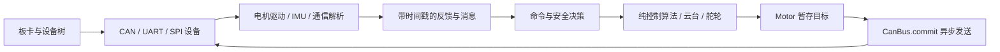

# SkyWalker 项目文档

从这里按任务进入文档。正文按“构建与硬件 → 基础模块 → 控制与通信 → 机器人业务 → 整机联动”组织；现有 `01`～`17` 文件名保留，便于旧链接继续使用。`dev/` 保存设计和历史施工记录，当前调用方式以这里的模块文档及源码为准。

## 先选一条路线

| 目标 | 建议顺序 | 最终可运行入口 |
|---|---|---|
| 第一次构建和上板 | [快速开始](01-getting-started.md) → [板级支持](03-boards.md) → [样例索引](10-samples.md) | `samples/` |
| 控制一台电机 | [架构](02-architecture.md) → [DJI](04-drivers-motor-dji.md) 或 [DM](05-drivers-motor-dm.md) → [速度/位置封装](09-motor-wrapper.md) → [电机工作链路](17-motor-workflow.md) | `samples/motor/` |
| 读 IMU 并解算姿态 | [IMU](06-drivers-imu.md) → [Kalman 与矩阵](07-kalman-matrix.md) | `samples/imu_test/` |
| 从遥控命令走到云台 | [通信](13-communication.md) → [机器人命令与安全](14-robotics.md) → [模块联动](module-integration.md#遥控到双轴云台) | `samples/robotics/gimbal_control/` |
| 连接两块主控 | [板间协议](13-communication.md#4-板间帧格式) → [机器人命令与安全](14-robotics.md) → [模块联动](module-integration.md#双主控命令与安全闭环) → [应用骨架](15-applications.md) | `applications/sentry_*/` |
| 定位问题 | [调试与观测](11-debugging.md) → [故障排查](12-troubleshooting.md)；UART DMA 问题再看 [专项说明](16-uart-dma-nocache.md) | 对应 sample 或 application |

## 模块地图

| 模块 | 输入 → 输出 | 说明与最小调用入口 | 如何联动 |
|---|---|---|---|
| 构建/板卡 | Kconfig、overlay、C++ 配置 → 可用设备与模块 | [架构与构建](02-architecture.md)、[板级支持](03-boards.md) | 先启用并检查物理设备，再启动驱动对象 |
| CAN 电机驱动 | 目标与 CAN 反馈 → 电机快照、异步 CAN 帧 | [DJI](04-drivers-motor-dji.md)、[DM](05-drivers-motor-dm.md)、[完整工作链路](17-motor-workflow.md) | `Motor` 暂存命令，所属 `CanBus` 按周期 `commit()` |
| 纯控制算法 | 目标、测量、`dt_s` → effort 或角度结果 | [控制算法](08-control-algorithms.md) | 由 [速度/位置控制器](09-motor-wrapper.md) 接入 `Motor` |
| IMU / 数学 | SPI 传感器、采样周期 → 姿态；矩阵缓冲 → 运算结果 | [IMU](06-drivers-imu.md)、[Kalman 与矩阵](07-kalman-matrix.md) | IMU 驱动内部调用 4/3 Kalman 设备；业务读取姿态 |
| UART / 协议 | UART 字节块 → 遥控、裁判、板间消息快照 | [通信](13-communication.md)、[DMA 存储](16-uart-dma-nocache.md) | 应用用原始时间戳检查新鲜度，再交给命令层 |
| 机器人业务 | 消息快照、硬件状态 → 安全动作和物理目标 | [机器人命令与安全](14-robotics.md) | 应用把目标交给本地执行器或板间链路 |
| 整机应用 | 以上模块及真实接线参数 → 云台/底盘控制线程 | [模块联动](module-integration.md)、[应用骨架](15-applications.md) | 云台板发控制和约束，底盘板本地再次检查安全 |

图只表示数据和调用方向。`enable()`、`commit()` 的成功返回不等于电机已经运动或安全帧已经送达；详见 [电机工作链路](17-motor-workflow.md)。

## 按主题查阅

### 工程和硬件

- [01 快速开始](01-getting-started.md)：工作区、构建、烧录、第一次上电。
- [02 架构与构建](02-architecture.md)：分层、源码布局、Kconfig/CMake 和线程边界。
- [03 板级支持](03-boards.md)：MC02、Type-C C 板、overlay 与 alias。
- [10 样例索引](10-samples.md)：独立工程及其硬件前提。

### 驱动、算法和封装

- [04 DJI 电机](04-drivers-motor-dji.md)、[05 达妙电机](05-drivers-motor-dm.md)：型号、ID、配置与直接命令。
- [08 控制算法](08-control-algorithms.md)、[09 电机控制封装](09-motor-wrapper.md)：纯 C 控制内核及 C++ 闭环调用。
- [17 电机工作链路](17-motor-workflow.md)：跨驱动、控制器、Group 和 CAN I/O 的时序、故障与示例。
- [06 IMU 与姿态](06-drivers-imu.md)、[07 Kalman 与矩阵](07-kalman-matrix.md)：设备组合、调用和数据边界。

### 通信和机器人

- [13 通信](13-communication.md)：UART、DR16、裁判、板间协议。
- [14 机器人命令与安全](14-robotics.md)：指令映射、全局/局部安全、舵轮、Yaw 和功率。
- [模块联动与调用路线](module-integration.md)：双轴云台与双主控两条完整数据流。
- [15 双主控应用](15-applications.md)：两个应用工程的线程、配置和上机顺序。

### 观测与问题定位

- [11 调试与观测](11-debugging.md)、[12 故障排查](12-troubleshooting.md)、[16 UART DMA 缓冲区](16-uart-dma-nocache.md)。

## 资料与文档边界

- [架构浏览器](architecture-browser/README.md) 提供本地交互图；[开发专题](dev/README.md) 保存设计方案和指定提交上的分析，不等同于当前 API。
- `docs/` 下的 PDF 是硬件与协议原始资料，清单及下载地址见 [DOWNLOAD_LINKS.txt](DOWNLOAD_LINKS.txt)。
- `samples/` 是独立验证入口；`applications/sentry_*` 是需按真实接线、ID、零点和权限策略配置的应用骨架。文中的代码片段只展示必要调用，完整初始化、错误处理和硬件配置以所链样例为准。
- 位置用 rad、速度用 rad/s，DJI effort 用 A，DM MIT effort 用 N·m。时间字段按名称区分 ms 与 s。文档修改型号、设备树属性或接口时应核对当前源码和样例。
