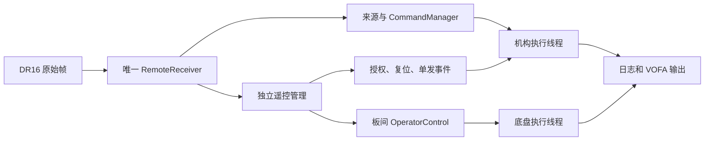

# samples 遥控控制与板间协议统一

本任务直接实现，古法编程模式仅对本任务禁用。核心操作说明见 [统一遥控操作](../../samples/robotics/common/REMOTE_CONTROL.md)。本说明记录改造范围、公共接口与最终编译入口，实板接线、标定和动作仍需在硬件上确认。

## 范围

`samples/motor` 仅改 `mixed_topology`，保留单电机/PID/自动轨迹、`recovery`、`can_smoke` 的模块测试用途。机器人机构覆盖 `yaw_gimbal`、`big_yaw`、`gimbal_control`、`command_gimbal`、`inertial_gimbal`、`dual_yaw_centering`、`swerve`、`four_swerve`、`chassis_power`、`shooter_bench`、`gimbal_shared_can`、`vehicle_integration`。命令观察样例使用相同物理遥控映射，纯传感器和遥控器诊断保持自身用途。

`applications/sentry_gimbal` 与 `sentry_chassis` 使用同一当前板间协议，并保留其显式操作输入配置。`VEHICLE_SAMPLE_CONTROLS` 只由整车 sample 开启。

## 数据流与线程



`RemoteReceiver` 与 `__nocache` DMA 使用静态生命周期，每个 UART 只由一个接收器拥有，`start()` 只调用一次。每个读取方保留自己的 `Snapshot{}`，失败或锁竞争不能把旧数据当成新输入。RC 时间戳以 ms 为单位，`core::Stamp` 使用 us：转换时乘 1000，序号和 valid 保持原值。

`RcControlAdapter` 单线程拥有，其他线程只读取发布副本。`update(remote, now_ms)` 返回当前授权状态；`clear_fault` 为本轮脉冲，编号和原始事件戳用于跨线程或板间去重；`withdraw()` 撤销授权，用于实际执行故障，准备期间不反复调用。样例管理不受输入、执行或状态暂停影响。电机设置、清故障与 CAN 提交仍由执行线程负责。

`ManualCommandMapper::Config::input_profile` 明确选择 `PhysicalRemote` 或 `KeyboardMouseSelectable`。前者使用右开关请求摩擦和发射，后者供现有 application 操作使用。遥控操作配置与通信格式没有版本兼容关系。

单发边沿保留原始戳，等待仲裁观察到对应输入后只消费一次。摩擦、供弹许可、热量、机械参考或忙碌条件不满足时丢弃该事件，不能重新借用仲裁序号或后续帧生产时间来补发。

## 当前板间协议

所有消息只接受唯一协议标识 3，编码器、parser 和每个 decoder 一致使用该常量。大 Yaw 和操作管理属于正式消息；移除能力广播、独立契约版本及旧协议选择。外部裁判协议和电机型号仍遵循设备要求。

保留 CRC、字段长度、有限值、角色、序号、boot、原始年龄和恢复边界检查。轮底盘与大 Yaw 的恢复代次独立，通信心跳不能代替执行状态生产。重传累加原始年龄；目标板重启或会话变化会撤销待清故障事件，不能自动改绑新 boot。

`OperatorControl` 即使业务输入停止生产也继续发布。接收端拒绝错误目标会话或过期许可；清故障编号由执行线程一次消费。发送请求只表示本地已安排发送，没有远端动作 ACK。传输批次继续限定 240 字节，按容量调度，不增大底层 DMA 缓冲区来掩盖批次错误。

## 最终编译与实板记录

按 implementation-first，全部实现完成后进行最终编译，不运行测试、不编写额外测试代码，不执行固件产物。此次不刷写或上电。单独编译示例：

```sh
west build -b dm_mc02/stm32h723xx samples/robotics/vehicle_integration -d build/rc_vehicle_gimbal
west build -b dm_mc02/stm32h723xx samples/robotics/vehicle_integration -d build/rc_vehicle_chassis -- -DEXTRA_CONF_FILE=chassis.conf
west build -b dm_mc02/stm32h723xx samples/motor/mixed_topology -d build/rc_mixed_isolation -- -DMIXED_TOPOLOGY=cross_can_isolation
west build -b dm_mc02/stm32h723xx samples/robotics/command_gimbal -d build/rc_gimbal_diagnostic -- -DEXTRA_CONF_FILE=diagnostic.conf
```

建议由操作者按 [遥控操作](../../samples/robotics/common/REMOTE_CONTROL.md) 所述上电顺序记录现象：未解锁、Safe 停机、摇杆回中、100 ms 失联、重连再解锁、复位一次、单发丢弃与持续发射退出、独立组故障隔离、单板重启和状态生产停止。保留源序号/年龄、机构代次、等待原因和实际输出；观察软件状态不能替代对 CAN 与电机实际行为的确认。

尚待实板确认的是拨轮扩展、物理左右开关对应关系，以及样例原有未完成的机械/功率/发射标定与实际测量来源。
