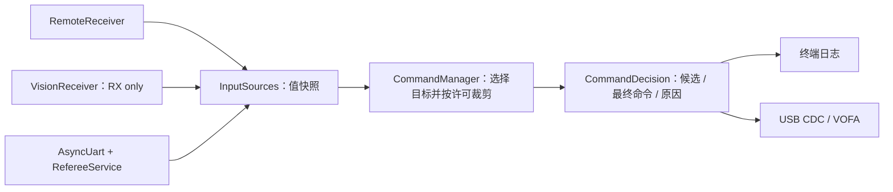

# 三源命令管理 sample 手工实施指南

日期：2026-09-30。目标目录建议为 `samples/robotics/command_manager/`。

本文安排一个专门观察命令管理的独立 sample：真实遥控器、视觉 AB 串口和裁判串口输入，终端或 VOFA 输出最终仲裁结果。本文是手工实施指南；以下新增接口、文件与代码尚未写入业务源码，也未构建或刷写。

采用 MC02 作为第一块验证板。按你选择的策略，“遥控决定 Safe/Manual/Auto；Manual 遥控底盘与云台；Auto 遥控底盘、视觉云台，右摇杆操作可立即抢占云台；裁判逐机构限制输出”。回中 200 ms 后等待新视觉帧再交回视觉，是本指南采用的默认返回策略。sample 不依赖先前报告中的电机、整机安全或 IMU 改造。

## 1. 最终调用方式与职责

希望主循环最终只表达以下三步，优先级判断放在正式命令库中：

```cpp
const auto frame = sources.poll();
robotics::CommandDecision decision{};
const int ret = manager.step(frame.commands, core::monotonicTimeUs(), decision);
telemetry.emit(frame, decision, ret);
```

`sources` 管三路接收；`CommandManager` 管源选择、超时、限幅与裁判许可；`telemetry` 只展示这一次完整决策。没有任何一步执行电机输出。



裁判系统当前提供的是输出许可与功率额度，不产生 yaw/vx 目标。“最终命令”指命令层最终仲裁值；真实应用以后还需交给已有全局/局部执行安全层确认硬件状态。这里不模拟底盘 Ready 或心跳来通过执行安全检查。

现有 [command_safety](../../samples/robotics/command_safety/src/main.cpp)显式使用无裁判模式和模拟底盘状态，本次保留该 sample，新建 `command_manager`。现有 [CommandManager](../../include/robotics/command/command_manager.hpp)仅处理手动命令，必须先补正式库的三源入口，才能真实测试所需功能。

## 2. 固定第一版仲裁规则

| 输入条件 | 底盘最终命令 | 云台最终命令 | 发射最终命令 |
| --- | --- | --- | --- |
| 遥控未收到、离线、超时或非法 | Disabled | Disabled | Disabled |
| 左拨杆 Down / Safe | Disabled | Disabled | Disabled |
| 左拨杆 Middle / Manual | 遥控或键鼠 BodyVelocity | 遥控或键鼠 Rate | 操作员摩擦轮/开火请求 |
| 左拨杆 Up / Auto | 保留遥控或键鼠 BodyVelocity | 合格视觉 AbsoluteAngle | 操作员摩擦轮授权 + 视觉开火请求 |
| Auto 中右摇杆超过抢占阈值 | 保留底盘请求 | 手动 Rate，来源 Remote/KeyboardMouse | 撤销视觉 Fire，只接受操作员请求 |
| Auto 没有目标、目标过期、停止帧或参考不匹配 | 保留底盘请求 | Hold | 撤销 Fire，可保留 Ready |
| 某机构裁判许可缺失、过期或明确关闭 | 仅该机构 Disabled | 仅该机构 Disabled | 仅该机构 Disabled |

云台被禁止时，发射不得 Fire，但可以在发射许可有效且操作员请求摩擦轮时保持 Ready。Ready 只表示“请求摩擦轮运行”，不代表测速已达到要求。sample 不实现发射器、热量模型或卡弹检测。

操作员摩擦轮授权复用 `OperatorIntent::friction_requested`，当前映射为键鼠右键；Manual 或手动抢占时的 fire 来自左键，Auto 视觉控制时的 fire 来自视觉 `fire_requested`。仅输出 `FireContinuous` 电平请求，不生成 `FireSingle` 离散事件。重复读取 true 不等于新增一发。

抢占只看映射后的云台 yaw/pitch 请求，不看底盘摇杆。默认进入阈值为 0.15、退出阈值为 0.05，退出需连续回中 200 ms；两个阈值形成迟滞，避免边缘抖动反复切换。回中等待期间手动角速度置零，不能继续发送阈值内的小偏移。键鼠模式的鼠标移动也通过现有 mapper 参与云台抢占。

切进 Auto 且未抢占时，先记录当前视觉序号并输出 Hold。收到切换之后的新视觉帧才使用目标；遥控失联后恢复到 Auto，以及手动抢占结束时，都重建这个边界。判断新帧使用时间与序号，不要求目标角度发生变化。

裁判许可解除后，可以恢复当前仍新鲜、且已越过 Auto 入口边界的候选目标；真正的电机重新使能规则留在执行层。裁判 `0x0202` 继续更新整体在线状态，不能延长 `0x0201` 的输出许可。

## 3. 推荐文件清单与实施顺序

先连续完成功能实现，再进行一轮构建和主流程验收。不要边写每个函数边新增细粒度测试。

| 顺序 | 文件 | 手工修改内容 |
| --- | --- | --- |
| 1 | `include/robotics/command/command_inputs.hpp`，新增 | 三路值输入、决策结果及原因枚举 |
| 2 | `include/robotics/command/command_manager.hpp` | 保留原入口，增加三源 overload、配置和 Auto 边界状态 |
| 3 | `lib/robotics/command.cpp` | 共享手动目标生成 helper；实现三源仲裁与逐机构许可裁剪 |
| 4 | 新 sample 的配置文件 | 独立 UART、DMA、终端和可选 USB VOFA |
| 5 | 新 sample 的 `src/input_sources.hpp/.cpp` | 三路接收的最小封装，保留原始测量时间 |
| 6 | 新 sample 的 `src/telemetry.hpp/.cpp` | 可读日志与固定 16 通道 VOFA |
| 7 | 新 sample 的 `src/board_config.hpp`、`main.cpp` | 集中配置和简洁主循环 |
| 8 | 新 sample 的 `README.md`、`sample.yaml`、`send_referee.py` | 接线、人工输入工具与整条流程验收说明 |

本次无需修改电机、IMU、`GlobalSafetyManager` 或现有应用。主循环不能另写一套 Manual/Auto/裁判优先级，否则测试的将是 sample 私有逻辑。

## 4. 三源输入与输出契约

新建 `include/robotics/command/command_inputs.hpp`，可参考：

```cpp
#pragma once
#include <communication/vision/vision_types.hpp>
#include <robotics/messages/command.hpp>
#include <robotics/messages/referee.hpp>
#include <robotics/messages/remote.hpp>

namespace skywalker::robotics {

struct CommandInputs {
    RemoteState remote{};
    core::Measurement<communication::vision::AimCommand> vision{};
    RefereeState referee{};
};

enum ArbitrationReason : std::uint32_t {
    RcUnavailable            = 1u << 0,
    SafeRequested            = 1u << 1,
    VisionMissing            = 1u << 2,
    VisionStale              = 1u << 3,
    VisionStopped            = 1u << 4,
    VisionReferenceMismatch  = 1u << 5,
    WaitNewVision            = 1u << 6,
    InvalidVision            = 1u << 7,
    PermissionMissing        = 1u << 8,
    PermissionStale          = 1u << 9,
    PermissionDenied         = 1u << 10,
    ValueLimited             = 1u << 11,
    ShooterNotArmed           = 1u << 12,
    AimNotControlling         = 1u << 13,
    InvalidInputs            = 1u << 14,
    InvalidManagerConfig     = 1u << 15,
    ClockRegression          = 1u << 16,
    ManualOverride           = 1u << 17,
    OverrideQuiet            = 1u << 18,
};

struct CommandDecision {
    OperatorMode operator_mode = OperatorMode::Safe;
    bool manual_override = false;
    bool override_quiet = false;
    RobotCommand requested{}; // 源选择后的候选，尚未按裁判许可裁剪。
    RobotCommand command{};   // 本次最终命令；telemetry 主通道只使用它。
    std::uint32_t chassis_reasons = 0, gimbal_reasons = 0, shooter_reasons = 0;
    // 最终采用视觉目标时保留完整目标及原始时间；Hold/Disabled 时清空。
    core::Measurement<communication::vision::AimCommand> selected_vision{};
    std::uint32_t reasons() const {
        return chassis_reasons | gimbal_reasons | shooter_reasons;
    }
};
}
```

这里复用 `AimCommand` 的协议无关值类型，它只依赖 core 数据，不引入 UART、工作线程或 AB 编码器。`CommandManager` 不持有接收器，也不做 I/O。

当前 `GimbalCommand` 没有参考编号和加速度字段。为了把任务集中在命令管理，第一版不修改它，而在 `selected_vision` 中保留完整所选视觉目标。`command.gimbal` 保存角度和速率；`selected_vision` 保存同一目标的参考、加速度和原始 stamp。最终来源不是 Vision 时，其 stamp 必须无效。

在 `command_manager.hpp` 添加头文件、配置字段与声明，原有配置字段顺序和原 overload 保留：

```cpp
// Config 原有速度上限和 input_timeout_ms 保留，末尾追加：
ManualCommandMapper::Config mapper{};
std::uint32_t permission_timeout_ms = 300;
core::TimeUs vision_timeout_us = 100000;
core::OrientationReference expected_vision_reference{1, 1};
float max_vision_yaw_acceleration_rad_s2 = 30;
float max_vision_pitch_acceleration_rad_s2 = 20;
float requested_fire_rate_hz = 5;
float override_enter_norm = 0.15f, override_exit_norm = 0.05f;
core::TimeUs override_release_us = 200000;

// public，新增：
[[nodiscard]] int validate() const;
[[nodiscard]] int step(const CommandInputs &, core::TimeUs now_us,
                       CommandDecision &out);

// private，新增；config_ 和 sequence_ 继续用原成员：
OperatorMode previous_mode_ = OperatorMode::Safe;
core::TimeUs auto_entry_us_ = 0, last_step_us_ = 0;
std::uint64_t auto_baseline_sequence_ = 0;
std::uint64_t last_seen_vision_sequence_ = 0;
bool have_vision_sequence_ = false;
bool have_step_time_ = false;
bool manual_override_ = false, have_override_quiet_time_ = false;
core::TimeUs override_quiet_since_us_ = 0;
void updateAutoOverride(OperatorIntent &, const CommandInputs &, core::TimeUs now_us);
```

同时 include `manual_command_mapper.hpp` 与 `command_inputs.hpp`。不要给同一个实例交替调用两种入口；一个实例由一个命令线程拥有。原 `reset(now_ms)` 一并清除上面的状态，只在启动或明确重置时调用。

| 接口/结果 | 行为与边界 |
| --- | --- |
| `validate()` | 检查所有数值有限，速度上限非负，两个加速度上限和 fire rate 为正，超时非零，参考 frame_id/epoch 非零；要求 `0 <= exit < enter <= 1`、release 非零，并检查 mapper 配置；错误返回 `-EINVAL` |
| `step(inputs, now_us, out)` | 普通线程、单一调用方；同步计算并完整覆盖 out；内部不等待、无动态分配、无回调 |
| 正常缺失/超时/停止/裁判禁止 | 返回 0，输出 Disabled/Hold 及原因；它们是正常决策，不是函数执行失败 |
| 配置非法 | 返回 `-EINVAL`，最终输出先清为 Disabled，原因 `InvalidManagerConfig` |
| 新入口时间倒退 | 返回 `-ESTALE`，全部 Disabled，原因 `ClockRegression`，清除源选择/抢占；时间回到此前单调范围后可恢复，reset 可显式重建基准 |
| 遥控已在线但 mapper 拒绝输入 | 返回 `-EINVAL`，全部 Disabled，原因 `InvalidInputs` |
| out 的 stamp | 本次决策时间/本地决策 sequence，不能代替输入新鲜度；输入 stamp 保持原值 |
| 旧 overload | 现有应用和 `command_safety` 保持原调用方式、正常行为，手动目标生成与新入口复用 helper |

## 5. CommandManager 实现方法

### 5.1 先抽取共享手动目标生成

在 `lib/robotics/command.cpp` 的私有辅助区抽出下面逻辑；旧 overload 和新 overload 都调用它，旧入口随后仍按传入的 safety 裁剪：

```cpp
void fillManualMotion(const OperatorIntent &i, const CommandManager::Config &c,
                      RobotCommand &out) {
    const auto scale = [](float v, float maximum) {
        return std::clamp(v, -1.0f, 1.0f) * maximum;
    };
    out.chassis.mode = ChassisMode::BodyVelocity;
    out.chassis.source = i.source;
    out.chassis.vx_m_s = scale(i.chassis_vx_norm, c.max_chassis_vx_m_s);
    out.chassis.vy_m_s = scale(i.chassis_vy_norm, c.max_chassis_vy_m_s);
    out.chassis.wz_rad_s = scale(i.chassis_wz_norm, c.max_chassis_wz_rad_s);
    out.gimbal.mode = GimbalMode::Rate;
    out.gimbal.source = i.source;
    out.gimbal.yaw_rate_rad_s = scale(i.gimbal_yaw_rate_norm, c.max_gimbal_yaw_rate_rad_s);
    out.gimbal.pitch_rate_rad_s = scale(i.gimbal_pitch_rate_norm, c.max_gimbal_pitch_rate_rad_s);
}
```

参考原 `command.cpp` 的 map/step，保留其遥控方向、死区和键鼠映射。旧入口的 Hold 分支和 Disabled 时数值归零要保持。这里只抽共享数据转换，不把新视觉策略塞进旧入口。

旧 overload 的兼容顺序必须明确保持：

```text
创建 RobotCommand{} 并保留原来的输入/配置检查、输出stamp和sequence规则
若 fresh && intent.mode==Manual：
    fillManualMotion(intent, config_, command)
    若 safety.chassis != Active：command.chassis={}
    若 safety.gimbal != Active：command.gimbal={}
最后，若 fresh && safety.gimbal==Hold：command.gimbal.mode=Hold
统一给子命令设置输出stamp，按原契约返回
```

不能无条件调用 helper，也不能只改 mode 而留下它写入的速度或来源。旧入口不新增发射行为。

### 5.2 按这个顺序完成新 overload

以下为应放在新 `step()` 中的完整处理顺序，先整体实现，再检查：

```text
1. 创建本轮 CommandDecision{}，所有命令默认 Disabled。
   准备本轮输出 stamp = {now_us/1000, sequence_+1, true}。
   定义统一finish(ret)：盖requested/command整组及全部子命令stamp，
   推进sequence_、完整赋值out，返回ret。下面所有提前返回都经过finish。

2. validate 失败：全部 Disabled，记录 InvalidManagerConfig，返回 -EINVAL。
   have_step_time_ 且 now_us < last_step_us_：清previous_mode/override/quiet，
       全部 Disabled，ClockRegression，返回 -ESTALE；保留last_step_us_不倒退。
   否则记录 last_step_us_ 与 have_step_time_。
   若本轮视觉stamp有效，记录本地序号高水位：
       比last_seen小 → 本轮vision_regressed=true，不退回高水位。
       首次或更大 → 更新last_seen，have_vision_sequence_=true。
       相同 → 允许重复读取同一不可变快照，不刷新其stamp。

3. remote.online 为 false，或 remote.stamp 不在 input_timeout_ms 内：
   previous_mode_ = Safe；清抢占状态；全部 Disabled，RcUnavailable，返回 0。
   调用 ManualCommandMapper(config_.mapper).map(remote, intent)，失败则
       previous_mode_=Safe、清override/quiet，全部Disabled，InvalidInputs，返回-EINVAL。
   operator_mode = intent.mode。

4. intent.mode == Safe：previous_mode_=Safe；清抢占状态；全部 Disabled，SafeRequested，返回 0。

5. 若 Auto 且 previous_mode_ != Auto：
       auto_entry_us_=now_us；auto_baseline_sequence_=当前视觉 sequence（无效时为0）。
   Auto 时计算 max(abs(yaw_norm), abs(pitch_norm))。
       未抢占且 >= enter：立即进入抢占，清 quiet timer。
       已抢占且 > exit：保持抢占，清 quiet timer。
       已抢占且 <= exit：启动/延续 quiet timer，临时把云台 norm 置零。
           quiet 达 release_us：退出抢占，重记本轮 auto_entry_us_ 与视觉 baseline。
   Manual 时清抢占状态。
   fillManualMotion(intent, config_, requested)，因此 Auto 也保留遥控底盘。
   previous_mode_ = intent.mode。

6. Manual：保留手动 Rate，忽略视觉控制及视觉 fire。
   Auto 且仍在抢占：保留手动 Rate，manual_override=true，记录 ManualOverride，跳过视觉选择。
   Auto 且未抢占：先将 requested.gimbal 设为 Hold，source=None，全部目标数值清零。
       无视觉 stamp → VisionMissing。
       vision_regressed → InvalidVision，不回用较低序号旧目标。
       stamp 超时/未来 → VisionStale。
       control_requested==false → VisionStopped，必须先于参考检查。
       reference!=expected → VisionReferenceMismatch。
       非有限角/速率/加速度 → InvalidVision。
       seq 未越过 Auto baseline 或时间早于 auto_entry_us_ → WaitNewVision。
       全部满足 → 使用当前视觉目标，mode=AbsoluteAngle，source=Vision。
           角度保留视觉参考值；速率按配置上限限幅。
           加速度按显式配置上限限幅，完整保存到 selected_vision。
           有限幅时加 ValueLimited；command 中的角度/速率与 selected_vision 一致。

7. requested.shooter 默认 Disabled。
   intent.friction_requested 为 false → ShooterNotArmed。
   为 true → Ready，source=intent.source；弹速=0表示本sample未指定目标弹速。
       Manual 或手动抢占时欲 fire = intent.fire_requested。
       Auto 视觉控制时欲 fire = 已合格视觉控制 && 当前视觉 fire_requested。
       若欲 fire → requested.shooter=FireContinuous，fire_rate_hz=config值；
           视觉 fire来源=Vision，手动 fire来源=intent.source。

8. command=requested。逐机构检查对应 OutputPermission，禁止时该子命令={}。
   不使用 referee.online 或 referee.stamp 代替三个权限 stamp。
   最终 gimbal 不再为 Vision/AbsoluteAngle时，selected_vision={}。
   最终 shooter=FireContinuous，但最终 gimbal 为 Hold/Disabled时：
       降为 Ready，来源改回intent.source，fire_rate=0，AimNotControlling。
       若发射许可本来已禁用，必须保持 Disabled，不得改回Ready。

9. 经finish(0)统一发布本轮结果。
   原始输入与 selected_vision stamp 不改。
```

Auto 的“当前目标”只取当前输入快照，不保留上一次有效目标作为后备。序号高水位也观察停止/参考不匹配的新帧；例如 target(seq10) → stop(seq11) → 再读seq10，最后一步保持Hold/InvalidVision。相同seq只能重复使用同一份不可变快照至原stamp过期，不能换内容或刷新时间。reset同时清高水位；现有接收器不支持运行期间销毁重建。

统一出口可参考下面的代码，避免Safe、离线或错误路径重复发布同一个决策序号：

```cpp
CommandDecision next{};
const MessageStamp output_stamp{now_us / 1000, sequence_ + 1u, true};
const auto finish = [&](int ret) {
    const auto stamp = [&](RobotCommand &c) {
        c.stamp = c.chassis.stamp = c.gimbal.stamp = c.shooter.stamp = output_stamp;
    };
    stamp(next.requested);
    stamp(next.command);
    sequence_ = output_stamp.sequence;
    out = next;
    return ret;
};
// 失败路径也用 return finish(-EINVAL)，正常失能用 return finish(0)。
```

`ManualOverride` 和 `ValueLimited` 是解释当前决策的信息位，不表示强制失能。不要用“任意 reasons 非零就 Disabled”实现裁剪；真正的禁止条件在算法中逐项处理。

回中等待时另记录 `override_quiet=true` 和 `OverrideQuiet`。按默认 mapper 的 channel_range=660、deadband=0.03，抢占进入阈值约对应原始右摇杆 116，退出约为 52；这是映射后的阈值，不要求原始值严格等于零。键鼠默认 scale=0.002，鼠标单次分量约 75 才达到进入阈值，25 以内视作 quiet，可按实际手感调整。

下面 helper 可放在 `command.cpp`，新 step 在 Auto 分支调用它，再按抢占状态选择目标。函数只改本轮 intent 的云台请求，不改遥控快照或底盘请求：

```cpp
void CommandManager::updateAutoOverride(OperatorIntent &intent,
                                      const CommandInputs &input,
                                      core::TimeUs now_us) {
    const float magnitude = std::max(std::fabs(intent.gimbal_yaw_rate_norm),
                                     std::fabs(intent.gimbal_pitch_rate_norm));
    if (!manual_override_ && magnitude >= config_.override_enter_norm) {
        manual_override_ = true;
        have_override_quiet_time_ = false;
    }
    if (!manual_override_) return;
    if (magnitude > config_.override_exit_norm) {
        have_override_quiet_time_ = false;
        return;
    }
    // mapped 小于退出阈值也可能非零，主动取消残余速率。
    intent.gimbal_yaw_rate_norm = 0;
    intent.gimbal_pitch_rate_norm = 0;
    if (!have_override_quiet_time_) {
        have_override_quiet_time_ = true;
        override_quiet_since_us_ = now_us;
    }
    if (now_us - override_quiet_since_us_ < config_.override_release_us) return;
    manual_override_ = false;
    have_override_quiet_time_ = false;
    auto_entry_us_ = now_us;
    auto_baseline_sequence_ = input.vision.stamp.valid ? input.vision.stamp.sequence : 0;
}
```

时间倒退已由 step 的入口检查拦截，不在此使用负时间差。quiet 计时不 sleep，不阻塞另外两路输入。step 随后把 `manual_override_` 和 `have_override_quiet_time_` 复制到本轮决策。Safe、离线、mapper 错误、Manual 以及 reset 都要清这两个状态。

首次 Auto 边界记录的是已看到的帧。即使静止目标持续发送完全相同的数值，下一份帧也会拥有新的本地 sequence，正常通过入口条件。视觉 mode=0 被 `VisionLink` 清成空目标，参考也为 `{0,0}`；应先判断停止，而不是把它当成错误参考。

裁判许可 helper 可以直接参考下面的实现。放在同文件辅助区：

```cpp
std::uint32_t permissionReason(const OutputPermission &p, std::uint64_t now_ms,
                               std::uint32_t timeout_ms) {
    if (!p.valid) return PermissionMissing;
    if (!isFresh(p.stamp, now_ms, timeout_ms)) return PermissionStale;
    if (!p.enabled) return PermissionDenied;
    return 0;
}
```

每个机构独立调用，reason 非零就将该机构最终命令赋 `{}` 并累计到对应 reasons。不要只修改 mode 而留下旧速度、角度、来源或开火频率。

所有非有限数值检查先于 `std::clamp`。World/Euler 角不是已标定的电机机械角，不能随手用 Pitch 机械限位裁剪它。本 sample 只限已有配置含义的速率/加速度；后续真实执行端另做坐标转换和机械保护。

AB 线上不含 frame_id、epoch 或远端会话序号；`expected_vision_reference={1,1}` 只是明确的本地测试约定，不能证明上位机真正的参考代次或实现防重放。

## 6. Sample 配置与接线

建议目录：

```text
samples/robotics/command_manager/
├── CMakeLists.txt
├── Kconfig
├── prj.conf
├── vofa.conf
├── app.overlay
├── sample.yaml
├── README.md
├── send_referee.py
└── src/
    ├── main.cpp
    ├── board_config.hpp
    ├── input_sources.hpp
    ├── input_sources.cpp
    ├── telemetry.hpp
    └── telemetry.cpp
```

MC02 串口分配：

| 用途 | 设备 | 接线与格式 |
| --- | --- | --- |
| 遥控 DR16 | UART5 | PD2 RX，100000 baud、8E1；确认实际DBUS反相/接收链路 |
| 视觉 AB | UART7 | PE7 RX / PE8 TX，115200、8N1；本sample只收目标 |
| 裁判 | USART1 | PA10 RX / PA9 TX，115200、8N1 |
| 终端 | USART10 | PE3 TX / PE2 RX，115200、8N1 |
| 可选 VOFA | USB CDC ACM | 板上 USB，JustFloat；独占设备 |

分别把外部 TX 接对应 RX，并共地。电气电平与板卡接口要匹配。裁判设备接入和 PC 模拟裁判二选一，不能两个发送端直接并接到同一 RX。

`app.overlay`：

```dts
/ {
    aliases {
        remote-uart = &uart5;
        vision-uart = &uart7;
        referee-uart = &usart1;
        telemetry-uart = &cdc_acm_uart0;
    };
};
&uart7 {
    current-speed = <115200>;
    dmas = <&dmamux1 5 80 STM32_DMA_PERIPH_TX>,
           <&dmamux1 7 79 STM32_DMA_PERIPH_RX>;
    dma-names = "tx", "rx";
};
&usart1 { current-speed = <115200>; };
```

这复制的是现有视觉样例的 UART7 DMA 配置。当前 MC02 SPI2 占 DMA stream 1/2，USART1 占 3/4，UART5 占 6，UART7 使用 5/7。USB CDC 节点已由板定义，不重复创建。

原板 `telemetry-uart` 指向 USART1，本次必须覆盖成 USB；同一设备不能同时交给 `AsyncUart` 与 VOFA 注册回调。C 板需要单独规划 overlay，这一版不要声明已支持 C 板。

`CMakeLists.txt`：

```cmake
cmake_minimum_required(VERSION 3.20.0)
find_package(Zephyr REQUIRED HINTS $ENV{ZEPHYR_BASE})
project(command_manager_bench LANGUAGES C CXX)
target_sources(app PRIVATE
    src/main.cpp src/input_sources.cpp src/telemetry.cpp)
```

`Kconfig`：

```kconfig
mainmenu "Three-source command manager bench"
source "Kconfig.zephyr"
config COMMAND_MANAGER_VOFA
    bool "Emit final commands through USB VOFA"
    default n
```

`prj.conf` 的核心配置：

```conf
CONFIG_CPP=y
CONFIG_STD_CPP20=y
CONFIG_REQUIRES_FULL_LIBCPP=y
CONFIG_MAIN_STACK_SIZE=8192
CONFIG_HEAP_MEM_POOL_SIZE=0
CONFIG_LOG=y
CONFIG_CBPRINTF_FP_SUPPORT=y
CONFIG_SERIAL=y
CONFIG_UART_ASYNC_API=y
CONFIG_NOCACHE_MEMORY=y
CONFIG_SKYWALKER_LIB_COMMUNICATION=y
CONFIG_SKYWALKER_UART_TRANSPORT=y
CONFIG_SKYWALKER_REMOTE_DR16=y
CONFIG_SKYWALKER_REMOTE_RECEIVER=y
CONFIG_SKYWALKER_REFEREE=y
CONFIG_SKYWALKER_INTERBOARD=n
CONFIG_SKYWALKER_VISION=y
CONFIG_SKYWALKER_VISION_AB=y
CONFIG_SKYWALKER_VISION_RECEIVER=y
CONFIG_SKYWALKER_LIB_ROBOTICS=y
CONFIG_SKYWALKER_ROBOTICS_COMMAND=y
CONFIG_SKYWALKER_ROBOTICS_SAFETY=n
CONFIG_SKYWALKER_ROBOTICS_SWERVE=n
CONFIG_SKYWALKER_ROBOTICS_GIMBAL=n
CONFIG_SKYWALKER_DRIVER_MOTOR=n
CONFIG_SKYWALKER_IMU=n
```

`vofa.conf` 是可选扩展配置，默认终端版不需要启用：

```conf
CONFIG_COMMAND_MANAGER_VOFA=y
CONFIG_SKYWALKER_LIB_VOFA=y
CONFIG_USB_DEVICE_STACK_NEXT=y
CONFIG_CDC_ACM_SERIAL_INITIALIZE_AT_BOOT=y
CONFIG_CDC_ACM_SERIAL_PRODUCT_STRING="SkyWalker Command Bench"
CONFIG_USBD_CDC_ACM_LOG_LEVEL_WRN=y
```

USB 启动方式沿用当前 [hello sample](../../samples/hello/prj.conf)，不再手动调用其他 USB 栈的 enable API。

## 7. InputSources：把接收细节收起来

### 7.1 接口与持有对象

`src/input_sources.hpp` 可以按下面骨架组织；具体构造和成员顺序也已给出：

```cpp
#pragma once
#include <communication/remote/remote_receiver.hpp>
#include <communication/vision/ab_protocol.hpp>
#include <communication/vision/vision_receiver.hpp>
#include <communication/referee/referee_service.hpp>
#include <robotics/command/command_inputs.hpp>

namespace bench {
using namespace skywalker;
namespace vision = communication::vision;

struct InputFrame {
    robotics::CommandInputs commands{};
    communication::RemoteReceiver::State remote_state{};
    vision::VisionReceiver::State vision_state{};
    int remote_error = 0, vision_error = 0, referee_error = 0;
    std::uint32_t remote_dropped = 0, vision_dropped = 0, referee_dropped = 0;
    std::uint32_t referee_resets = 0;
};

class InputSources {
public:
    struct Config {
        const device *remote_uart = nullptr, *vision_uart = nullptr, *referee_uart = nullptr;
        communication::RemoteReceiver::Config remote{};
        vision::AbProtocol::Config protocol{};
        vision::VisionReceiver::Config vision{};
        communication::RefereeVersion referee_version = communication::RefereeVersion::Rm2026V1_3;
        std::uint32_t referee_timeout_ms = 500;
    };

    InputSources(const Config &c, communication::AsyncUart::DmaBuffers &r,
                 communication::AsyncUart::DmaBuffers &v,
                 communication::AsyncUart::DmaBuffers &f)
        : remote_(c.remote_uart, r, c.remote), protocol_(c.protocol),
          vision_(c.vision_uart, v, protocol_, c.vision),
          referee_uart_(c.referee_uart, f), referee_(c.referee_version, c.referee_timeout_ms) {}
    [[nodiscard]] int start();
    InputFrame poll();

private:
    communication::RemoteReceiver remote_;
    vision::AbProtocol protocol_; // 必须在 vision_ 之前构造并持续存活。
    vision::VisionReceiver vision_;
    communication::AsyncUart referee_uart_;
    communication::RefereeService referee_;
    communication::RemoteReceiver::Snapshot rc_{}; // 长期保留，不能每轮清零。
    int remote_start_error_ = 0, vision_start_error_ = 0, referee_error_ = 0;
    std::uint32_t referee_resets_ = 0;
    std::uint64_t referee_init_retry_ms_ = 0;
    bool started_ = false;
};
}
```

`start()` 只在线程中调用一次。按 remote.start、vision.start、referee_uart.init 顺序启动，分别保存返回码；返回第一个负码，否则 0。`started_` 已置位后重复调用返回 `-EALREADY`。某一路失败后仍应允许 poll 和日志输出，不能因失败销毁已经注册回调的对象。

Remote/Vision 的 0 表示工作线程已安排，UART 的真实结果由 poll 中的 state/error 表示；并不是“三路已在线”。本轮不要求先修 `RemoteReceiver` 的初始失败恢复：如果它进入 InitFailed，sample 如实输出错误，修正配置后重新启动固件。

`poll()` 以下流程可参考放入 `src/input_sources.cpp`：

```cpp
#include "input_sources.hpp"
#include <cerrno>
#include <zephyr/kernel.h>

namespace bench {
int InputSources::start() {
    if (started_) return -EALREADY;
    started_ = true;
    remote_start_error_ = remote_.start();
    vision_start_error_ = vision_.start();
    referee_error_ = referee_uart_.init();
    if (remote_start_error_ < 0) return remote_start_error_;
    if (vision_start_error_ < 0) return vision_start_error_;
    return referee_error_;
}

InputFrame InputSources::poll() {
    InputFrame frame{};
    auto now_ms = static_cast<std::uint64_t>(k_uptime_get());
    int sr = referee_uart_.service(now_ms);
    if (sr == -EACCES && now_ms >= referee_init_retry_ms_) {
        referee_init_retry_ms_ = now_ms + 100;
        sr = referee_uart_.init();
    }
    if (sr == 0) referee_error_ = 0;
    else if (sr != -EAGAIN && (sr != -EACCES || referee_error_ == 0)) referee_error_ = sr;

    communication::AsyncUart::RxChunk chunk{};
    for (unsigned budget = 0; budget < 8; ++budget) {
        const int rr = referee_uart_.read(chunk);
        if (rr == -EOVERFLOW) {
            referee_.discardPartial();
            ++referee_resets_;
            continue;
        }
        if (rr == -EAGAIN) break;
        if (rr < 0) {
            if (rr != -EACCES || referee_error_ == 0) referee_error_ = rr;
            break;
        }
        const int pr = referee_.processBytes(chunk.bytes, chunk.size, chunk.timestamp_ms);
        if (pr < 0) referee_error_ = pr;
    }
    now_ms = static_cast<std::uint64_t>(k_uptime_get());
    referee_.processBytes(nullptr, 0, now_ms);
    // result 已清零；-EAGAIN 不写，-ESTALE 则写旧值并标 online=false。
    const int fs = referee_.snapshot(now_ms, frame.commands.referee);
    if (fs != 0 && fs != -EAGAIN && fs != -ESTALE) referee_error_ = fs;

    (void)remote_.snapshot(rc_);
    const auto vs = vision_.snapshot();
    frame.commands.remote = rc_.remote;
    frame.commands.vision = vs.link.aim;
    frame.remote_state = rc_.state;
    frame.vision_state = vs.state;
    frame.remote_error = remote_start_error_ < 0 ? remote_start_error_ : rc_.uart_error;
    frame.vision_error = vision_start_error_ < 0 ? vision_start_error_ : vs.uart_error;
    frame.referee_error = referee_error_;
    frame.remote_dropped = rc_.dropped;
    frame.vision_dropped = vs.dropped;
    frame.referee_dropped = referee_uart_.droppedChunks();
    frame.referee_resets = referee_resets_;
    return frame;
}
}
```

`poll()` 由同一个主线程调用，不能在中断或多个线程里同时调用。裁判 parser 无锁，全部 process/snapshot 都在这里。遥控和视觉 worker 只通过已提供的快照接口交付输入。

RX 溢出时必须丢弃半包；解析使用接收块原始 `timestamp_ms`，不能用本轮 now 为旧字节刷新时间。manager 的 now 在 poll 返回之后取，避免刚读取的新视觉 stamp 短暂晚于判定时间。

三块 DMA 缓冲区、InputSources 及其协议对象使用静态生命周期；不要在启动函数栈上临时创建后返回。H7 使用 `__nocache` DMA 存储，定义时沿用样例形式，不加初始化表达式。

## 8. 配置集中到 board_config，主循环保持简洁

`src/board_config.hpp`：

```cpp
#pragma once
#include "input_sources.hpp"
#include <robotics/command/command_manager.hpp>
#include <zephyr/devicetree.h>

namespace bench {
inline const InputSources::Config inputs{
    .remote_uart = DEVICE_DT_GET(DT_ALIAS(remote_uart)),
    .vision_uart = DEVICE_DT_GET(DT_ALIAS(vision_uart)),
    .referee_uart = DEVICE_DT_GET(DT_ALIAS(referee_uart)),
};
#ifdef CONFIG_COMMAND_MANAGER_VOFA
inline const device *telemetry_uart = DEVICE_DT_GET(DT_ALIAS(telemetry_uart));
#else
inline const device *telemetry_uart = nullptr;
#endif
inline const skywalker::robotics::CommandManager::Config manager = [] {
    skywalker::robotics::CommandManager::Config c{};
    c.max_chassis_vx_m_s = 0.5f;
    c.max_chassis_vy_m_s = 0.5f;
    c.max_chassis_wz_rad_s = 1.0f;
    c.max_gimbal_yaw_rate_rad_s = 1.0f;
    c.max_gimbal_pitch_rate_rad_s = 0.8f;
    c.input_timeout_ms = 100;
    c.permission_timeout_ms = 300;
    c.vision_timeout_us = 100000;
    c.expected_vision_reference = {1, 1};
    c.override_enter_norm = 0.15f;
    c.override_exit_norm = 0.05f;
    c.override_release_us = 200000;
    return c;
}();
}
```

`inputs` 中 VisionReceiver 的 `feedback_period_us` 默认 0，只收命令，不要求 IMU/弹速/弹数，也不伪造反馈。遥控 `decode_wheel` 默认 false；没有确认接收器第五通道时，wz 为零是预期行为。

裁判默认使用当前仓库明确支持的 `Rm2026V1_3`，真实设备必须核对版本。`Unspecified` 不会产出有效权限；严格三源仲裁下保持 Disabled 是正确结果。

`src/main.cpp` 的主体：

```cpp
#include "board_config.hpp"
#include "telemetry.hpp"
#include <core/clock.hpp>
#include <zephyr/logging/log.h>
LOG_MODULE_REGISTER(command_manager_bench, LOG_LEVEL_INF);

namespace {
using namespace skywalker;
static communication::AsyncUart::DmaBuffers rc_dma __nocache;
static communication::AsyncUart::DmaBuffers vision_dma __nocache;
static communication::AsyncUart::DmaBuffers referee_dma __nocache;
static bench::InputSources sources(bench::inputs, rc_dma, vision_dma, referee_dma);
static robotics::CommandManager manager(bench::manager);
static bench::Telemetry telemetry;
}

int main() {
    const int checked = manager.validate();
    const int started = sources.start();
    const int output = telemetry.start(bench::telemetry_uart);
    LOG_INF("config=%d sources_start=%d telemetry=%d; command observation bench",
            checked, started, output);
    for (;;) {
        const auto frame = sources.poll();
        skywalker::robotics::CommandDecision decision{};
        const int ret = manager.step(frame.commands, skywalker::core::monotonicTimeUs(), decision);
        telemetry.emit(frame, decision, ret);
        k_sleep(K_MSEC(10));
    }
}
```

一次函数错误也要显示本次 Disabled 结果，不复用上一轮 command。terminal/VOFA 故障不能阻塞输入采集或改写仲裁结果。整个 sample 不创建 CanBus、Motor、IMU 或执行线程。

## 9. Telemetry：最终命令与原因同时可见

`src/telemetry.hpp` 接口建议如下，静态对象存活覆盖 UART 回调：

```cpp
#pragma once
#include "input_sources.hpp"
#include <lib/vofa/vofa.h>

namespace bench {
class Telemetry {
public:
    int start(const device *vofa_uart);
    void emit(const InputFrame &, const skywalker::robotics::CommandDecision &, int step_error);
private:
    Vofa vofa_{};
    bool vofa_ready_ = false;
    std::uint64_t next_log_ms_ = 0, next_vofa_ms_ = 0;
    std::uint32_t vofa_rejected_ = 0;
    int last_vofa_error_ = 0;
};
}
```

`start()` 在 `#ifdef CONFIG_COMMAND_MANAGER_VOFA` 下调用 `vofa_init()`，成功才设置 ready；未启用 VOFA 时直接返回 0，保持终端输出。初始化失败记录错误，不能对无效实例调用 send。

`emit()` 每 100 ms 输出一次文字；启用 VOFA 时每 20 ms 发送一次最终命令。不再创建 telemetry 工作线程。字符串 helper 放在 `telemetry.cpp` 私有区，switch 显示 Safe/Manual/Auto、None/Remote/KeyboardMouse/Vision 及各命令模式；未知枚举输出 Unknown。

终端建议分两到三行，所有最终数值均来自 `decision.command`：

```text
seq=145 mode=Auto override=0 quiet=0 error=0 reasons=0x00000000
chassis[BodyVelocity Remote] v=0.20/0.00/0.00; gimbal[AbsoluteAngle Vision] q=0.25/-0.20 rate=0.10/0.00; shooter[Disabled None] hz=0.00
age_ms rc=3 vision=8 permit(g/c/s)=30/30/30; uart=0/0/0; rx_drop=0/0/0; vofa_drop=0
```

上面是格式示例；三机构的实际 reasons 必须与所用输入一致。例如没有摩擦轮授权时，应该显示 `ShooterNotArmed`，不能照抄全零示例原因。

抢占时应看到 `mode=Auto override=1`，但最终云台来源变为 Remote/KeyboardMouse、模式变为 Rate。回中等待时 `quiet=1` 且两轴 rate 为零。交回视觉时先显示 WaitNewVision/Hold，再出现 Vision/AbsoluteAngle。

权限年龄分别用 `robot.gimbal_output.stamp`、`chassis_output.stamp`、`shooter_output.stamp` 计算。RC、裁判单位为 ms；视觉保留 us，年龄显示时再除以 1000。无效 stamp 显示 `NA`，不要伪装成 0 ms。

当 `selected_vision.stamp.valid` 时，额外输出其 reference、两轴加速度及原始视觉 sequence。它们是所选目标信息，不是实测姿态。最终 command 的 sequence 是仲裁计数，也不是输入帧计数。

VOFA 的 16 个通道固定如下：

| 通道 | 内容 |
| --- | --- |
| 0 | OperatorMode：Safe=0、Manual=1、Auto=2 |
| 1 | 最终云台 source：None=0、Remote=1、KeyboardMouse=2、Vision=3 |
| 2、3、4 | 最终 chassis/gimbal/shooter mode，沿用正式枚举值 |
| 5、6、7 | 最终 vx、vy、wz，m/s、m/s、rad/s |
| 8、9 | 最终 yaw、pitch target，rad |
| 10、11 | 最终 yaw、pitch rate，rad/s |
| 12、13 | 最终 fire_rate_hz、requested_bullet_speed_m_s |
| 14、15 | 决策 reasons 的低 16 位、高 16 位 |

可以直接放在 `emit()` 的 VOFA 分支：

```cpp
const auto &c = decision.command;
const auto reasons = decision.reasons();
const float values[VOFA_MAX_FLOATS] = {
    float(decision.operator_mode), float(c.gimbal.source),
    float(c.chassis.mode), float(c.gimbal.mode), float(c.shooter.mode),
    c.chassis.vx_m_s, c.chassis.vy_m_s, c.chassis.wz_rad_s,
    c.gimbal.yaw_target_rad, c.gimbal.pitch_target_rad,
    c.gimbal.yaw_rate_rad_s, c.gimbal.pitch_rate_rad_s,
    c.shooter.fire_rate_hz, c.shooter.requested_bullet_speed_m_s,
    float(reasons & 0xffffu), float(reasons >> 16),
};
const int ret = vofa_send(&vofa_, values, VOFA_MAX_FLOATS);
if (ret < 0) {
    ++vofa_rejected_;
    last_vofa_error_ = ret;
} else {
    last_vofa_error_ = 0;
}
```

`vofa_send()` 非阻塞复制入队；队列满返回 `-ENOBUFS`，丢弃这一帧遥测、继续下一次仲裁，不循环等待。回调中不能阻塞。数值必须来自最终 command，不能拿原始视觉角度填补最终 Disabled 的角度通道。

float32 不能逐个精确表达所有 uint32 值。把原因拆成两个 16 位通道可无损重建：`uint32(ch14) | (uint32(ch15) << 16)`。例如 ManualOverride 位 17 对应高通道值 2；完整时间和 sequence 留在终端，用整数格式输出。

`Telemetry::start()` 的可参考实现，放在 `telemetry.cpp`：

```cpp
int Telemetry::start(const device *uart) {
#ifdef CONFIG_COMMAND_MANAGER_VOFA
    const int ret = vofa_init(&vofa_, uart);
    vofa_ready_ = ret == 0;
    return ret;
#else
    (void)uart;
    return 0;
#endif
}
```

默认终端版不要引用未启用 USB 栈的 `DEVICE_DT_GET(cdc_acm_uart0)`，所以 board_config 已按开关使用 nullptr。`vofa_send()` 所在代码同样放在 `#ifdef CONFIG_COMMAND_MANAGER_VOFA` 中，避免终端版本产生未链接的 VOFA 符号。

`emit()` 的节流方式：

```text
now_ms = k_uptime_get()
若 now_ms >= next_log_ms_：
    next_log_ms_ = now_ms + 100
    打印当前 decision 全部最终命令、三个来源、三个 reasons、override/quiet、step_error
    打印原始输入年龄、接收状态/错误与丢帧计数
若启用VOFA && vofa_ready_ && now_ms >= next_vofa_ms_：
    next_vofa_ms_ = now_ms + 20
    用上面的16通道数组调用vofa_send，一次失败就记计数后继续
```

枚举文字 helper 按第 9 节通道表和正式枚举写 switch。`%.2f` 的参数显式转 `double`；输出 uint64 sequence/time 时按实际类型使用整数格式并显式转换，不能先转成 float。若日志带宽不足，先降低文字频率，保持仲裁循环和 RX 消费继续运行。

## 10. 两路 PC 输入工具

### 10.1 直接使用现有视觉发送器

本 sample 是 RX-only，完整视觉应用可能在启动时等待 MCU 姿态反馈。先使用仓库已有 [send_command.py](../../samples/communication/vision/send_command.py)直接发送 AB 目标，不要求构造假的姿态反馈。

```bash
python3 samples/communication/vision/send_command.py \
  --port /dev/ttyUSB_VISION --mode 1 \
  --yaw 0.25 --pitch -0.20 --yaw-vel 0.10 \
  --hz 50 --count 3000
```

把端口名替换成实际视觉串口转接器。mode=1 为控制，mode=2 为控制并请求开火，mode=0 为停止；上位机先停止当前 sender，再在同一端口发送 mode=0：

```bash
python3 samples/communication/vision/send_command.py \
  --port /dev/ttyUSB_VISION --mode 0 --hz 50 --count 10
```

该脚本 `--hex-only` 可以只生成帧而不打开串口；串口运行需要 pyserial，若本地未安装，由你在所用 Python 环境中安装后执行。

### 10.2 新增最小裁判发送器

建议在新 sample 中手工创建 `send_referee.py`。下面构造的是符合当前仓库 parser 的台架输入，不替代真实裁判协议/固件核验；它不依赖板上其他模块：

```python
#!/usr/bin/env python3
import argparse
import math
import struct
import time

def crc8(data):
    value = 0xFF
    for byte in data:
        value ^= byte
        for _ in range(8):
            value = (value >> 1) ^ (0x8C if value & 1 else 0)
    return value

def crc16(data):
    value = 0xFFFF
    for byte in data:
        value ^= byte
        for _ in range(8):
            value = (value >> 1) ^ (0x8408 if value & 1 else 0)
    return value

def encode(flags, sequence, power_only):
    if power_only:
        # 只刷新0x0202状态与缓冲能量，不产生/刷新输出许可。
        command_id = 0x0202
        payload = bytes(8) + struct.pack('<HHH', 30, 0, 0)
    else:
        command_id = 0x0201
        payload = struct.pack('<BB5HB', 3, 1, 100, 100, 10, 200, 80, flags)
    header = b'\xA5' + struct.pack('<HB', len(payload), sequence & 0xFF)
    header += bytes([crc8(header)])
    body = header + struct.pack('<H', command_id) + payload
    return body + struct.pack('<H', crc16(body))

def main():
    parser = argparse.ArgumentParser()
    parser.add_argument('--port')
    parser.add_argument('--flags', type=int, choices=range(8), default=7)
    parser.add_argument('--hz', type=float, default=10)
    parser.add_argument('--count', type=int, default=600)
    parser.add_argument('--power-only', action='store_true')
    parser.add_argument('--hex-only', action='store_true')
    args = parser.parse_args()
    if not math.isfinite(args.hz) or not 0 < args.hz <= 100 or args.count < 1:
        parser.error('use 0 < hz <= 100 and count >= 1')
    if args.hex_only:
        print(encode(args.flags, 0, args.power_only).hex(' '))
        return
    if not args.port:
        parser.error('--port is required unless --hex-only is used')
    import serial
    with serial.Serial(args.port, 115200, timeout=0.1, write_timeout=1) as uart:
        deadline = time.monotonic()
        for sequence in range(args.count):
            frame = encode(args.flags, sequence, args.power_only)
            if uart.write(frame) != len(frame):
                raise OSError('short serial write')
            deadline += 1 / args.hz
            time.sleep(max(0, deadline - time.monotonic()))

if __name__ == '__main__':
    main()
```

输出许可位 `flags` 的 bit0/bit1/bit2 分别为云台/底盘/发射，示例：

| flags | 二进制 | 允许的机构 |
| --- | --- | --- |
| 7 | 111 | 三机构全部允许 |
| 5 | 101 | 云台与发射；禁底盘 |
| 6 | 110 | 底盘与发射；禁云台，Fire 应被撤销 |
| 3 | 011 | 云台与底盘；禁发射 |
| 0 | 000 | 三机构全部禁止 |

`sequence & 0xff` 是线协议的 8 位序号；parser 发布的 permission stamp.sequence 是本地解码计数，它们不是同一个序号。

```bash
python3 samples/robotics/command_manager/send_referee.py \
  --port /dev/ttyUSB_REFEREE --flags 7 --hz 10 --count 600
```

10 Hz 的合法权限帧可保持 300 ms 许可新鲜。修改 flags 测试时先结束同端口上一进程。`--power-only` 可用于证明“裁判仍 online”不等于“运动输出许可仍有效”。

## 11. 构建入口与一轮完整验收

`sample.yaml` 的最小内容：

```yaml
sample:
  name: SkyWalker three-source command manager
  description: DR16 and AB target arbitration with referee permissions and final-command telemetry
common:
  tags: [skywalker, hardware]
  platform_allow: [dm_mc02/stm32h723xx]
  build_only: true
tests:
  sample.skywalker.robotics.command_manager: {}
```

`build_only` 只表示 Zephyr 可以编译 sample，不表示自动通过了硬件仲裁验收。功能文件整体完成后，由你执行以下命令；本轮没有执行：

```bash
# 默认终端版
west build -p always -b dm_mc02/stm32h723xx \
  samples/robotics/command_manager -d build/command-manager-terminal

# 可选VOFA版：独立构建目录
west build -p always -b dm_mc02/stm32h723xx \
  samples/robotics/command_manager -d build/command-manager-vofa \
  -- -DEXTRA_CONF_FILE=vofa.conf

# 验证原调用方兼容；不要求修改或上机运行它们
west build -p always -b dm_mc02/stm32h723xx \
  samples/robotics/command_safety -d build/command-safety-compat
west build -p always -b dm_mc02/stm32h723xx \
  applications/sentry_gimbal -d build/sentry-gimbal-command-compat

# 确认目标后再烧录所选版本
west flash -d build/command-manager-vofa
```

先只给开发板/接收器供电，左拨杆 Down；连接两个 PC 串口输入、终端适配器与可选 USB。不要连接执行器进行这次命令观测。终端打开 USART10 对应适配器的 115200，VOFA 打开板上 USB CDC 对应端口并选择 JustFloat。

按下面顺序完成一次端到端验收，记录日志或 VOFA 波形：

| 步骤 | 操作 | 预期最终结果 |
| --- | --- | --- |
| 1 | 不发视觉/裁判，遥控 Down | 三机构 Disabled、来源 None、命令数值归零；接收状态/错误可见 |
| 2 | 裁判 flags=7，遥控 Middle，动摇杆 | 底盘 BodyVelocity、云台 Rate、来源 Remote；视觉不能抢走 Manual |
| 3 | 保持视觉 mode=1、固定 yaw=0.25/pitch=-0.20，切 Up 且右摇杆回中 | 本轮 Hold，之后新 seq 的相同目标进入 Vision/AbsoluteAngle；底盘仍由遥控控制 |
| 4 | Auto 中仅动左摇杆 | 底盘改变，云台继续 Vision；不能触发云台抢占 |
| 5 | Auto 中右摇杆超过进入阈值 | 当轮云台 Rate/Remote，override=1；selected_vision 无效，视觉 fire 无效 |
| 6 | 右摇杆回中或进入退出阈值内 | quiet=1，两轴手动 rate=0；200ms内再偏出退出阈值则重新计时 |
| 7 | 持续回中200ms，视觉保持发送同样角度 | 释放当轮 Hold/WaitNewVision；后续新 seq 恢复 Vision，不能复用抢占前目标 |
| 8 | 先停视觉sender，再仅发mode=0 | Auto 非抢占时立即 Hold，Fire撤销；停止帧不应报参考非法 |
| 9 | 停视觉sender并等100ms | 非抢占时不能继续旧AbsoluteAngle；底盘仍可遥控。此时右摇杆仍可抢占云台 |
| 10 | 依次发送裁判flags=5、6、3 | 对应机构Disabled且数值归零；云台被禁时发射不能Fire；其余许可仍独立生效 |
| 11 | 三源仍有效，关闭遥控器 | 100ms后全部Disabled，override清除；恢复遥控到Auto后重新等待新视觉帧 |
| 12 | 停裁判0201，继续RC/视觉或仅发0202 | 300ms后各权限过期并禁止输出，不能使用整体online续期 |
| 13 | 开启键鼠来源、右键请求摩擦轮 | 发射许可有效时Ready；Manual/抢占时左键可请求FireContinuous，Auto视觉时mode=2可请求FireContinuous |
| 14 | Auto视觉mode=2，但未请求摩擦轮 | 不Fire，显示ShooterNotArmed；裁判无发射许可时始终Disabled |
| 15 | 拔USB或让VOFA积压 | 仲裁/终端继续，vofa_rejected递增或通信诊断可见；不等待历史遥测发完 |

步骤 13 的 Ready/Fire 是命令意图，不能据此宣称摩擦轮实测就绪、热量满足或弹速达到要求。当前 mapper 的右拨杆 Up 选择 KeyboardMouse；实体摇杆模式没有默认摩擦轮按键映射，这时 ShooterNotArmed 是预期。

静止目标新帧、抢占回中边界、同帧交接禁止是这次 sample 的关键流程；不需要新增逐函数单元测试。若后续要自动化，可将上述完整仲裁过程做成一个模块流程验收。

## 12. 自检与故障定位

完成上述功能后集中检查：

- 新 overload 与旧调用方均可编译，样例 main 无仲裁 if/else，`step` 内不做 I/O。
- 每轮使用值快照，读取后取 now；remote/referee ms 与 vision us 不混用。
- 裁判三个权限单独检查原始 stamp，source 输入与 output 决策时间分别可见。
- Safe、失联、错误与裁判禁止都清最终数值；Hold/Disabled 不保留 selected_vision。
- Auto 抢占只看云台请求，quiet 不阻塞，回中内小偏移不会残留 rate。
- 释放当轮不能同帧交回视觉，目标数值不变的新帧仍正常通过。
- 不把 ManualOverride/ValueLimited 信息位误当成全机构失能原因。
- 裁判口与 VOFA 设备独占，终端版不引用未启用 USB 设备或 VOFA 函数。
- 终端与VOFA都从最终 command 输出，图上不会把被禁止的原始目标冒充最终目标。

常见现象对应的检查点：

| 现象 | 优先检查 |
| --- | --- |
| 一直RcUnavailable | remote-uart、DR16反相、电气链路、100000/8E1、worker state/error |
| 一直PermissionMissing | profile、裁判口、CRC/13字节0201输入；Unspecified不会解出许可 |
| 裁判online仍PermissionStale | 是否只收0202；这是刻意保留的独立权限过期行为 |
| Auto一直WaitNewVision | 是否进入后还有新seq；完整视觉软件可能在等姿态反馈，先用直接sender |
| Auto一直ManualOverride | 右摇杆偏置、阈值、鼠标归一化及quiet计时；打印mapped yaw/pitch诊断 |
| 回中后出现细小Rate | quiet分支遗漏显式清零；mapped在exit以内也未必为0 |
| mode=0报ReferenceMismatch | 判断顺序错误；先处理control_requested=false |
| 终端正常，VOFA无波形 | USB配置、端口、JustFloat、vofa_ready及send错误；不要把裁判口给VOFA |
| 函数报错后仍输出上一命令 | 错误路径没有完整覆盖out，或telemetry缓存了旧结果 |

## 13. 完成边界

- [ ] 新建专用 `samples/robotics/command_manager`，保留原 `command_safety`。
- [ ] 正式 CommandManager 有三源纯值入口，兼容原手动入口。
- [ ] 手动、视觉、右摇杆抢占、回中交接和裁判逐机构许可规则明确。
- [ ] main 的采集、仲裁、展示调用清晰；完整目标、来源、原因可观测。
- [ ] 默认终端版本与可选USB VOFA版本有独立构建入口。
- [ ] 实际三路接收或台架发送器能完成上述整条流程验收。
- [ ] 后续真实执行仍需现有硬件安全监督、坐标转换与机构保护。

本轮未验证真实接线、裁判固件profile、DR16键鼠链路、USB枚举、DMA运行、线程栈和编译结果。回中200ms、进入0.15/退出0.05及命令限幅是默认台架参数，需按实际手感确认。业务源码、配置、脚本和sample目录均未创建或修改；本次仅写入这一份手工实施指南。
