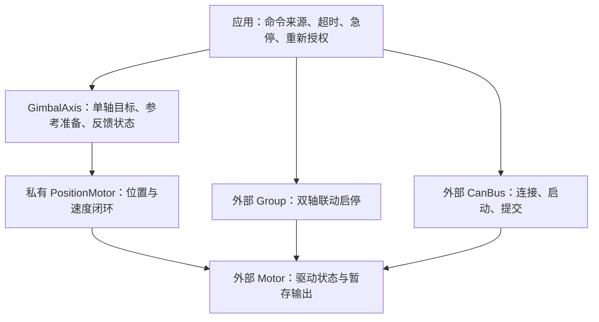

# 云台 Axis 封装边界与整合方案

> 当前实施范围已收敛：仅合并 GimbalAxis，Gimbal 与大小 yaw 协调暂缓。以 [GimbalAxis 单轴封装实施记录](GimbalAxis单轴封装实施记录.md) 为准，本文保留设计分析。

> 后续设计：已明确采用 Axis 与 YawGimbal 合并，并进一步抽取可复用双轴 Gimbal。请以 [云台 GimbalAxis 与 Gimbal 分层重构方案](云台GimbalAxis与Gimbal分层重构方案.md) 作为下一步实施方案。本文保留外部调用清单与单轴分析；其中 Group 留在应用层、暂不抽取 Gimbal 的建议已被后续方案替代。

## 1. 状态、范围与结论

基线：2026-09-29，提交 `3fd4af1`。本文件是源码分析和手工重构方案，下面的 `GimbalAxis`、`AxisCommand`、`poll()` 等新接口尚未实现。业务源码未修改，未运行构建、测试或硬件验证。

目标是减少双轴样例对内部对象和状态的直接访问，同时理顺单轴控制的职责。保持电机控制算法、遥控授权、双轴联动、总线提交和故障恢复策略的边界。

推荐目标：把现有 `Axis` 与 `YawGimbal` 的单轴职责整合成 `robotics::GimbalAxis`，内部拥有一个 `PositionMotor`，外部保留 `Motor`、`Group` 和 `CanBus`。这会消除 `yaw.controller.begin()` 这样的访问、重复的云台配置和 pitch 借用 yaw 命令字段的命名问题。

这是基于仓库内三个调用方的建议，未确认仓库外是否有使用 `YawGimbal` 构造接口的项目。若需要稳定旧 API，优先采用第 5 节的兼容方案。

## 2. 当前到底有哪些外部访问

以下行号对应 `samples/robotics/gimbal_control/src/main.cpp`。

| 外部访问 | 位置 | 实际用途 | 建议接口 |
| --- | --- | --- | --- |
| `Axis yaw(...)` / `Axis pitch(...)` | 107、108 | 接线：一个电机、位置环配置、单轴配置 | `GimbalAxis(...)` |
| `yaw.controller.begin()` / pitch 同样调用 | 128、130 | 验证云台配置并配置位置控制器 | `yaw.begin()` |
| `yaw.ready(now)` / `pitch.ready(now)` | 163、164 | 判断能否开始使能；必要时重建参考；更新就绪时间 | `yaw.poll(now)` 返回状态 |
| `yaw.feedbackHealthy()` / pitch 同样调用 | 165 | 运行中检查反馈和角度边界 | 读取此次 `poll()` 的 `feedback_healthy` |
| `yaw.ready_ms` / `pitch.ready_ms` | 168 | 要求遥控帧晚于两轴恢复就绪的时间 | 读取此次 `poll()` 的 `ready_since_ms` |
| `yaw.controller.reset()` / pitch 同样调用 | 188、190 | 在组使能前清控制历史、用反馈建立目标 | `yaw.reset()` |
| `yaw.update(rate, stamp, dt)` / pitch 同样调用 | 204、205 | 构造 Rate 命令并更新本轴控制输出 | `yaw.updateRate(rate, dt)` |

除构造外，现有调用有六种形式。当前样例真正需要的是四组操作：配置、周期状态刷新、使能前重置、运行更新。

成员访问也很明确：

| 成员 | 结构体外是否使用 | 处理方式 |
| --- | --- | --- |
| `drive` | 没有通过 `yaw.drive` 访问；外部另有 `yaw_drive` | 类内保留引用，外部仍拥有 Motor |
| `axis_motor` | 双轴样例中没有 | 私有拥有；台架样例需要只读遥测入口 |
| `controller` | 外部穿透调用 begin/reset | 合并其控制逻辑，消除这一层成员访问 |
| `config` | 没有 | 和 YawGimbal 的配置合并为一份 |
| `ready_ms` | 外部直接读 | 通过返回的状态值公开 |
| `was_ready` | 没有 | 私有状态 |
| `reference_seeded` | 没有 | 私有状态，受参考初始化策略控制 |

`feedbackHealthy(false)` 只在 Axis 内部使用。它用于建立参考前的检查，不必继续作为公开布尔参数接口。

## 3. 繁琐的原因与不能混淆的语义

### 3.1 封装只做了一半

Axis 已经负责组装 PositionMotor 和 YawGimbal，但外部仍需要知道 `controller` 这个成员才能初始化、重置。外部也直接读取可修改的就绪时间。这些都可以通过稳定接口收起来；仅把 `struct` 改为 `class` 不会自动解决问题。

Axis 与 YawGimbal 各持有一份相同的云台配置，也都按 Continuous/Limited 判断位置来源、参考要求和限位。合并后可以共用私有检查辅助函数，但要保留不同阶段的检查强度，不能把更新阶段的条件一股脑套到参考尚未建立的阶段。

### 3.2 ready 不是“正在正常工作”

`drivers/motor/motor.cpp:295` 的 `readyLocked()` 要求状态为 Disabled，且总线已启动、安全准备完成、反馈稳定等。因此 `Axis::ready()` 的含义是“此刻可以进入使能流程”，Active 时返回 false 是正常的。

这就是主循环同时调用 `ready()` 和 `feedbackHealthy()` 的原因。重构后应保留两个字段：

- `ready_for_enable`：用于安全拨杆确认和进入使能流程。
- `feedback_healthy`：用于运行中的反馈门控。

不能用 `if (!status.ready_for_enable) disable()` 替换现在的运行门控，否则刚运行就会被停掉。

`ready_since_ms` 保存最近一次 false → true 的时间；离开就绪状态时保留时间值，在下一次进入就绪时更新。它不是最近一帧反馈的时间，也不是每次 poll 的时间。

### 3.3 参考重建和目标重置是两件事

- `Motor::reseedPosition(known)`：重建驱动位置坐标，成功后增加 `reference_generation`。
- `YawGimbal::reset()`：重置位置控制器历史，并用反馈设置运动目标，不使能电机。

不能通过每周期调用 reset 来代替参考管理，也不能每周期 reseed。现有 reseed/reset 都拒绝在 Active 或 Enabling 时执行。

双轴样例用 GM6020 校准绝对角或 DM 已保存零点的原生位置重建 Limited 参考。这依赖具体硬件标定；`Limited` 本身不能证明这些坐标可信。

### 3.4 命令包装中的遥控属性不是控制算法所需

Axis 的 `update()` 写入 `ControlSource::Remote` 和 `MessageStamp`，但当前 `YawGimbal::update()` 不读取它们，也不检查命令超时。样例已在外层检查遥控帧的新鲜度和恢复边界。

因此单轴接口可以接受中性角度/角速度命令。来源、时间戳继续由外层消息和安全逻辑保存并校验，不从机器人消息中删除。

## 4. 推荐的职责边界



`GimbalAxis` 的职责是单轴控制，不接管遥控设备或线程。所有控制状态由同一个执行器线程更新。

Motor 继续外置，因为同一电机还要被 Group、CanBus 和遥测使用。无需为了隐藏一切，再添加 `axis.motor()` 供外部取回电机。

两轴更新成功后再提交输出的时序仍由应用保证。不能让每个 `updateRate()` 内部直接 commit：同 CAN 时会改变整组输出的发布边界，跨 CAN 时也不能由单轴保证双轴原子提交。

`GimbalLocalSafety` 负责根据权限、时间戳等做安全决策，适合消费整理后的状态；它不适合拥有位置环或修改驱动坐标。其当前命令超时策略包含 Hold，而双轴样例超时会禁用 Group，不能直接替换而宣称行为不变。

## 5. 方案比较

| 方案 | 得到什么 | 成本与局限 | 建议 |
| --- | --- | --- | --- |
| 在本地 Axis 加 begin/reset、私有成员、统一状态返回 | 快速消除穿透访问；只影响双轴样例 | Axis 和 YawGimbal 仍有重复配置与轴语义 | 只做小范围改动时采用 |
| 把 Axis 抽到库中，内部继续组合原 YawGimbal | 调用方得到统一接口，旧构造方式不受影响 | 保留内部两层状态与重复配置，需要维护适配 | 存在仓库外兼容要求时采用 |
| 合并 Axis 与 YawGimbal 为 GimbalAxis，拥有 PositionMotor | 单轴状态、配置、运动接口集中；yaw/pitch 命名统一 | 迁移三个调用方，补齐遥测入口与参考策略 | 当前仓库内推荐目标 |
| 塞进 PositionMotor 或 Motor | 表面上少一个类 | 通用电机层被云台模式、拓扑与参考策略耦合 | 不推荐 |
| 包成一个全自动双轴 Gimbal | 主循环可以更短 | 会同时涉及来源、安全策略、总线编排，范围明显更大 | 等双轴编排出现实际复用需求再考虑 |

合并的理由是这些单轴职责已经紧密关联，而不是类的数量越少越好。原有 PID/位置控制仍保留在通用 PositionMotor 内，不搬进 GimbalAxis。

## 6. 建议接口草案

放置位置建议：`include/robotics/gimbal/gimbal_axis.hpp`，实现为 `lib/robotics/gimbal_axis.cpp`。下面是设计草案，不是现有可调用 API。

```cpp
enum class AxisTopology : std::uint8_t { Continuous, Limited };
enum class AxisReferenceInit : std::uint8_t {
    Preserve,           // 使用外部已经建立的参考，不自动 reseed。
    CalibratedFeedback, // 显式确认绝对角/原生位置与机械限位坐标一致。
};

struct GimbalAxisConfig {
    AxisTopology topology = AxisTopology::Continuous;
    float min_angle_rad = -3.14159265f;
    float max_angle_rad =  3.14159265f;
    float max_rate_rad_s = 3.0f;
    bool hold_on_zero_rate = true;
    AxisReferenceInit reference_init = AxisReferenceInit::Preserve;
};

struct AxisCommand {
    GimbalMode mode = GimbalMode::Disabled;
    float target_rad = 0.0f;
    float rate_rad_s = 0.0f;
};

class GimbalAxis {
public:
    struct Status {
        bool ready_for_enable = false;
        bool feedback_healthy = false;
        std::uint64_t ready_since_ms = 0;
        int error = 0; // 本次 poll 的配置/参考准备错误；不是 Motor 的故障锁存。
    };

    GimbalAxis(motor::Motor &drive,
               const control::PositionMotor::Config &position_config,
               const GimbalAxisConfig &config);
    GimbalAxis(const GimbalAxis &) = delete;
    GimbalAxis &operator=(const GimbalAxis &) = delete;
    GimbalAxis(GimbalAxis &&) = delete;
    GimbalAxis &operator=(GimbalAxis &&) = delete;

    int validate() const;
    int begin();
    Status poll(std::uint64_t now_ms);
    int reset();
    int update(const AxisCommand &, SafetyAction action, float dt_s);
    int updateRate(float rate_rad_s, float dt_s);
    double targetAngleRad() const;
    control::PositionMotor::Telemetry telemetry() const;

private:
    motor::Motor &drive_;
    control::PositionMotor position_;
    GimbalAxisConfig config_;
    // 迁入原 YawGimbal 的目标、模式、安全动作、使能代次状态。
    // 迁入 Axis 的 was_ready、ready_since、reference_seeded。
    // 另记录 begin 是否成功；内部按阶段检查同一份配置。
};
```

双轴样例会用 begin/poll/reset/updateRate 四组操作；台架和应用还使用通用 update、目标角查询和遥测。保留后者是已有调用需求，不必开放整个 PositionMotor 对象。

### 6.1 各接口的契约

| 接口 | 参数、返回值与状态变化 |
| --- | --- |
| 构造 | Motor 引用必须长期有效；按成员声明顺序构造 PositionMotor；只保存配置与初始状态，不启动总线、不使能 |
| `validate()` | 检查范围、速率、枚举和位置参考模式；沿用原 `-EINVAL` / `-ENOTSUP`，成功 0；Continuous 配 CalibratedFeedback 应拒绝，避免无意义配置 |
| `begin()` | 总线 start 后调用；validate 成功再 configure 位置环；成功置已配置；重复调用返回 `-EALREADY`，保留已经成功的配置状态；其他底层错误原样返回 |
| `poll(now_ms)` | 毫秒、单调递增；刷新健康、必要的参考准备、就绪边沿；返回值副本，不是可修改的内部状态；不得使能电机或清故障 |
| `reset()` | 使能前调用；沿用原重置顺序；未配置 `-EACCES`，Active/Enabling 为 `-EBUSY`，反馈不足等保留原错误；不修改就绪时间，不替代参考准备 |
| `update(command, action, dt_s)` | 角度 rad、角速度 rad/s、周期 s；沿用原 Rate/Hold/AbsoluteAngle、限位及 generation 逻辑；`0 < dt <= 0.02`，位置环还会执行其自己的 dt 范围检查；返回 0 或原错误 |
| `updateRate(rate, dt)` | 构造中性 Rate 命令，委托 `update(..., SafetyAction::Active, dt)`；便利接口仅用于外部已批准 Active 的路径，仍受电机输出许可约束 |
| `targetAngleRad()` | 返回当前目标角度，不是反馈角度；初始值保持原实现行为 |
| `telemetry()` | 返回 `position_.telemetry()` 的副本，保留底层同步和有效性字段；不暴露可修改控制器 |

`update()` 对 Disable/Disabled 仍返回 `-EACCES`，调用方仍负责真正的 disable；实际角度越界仍为 `-ERANGE`，底层错误仍上传。新增 `poll()` 不能成为跳过驱动和控制环自身检查的理由。

### 6.2 poll 的建议顺序

这是伪代码，按此语义迁移，先保证完整流程，再考虑减少重复读取：

```text
未成功 begin：返回两项状态 false、error = -EACCES，不改动驱动参考
读取 snapshot，查询 drive.ready()
如果 Limited + 显式 CalibratedFeedback + drive.ready()：
    如果第一次需要建立参考，或当前参考失效：
        从新鲜反馈中选取已约定坐标的有限数值
        先选有效且有限的绝对角，否则选有效且有限的原生位置
        无可用值时报告 -EAGAIN（过期）或 -ENODATA（位置缺失）
        调用 reseedPosition；失败保留原返回码，本轮不可报告 ready
        成功才更新 reference_seeded，并重新读取 snapshot
使用参考建立后的数据检查 feedback_healthy
重新确认 drive.ready()，与 feedback_healthy、准备结果组合得 ready_for_enable
ready_for_enable 从 false 到 true 时：ready_since_ms = now_ms
记录 was_ready；返回状态值
```

Preserve 模式不因为缺少参考就自行重建；需要建立参考的调用方必须在禁用阶段显式完成。Continuous 的健康判断先保留原单轴绝对角规则，PositionMotor 对速度、温度、连续参考等更完整的校验仍然有效。`feedback_healthy` 不代表所有电机安全条件都已通过。

原 Axis 先按“有效且有限”判断是否有来源，实际取值时却只按绝对角 valid 位优先选择。草案将选择和校验统一，这是刻意的边界修正，需要在实现记录中说明，不能描述为完全机械搬移。

多个 Motor 方法各自加锁，`poll()` 不是跨方法或跨两轴的原子快照。参考重建后必须重新读取数据；Group.enable、Motor、PositionMotor 仍需在动作发生时重新验证条件。此方案不承诺严格只读一次反馈，也不以此宣称性能收益。

构造后的对象不要复制或移动：位置控制器配置时向 Motor 绑定自身地址。begin/poll/reset/update/目标查询由同一个控制线程串行调用；除已有的遥测副本接口外，不承诺跨线程并发访问，也不新增中断调用路径。

## 7. 双轴调用方会变成什么样

保留外部 Motor、Group、CanBus；用 GimbalAxis 替换 Axis。board_config 的两轴配置显式选择 CalibratedFeedback，沿用已核对的零点与范围，不因重构调整数值。

```cpp
static GimbalAxis yaw(yaw_drive, board_config::yawMotorConfig(), board_config::yaw);
static GimbalAxis pitch(pitch_drive, board_config::pitchMotorConfig(), board_config::pitch);

// 仍然先 attach 两个电机，再 start 所需总线。
if (ret == 0)
    ret = yaw.begin();
if (ret == 0)
    ret = pitch.begin();

// 每个控制周期：
const auto ys = yaw.poll(now);
const auto ps = pitch.poll(now);
const bool yaw_ready = ys.ready_for_enable;
const bool pitch_ready = ps.ready_for_enable;
const bool feedback_ok = ys.feedback_healthy && ps.feedback_healthy;
const bool new_command = remote.stamp.timestamp_ms >
                         std::max(ys.ready_since_ms, ps.ready_since_ms);

// 现有授权与重置分支内：
ret = yaw.reset();
if (ret == 0)
    ret = pitch.reset();
if (ret == 0)
    ret = gimbal.enable();

// 现有 Active 分支内：
const int yr = yaw.updateRate(yaw_rate, dt);
const int pr = yr == 0 ? pitch.updateRate(pitch_rate, dt) : 0;
// 继续保留两轴成功后 commit、失败时 Group.disable 的现有逻辑。
```

这是分散位置的替换片段，不是可顺序粘贴的一整段程序。急停/复位分支仍在 poll 前处理；反馈恢复、拨杆重新授权、新命令门槛以及 enable_issued 状态保持原顺序。

这里减少的是内部知识和分散查询。两台电机仍各自需要配置、重置和更新，两轴协调属于 Group 与应用层，不应为了少写两行而改变这一点。

## 8. 手工实施顺序与影响文件

遵循 implementation-first：先连续完成整个功能迁移，再集中检查；不按每个小方法新增测试、反复构建。

1. 新建 `include/robotics/gimbal/gimbal_axis.hpp` 和 `lib/robotics/gimbal_axis.cpp`。先迁入原 YawGimbal 的验证、目标生成、reset 与状态，再迁入 Axis 的参考准备与就绪时间管理，落实上述契约。位置环仍调用 PositionMotor。
2. 更新 `lib/robotics/CMakeLists.txt` 的 `CONFIG_SKYWALKER_ROBOTICS_GIMBAL` 源文件列表。保持现有 Kconfig 开关，不为一次合并增加开关。
3. 修改双轴样例的 `src/board_config.hpp`：切换新类型、显式开启现有校准反馈参考策略。修改 `src/main.cpp`：删除本地 Axis、替换构造与六类外部访问，保留 Group/CanBus、安全逻辑和遥测通道。
4. 修改 `samples/robotics/yaw_gimbal/src/main.cpp` 和 `src/board_config.hpp`：去掉外置 PositionMotor；保留键盘 e/h/0/1 等操作语义；把输入映射到 AxisCommand；将 `axis.telemetry()` 改为 `yaw.telemetry()`；保留 `yaw.targetAngleRad()`。当前 Continuous 配置采用 Preserve，保留现有使能流程即可。
5. 修改 `applications/sentry_gimbal/src/main.cpp` 和 `src/board_config.hpp`：用新类构造替换外置位置控制器；保留 `LocalGimbalCommand`、GimbalLocalSafety 和消息来源/时间戳判断；将最终批准的 yaw 字段投影为 `AxisCommand{mode, yaw_target_rad, yaw_rate_rad_s}` 再 update。为控制迁移范围，可先保留该应用现有的 ready_ms 门控，不同步替换成 poll；它当前使用 `>= ready_ms`，双轴样例使用 `>`，不要顺手统一策略。
6. 仓库内迁移完成后，再删除旧 `include/robotics/gimbal/yaw_gimbal.hpp`、`lib/robotics/yaw_gimbal.cpp` 或提供明确的兼容层。兼容层必须适配旧的外部 PositionMotor 构造方式；简单 `using YawGimbal = GimbalAxis` 无法兼容旧构造函数，不算兼容实现。
7. 更新相关 README、`docs/module-integration.md`、`docs/14-robotics.md`、`docs/15-applications.md`、`docs/17-motor-workflow.md` 和架构浏览器中的类名与调用链。历史开发指南只标明基线，不把历史草案批量替换成当前实现。`docs/14-robotics.md` 原有 poll/suspend 表述与当前 YawGimbal 接口不一致，需按最终接口修正，不能用它证明当前已存在 poll。

不需要修改 Motor、Group、CAN 协议、遥控驱动、设备树或 PID 数值。若发现必须修改这些部分，先重新核对是否扩大了单轴封装的范围。

## 9. 完成迁移后的集中检查

以下命令供实施者执行，本次未运行：

```sh
rg -n 'YawGimbal|YawTopology|\.controller\.|reference_seeded|ready_ms' include lib samples/robotics applications docs
west build -b dm_mc02/stm32h723xx samples/robotics/gimbal_control -d /tmp/skywalker-axis-gimbal-control
west build -b dm_mc02/stm32h723xx samples/robotics/yaw_gimbal -d /tmp/skywalker-axis-yaw-bench
west build -b dm_mc02/stm32h723xx applications/sentry_gimbal -d /tmp/skywalker-axis-sentry-gimbal
```

搜索结果需要按上下文审核：应用暂留的 ready_ms 和历史指南不应机械删除。项目 CI `.github/workflows/build-applications-and-samples.yml` 构建所有 applications/samples，最终还应通过该门禁，不能仅以三处定向构建代替。

现有 `tests/motor/regression` 验证底层电机并发、组联动和生命周期，不直接覆盖本次 GimbalAxis 行为。如执行它，只能作为底层回归，不能据此宣称单轴迁移已验证：

```sh
west build -b native_sim/native/64 tests/motor/regression -d /tmp/skywalker-motor-regression
/tmp/skywalker-motor-regression/zephyr/zephyr.exe
```

关键流程检查集中做一轮：配置失败应阻止参考修改和使能；Limited 参考准备完成后才允许授权；Active 时 ready_for_enable 为 false 但健康反馈仍允许持续控制；Disable→恢复后必须满足原新帧和拨杆规则；Rate/Hold/AbsoluteAngle 与遥测保持原有行为；任一轴更新失败仍撤销整个组；跨 CAN 时仍由应用提交两条总线。

如需新增自动化验证，优先覆盖一次“启动→参考准备→授权→使能→控制→反馈丢失→恢复”的完整流程，不为每个转发方法添加镜像测试。

## 10. 实机前提、排查与最终清单

本次为封装分析，不涉及上电。实施后实机检查时先保持禁用并支撑 pitch，确认零点、方向、机械范围与急停输入，再接通电机电源观察反馈及参考，最后用新的一轮拨杆授权做低速短行程验证。样例 pitch 限位仍是占位值，不能因完成重构就自动将 `connections_configured` 设为 true。

| 现象 | 优先检查 |
| --- | --- |
| 使能后立刻停机 | 是否误把 ready_for_enable 当成 Active 的运行条件 |
| Limited 一直不能就绪 | 是否明确选择参考策略、源坐标是否有效、参考准备错误码、角度是否在范围内 |
| 目标持续追随反馈、保持不住 | 是否每周期调用 reset/reseed，或错误重置模式历史 |
| pitch 没有运动或跟随错误命令 | 是否正确投影为本轴的 rate_rad_s/target_rad |
| 台架日志丢失 effort | 是否补齐只读 telemetry 转发 |

- [ ] 业务层不再访问 `.controller` 或可修改的就绪时间。
- [ ] 就绪与反馈健康的语义分开，保持原授权比较符和时序。
- [ ] 参考重建策略明确，和目标 reset 分开；不在 Active/Enabling 重建参考。
- [ ] PositionMotor 地址和 Motor 生命周期稳定，所有控制更新串行执行。
- [ ] yaw/pitch 命令使用中性轴字段，原机器人消息与来源/时间戳校验仍保留。
- [ ] 台架遥测、目标角查询、Hold/AbsoluteAngle 调用均完成迁移。
- [ ] 两轴更新、Group 撤销和 CAN 提交顺序保持正确。
- [ ] 三处调用方定向构建与项目 CI 完成；实机验证状态单独记录。

未验证假设：仓库外 API 兼容需求、实物参考坐标与机械限位一致性、重构后的构建及硬件行为。当前已完成的是设计指南，以上业务改动仍需手工实施。
