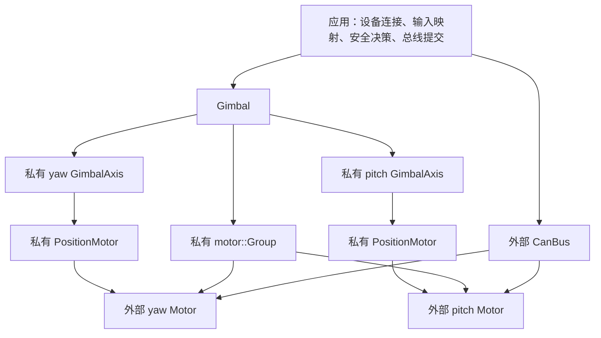
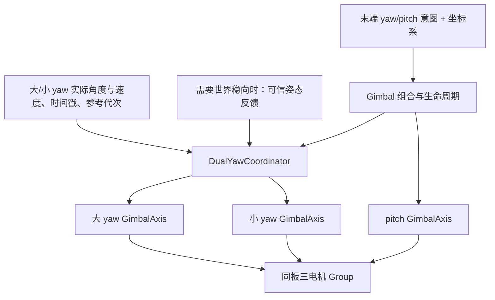

# 云台 GimbalAxis 与 Gimbal 分层重构方案

> 实施状态：`GimbalAxis` 已在 `include/robotics/gimbal/gimbal_axis.hpp` 和 `lib/robotics/gimbal_axis.cpp` 实现。双轴 `Gimbal` 尚未实现；大小 yaw 协调仍需明确机械拓扑和反馈来源。本文保留双轴层及协调器的未完成方案，单轴设计章节仅作背景参考。

## 1. 状态与确定的方向

方案基线：2026-09-29，提交 `3fd4af1`。该基线早于 `GimbalAxis` 实现。当前源码已有 `GimbalAxis`，但没有 `Gimbal` 或 `DualYawCoordinator`；本文后续实现步骤需据此跳过已完成部分。双轴方案及硬件行为仍未验证。

采用两层库代码：

1. `robotics::GimbalAxis`：合并样例 Axis 与原 YawGimbal，内部拥有 PositionMotor，可以独立用于单轴。
2. `robotics::Gimbal`：拥有 yaw、pitch 两个 GimbalAxis 和一个 motor::Group，提供统一的双轴控制接口。

Motor 与 CanBus 由应用持有。应用负责连接设备、生成命令、决定运动许可，以及在控制周期末统一提交总线。Gimbal 负责执行双轴控制和共同启停。

首版 Gimbal 固定为 yaw/pitch 两轴，直接消费现有 GimbalCommand。当前单轴台架和 sentry_gimbal 继续使用独立 GimbalAxis，不虚构第二台电机，不引入可选轴、动态轴列表或继承框架。

本方案把 Group 的拥有权与双轴编排移入 Gimbal。单轴封装已完成；剩余设计围绕双轴生命周期、Group 协调和大小 yaw 目标分配展开。

## 2. 结构与对象归属



| 对象              | 拥有者                  | 主要职责                                     |
| ----------------- | ----------------------- | -------------------------------------------- |
| PositionMotor     | GimbalAxis              | 位置/速度闭环、输出单位、控制安全校验        |
| GimbalAxis × 2   | Gimbal                  | 每轴目标生成、参考准备、反馈检查、就绪边沿   |
| motor::Group      | Gimbal                  | 联动使能、故障传播、共同撤销输出许可         |
| motor::Motor × 2 | 应用                    | 电机型号配置、驱动反馈与状态、暂存输出       |
| motor::CanBus     | 应用                    | attach/start、整条总线的批次提交、异步 I/O   |
| 输入与安全策略    | 应用或已有消息/安全模块 | 来源、新鲜度、拨杆、裁判权限、急停和恢复授权 |

“拥有”表示对象直接作为私有成员存在，生命周期由所属对象负责。GimbalAxis 对 Motor 只保存引用，不复制或创建电机。

构造顺序：先创建两台 Motor，再创建 Gimbal 形成内部 Group，然后完成所有电机 attach，最后 start 所需总线。

同一电机只能属于一个 Group。采用 Gimbal 后必须删除样例中额外构造的 motor::Group，也不能保留外部 PositionMotor 为同一电机绑定第二个控制器。

Gimbal、GimbalAxis 禁止复制和移动：PositionMotor 配置时绑定自身地址，Group 构造时绑定成员关系。当前总线没有公开 stop/detach 生命周期，推荐沿用 static 对象存活到程序结束；不能销毁短生命周期 Gimbal 后，留下 Motor 内的 Group/控制器引用。

## 3. GimbalAxis：把一个轴封装完整

放置于 `include/robotics/gimbal/gimbal_axis.hpp` 和 `lib/robotics/gimbal_axis.cpp`。接口草案：

```cpp
enum class AxisTopology : std::uint8_t { Continuous, Limited };
enum class AxisReferenceInit : std::uint8_t { Preserve, CalibratedFeedback };

struct GimbalAxisConfig {
    AxisTopology topology = AxisTopology::Continuous;
    float min_angle_rad = -3.14159265f;
    float max_angle_rad =  3.14159265f;
    float max_rate_rad_s = 3.0f;
    bool hold_on_zero_rate = true;
    AxisReferenceInit reference_init = AxisReferenceInit::Preserve;
};
struct AxisCommand {
    GimbalMode mode = GimbalMode::Disabled;
    float target_rad = 0.0f;
    float rate_rad_s = 0.0f;
};
class GimbalAxis {
public:
    struct Status {
        bool ready_for_enable = false;
        bool feedback_healthy = false;
        std::uint64_t ready_since_ms = 0;
        int error = 0;
    };
    GimbalAxis(motor::Motor &, const control::PositionMotor::Config &,
               const GimbalAxisConfig &);
    // 复制和移动操作均删除。
    int validate() const;
    int begin();
    Status poll(std::uint64_t now_ms);
    int reset();
    int update(const AxisCommand &, SafetyAction, float dt_s);
    int updateRate(float rate_rad_s, float dt_s);
    double targetAngleRad() const;
    control::PositionMotor::Telemetry telemetry() const;
private:
    friend class Gimbal;
    motor::Motor &drive_;
    control::PositionMotor position_;
    GimbalAxisConfig config_;
    // 私有：参考初始化、目标、模式历史、使能代次、就绪时间、配置状态。
    // 共用私有反馈检查辅助函数，供 poll/reset/update 和 Gimbal 预检使用。
};
```

friend Gimbal 只用于双轴协调时复用私有预检，避免增加可修改控制器/电机访问器。外部不能通过 `gimbal.yaw().reset()` 绕开双轴流程；查询通过状态和遥测副本完成。

| 接口       | 行为与边界                                                                                                                      |
| ---------- | ------------------------------------------------------------------------------------------------------------------------------- |
| validate   | 检查有限数值、限位顺序、正最大速率、枚举；Continuous 配 AbsoluteNearest，Limited 配 DriverContinuous；失败为 -EINVAL / -ENOTSUP |
| begin      | 总线启动后配置位置控制器；不等待反馈、不使能；成功 0，重复成功配置 -EALREADY，其他错误透传                                      |
| poll(now)  | 刷新反馈健康；按显式策略准备参考；记录最近一次进入可使能状态的时间；未 begin 时 error=-EACCES，不改驱动参考                     |
| reset      | 禁用状态下清控制历史，并以新鲜反馈建立目标；Active/Enabling 为 -EBUSY；不重建驱动坐标、不使能                                   |
| update     | 沿用原 Rate 积分、AbsoluteAngle 目标限速、Hold、连续角环绕、Limited 限位；执行位置控制并暂存输出                                |
| updateRate | 为独立单轴提供便利，委托 Rate + Active；不自行授予电机输出许可                                                                  |
| 查询       | 返回目标角或 PositionMotor 遥测副本；目标与实际反馈分别表达                                                                     |

时间 now 为单调毫秒，dt 为秒且满足 `0 < dt <= 0.02`，还需通过位置环自身的周期范围检查。角度为 rad，角速度为 rad/s。错误沿用原约定：反馈暂不可用 -EAGAIN、参考缺失 -ENODATA、越界 -ERANGE、参数非法 -EINVAL、状态不允许 -EACCES。

ready_for_enable 要求电机 Disabled 且准备条件满足，Active 时为 false。feedback_healthy 在正常 Active 时仍为 true；不能用 ready 代替运行健康检查，也不能因正常 Active 下 ready=false 就报告 error。

Limited 只有显式选择 CalibratedFeedback 才使用校准绝对角/原生位置建立参考；首次或参考失效时，在电机禁用且反馈稳定后执行。来源同时检查 valid 位和有限数值，优先可信绝对角，其次可信原生位置；reseed 成功后重新读取反馈。失败不置 reference_seeded，保留错误并报告不可使能。

Preserve 不自动建立参考；需要时由外部在禁用阶段准备。Continuous 使用 Preserve，拒绝无意义的 CalibratedFeedback 配置。不能仅凭 Limited 就认定原生坐标和机械限位已标定一致。

参考建立前的位置源检查、建立后的反馈检查应复用配置但保留不同阶段条件。原 Axis 校验来源时检查有限数值、实际选择却仅按绝对角有效位优先，本次统一选择规则是边界修正，应单独记录。

## 4. Gimbal：代表整套双轴云台

放置于 `include/robotics/gimbal/gimbal.hpp` 和 `lib/robotics/gimbal.cpp`。

```cpp
class Gimbal {
public:
    struct AxisSetup {
        motor::Motor &motor;
        control::PositionMotor::Config position;
        GimbalAxisConfig axis;
    };
    enum class AxisId : std::uint8_t { None, Yaw, Pitch };
    enum class Stage : std::uint8_t {
        None, Configure, Prepare, Reset, Enable, Update, ClearFault
    };
    struct Error {
        Stage stage = Stage::None;
        AxisId axis = AxisId::None;
        int code = 0;
    };
    struct Status {
        bool configured = false;
        bool ready_for_enable = false;
        bool feedback_healthy = false;
        bool active = false;
        bool enabling = false;
        std::uint64_t ready_since_ms = 0;
        std::uint64_t enable_generation = 0;
        GimbalAxis::Status yaw{};
        GimbalAxis::Status pitch{};
        motor::FaultInfo last_fault{};
        Error last_error{};
    };
    struct Telemetry {
        double yaw_target_rad = 0;
        double pitch_target_rad = 0;
        control::PositionMotor::Telemetry yaw{};
        control::PositionMotor::Telemetry pitch{};
    };
    Gimbal(const AxisSetup &yaw, const AxisSetup &pitch);
    // 复制和移动操作均删除。
    int begin();
    Status poll(std::uint64_t now_ms);
    int enable();
    void disable();
    int clearFault();
    int update(const GimbalCommand &, SafetyAction, float dt_s);
    Telemetry telemetry() const;
private:
    motor::Group group_;
    GimbalAxis yaw_;
    GimbalAxis pitch_;
    // begin 结果、最近状态/错误；不复制 Group 的底层握手状态机。
};
```

AxisSetup 是参数包。构造时配置复制到各轴，Motor 保持引用；不保存对临时 AxisSetup 的引用。Group 按成员声明顺序先绑定两台电机，各轴随后构造。

Status 的 ready/active/enabling 从轴与 Group 状态推导。last_error 记录最近失败的阶段/轴/错误码，直到下一次 enable 成功受理后清除；它用于诊断，不作为当前故障的唯一依据。last_fault 是 Group 的历史故障，不能仅凭非零历史值永久阻止恢复。

### 4.1 begin：统一配置

先验证两轴引用不同电机、两轴配置有效，再依次调用两轴 begin。两轴均成功才报告 configured。总线 start 本身仍负责已有的 Group 拓扑冲突检查。

成功返回 0，重复成功 begin 返回 -EALREADY。若先配置一轴后另一轴失败，保存错误、撤销输出许可、整机保持配置失败，不尝试解绑定已配置 PositionMotor。首版采用一次启动配置：失败后再次 begin 返回保存的失败码，由应用结束初始化、修正配置后重启。

### 4.2 poll：准备参考并聚合状态

依次调用两轴 poll，再读取 Group 状态：

```text
feedback_healthy = yaw.feedback_healthy && pitch.feedback_healthy
ready_for_enable = configured && yaw.ready_for_enable &&
                   pitch.ready_for_enable && group.ready
ready_since_ms = max(yaw.ready_since_ms, pitch.ready_since_ms)
active = group.active
enabling = group.enable_pending
```

若 Group 正处于 Active/Enabling，或任一 MotorSnapshot.state 仍是 Active/Enabling，而任一轴反馈或角度不健康，立即请求整组 disable，记录 Prepare 错误及轴，重新读取组状态返回。这部分原来位于样例的 feedback_ok 门控中。Group.status().active 可能已因反馈失效而变成 false，因此不能只看该字段来决定是否需要停机。

poll 不因健康恢复自动 enable，也不清故障。ready_since_ms 保持两轴各自最近就绪时刻的最大值，不每次刷新。单轴 error 区分反馈过期、数据缺失、越界或 reseed 失败，不能仅返回模糊 bool。

多个快照之间驱动仍会异步变化，poll 不是原子保证；enable/update 必须在实际动作前复核，不能只信缓存 ready。

### 4.3 enable：两轴重置后请求联合使能

调用前应用已经完成新命令、权限和恢复授权。内部顺序：

```text
检查 configured；Active 或 Enabling 返回 -EALREADY
重新检查两轴已准备好的反馈/参考与 Group.ready
未就绪或条件已变化：返回 -EAGAIN，不在 enable 内自动 reseed
yaw.reset()
pitch.reset()
group.enable()
```

前置 -EALREADY 只是拒绝重复请求，不停止正常运行。真正的准备/重置/使能失败不继续后续动作，记录来源并撤销输出许可，错误原样返回；未配置为 -EACCES。上层重新判断授权，不自动重试。

返回 0 表示“请求已受理”，不是 Active。后续 poll 报告 enabling，直到两轴进入相同使能代次，Group 才打开运行许可。Enabling 时等待，不重复 reset/enable。

不单独公开 Gimbal::reset：双轴 reset 是 enable 的一部分，避免调用方漏重置某一轴；独立 GimbalAxis 保留 reset。

### 4.4 update：分发命令，任一失败撤销整组

| GimbalCommand 输入 | yaw AxisCommand | pitch AxisCommand |
| ------------------ | --------------- | ----------------- |
| mode               | 相同 mode       | 相同 mode         |
| 角度               | yaw_target_rad  | pitch_target_rad  |
| 角速度             | yaw_rate_rad_s  | pitch_rate_rad_s  |

来源和时间戳仍由上层校验，Gimbal 不内置遥控超时数值，也不将 Vision/Autonomous 强制当作 Remote。

处理顺序：

1. Disable 动作或 Disabled 模式：执行 disable，返回 0，不暂存运动输出。
2. 校验 configured、动作、模式、dt 和本次实际消费的命令值；非 Active 不计算运动输出。
3. 预检两轴反馈、参考和限位，避免已知的第二轴问题仍先更新第一轴。
4. 构造两条 AxisCommand，先 yaw.update，成功再 pitch.update。
5. 任一失败记录来源、group.disable、返回负数；两轴成功返回 0，输出只暂存到 Motor。

未配置/非 Active 为 -EACCES，无效命令或周期为 -EINVAL，越界为 -ERANGE，底层错误透传。失败后调用方不提交该云台运动批次。

Hold 动作优先选择保持模式，可构造零初始化的 Hold 轴命令，不消费过期目标中的角度/角速度；dt、反馈与状态仍须有效。这是明确的上层 Hold 分发语义，与原 YawGimbal 对所有未使用值也做有限性检查的行为有区别，应在实现说明中记录。

Gimbal 的 Disable 路径实际禁用整组并返回 0；单轴 GimbalAxis 的 Disabled 更新仍返回 -EACCES。这一区别反映整组执行器与单轴控制算法的职责。

预检不能保证第二轴更新绝不失败。即使 yaw 已暂存输出，pitch 随后失败，仍须撤销整组；不宣称两轴 update 是事务或已经执行 CAN 发送。

### 4.5 disable、clearFault、遥测与线程

disable 撤销 Group 输出许可，停机帧由 I/O 线程发送；已禁用且无新使能请求时避免重复生成停机请求。它不表示机构已静止，也不修改参考坐标。

clearFault 只响应外部明确复位：先确保撤销输出，再委托 Group.clearFault，透传错误。0 只表示请求受理/没有可清故障，不表示异步握手完成。clearFault 不解除上层急停锁存、不设置 rearm_allowed、不自动 enable。

telemetry 返回两轴 PositionMotor 遥测和目标角副本，保留有效性字段。所有 Gimbal 控制方法、poll 与目标聚合查询由同一执行器线程串行调用，向其他线程发布完整副本。首版不新增线程、互斥锁或中断调用路径，不承诺两轴遥测是同一时刻的硬件快照。

## 5. CAN 提交仍在外部

`include/drivers/motor/can_bus.hpp` 明确规定 commit 发布整条总线，调用方必须协调 setter/update 和 commit 批次。同一总线可能还承载其他机构。

所以 Gimbal 不保存 CanBus 引用，begin 不 attach/start，update 不 commit。应用在本周期完成同一总线上所有获准机构的更新之后，每条不同物理总线提交一次；提交失败按影响范围撤销机构输出许可并通知应用恢复逻辑。

双轴样例共 CAN 时提交一次，跨 CAN 时分别提交。第一条已提交、第二条失败时调用 gimbal.disable，但不能撤回已经发送的帧，不能声称跨总线原子性。commit 成功只表示发布成功，异步发送故障仍由 I/O、Motor、Group 与后续 poll 反映。

## 6. 应用用法草案

初始化不再外建 Group、Axis、PositionMotor 或 YawGimbal：

```cpp
static motor::Motor yaw_drive(board_config::yawHardware());
static motor::Motor pitch_drive(board_config::pitchHardware());
static Gimbal gimbal(
    {yaw_drive, board_config::yawMotorConfig(), board_config::yaw},
    {pitch_drive, board_config::pitchMotorConfig(), board_config::pitch});

// 创建/选择 CanBus；沿用全部 attach，再 start 的错误检查。
// 所有所需总线启动成功后：
ret = gimbal.begin();
```

控制周期的骨架如下，接口尚未实现，不能直接对当前源码编译：

```cpp
// 急停/显式复位仍优先处理，必要时调用 disable/clearFault。
const auto status = gimbal.poll(now);
if (enable_issued && !status.active && !status.enabling) {
    enable_issued = false;
    rearm_allowed = false;
}
// 保留当前 remote/dt/急停/拨杆/新帧门控，计算 rearm_allowed 和 requested。
// requested 不是简单的“拨杆在中位”。
if (!requested) {
    gimbal.disable();
    enable_issued = false;
} else if (!enable_issued && status.ready_for_enable) {
    ret = gimbal.enable(); // 两轴 reset + Group.enable 已封装。
    enable_issued = ret == 0;
    if (ret < 0)
        rearm_allowed = false;
} else if (status.active) {
    GimbalCommand command{};
    command.mode = GimbalMode::Rate;
    command.source = ControlSource::Remote;
    command.stamp = remote.stamp;
    command.yaw_rate_rad_s = yaw_rate;
    command.pitch_rate_rad_s = pitch_rate;
    ret = gimbal.update(command, SafetyAction::Active, dt);
    if (ret == 0)
        ret = yaw_bus.commit().error;
    if (ret == 0 && split_buses)
        ret = pitch_bus.commit().error;
    if (ret < 0) {
        gimbal.disable();
        enable_issued = false;
        rearm_allowed = false;
    }
}
```

片段省略的是已有授权条件与日志，不是删除它们。双轴样例仍要求 `remote.stamp.timestamp_ms > status.ready_since_ms`，保留在线/有效帧/超时/周期检查、安全拨杆再授权。poll 内物理异常停机后，应用仍在本周期撤销重新授权许可。

enable_issued 留在应用用于识别“上次请求中断，需要新一轮操作授权”。Group 的 enable_pending/active 是执行状态，两者不能相互替代。仅写 `if (ready && requested) enable()` 可能用旧许可自动恢复运行。

main 不再处理每轴 begin/reset/update、参考初始化或直接 Group 调用。剩余代码描述本应用何时允许运动；若后续还需缩短 main，可将原遥控门控移入样例的 remote_gimbal_policy.hpp，首版不为此扩展公共 Gimbal API。

## 7. 现有逻辑归属

| 现有行为                                      | 新位置                          |
| --------------------------------------------- | ------------------------------- |
| Axis 对象组装、ready/feedbackHealthy/参考重建 | GimbalAxis                      |
| YawGimbal 验证、seed、目标生成、限速/限位     | GimbalAxis                      |
| 外部 PositionMotor                            | GimbalAxis 私有成员             |
| 双轴 begin                                    | Gimbal.begin                    |
| 双轴 reset + Group.enable                     | Gimbal.enable                   |
| 双轴状态、max(ready_ms)                       | Gimbal.poll                     |
| 双轴 update 和失败停组                        | Gimbal.update                   |
| 外部 Group                                    | Gimbal 私有成员                 |
| 摇杆死区、归一化、方向映射                    | 应用输入映射                    |
| 超时、拨杆、急停锁存、裁判权限、再授权        | 应用或已有安全模块              |
| CAN attach/start/commit、物理总线去重         | 应用总线编排                    |
| VOFA、周期日志                                | 应用，消费状态/遥测和 BusStatus |

已有 GimbalLocalSafety 可用于应用许可判断，但命令超时策略含 Hold，而当前双轴样例超时禁用；首版不强行替换。

## 8. 文件清单与实施顺序

遵循 implementation-first：先连续完成整个迁移，再集中构建和检查，不为每个小方法增加细粒度测试。

| 文件                                                         | 手工实施内容                                              |
| ------------------------------------------------------------ | --------------------------------------------------------- |
| include/robotics/gimbal/gimbal_axis.hpp                      | 新单轴类型、配置、状态和接口                              |
| lib/robotics/gimbal_axis.cpp                                 | 合并原 Axis 与 YawGimbal，参考与单轴控制                  |
| include/robotics/gimbal/gimbal.hpp                           | 双轴组合类、构造参数、状态、诊断                          |
| lib/robotics/gimbal.cpp                                      | 整组配置/准备/使能/更新/停机                              |
| lib/robotics/CMakeLists.txt                                  | 同一 CONFIG_SKYWALKER_ROBOTICS_GIMBAL 下构建两个实现      |
| samples/robotics/gimbal_control/src/main.cpp                 | 移除 Axis/Group，采用 Gimbal，保留授权和总线边界          |
| samples/robotics/gimbal_control/src/board_config.hpp         | 新类型、显式校准参考策略；不改 PID、方向与限位数值        |
| samples/robotics/yaw_gimbal/src/main.cpp 与 board_config.hpp | 独立 GimbalAxis，保留键盘模式、目标查询、遥测             |
| applications/sentry_gimbal/src/main.cpp 与 board_config.hpp  | 当前仅小 yaw，采用独立 GimbalAxis，保留消息路由和安全策略 |
| 旧 yaw_gimbal.hpp/.cpp                                       | 三处迁移后删除，或按真实外部兼容需求适配                  |
| 相关 README、主题文档、架构浏览器                            | 更新命名、拥有关系、调用顺序与验证状态                    |

先完成 GimbalAxis，再完成 Gimbal，再迁移三个调用方，最后清理旧接口。单轴台架 `axis.telemetry()` 改由 GimbalAxis 返回，不能遗漏 effort 诊断。sentry 的 `>= ready_ms` 和双轴样例的 `>` 保持原授权规则。

无需修改 Motor/Group/CanBus 协议实现、设备树或消息线协议。若仓库外依赖旧的外部 PositionMotor 构造方式，简单类型别名无法兼容，需要适配或明确破坏性迁移；目前未确认外部使用情况。

## 9. 集中检查与故障排查

完成实现后执行以下命令，本次未运行：

```sh
west build -b dm_mc02/stm32h723xx samples/robotics/gimbal_control -d /tmp/skywalker-gimbal-control
west build -b dm_mc02/stm32h723xx samples/robotics/yaw_gimbal -d /tmp/skywalker-gimbal-axis-bench
west build -b dm_mc02/stm32h723xx applications/sentry_gimbal -d /tmp/skywalker-gimbal-sentry
```

最终还需通过项目 applications/samples 全量 CI。底层 tests/motor/regression 可作回归，但不能直接证明新增 Gimbal 行为正确。若新增自动化验证，优先一组覆盖启动、异步使能、控制、停机和恢复的完整流程测试。

集中检查：无反馈只等待；半配置失败不放行；Enabling 不重复 reset/enable；三种模式正确映射两轴；任一轴失败撤销 Group；恢复后不能因旧 requested 自动启动；Active 下 ready=false 不误停；共 CAN 只提交一次、跨 CAN 失败整组撤销；单轴调用与遥测继续工作。

| 现象                  | 优先排查                                            |
| --------------------- | --------------------------------------------------- |
| CAN start 拓扑错误    | 是否保留外部 Group，造成同一 Motor 重复归组         |
| 控制器配置失败        | 是否残留第二个 PositionMotor，或配置/输出单位不匹配 |
| 反复使能进不了 Active | 是否把 enable 的 0 当成 Active，或每周期重复请求    |
| Active 立即停机       | 是否用 ready_for_enable 作为运行条件                |
| 反馈恢复后自动运动    | 是否丢失 enable_issued / 再授权历史                 |
| pitch 不响应正确命令  | 是否仍误用 yaw 字段或方向映射错误                   |
| 共享 CAN 其他输出异常 | 是否让单个 Gimbal 提前 commit 整条总线              |

硬件验证前保持连接开关关闭，核对坐标、输出单位与机械限位。先支撑 pitch 并保持禁用，再供电观察反馈/参考，随后新一轮明确授权做低速短行程检查。pitch 限位仍为待实测值，不能因封装完成就自动将 connections_configured 设为 true。

## 10. 最终清单与未验证项

- [ ] GimbalAxis 合并单轴逻辑，私有拥有 PositionMotor 和唯一配置。
- [ ] Gimbal 拥有两个轴和唯一 Group，对外提供整组操作。
- [ ] Motor/CanBus 外置，先组装完整拓扑再启动总线。
- [ ] 单轴可独立用，双轴内部对象不向外开放修改。
- [ ] 参考准备、目标 reset、显式 enable 清楚分开。
- [ ] 异步使能、故障停组、旧授权失效、恢复流程完整。
- [ ] 时间戳、急停锁存、来源与超时策略留在正确层次。
- [ ] 外部统一 commit，错误按影响范围撤销许可。
- [ ] 三处调用方、日志遥测、文档和 CI 完成迁移验证。

尚未验证仓库外 API 使用、真实机械坐标和 pitch 限位、实现后的构建与实机行为。当前交付是设计方案，业务源码未改动。

## 11. 大小 yaw 联动的支持评估

### 11.1 结论与假设

当前方案能复用单轴执行、状态检查和联动启停，但第 1～10 节固定 yaw/pitch 的 Gimbal 尚不支持大小 yaw 的协同目标分配。多创建一个 GimbalAxis 或让 Group 增加第三个成员，不会自动获得瞄准补偿、回中和限位分配能力。

本节先按“独立大 yaw 电机带着小 yaw 转动，两轴串联，另有 pitch”讨论，假定两级 yaw 轴平行、正方向与零点已统一。实际机械拓扑、控制板归属、控制目标坐标系仍待确认；以下是扩展评估，不表示三轴方案已实现或硬件已确认。若大 yaw 指底盘旋转，见 11.7。

| 能力                                  | 当前方案适配情况                                     |
| ------------------------------------- | ---------------------------------------------------- |
| 大、小 yaw 各自的位置控制、参考、限位 | 可复用 GimbalAxis，但参数与参考方式分别配置          |
| 同一控制板上的三台电机联合启停        | 底层 Group 支持多个成员，可在新三轴组合中使用        |
| 不同 CAN 上的同板电机联动             | 可复用现有 Group 和应用提交结构；仍不是同步/原子发送 |
| 大小 yaw 共同实现一个朝向目标         | 未提供，需要协调层                                   |
| 大 yaw 跟随、小 yaw 回中              | 未提供，需要目标分配与父轴补偿                       |
| 世界坐标稳向、底座运动补偿            | 未提供，需要坐标定义和可信姿态/运动反馈              |
| 一轴接近限位后的协调分配              | 当前只有各轴局部限制，缺少联合约束                   |
| 跨控制板共同使能与故障恢复            | 本地 Group 不支持，需板间命令/反馈与恢复协议         |

### 11.2 为什么两个单轴控制器不等于联动

在上述平行 yaw 简化模型下，定义：

- b：大 yaw 相对底座角。
- s：小 yaw 相对大 yaw 角。
- beta：底座在世界坐标的航向。
- psi：末端在世界坐标的朝向。

零点与方向统一后，有 `psi = beta + b + s`；固定底座或仅讨论底座坐标时，目标朝向为 `b + s`。这是当前假设下的运动学关系；轴不平行、存在显著滚转俯仰耦合时，应使用实际旋转变换，不能直接相加欧拉 yaw。

例如底座固定、末端目标为 30°：开始 b=10°、s=20°，大 yaw 跟随后变为 b=25°，则小 yaw 应向 s=5° 补偿。两级目标的和保持 30°。

因此：

- 向两级都发送相同的非零角速度，会在理想跟踪下叠加末端角速度。
- 大 yaw 转动时，小 yaw 保持自己的关节角，末端会跟着大 yaw 转动。
- 单轴 Hold 锁定关节角，不自动等于“保持末端世界朝向”。

GimbalCommand.yaw 应在联动模式中表示一个明确坐标系下的末端 yaw 意图，再由协调器拆成两个物理关节命令。不能把两个电机都接到同一个 yaw 字段，也不能借用 pitch 字段承载大 yaw。

### 11.3 推荐的扩展位置

保留 GimbalAxis 的单轴执行职责，在 Gimbal 的目标生成阶段增加独立 `DualYawCoordinator`：



图中 Group 表示共同执行域，不表示控制输出必须通过 Group 的 setter；实际输出仍由各 PositionMotor 暂存到 Motor。

DualYawCoordinator 只做坐标换算和目标分配，不拥有电机、CAN 或控制线程。这样单独验证协调算法时无需启动驱动。Gimbal 负责给它一致的输入，分发结果，遇到失败撤销相应联动域。

建议给 Gimbal 明确的两种构造拓扑：普通 yaw/pitch，或 big_yaw/small_yaw/pitch；避免用动态 N 轴注册框架覆盖当前需求。两轴路径保持原行为，三轴路径选择协调器。构造方式、私有第三轴存储与 Group 成员必须一起调整，不能只在 update 临时多调用一次电机。

若确认大小 yaw 是近期必要功能，应在实现 Gimbal 之前把该拓扑纳入接口设计；GimbalAxis 的合并仍可以保持。当前固定“两私有轴、一个两成员 Group”的类声明届时需要修订。

### 11.4 第一版可以采用的协调策略

若机构带宽允许，可采用“小 yaw 负责快速跟踪，大 yaw 跟随小 yaw 的偏移，使小 yaw 返回工作区中部”的策略。

1. 读取两级真实角度/速度，检查坐标参考、反馈时效和采样时间差。
2. 由上层 Rate/Angle 命令形成一个末端目标；进入 Hold 时保存末端目标，而不是分别锁住两个关节后继续让大轴回中。
3. 用小 yaw 偏离中心的程度生成大 yaw 跟随请求，包含死区和可调跟随速度/加速度约束。
4. 根据大 yaw 的实际运动，生成小 yaw 的补偿目标。
5. 联合检查两级位置/速率可行范围，报告目标是否受限，再下发各轴目标。

示意关系为 `s_target = psi_target - beta_measured - b_measured`。角度分支必须展开/选择到小 yaw 的实际合法范围内，不能不考虑机械限位就使用最短环形误差。仅在底座坐标下协调时省略 beta。

补偿依赖测得的父轴运动，不能假设大 yaw 已达到它的指令位置。反馈延迟、滤波与位置环跟踪误差都会影响末端效果；该关系是目标生成思路，不是已经验证的闭环控制器。

小 yaw 中心不必是 0。当前样例 yaw 的有效范围位于编码器校准零点的一侧，应显式配置 s_center 并保证它在合法范围内；机械工作区中部可作为初始候选，不能直接把关节 0 当成回中点。

仅用已校准的两级编码器可以做底座坐标下的联动；要保持世界朝向，还需要可信的底座或末端姿态反馈及明确的坐标换算。当前 sentry 云台控制链未接入这样的姿态反馈；仓库中存在 IMU 驱动不代表该能力已经接通。

### 11.5 联合约束和已有接口需要补的地方

各轴自己限幅不足以保证末端目标。例如小 yaw 快到边界时，大 yaw 需要接管更多运动；如果大 yaw 也到速率/位置上限，协调器必须限制可执行的末端目标并反馈受限状态，不能继续无界积累不可达目标。

GimbalAxis 当前草案的 AbsoluteAngle 路径还会各自进行目标限速，PositionMotor 也有内部速度限制。如果协调器已经规划好两个目标，下层分别再次限幅可能破坏二者的补偿关系。实施时必须统一约束、明确谁负责目标轨迹生成，并用实际执行目标/反馈更新协调状态；不能无条件把规划结果塞给旧接口就宣称精确补偿。

建议补充以下值类型和算法接口，名字是草案：

```cpp
struct DualYawFeedback; // b/s、速度、时间戳、有效位、参考代次；可选姿态
struct YawAim;          // 末端目标/速度、模式、明确的 Base/World 坐标系
struct DualYawTargets; // 两轴关节目标、是否受限、受限原因
class DualYawCoordinator {
public:
    int reset(const DualYawFeedback &); // 用可信当前朝向建立协调目标
    int step(const YawAim &, const DualYawFeedback &, float dt_s,
             DualYawTargets &out);
};
```

reset 在启动/恢复或参考变化后的明确边界使用，不每周期调用。step 仅更新算法状态和结果，不使能、不提交总线；错误时不发布新的运动目标。参数非法返回 -EINVAL，缺少必需参考返回 -ENODATA，反馈过期返回 -ESTALE；输入合法但目标被约束时可返回 0 并设置受限标志，输出必须可执行。具体结构字段与阈值应在机械和板卡布局明确后落定。

GimbalCommand 当前没有坐标系字段；应新增明确的末端命令类型或版本化扩展，避免悄悄把原关节 yaw 字段改为世界 yaw。大小 yaw 关节反馈也需要新的反馈类型，现有 ChassisFeedbackSummary 只有底盘速度等摘要，不提供这套关节角数据。

反馈时间戳必须处于同一时间域，或有明确换算/转发年龄语义；不能仅因重新发送就把旧反馈盖成新鲜数据。恢复时需检查参考代次，清理旧的展开角与末端积分目标。

### 11.6 同板与跨板的边界

同板且三个 Motor 都在本进程中时，可使用同一个 Group 管理使能与故障联动，即使这些电机跨两条 CAN。初始化仍须先构造完整 Group、全部 attach，再 start。

跨控制板则不能共享 motor::Group。当前板间路由只有本地 GimbalCommand 和远端 ChassisCommand，RemoteChassisControl 不是大 yaw 关节控制协议。若大 yaw 在另一块板，需设计大 yaw 命令、反馈、时间有效性、启动编号、恢复代次以及两侧独立超时停机。

必须明确协调器运行在哪块板：一处负责末端目标分配，各板运行本地轴闭环；不能让两块板各自根据不同反馈独立修改同一个末端目标。遇到不可接受的反馈延迟时应退出联动或执行预先定义的降级，不把跨板通信当作同步闭环。

对于串联联动，默认先共同撤销相关轴的许可。若希望大 yaw 故障后小 yaw 继续工作，必须确认父轴姿态仍可信、机械状态可接受、剩余行程足够，并单独定义降级授权；不能直接沿用两个独立机构互不影响的假设。

### 11.7 如果大 yaw 实际指底盘旋转

此时应增加的是“底盘与云台跟随协调器”，输出 ChassisCommand.wz_rad_s 和小 yaw 关节命令。不能在 Gimbal 内新增一个假 Motor 或把已有底盘 Group 嵌入另一个 Group。

已有板间链路可运输底盘旋转速度请求，但仍需补充用于补偿的可信相对角/姿态和实际运动反馈，并保持底盘本地权限与恢复机制。底盘掉线是否只保留小 yaw 操作，需要按目标坐标系、反馈可用性和小 yaw 余量定义，不能从现有独立控制策略直接推断。

### 11.8 建议实施与验证范围

在确认机械与板卡布局后，先明确坐标、零点/方向、限位、s_center 和 Hold 含义，再完善 DualYawCoordinator 的输入输出；随后扩展 Gimbal 拓扑、消息/反馈与必要的跨板路由。GimbalAxis 的合并、Motor/CanBus 的边界仍可沿用前文。业务代码暂不改动。

建议新增 `include/robotics/gimbal/dual_yaw_coordinator.hpp` 与 `lib/robotics/dual_yaw_coordinator.cpp`；修改 Gimbal 的构造/状态/更新分发。若跨板，再单独列消息协议与路由迁移，不能只改云台类。具体代码步骤须等上述硬件假设明确后再展开。

完成整条实现后集中验证：固定末端目标时大轴回中、小轴反向补偿；正反向 Rate 跟踪；小轴接近两侧限位；大轴饱和；角度跨 ±pi；单轴反馈过期；参考代次变化；恢复后不沿用旧目标；世界模式下底座转动；跨板延迟/断链。按确定的拓扑做一个完整流程验证，不把所有数学分支拆成细粒度测试。

本节仅为支持能力与扩展边界评估。未确认大小 yaw 的实际结构、关节与姿态反馈、板卡分布、带宽和机械约束，不能据此声称大小 yaw 联动或世界稳向已经具备。
