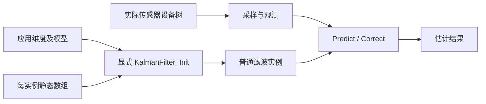

# 卡尔曼滤波设备树取舍分析与迁移指南

2026-10-02：本方案已按用户明确禁用古法编程模式的要求直接实施。当前接口以[Kalman 与矩阵模块文档](../modules/drivers/kalman-matrix.md)和源码为准。

## 设计结论

去掉通用线性 Kalman 的设备树实例化层，保留数学算法，迁入 `lib/control`。调用者提供状态及静态矩阵数组，显式初始化；Kconfig 决定是否编译，应用决定维度和模型。多实例和无堆分配能力继续保留。

旧 binding 只配置状态/观测维度，没有硬件连接；计算函数已经接收普通 `KalmanFilter *`，设备 API 指针为空。当前仓内应用没有使用旧节点，BMI088 姿态估计则使用独立 QuaternionEkf。因此普通算法实例更符合现有边界。

[Zephyr 官方配置说明](https://docs.zephyrproject.org/latest/build/dts/dt-vs-kconfig.html)允许部分驱动实例参数放在设备树；此处调整基于当前用途，而不是把软件节点判为语法错误。

## 当前实现

| 文件 | 职责 |
|---|---|
| [include/control/kalman_filter.h](../../include/control/kalman_filter.h) | C/C++ 公共接口、KalmanBuffer、KalmanBuffers、KalmanFilter |
| [lib/control/kalman_filter.c](../../lib/control/kalman_filter.c) | 容量校验、显式初始化、原有预测/校正公式 |
| [lib/Kconfig](../../lib/Kconfig) | SKYWALKER_LIB_KALMAN_FILTER 自动选择 CONTROL 和 MATRIX |
| [lib/control/CMakeLists.txt](../../lib/control/CMakeLists.txt) | 按新开关加入算法源码 |

旧 `drivers/kalman_filter` 实现、旧驱动头文件、设备树 binding 与驱动开关已移除。外部应用需改用 `<control/kalman_filter.h>` 和 `CONFIG_SKYWALKER_LIB_KALMAN_FILTER=y`，将旧节点转换为应用持有的独立缓冲与 Init 调用；本次没有保留设备兼容层。



## 调用契约

`KalmanFilter_Init(kf, n, m, buffers)` 校验非空指针、正维度、矩阵索引/字节范围以及七块数组容量，然后绑定并设置默认模型：F=I、H 的前 min(n,m) 个对角元素为 1、P=1000I、Q=0.001I、R=I、X/K=0。

容量按 float 元素数：F/P/Q 为 n²，H/K 为 nm，R 为 m²，X 为 n。空指针/零维度返回 -EINVAL，容量不足返回 -ENOSPC，范围溢出返回 -EOVERFLOW；失败不修改实例或缓冲。

初始化不分配、不释放内存，描述符只在调用中使用，数据数组须覆盖所有计算。数组互不重叠；同一实例由一个线程串行使用。Init 成功后再配置实际模型。重复调用会覆盖模型和状态，须先停止使用实例；不是保留模型的 reset。

Predict/Correct 维持原有 void 接口与公式，仍含按维度增长的栈缓冲，仍不传播矩阵运算或求逆错误。这些数值与工作内存限制需要按实际使用需求另行处理。当前 QuaternionEkf 及真实传感器节点继续按原链路使用。

## 编译入口和边界

一次最终编译可使用现有双 IMU 样例的环境，并显式启用线性算法：

```bash
west build -p always -b dm_mc02/stm32h723xx samples/imu/dual_imu -d build/kalman-library-syntax -- -DCONFIG_SKYWALKER_LIB_KALMAN_FILTER=y
```

这会编译新算法，并不让双 IMU 改用线性 Kalman；编译结果见本次任务报告。本任务不新增或执行测试，也不运行产物。外部使用者、目标线程栈余量和数值行为尚未验证。
