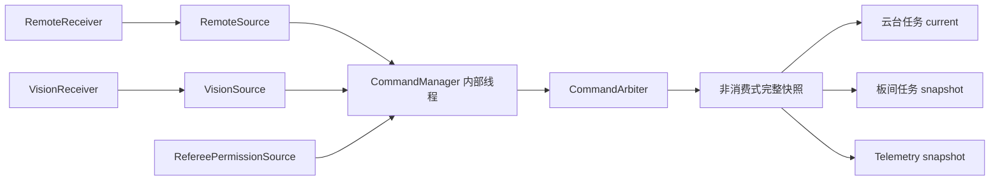

# 命令来源注册与后台仲裁服务实施指南

本轮已按明确授权禁用古法编程模式并写入实现。该禁用只适用于本次任务，下次任务恢复仓库默认模式。本文记录现在的接口与迁移结果，不再是待手工执行的代码方案。

原方案把单槽消息队列说成广播，这是错误的：`k_msgq_get()` 会取走消息，多个读者会竞争同一消息。实现采用短锁保护的非消费式快照；读取者取得值副本，不改变发布值。每次读取内部一致；两个不同时刻的读取可能跨越一次新发布，不保证相同序号或同时执行。

## 已落实的边界



- CommandManager 注册来源、启动接收、采集和发布；应用不再调用 update 或传入仲裁时间。
- CommandArbiter 保存原有同步算法、配置与历史状态，由服务工作线程独占调用。
- ICommandSource 提供 Operator 或 Aim 角色的消息。每种角色最多一个来源，注册顺序不定义业务优先级。
- IPermissionSource 独立提供裁判许可，仍由仲裁器逐机构裁剪。
- 执行端继续负责自己的周期、命令超时、反馈、参考准备及恢复。Manager 不调用执行器，也不提交 CAN。
- 服务与来源均需保持静态生命周期。没有运行期注销、stop、reset 或 restart 入口。

新物理设备可以实现已有角色接口。新增导航、搜索等新语义仍需扩充角色和仲裁策略；本轮没有实现同角色多源竞争或热插拔。

## 对外接口

头文件：`include/robotics/command/command_manager.hpp`。

```cpp
using Config = CommandArbiter::Config;
explicit CommandManager(const Config &config);
int registerSource(ICommandSource &source);
int bindPermissions(IPermissionSource &source);
int start();
int current(RobotCommand &out) const;
int snapshot(CommandSnapshot &out) const;
```

| 接口 | 结果与约束 |
| --- | --- |
| registerSource | 非拥有注册；成功 0；重复对象或角色 -EEXIST；非法角色 -EINVAL；容量不足 -ENOSPC；尝试启动后 -EBUSY |
| bindPermissions | 绑定唯一许可来源；重复 -EEXIST；尝试启动后 -EBUSY |
| start | 先检查配置和必需来源，再启动来源、许可和工作线程；成功 0；缺操作员或配置错误 -EINVAL；缺必需裁判 -ENODEV；重复尝试 -EALREADY；来源启动错误原样返回 |
| current | 复制最新最终 RobotCommand；成功 0；首次发布前 -EAGAIN，不修改 out |
| snapshot | 复制输入、决策和诊断组成的完整帧；成功 0；首次发布前 -EAGAIN，不修改 out |

所有公共接口只在线程中调用；ISR 调用返回 -EWOULDBLOCK。注册、绑定和启动由同一个启动线程顺序调用；current/snapshot 可由多个线程独立调用。它们不阻塞等待新消息，返回 0 也可能仍是上次序号。

start 返回 0 表示工作线程已安排，不表示 UART 或输入已在线。启动失败后会发布 Disabled、无效命令时间戳和错误诊断；此前已经启动的接收器继续存活，禁止销毁或重复启动这些对象。

读取不会更新命令时间。读者应初始化自己的输出副本，执行端仍按原有时间戳判定失效。服务没有正常发布时，不能凭“读取成功”授权输出。

## 来源与许可契约

接口在 `command_source.hpp`，现有接收器适配器在 `receiver_sources.hpp`。

```cpp
class ICommandSource {
public:
    virtual ~ICommandSource() = default;
    virtual SourceRole role() const = 0;
    virtual int start() = 0;
    virtual int sample(SourceSample &out) = 0;
};
class IPermissionSource {
public:
    virtual ~IPermissionSource() = default;
    virtual int start() = 0;
    virtual int sample(std::uint64_t now_ms, RefereeState &out,
                       SourceDiagnostics &diagnostics) = 0;
};
```

SourceValue 是 RemoteState 与 Measurement<AimCommand> 的 variant，角色分别为 Operator 和 Aim。role 在对象生命周期内固定；工作线程检查交付值与角色是否匹配，错误类型按 -EINVAL 使该来源无效。

sample 成功返回 0 并完整交付一份状态，状态可以是离线或无效。返回 -EAGAIN 时服务保留上次值和原始时间；其他错误使该来源无效，并记录 sample_error。后续成功交付恢复正常采集。sample 必须有界，不等待未来串口字节，不在回调中操纵执行器。

诊断包含 error（传输错误）、sample_error（采集状态）、state、dropped 和 dropped_available。二者不同于 decision.error；来源掉线通常仍是一次正常仲裁，原因位解释为何禁用或等待。

RemoteSource 长期保留 RemoteReceiver::Snapshot；接收器即使取锁失败也会对缓存的 online 标志做失效处理，因此适配器仍交付更新后的缓存，并在 sample_error 记录原返回值。VisionSource 保留目标的参考、加速度和原始 stamp。RefereePermissionSource 是 RefereeReceiver::poll 的唯一调用方，初始化和重试由现有 poll 推进。

当前 RefereeReceiver 没有公开丢包和 parser 重置计数。遥测将裁判 dropped 显示为 -1，并移除 ref_reset 列，避免把“未知”显示为“零次”。

## 内部数据和时间

```cpp
struct CommandSnapshot {
    CommandInputs observed{};
    CommandDecision decision{};
    SourceDiagnostics remote{}, vision{}, permission{};
};
```

服务每轮依次采样来源、获取许可、记录采集结束时的 observed.now_us、调用 arbiter.update，然后在短锁内复制整份快照。锁内没有 I/O、日志、用户回调或仲裁计算。

now_us 是本机仲裁时间，不覆盖任何输入时间。例如 now_us=1'250'000，遥控 timestamp_ms=1'200，输入年龄为 50 ms。视觉 stamp 使用微秒，普通机器人 MessageStamp 使用毫秒。

现有手动/自动选择、手动抢占、交回时的新视觉帧边界、各机构许可、限幅和原因位均保留在 CommandArbiter 中。requested 仍是候选，实际执行只使用 decision.command。selected_vision 保存与最终视觉命令对应的完整目标；最终不使用视觉时由原算法清空。

## 调用方式

下面是需要处理返回码的装配示例，receiver、vision_receiver、referee_receiver 均为已经构造且保持静态生命周期的设备对象：

```cpp
static RemoteSource remote_source(receiver);
static VisionSource vision_source(vision_receiver);
static RefereePermissionSource permission_source(referee_receiver);
static CommandManager commands(config);

int startCommands() {
    int ret = commands.registerSource(remote_source);
    if (ret == 0) ret = commands.registerSource(vision_source);
    if (ret == 0) ret = commands.bindPermissions(permission_source);
    if (ret == 0) ret = commands.start();
    return ret;
}
```

执行任务在循环外声明 RobotCommand command{}，每轮 commands.current(command)，随后 executor.update(command.gimbal, now_us)。板间任务读取 CommandSnapshot，将 decision.command.chassis 提交给 link，同时传递 observed.referee，并维持原有 link.poll 周期。

ControlSource 描述来源；机构字段描述执行目标。不能把 Vision 来源解释成一种独立的执行器。移除 CommandRouter 后，正式应用中只留下云台与板间任务，底盘板仍维持自己的接收与执行流程。

## 文件落点与配置

| 文件 | 实现 |
| --- | --- |
| include/robotics/command/command_arbiter.hpp、lib/robotics/command.cpp | 原同步核心改名，原算法保留 |
| include/robotics/command/command_source.hpp | 来源、许可、采集诊断与完整帧 |
| include/robotics/command/receiver_sources.hpp、lib/robotics/receiver_sources.cpp | 遥控、视觉和裁判适配器，按对应功能开关编译 |
| include/robotics/command/command_manager.hpp、lib/robotics/command_manager.cpp | 固定容量注册表、启动、工作线程和快照 |
| lib/Kconfig、lib/robotics/CMakeLists.txt | 同步核心与后台服务分开编译 |
| samples/robotics/command_manager | 静态装配三路来源，遥测只接收同一份 CommandSnapshot |
| samples/robotics/command_safety | 单遥控服务，无裁判要求，禁用 Auto |
| applications/sentry_gimbal | 静态注册遥控和许可，移除外置 command/referee 任务与 CommandRouter |
| tests/command_manager/scenario.cpp | 仅适配同步类型名称，未新增或运行测试 |

开启 CONFIG_SKYWALKER_COMMAND_SERVICE=y。服务栈默认 6144 字节、优先级 5、仲裁周期 10 ms，分别由 SKYWALKER_COMMAND_STACK_SIZE、SKYWALKER_COMMAND_PRIORITY、SKYWALKER_COMMAND_PERIOD_MS 配置。来源接收器仍维持自己的内部线程。堆分配不是注册和快照的数据交付机制。

正式云台仍没有装配视觉，allow_auto=false；connections_configured 及原有电机配置保持原状态。GimbalExecutor 仍仅消费 GimbalCommand，本轮没有将视觉参考与加速度扩展成新的轴执行功能。

## 编译与未验证项

本轮只安排完成后的三源 sample 编译，不运行测试、不烧录、不上电：

```sh
west build -b dm_mc02/stm32h723xx samples/robotics/command_manager -d build/command-manager-service-20261001
```

该编译不覆盖正式云台与单遥控应用，也不证明任务栈、最坏调度延迟、实际串口吞吐和硬件行为。未来进行板上使用时先用无动力的命令观察台架；实际运动继续遵守已有的反馈、参考、命令超时和动力配置约束。

本次没有新增一次性动作的确认/去重协议，不能将连续读取当前目标当作事件队列。新增一次性动作时需要另定事件契约。
