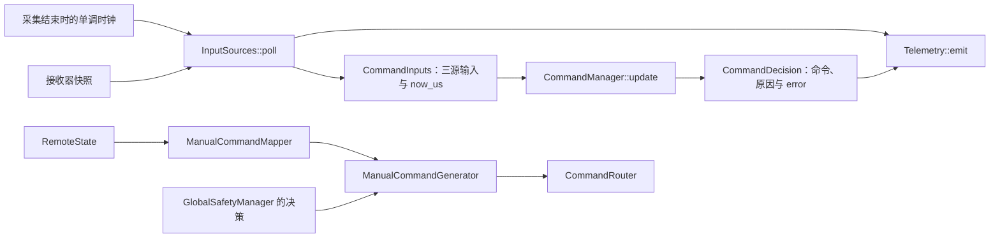

# 命令管理器调用接口简化实施指南

> 对应实现已迁移到代码，现行入口见 [命令保险与局部恢复](../19-command-recovery.md)。原手工步骤作为设计记录保留；未做硬件运行验证。

后续整体架构以[安全策略收敛与执行层自恢复实施指南](安全策略收敛与执行层自恢复实施指南.md)为准。若同时实施，不再新增本文用于保留旧全局安全入口的 ManualCommandGenerator；输入封装与按值返回建议继续适用。

本文是待手工实施的方案，不代表新接口已存在。允许破坏性更改；本次只写指南，业务源码、配置和测试文件均未修改，也未执行构建或测试。

建议把三源调用收敛为下面三行：

```cpp
const auto frame = sources.poll();
const auto decision = manager.update(frame.inputs);
telemetry.emit(frame, decision);
```

核心调整是：输入携带本轮仲裁时间，结果携带错误码，取消输出参数，旧手动入口独立成 `ManualCommandGenerator`。保留 `CommandManager` 的名字，使业务名称和原有认知一致。

## 当前状态与范围

当前 `samples/robotics/command_manager/src/main.cpp` 每轮要声明 `CommandDecision`、单独取时间、调用带输出参数的 `step()`，再把 `ret` 与 `decision` 分开交给遥测。同一轮结果被拆成两份，调用方需要维持它们的对应关系。

`include/robotics/command/command_manager.hpp` 还同时公开两个不同的 `step()`：

| 入口 | 输入与职责 | 时间单位 | 当前调用方 |
| --- | --- | --- | --- |
| 三源入口 | 遥控、视觉、裁判许可的仲裁 | 微秒 | `command_manager` sample、已有主机场景 |
| 手动入口 | 已映射意图与全局安全决策的命令生成 | 毫秒 | `sentry_gimbal` 应用、`command_safety` sample |

两者共享序号成员，头文件还要求不能在同一实例交替调用。把它们放进不同类型，便能直接在接口上表达不同用途。

另一个可以顺手简化的地方是 `reset(std::uint64_t)`：实现根本没有使用这个参数，也始终返回零，应改成无参数的 `void reset()`。

本次假设配置在构造后固定。保留当前所有限幅值、超时值、模式策略与错误原因位；不新增自动行为，不改变线路和通信协议，不给正式应用接入视觉。

## 数据流与对象边界



采集层负责设备、时钟读取及接收诊断；管理器只处理已经取得的输入并推进自己的仲裁状态。`CommandManager` 不应持有 UART、DMA、接收线程或遥测对象，主机端仍可直接构造输入使用它。

`InputFrame` 包含完整接收诊断，`CommandInputs` 只包含仲裁需要的数据。把 `InputFrame::commands` 改成 `inputs`，避免把尚未仲裁的输入误读为输出命令。

## 推荐修改顺序

连续完成以下文件的修改，全部完成后再执行末尾的一次编译。下面各步的“完成标志”是写代码时的目标，不要求每步追加审查或测试。

| 顺序 | 文件 | 修改内容 |
| --- | --- | --- |
| 1 | `include/robotics/command/command_inputs.hpp` | 输入增加 `now_us`，结果增加 `error` |
| 2 | `include/robotics/command/manual_command_generator.hpp`，新文件 | 承接旧手动命令生成接口 |
| 3 | `include/robotics/command/command_manager.hpp` | 仅公开三源 `update()`、配置状态和无参复位 |
| 4 | `lib/robotics/command.cpp` | 迁移旧实现，调整三源返回方式，缓存配置校验结果 |
| 5 | sample 的 `input_sources.hpp/.cpp` | 字段改名，在采集结束处记录仲裁时间 |
| 6 | sample 的 `telemetry.hpp/.cpp`、`main.cpp` | 去掉独立错误参数，采用三行调用 |
| 7 | `applications/sentry_gimbal/src/main.cpp`、`samples/robotics/command_safety/src/main.cpp` | 使用独立手动生成器，保留原全局安全链路 |
| 8 | 相关说明文档 | 更新接口名称、时钟归属和调用示例 |

`lib/robotics/CMakeLists.txt` 继续编译 `command.cpp`。把新增类的实现也放在该文件中即可，本次没有必要增加新的编译单元。

## 第一步：把一次调用需要的信息放在同一个对象里

在 `command_inputs.hpp` 的 `CommandInputs` 中增加：

```cpp
struct CommandInputs {
    core::TimeUs now_us = 0;
    RemoteState remote{};
    core::Measurement<communication::vision::AimCommand> vision{};
    RefereeState referee{};
};
```

`now_us` 表示执行本轮仲裁的时间，不是收到遥控、视觉或裁判数据的时间。调用者每轮填写它，管理器仍用三个数据源各自原始时间戳计算新鲜度。默认值零代表启动时刻，不代表“自动获取系统时间”。

例如本轮 `now_us = 1'250'000`，遥控消息 `timestamp_ms = 1'200`，其年龄为 `1'250 - 1'200 = 50 ms`；不能把遥控原始时间也覆盖为本轮时间，否则断流后输入将一直显得新鲜。

在现有 `CommandDecision` 中增加一个字段，其他成员与 `reasons()` 保持现有定义：

```cpp
int error = 0;
```

`error` 表示调用自身是否成功；原因位解释本轮为何限幅、等待或禁用，两者不是同一种状态。

| 情况 | `error` | 结果 |
| --- | --- | --- |
| 正常手动、正常视觉控制 | `0` | 当前允许的命令 |
| Safe、遥控断流、裁判不允许 | `0` | 对应输出 Disabled，保留原因位 |
| 视觉缺失或过期 | `0` | 沿用当前 Hold 与原因语义 |
| 参数或遥控映射非法 | `-EINVAL` | 全部 Disabled，原因指出配置或输入问题 |
| 本轮时间早于上次接受的时间 | `-ESTALE` | 全部 Disabled，原因包含 `ClockRegression` |

不要用 `reasons() != 0` 替代错误码判断：`ManualOverride`、`OverrideQuiet`、`ValueLimited` 本来就可能出现在一次成功的决策里。

完成标志：输入时间和本轮错误均有唯一归属。

## 第二步：把旧手动路径独立命名

新增 `include/robotics/command/manual_command_generator.hpp`：

```cpp
#pragma once
#include <cstdint>
#include <robotics/messages/command.hpp>
#include <robotics/messages/remote.hpp>
#include <robotics/messages/safety.hpp>

namespace skywalker::robotics {
class ManualCommandGenerator {
public:
    struct Config {
        float max_chassis_vx_m_s = 3, max_chassis_vy_m_s = 3;
        float max_chassis_wz_rad_s = 6;
        float max_gimbal_yaw_rate_rad_s = 3;
        float max_gimbal_pitch_rate_rad_s = 2;
        std::uint32_t input_timeout_ms = 100;
    };

    explicit ManualCommandGenerator(const Config &config) : config_(config) {}
    [[nodiscard]] int generate(const OperatorIntent &intent,
                               const GlobalSafetyDecision &safety,
                               std::uint64_t now_ms,
                               RobotCommand &out);
    void reset() { sequence_ = 0; }

private:
    Config config_;
    std::uint32_t sequence_ = 0;
};
}
```

这是现有手动生成能力的搬家。`generate()` 的参数、返回码和行为保持旧入口：输入非法返回 `-EINVAL` 且不覆盖 `out`；正常调用即使处于禁用状态也返回零、完整写入命令并增加序号；Auto 不产生自主运动，发射仍保持原行为。

把 `command.cpp` 中原四参数 `CommandManager::step(...)` 的函数体搬到 `ManualCommandGenerator::generate(...)`。不要把三源路径的 `error` 或视觉状态复制进去。

两个类型都需要复用现有 `fillManualMotion()`。可仅将这个文件内部辅助函数的配置参数改为模板参数，函数体原样保留：

```cpp
template <class MotionConfig>
void fillManualMotion(const OperatorIntent &intent,
                      const MotionConfig &config,
                      RobotCommand &out) {
    // 放入当前 fillManualMotion 的完整函数体。
    // 参数名同步替换为 intent / config / out。
}
```

这里的模板只表示“两种配置都有这些限幅字段”，不引入运行时多态。五个物理限幅字段在两个配置中保持同名即可。

每个生成器仍由一个线程拥有，`generate()` 与 `reset()` 不并发调用，不从接收中断调用。复位会从零重新计数，正式应用需要在其已有通信恢复边界安排复位。

完成标志：旧手动路径不再依赖三源管理器的视觉和抢占状态。

## 第三步：收敛管理器的公共接口

在 `command_manager.hpp` 保留现有 `Config` 的全部字段与默认值，将公共函数替换为：

```cpp
explicit CommandManager(const Config &config);
[[nodiscard]] int configError() const { return config_error_; }
[[nodiscard]] CommandDecision update(const CommandInputs &inputs);
void reset();
```

删除两个旧 `step()`、公共 `validate()` 及 `reset(now_ms)` 声明。移除仅为旧手动入口服务的 `messages/safety.hpp` 包含。

在私有部分保留所有现有仲裁状态与 `updateAutoOverride()`，在 `config_` 后增加：

```cpp
const int config_error_;
int validateConfig() const;
```

`Config` 不提供可变访问器。这样可以只在构造时校验一次：

```cpp
CommandManager::CommandManager(const Config &config)
    : config_(config), config_error_(validateConfig()) {}
```

把原 `validate()` 改名为 `validateConfig()`，函数体不变；它只读取已经构造好的 `config_`。`configError()` 随后只是读取缓存，结果为 `0` 或 `-EINVAL`。

按值返回 `CommandDecision`，由调用方持有独立结果。前一版关于返回局部对象的常量引用能够延长生命周期的说法错误：函数退出后局部对象销毁，再绑定常量引用不能延长它的生命期。编译器可能优化值返回的拷贝，但不保证所有具名返回或 lambda 返回都零拷贝。

线程契约仍是一实例一所有者线程。`update()` 会修改序号、模式和抢占状态，不是只读方法；输入采集完成后再同步调用。其他线程需要消费结果时应复制并交给现有消息通道，不把引用直接跨线程传递。

## 第四步：连续调整三源实现

在 `command.cpp` 修改三源函数签名，并从输入取本轮时间：

```cpp
CommandDecision CommandManager::update(const CommandInputs &in) {
    const auto now = in.now_us;
    CommandDecision n{};
    const MessageStamp stamp{now / 1000, sequence_ + 1u, true};

    const auto finish = [&](int error) -> CommandDecision {
        n.error = error;
        n.requested.stamp = n.requested.chassis.stamp =
            n.requested.gimbal.stamp = n.requested.shooter.stamp = stamp;
        n.command.stamp = n.command.chassis.stamp =
            n.command.gimbal.stamp = n.command.shooter.stamp = stamp;
        sequence_ = stamp.sequence;
        return n;
    };

    const auto disable = [&](std::uint32_t reason, int error)
        -> CommandDecision {
        previous_mode_ = OperatorMode::Safe;
        manual_override_ = have_override_quiet_time_ = false;
        n.chassis_reasons = n.gimbal_reasons = n.shooter_reasons = reason;
        return finish(error);
    };

    if (config_error_ < 0)
        return disable(InvalidManagerConfig, config_error_);

    // 将原三源 step() 从时间倒退判断到最终 return finish(0)
    // 的完整代码接在这里；保留它的全部判断顺序。
}
```

上述代码是替换函数头和公共收尾部分的模板，必须接入原函数余下部分。删除旧 `out = n`，没有单独返回的整数；其含义已移入 `n.error`。`finish` 与 `disable` 都按值返回，不能返回局部 n 的引用或指针。

所有原 `return disable(...)`、`return finish(0)` 都可继续沿用。保留以下状态推进顺序：

1. 配置或时钟错误先输出 Disabled。时间倒退时不覆盖上次接受的时间。
2. 检查视觉序号，再判定遥控有效性与操作模式。
3. 首次进入 Auto 或解除手动抢占时记录时间和视觉序号基线。
4. 生成候选命令，使用每个机构各自的裁判权限裁剪最终命令。
5. 根据最终云台状态处理发射约束、清理未采用的视觉目标，最后统一写命令时间和序号。

`requested` 是尚未按裁判许可裁剪的候选；`command` 才是最终输出。虽然字段较多，也不能为了缩短调用把两者合成一个值，遥测解释原因时需要它们的区别。

`reset()` 沿用当前函数的状态清理代码，删除参数与 `return 0`：序号归零、上一模式变 Safe、所有时间及视觉序号记录清零、所有状态标志复位。它不修改配置或配置错误，配置无效的实例不会因复位变为有效。

完成标志：一次调用只返回一个结果，所有成功与失败出口都经过同一收尾路径。

## 第五步：由采集层提供本轮时间

在 `input_sources.hpp` 将 `InputFrame` 的字段改为：

```cpp
robotics::CommandInputs inputs{};
```

在 `input_sources.cpp` 中增加 `#include <core/clock.hpp>`，把当前 `frame.commands` 全部改成 `frame.inputs`。完成裁判处理、遥控快照和视觉快照的组装后，在 `return frame` 前增加：

```cpp
frame.inputs.now_us = core::monotonicTimeUs();
return frame;
```

这次取时必须发生在读取输入之后。同一轮内较晚读到的输入可能具有较新的时间戳，若先取时，后续的新鲜度判断可能把它当作未来数据。

保持 `rc_` 为跨轮保留的成员。当前接收器可能在没有新快照时不写目标，不应顺手把它改成每轮清零的局部变量。

完成标志：主循环不用取时，消息原始时间戳仍来自接收器。

## 第六步：简化遥测和主循环

在 `telemetry.hpp` 与 `telemetry.cpp` 同步改为：

```cpp
void emit(const InputFrame &frame,
          const skywalker::robotics::CommandDecision &decision);
```

现有实现可以继续用参数名 `f`、`d`。移除 `int error`，日志原来输出 `error` 的地方改成 `d.error`，全部 `f.commands` 改成 `f.inputs`。VOFA 仍使用最终 `d.command`，既有 16 通道布局无需改变。

在 `main.cpp` 删除不再使用的 `<core/clock.hpp>`，将入口写为：

```cpp
int main() {
    if (const int error = manager.configError(); error < 0) {
        LOG_ERR("invalid command config: %d", error);
        return error;
    }
    const int started = sources.start();
    const int output = telemetry.start(bench::telemetry_uart);
    LOG_INF("sources_start=%d telemetry=%d; command observation bench",
            started, output);

    for (;;) {
        const auto frame = sources.poll();
        const auto decision = manager.update(frame.inputs);
        telemetry.emit(frame, decision);
        k_sleep(K_MSEC(10));
    }
}
```

配置错误在启动阶段直接报告；接收源启动状态仍保留日志，台架仍能展示缺失输入的诊断。`board_config.hpp` 继续逐字段设置现有 `Config`，本次不需要额外配置 DSL 或链式 builder。

完成标志：循环只表达采集、仲裁、展示三个动作，没有输出参数或配套返回码。

## 第七步：迁移另外两个调用方

在 `applications/sentry_gimbal/src/main.cpp` 与 `samples/robotics/command_safety/src/main.cpp`：

1. 将 `command_manager.hpp` 包含替换成 `manual_command_generator.hpp`。
2. 将 `CommandManager manager({});` 替换成 `ManualCommandGenerator generator({});`。
3. 将 `manager.step(intent, decision, now, command)` 改成 `generator.generate(intent, decision, now, command)`。

正式应用保留当前 `== 0` 后才调用 `router.route(...)` 的结构；其中 `GlobalSafetyManager` 的急停、底盘心跳、反馈与恢复信息都继续传递。无电机 `command_safety` sample 可对原来忽略的生成返回值显式写 `(void)generator.generate(...)`，保持原调用策略。

不能将 `GlobalSafetyDecision` 简单换成三个 `enabled` 布尔值。它还表达 Hold、全局状态和恢复上下文，而三源 `CommandInputs` 当前没有承接全部这些语义。

已有 `tests/command_manager/scenario.cpp` 调用旧三源 API，破坏性更改后需要迁移。本次未请求测试，不修改或执行该文件；将来明确进行测试迁移时，需要在每轮写入 `input.now_us`、调用 `update(input)` 并读取结果的 `error`，时间倒退场景也改为改变输入内的时间。原断言场景不应因为接口改名被删除。

文档需同步的入口包括 sample 的 `README.md`、`docs/14-robotics.md`、`docs/15-applications.md` 与架构浏览器中旧手动生成类的说明。历史开发指南应注明接口已被本方案取代，不要把历史示例当作现行声明。

## 完成后的一次编译与后续使用说明

本次不运行任何命令生成工作区产物。用户完成全部手工修改后，可在仓库根目录执行一次目标 sample 构建：

```sh
west build -p always -b dm_mc02/stm32h723xx samples/robotics/command_manager -d build/command-manager-api
```

这是最终编译检查，不包括烧录、运行测试或实机验证。当前主机测试的构建与运行命令只有在测试接口完成迁移且另行明确需要时才适用。

后续手动台架使用沿用 sample 的 README：先接信号线并共地，再给主控供电，再启动遥控、视觉和裁判输入。本 sample 只展示决策，不创建执行器，因此这一轮接口迁移不需要给电机或功率机构上电。

预期可观察行为仍是：无遥控时 Disabled，Manual 使用遥控，Auto 等待进入后的新视觉帧，抢占释放后重新等待新帧，裁判许可按机构否决。这里只列出接口应保持的行为，未在本次执行验证。

| 迁移时出现的问题 | 处理位置 |
| --- | --- |
| 找不到 `step`、`validate` 或旧 `reset` | 调用方还没有迁移到新声明 |
| `emit` 参数个数不匹配 | 同步修改声明、定义与调用 |
| `InputFrame` 找不到 `commands` | 采集或遥测仍保留旧字段名称 |
| 消息全部被当作过期或未来数据 | 确认 `now_us` 每轮赋值且位于采集结束，毫秒转换只做一次 |
| 抢占释放一直未完成 | 确认手工构造输入的 `now_us` 持续推进 |
| 正式应用丢失全局安全状态 | 旧调用方应使用 `ManualCommandGenerator` 并保留原 safety/router 链路 |

未验证的假设是：构造后配置固定符合后续需求；所有新增生产者都能在每轮仲裁前提供同一单调时钟域的时间；目标板的构建环境可用。本指南未测量值返回接口的运行性能，也未执行硬件验证。

最终实施清单：

- [ ] 新三源调用只需要 `manager.update(frame.inputs)`。
- [ ] `CommandDecision` 统一保存命令、诊断和调用错误。
- [ ] 采集时间与原始消息时间分开保留。
- [ ] 两个旧手动调用方已迁移到独立生成器。
- [ ] 视觉与权限门禁、手动抢占状态的既有语义被完整搬移。
- [ ] 公共旧接口移除，说明文档同步到目标接口。
- [ ] 完成整批修改后执行一次编译；测试迁移与硬件验证仍单独安排。
