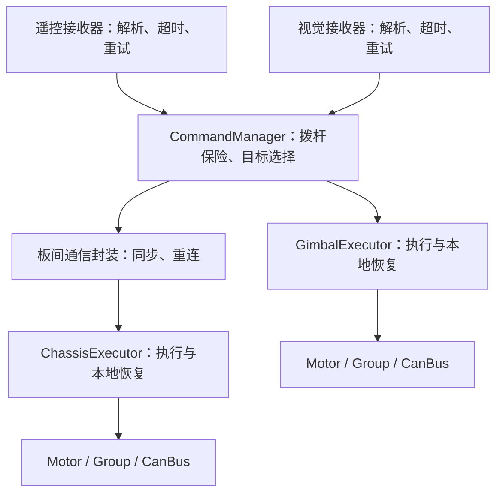

# 安全策略收敛与执行层自恢复实施指南

> 对应实现已迁移到代码，现行入口见 [命令保险与局部恢复](../19-command-recovery.md)。原手工步骤作为设计记录保留；未做硬件运行验证。

本方案落实“命令层上保险，执行层自行处理故障”。普通掉线自动恢复，主程序不再理解多套安全决策和复位条件。允许破坏性修改，但本次仅写指南，业务代码未修改，未执行编译、测试或硬件操作。

假设：左拨杆 Down 为保险，Middle 为 Manual，Up 为 Auto；拨回工作档后凭新有效输入自动恢复，不增加软件复位键。遥控失联不锁存急停，也不能继续执行最后一次速度或开火指令。当前正式云台应用仍只启用 Manual，Auto 需另行装配视觉后启用。

## 1. 收敛后的行为

| 事件 | 本地处理 | 自动恢复条件 |
| --- | --- | --- |
| 拨杆 Down | 命令层发布全部 Disabled，执行器撤销输出 | 拨回工作档、新命令有效、机构准备完成 |
| 遥控暂时失联 | 接收器继续接收/重试，撤销依赖遥控授权的命令 | 新有效遥控帧到达 |
| 视觉暂时失联 | Auto 云台 Hold，遥控底盘和手动抢占仍可用 | 新目标有效且符合当前参考与进入基线 |
| 底盘通信中断 | 底盘命令超时后暂停，通信线程继续运行，云台不受牵连 | 会话同步、硬件就绪、恢复后的新命令 |
| 电机暂时断电/丢反馈 | 该电机或耦合 Group 撤销输出，等待反馈 | 反馈稳定、参考可信、控制器复位、新命令有效 |
| CAN 故障 | CanBus 内部重试，执行器等待 | 总线恢复，再走本地准备流程 |
| 配置错误或未知硬件故障 | 只阻止对应机构，报告具体原因 | 根因消除或取得有效参考 |

暂停对应输出不表示退出线程或锁死整机。失去反馈不能继续闭环，保持位置也需要反馈和供电。当前八电机舵轮底盘可以作为一个恢复域，关键成员失联时整组暂停；独立的云台不应因此停止。

## 2. 删除重复的管理层，保留功能内部约束

| 当前模块 | 去向 |
| --- | --- |
| GlobalSafetyManager | 删除；拨杆与数据源有效性归 CommandManager，底盘可用性归底盘封装 |
| GimbalLocalSafety、ChassisLocalSafety | 删除独立判定对象，命令年龄/反馈/就绪处理合并进执行器 |
| 两应用 main.cpp 中的恢复与多次急停锁存 | 搬进执行器，主循环只交接命令、周期调用、展示状态 |
| Motor / Group / CanBus | 保留超时撤销许可、限幅、使能握手、总线恢复等内部机制 |
| 板间启动身份、序号和恢复代次 | 保留内部防旧命令作用，交给通信封装与执行器协调 |

当前代码已有局部降级，并非所有掉线都会锁存。复杂之处在于一条恢复链同时经过全局管理器、局部管理器、应用循环和驱动。



上层状态只需要 Disabled、Recovering、Active、Blocked：命令不允许输出、自动等待恢复、正常执行、当前条件无法自动继续。底层 Offline/Enabling 等状态描述真实协议过程，可以留在内部。Blocked 不引入新的全系统确认复位接口。

## 3. CommandManager 的目标契约

```cpp
[[nodiscard]] CommandDecision update(const CommandInputs &inputs);
```

inputs 携带本轮时间、遥控与视觉等快照；结果含最终命令、原因和调用错误。按值返回，不能返回函数局部结果的引用。上一份指南相关错误已更正。

内部依次执行：配置/时钟校验；遥控有效性校验；Down 直接生成 Disabled；Manual/Auto 目标选择；统一生成命令时间与序号。Down 或遥控失效时撤销旧视觉所有权，恢复时重建进入基线。正常断流是运行状态，调用错误只用于配置或输入非法等情况。

保险判断不等待硬件 ready、重试定时器、遥测或底盘确认。移除上层“底盘 ready 才生成目标”的依赖：目标持续产生，底盘自己决定能否执行，避免相互等待。

裁判通信中断不升级成全局急停。若产品仍启用现有裁判软件许可配置，在命令层按机构裁剪一次并自动恢复，不重复经过三套许可判断；功率限幅归底盘功能。本方案不擅自决定实际比赛是否取消裁判许可。

正式 sentry_gimbal 尚未接入视觉。迁移到统一接口时继续限制为 Manual，未支持的 Auto 请求产生 Disabled；不要因替换 API 自动引入新的 Auto 行为。上一份指南的 ManualCommandGenerator 不作为此次最终架构新增。

完成标志：业务不再传 GlobalSafetyDecision，只有目标命令与诊断。

## 4. 接收器内部补齐重试

在 lib/communication/remote_receiver.cpp 的 run() 中，首次 init_ret 被声明为 const，失败后永远不再进入 service 分支。这是需要直接修复的具体问题。VisionReceiver::run() 已有可参考的周期重试方式。

将遥控线程改为下列有界流程伪代码：

```text
到重试时刻：
    uart.service(now_ms)
    只有 -EACCES（未初始化）才 uart.init()
    成功：清当前传输错误
    -EAGAIN：等待内部重试
    其他错误：记录原因，下次尝试安排在 now_ms + 100
传输可服务时：有界读取 RX 并解析
    -EOVERFLOW：丢弃半帧，等待新完整帧
    -EAGAIN：结束本轮读取
保留原接收时间，推进数据超时，发布快照，线程让出 CPU
```

不要反复 start 创建线程，也不要无条件 init。AsyncUart 可能已经注册回调，仅首次开启 RX 失败，这种情况应由 service 处理。对端不发数据时继续等待即可，不需要不断重建 UART。

UART 可用不等于遥控在线，只有新有效完整帧才能恢复数据有效性。空设备、非法解码配置等确定的装配错误应报告 Blocked，不能把所有负 errno 都作为可重试掉线。

把应用内板间与裁判 UART 的服务、必要初始化重试也收进对应通信封装。主命令线程不等待重连，保留接收预算和原始消息时间。

完成标志：主程序只启动接收器和取得快照，不负责重试。

## 5. 执行器的接口和恢复顺序

新增应用内 GimbalExecutor 和 ChassisExecutor，组合已有对象。GimbalAxis 继续负责控制算法；当前云台执行器覆盖已有单 Yaw，不顺带扩建双轴。

```cpp
enum class RunState : std::uint8_t { Disabled, Recovering, Active, Blocked };
struct RunStatus {
    RunState state = RunState::Disabled;
    int error = 0;
    // 再加本模块原因枚举，解释等待条件。
};

// 以下分别放在两个类内，不是重复自由函数。
// GimbalExecutor：组合 CanBus/Motor/GimbalAxis。
[[nodiscard]] RunStatus begin();
[[nodiscard]] RunStatus update(const robotics::GimbalCommand &, core::TimeUs now_us);

// ChassisExecutor：组合 hardware/chassis/limiter，内部读取板间快照。
[[nodiscard]] RunStatus begin();
[[nodiscard]] RunStatus update(core::TimeUs now_us);
```

begin 验证配置、建立绑定并推进初始化，不授权运动。未完成返回 Recovering，确定的配置错误返回 Blocked；重复 begin 只返回状态，不重建线程。update 每轮有界推进，按值返回状态，普通等待不要求主程序处理。当前错误恢复后清零，历史计数另留诊断。

单实例由一个执行线程调用，ISR 只入队或通知。跨线程沿用 Latest<T> 传值。共享 CAN 的多个控制对象仍需统一发布，或串行化整批目标写入与 commit。

恢复步骤：

1. 命令禁用或过期，立即撤销运动许可，但通信与反馈恢复继续运行。
2. 反馈、驱动或总线失效，退出旧运行代次，旧目标作废。
3. 到重试时刻才推进准备，不 sleep、不循环等待。
4. 反馈稳定后建立可信参考，从当前反馈 reset 控制器。
5. 等待恢复边界之后产生的新有效命令。
6. 发出一次 enable，Enabling 期间等待完成，不每轮重发。
7. Active 后计算并 commit；失败回到本地恢复或阻止状态。

Down 期间可恢复通信和准备反馈，但不能使能。不能给缓存旧目标补上当前时间或新代次来恢复运动。disable 也不每轮重复调用，以免不断产生新停机代次；让驱动完成已有停机请求。

控制周期异常先暂停本轮输出并重建计时，不因一次调度延迟锁死整机。绝对反馈可按配置重建参考，丢失的多圈相对位置不能凭“再次有反馈”就假定原参考恢复。

直接复用：云台 GimbalAxis::poll()/ready_since_ms/reset() 与 Motor::enable()/active()；底盘 DjiChassisHardware::pollRecovery()/arm()/apply()、SwerveChassis::reset()；总线运行中的恢复继续使用 CanBus 内部流程。

初始启动失败只重试未完成阶段，不重复 attach 电机或 start 已成功总线。CanBus::start() 已有失败回滚，但多总线硬件封装仍需记录每条总线已完成的初始化阶段。

完成标志：main 不再组装 LocalSafetyInputs 或亲自协调重新使能。

## 6. 自动重试的分类

| FaultReason | 处理 |
| --- | --- |
| FeedbackExpired / TransportError / RxOverflow | 等待通信恢复，再准备/使能；通常不需要 clearFault |
| CommandExpired | 等待新命令并重新授权，不锁存全局故障 |
| UnexpectedDisabled / EnableTimeout | 可作为有间隔重试候选；确认无设备故障、反馈与参考可用后再清暂态原因 |
| DriveFault | 依据设备实际故障码识别；没有可信可恢复白名单时仅阻止本机构，不无限清除 |
| InvalidCommand / ControlRejected | 保留数值或控制拒绝原因，处理根因，不能靠循环清错掩盖 |

Motor::raiseFault() 已有通信类与需清除原因的分类，不必先推翻驱动。自动清除暂态原因应是执行器私有步骤，可先沿用 100 ms 量级重试配置；反复暂态失败继续等待，不升级为全局急停。

Group::clearFault() 会遍历组内故障成员。自动调用前确认所有待清故障都属于允许类别，不能只看首次记录的一个故障，就连带清掉其他成员的未知错误。

## 7. 板间恢复上下文隐藏在内部

保留启动身份、序号、恢复代次用于拒绝旧命令。发送端只提交 ChassisCommand；通信封装提供已过滤的命令与约束快照，CommandRouter 不再接收 GlobalSafetyDecision。

内部规则：对端身份变化或会话超时作废旧控制与半帧；底盘准备完成时只推进一次恢复代次，经状态通道交给通信线程；发送端收到新上下文后等新 producer 命令再绑定，禁止重标记旧缓存；接收端和执行端分别检查当前上下文，覆盖两线程之间的竞争窗口。

停机不等待三个运行帧。正常恢复可用有效会话同步加一条新命令替代上层 stable_command_count=3；电机反馈稳定窗口继续保留。

继续保留 InterBoardLink::accept() 对 producer sequence 的去重。当前 codec 对新接收命令使用本地接收时间，发送端也必须在发帧前检查源命令年龄，不能持续发送过期缓存。两板时钟不能直接互减。

第一阶段可保留 v1 帧布局，将 global_action、safety_state 等历史字段藏在通信适配层，动作从命令模式显式映射；新接收端不把诊断原因位解释为全局急停。两板应用成套迁移，不混用不同语义的固件。

不能直接重排 SafetyAction/SafetyState/ExecutionState 数值，它们已编码进协议。最终若删历史字段，应升级版本与编解码，不在相同版本内改变字节含义。

## 8. 按文件连续实施

| 顺序 | 位置 | 操作 |
| --- | --- | --- |
| 1 | remote_receiver.cpp 与板间通信服务 | 补内部初始化重试，保留单线程、原时间 |
| 2 | sentry_gimbal/src/gimbal_executor.hpp/.cpp，新增 | 搬入云台完整执行与恢复流程 |
| 3 | sentry_chassis/src/chassis_executor.hpp/.cpp，新增 | 组合 hardware/chassis/limiter，隐藏恢复协调 |
| 4 | chassis_hardware.hpp/.cpp | 可推进的初始化阶段，私有暂态恢复步骤 |
| 5 | include/communication/interboard/、lib/communication/ | 新增通信门面，复用 Link/Codec |
| 6 | command_manager.hpp、command_inputs.hpp、command.cpp | 按值 update 与拨杆保险，移除旧 GlobalSafetyDecision 入口 |
| 7 | command_router.hpp/.cpp、两个应用 main.cpp | 只交接命令和调用执行器，删多处锁存与复位协调 |
| 8 | samples/robotics/command_safety | 改为保险观察样例，去掉旧管理器及额外软件复位要求 |
| 9 | robotics/safety/*.hpp、lib/robotics/safety.cpp、messages/safety.hpp | 调用方迁移后删除独立管理器及专用消息 |
| 10 | CMakeLists、lib/Kconfig、prj.conf 与说明文档 | 纳入新增文件，移除旧 SAFETY 开关与引用，同步实际调用链 |

SafetyAction 仍被 GimbalAxis::update() 使用，不能跟管理器一起直接删。先作为内部适配；最终由 GimbalMode 表达 Disabled/Hold/Rate/AbsoluteAngle，去掉重复动作参数，同步 yaw_gimbal 等调用方。协议内的旧状态也需显式适配。

samples/motor/recovery 的手动按键是低层演示，不代表生产执行器必须人工恢复；底层 enable/disable API 保留。

目标调用示意：

```cpp
// 命令线程。
const auto frame = sources.poll();
const auto decision = manager.update(frame.inputs);
local_command.put(decision.command.gimbal);
chassis_link.submit(decision.command.chassis);

// 云台执行线程。
robotics::GimbalCommand command{};
local_command.get(command);
const auto status = gimbal.update(command, core::monotonicTimeUs());
```

submit 复制带原时间戳的命令到有界消息槽，不等待发送；按消息通道约定处理提交失败，不能为旧目标无限续期。构造、初始化、配置与返回状态处理仍需完成。日志限频，不将通信等待放入控制循环。

## 9. 最终编译与后续使用

全部实施完成后，对涉及目标进行末尾一轮编译；本次不执行命令，不运行产物或自动烧录：

```sh
west build -p always -b dm_mc02/stm32h723xx applications/sentry_gimbal -d build/sentry-gimbal-recovery
west build -p always -b dm_mc02/stm32h723xx applications/sentry_chassis -d build/sentry-chassis-recovery
```

修改的 sample 也纳入该轮编译。现有测试可能依赖旧接口，本次未请求测试，不修改、不运行测试；以后明确要求时按新契约迁移。

后续上电先保持拨杆 Down，启动主控和通信，再在机构受控、限幅明确的条件下接通电机供电。拨回工作档凭新命令恢复，再置 Down 撤销运动。软件撤销许可不等于机械瞬间停止，具体停止或保持方式须符合现有机构。

| 现象 | 排查 |
| --- | --- |
| 掉线后一直等待 | 看本模块缺通信、反馈、参考还是新命令，不逐层 clearEmergencyStop |
| UART 恢复而遥控离线 | 确认新完整帧有效，service 成功不代表数据在线 |
| ready 却不运行 | 查看保险位置、新命令、会话上下文与使能进度 |
| 恢复时目标跳变 | 检查是否重放旧目标，是否从可信当前反馈 reset |
| 无关机构停止 | 查看是否错误共用 Group，或又将局部原因接回全局许可 |
| 一直 Enabling 或不断停机 | 确认没有重复 enable/disable 干扰正在进行的握手 |

未验证事项：拨杆响应时间、设备故障白名单、断电后位置参考重建、多总线与板间恢复时序。本指南不宣称这些硬件行为已通过验证。

最终清单：

- [ ] 普通掉线不锁存整机，不要求额外软件复位。
- [ ] 拨杆保险优先，失联时不续跑旧目标。
- [ ] 通信、云台、底盘各自处理恢复。
- [ ] 恢复依赖新鲜反馈、可信参考、新命令。
- [ ] 未知硬件错误只阻止对应机构，不无限清除。
- [ ] 主循环没有 GlobalSafetyInputs / LocalSafetyInputs 组装。
- [ ] 底层超时、限幅、Group、拒绝旧命令机制继续有效。
- [ ] 整批修改结束后编译，硬件行为另按明确范围验证。
