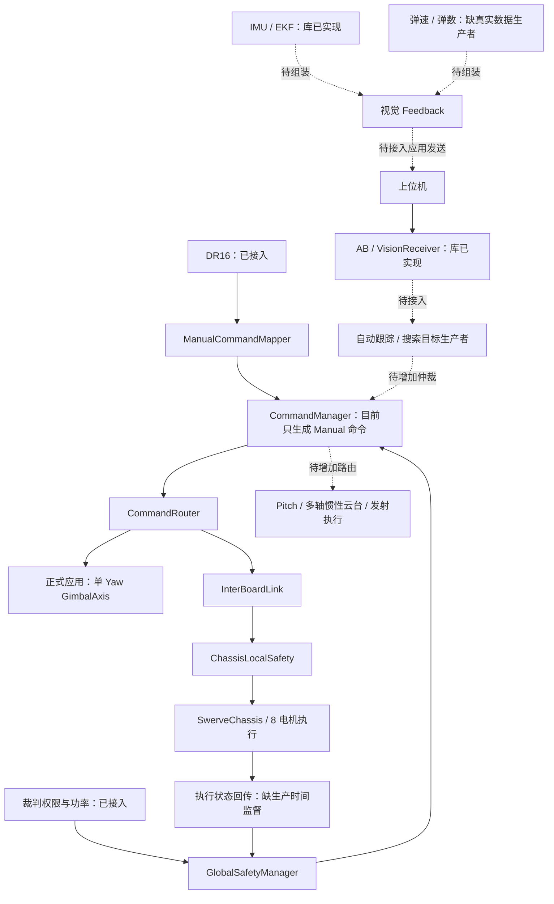

# 当前项目完成度分析与后续实施清单

分析日期：2026-09-30。源码基线：`e663bbd`；检查开始时工作区干净。

本轮只读审查了应用、驱动、控制、通信、机器人算法、板级配置、样例、现有测试和 CI。没有运行构建、测试或硬件实验，只有本文被新增。下面“已实现”表示存在实际代码与调用路径，不表示已经通过本轮运行验收。

分析以仓库现有的“双主控哨兵：云台板 + 四轮舵底盘板”为整机方向。大小 Yaw、发射机构、自主导航是否属于你的最终硬件，需要按实际目标决定；它们不能全部算作通用框架的强制缺陷。

## 1. 当前完成度与开发重点

基础框架已经覆盖大部分台架开发需要。主要剩余工作集中在应用层状态衔接、实车配置、多轴/惯性云台、视觉控制闭环和自动行为。后续应复用现有 PID、遥控解码、CAN 电机框架和 EKF，推进正式应用的完整闭环。

| 领域 | 当前代码已具备 | 仍需完成 |
| --- | --- | --- |
| 板级支持 | MC02、C 板设备树；CAN、UART、BMI088 与加热 PWM 配置入口 | 实车端口分配、电气接线、DMA 资源和两块板的构建/上机核验 |
| 电机 | `CanBus`、`Motor`、`Group`；DJI 与 DM 三种模式；停机、恢复、参考重建 | 真实 CAN 故障、回调取消、跨总线联动与机械停止验收 |
| 控制 | PID、前馈、限速、速度环、位置串级及电机封装 | 惯性云台执行适配；视觉角度/角速度/角加速度贯通 |
| IMU | BMI088 + 独立 EKF、RS485 DM IMU、快照过期、后台采集与温控 | 正式应用接入、安装方向与参考标定、实物流和温控验收 |
| 遥控与裁判 | DR16 已接应用；裁判权限、功率上限及缓冲能量解析已接应用 | 初始 UART 失败恢复；裁判实际端口/profile；发射所需字段按需补齐 |
| 板间通信与安全 | 心跳、控制、约束、反馈、boot_id/恢复代次及全局/局部安全链路 | 控制任务健康检测、状态生产时间检查、整机故障恢复验收 |
| 云台 | 完整单轴 `GimbalAxis`；双轴遥控样例 | 正式应用目前只有单 Yaw；统一双轴 `Gimbal`、Pitch 接入和惯性控制尚缺 |
| 底盘 | 四模块舵轮运动学、8 台 DJI 电机执行、反馈恢复和台架限功率 | 几何/零点/PID 标定、可信功率控制、实测速度反馈；导航按需扩展 |
| 视觉与自动模式 | AB 收发协议、`VisionLink`/`VisionReceiver` 与软件流程验收 | 姿态反馈生产者、自动目标生产者、参考恢复、仲裁、丢目标策略与巡航搜索 |
| 发射 | 意图、命令枚举、裁判输出许可占位 | 实际命令生成、路由、摩擦轮/拨弹执行、热量/弹速/计数与保护 |

重要更正：旧[电机审查指南](电机驱动审查复核与线程弹性实施指南.md)和[专题索引](README.md)仍写 F1–F6 待完成，但当前源码已有对应修复和 14 个回归用例。它们应进入“已落地、待目标板验收”，不要重新列为尚未实现。

## 2. 当前数据流和缺少的连接



虚线表示还没有在正式应用中形成的连接。模块已有实现和整机已经能使用该模块，是两个不同的完成条件。

## 3. P0：让现有应用能够可靠启动、停止和恢复

P0 指打开实车运动门禁前应处理的事项；P1 指形成目标整机功能所需的主要开发；P2 指后续行为和工程完善。

### 3.1 先完成真实硬件配置，保留配置门禁

两应用 `connections_configured=false`。云台还保留 `referee_version=Unspecified`、GM6020 `current_mode_confirmed=false`，overlay 中 `referee-uart` 尚未启用。底盘 `power_model_calibrated=false`，功率参数为零。默认 `require_referee_for_motion=true`，这些条件会实际阻止输出。

证据：

- [云台 board_config.hpp](../../applications/sentry_gimbal/src/board_config.hpp)：12–14、39–45、76–81。
- [云台 app.overlay](../../applications/sentry_gimbal/app.overlay)：1–13。
- [底盘 board_config.hpp](../../applications/sentry_chassis/src/board_config.hpp)：16–24、46–51、78–94。
- [底盘 main.cpp](../../applications/sentry_chassis/src/main.cpp)：131–146，默认要求裁判功率数据新鲜且模型已标定。

实施时先整理一张真实接线表，再逐项填写 CAN 控制器、反馈 ID、共享发送槽、电机模式、零点、方向、轮半径、模块坐标、UART 波特率/电气接口及 DMA。确认 GM6020 的控制模式后才能修改确认字段。选择仓库已支持且与实际系统相符的裁判 profile，并配置真实裁判 UART。

云台急停和复位入口都固定返回 `false`；底盘急停入口也固定返回 `false`，但底盘已经有 `sw0` 按钮的消抖复位，不能把底盘复位误列为完全缺失。需要接入真实急停与云台复位输入，并明确输入故障时的行为。软件 disable 不提供物理断电或机械制动。

### 3.2 修复云台对异步 Enabling 阶段的处理

这是从源码可推导的应用状态衔接问题，默认未配置门禁会掩盖它。

现有过程：

1. [Motor::requestEnable](../../drivers/motor/motor.cpp)：347 起，受理请求后进入 `Enabling`，尚未开放输出。
2. `Motor::readyLocked()` 只对 `Disabled` 成立，`active()` 只对 `Active` 成立，见同文件 295–317。
3. [云台 main.cpp](../../applications/sentry_gimbal/src/main.cpp)：257–264 使用 `ready || active` 作为 `hardware_ready`。
4. 握手如果持续到下一轮 5 ms 控制周期，两者都为 false；局部安全返回 `Recovering/Disable`，275–277 随即对 `Enabling` 调用 `disable()`。

因此正常握手可能被应用自己取消。DJI 很快完成时可能没有暴露；较慢的 DM 握手或 CAN 负载更容易触发。不能据此断言默认硬件一定失败。

建议在云台执行流程中明确区分 `Disabled → Enabling → Active`。处于 Enabling 且急停、权限、输入新鲜度和反馈仍满足条件时，等待驱动完成握手；不要把“尚未 Active”解释为故障。条件撤销、反馈过期或驱动超时/故障时，仍必须 disable；也不能在 Enabling 提交普通运动目标。

可复用[双轴云台样例](../../samples/robotics/gimbal_control/src/main.cpp)中对 `group.enable_pending` 的处理，约 98–153 行。该样例使用 Group，正式单轴应用需要按 Motor 状态适配。

```text
每轮读取电机状态、命令、权限和急停
若需要撤销输出：disable
否则若 Enabling：继续监督，等待握手完成
否则若 Active：执行当前有效目标并 commit
否则若 Disabled 且 ready 且收到恢复边界后的新命令：reset，然后 enable
否则：保持不输出，等待反馈或显式清故障
```

先整体完成状态分支，再做一次完整使能流程检查：故意让握手跨越多个控制周期，正常条件下应到 Active；握手中撤销权限应立即取消。

### 3.3 修复云台急停复位请求的消费时序

[云台 main.cpp](../../applications/sentry_gimbal/src/main.cpp)：110–112 清除全局锁存并递增 `reset_generation`，新的非急停安全快照要到 113–127 才发布。优先级更高的云台执行线程可能在这之间运行，读到新复位代次和旧 `EmergencyStop` 快照。

执行线程 245–252 此时 `local.clearEmergencyStop(!estop)` 可能返回 `-EBUSY`，却仍把 `last_reset` 更新为新代次。结果是全局锁存已清、局部锁存未清，这次复位已被消费。

应让复位事件与对应安全快照一致交付；或者仅在确认本地急停已释放且成功处理后消费该代次。失败仍保留待处理请求，真实急停未释放时禁止清锁存。若采用一起发布的新快照，可参考公共 `Latest<T>`，但必须处理 `put()` 失败，不能先宣布事件已完成。

当前云台复位函数恒为 false，本轮没有观察到实机故障。这是接入物理复位前应修正的并发路径。完成条件是一次复位请求可靠处理全局与本地锁存，随后等待新命令再使能。

## 4. P1：正式云台、多轴和惯性控制

### 4.1 将现有双轴能力接入正式应用

正式[云台 gimbalTask](../../applications/sentry_gimbal/src/main.cpp)：218–221 只构造一台电机和一个 Yaw；280–281 只消费 yaw 字段。`GimbalCommand` 已包含 pitch 字段，但在这里没有执行器。

仓库已有[双轴遥控样例](../../samples/robotics/gimbal_control/src/main.cpp)，不是完全没有 Pitch 控制。缺少的是可复用双轴 `Gimbal` 编排层与正式应用的 Pitch 配置、恢复和执行链路。

推荐复用现有 `GimbalAxis`，增加薄的组合层：统一读取双轴反馈、判断联动条件、形成目标、协调启停和按物理 CAN 提交。机械联动需要共同失能时使用 `Group`；同一 CAN 只保留一个 `CanBus` owner。Group 不保证不同 CAN 同时发送。

Pitch 的机械限位、编码器参考/回零、方向和重力前馈必须按实物配置。样例中的占位参数不能直接搬进正式应用。设计参考[分层重构方案](云台GimbalAxis与Gimbal分层重构方案.md)，其中的双轴 API 仍是方案。

大小 Yaw 协调器只在实际存在两级 Yaw 时增加。当前源码只命名 `yaw`，没有充分依据把它认定为“大 Yaw”或“小 Yaw”。

### 4.2 补齐世界坐标目标到实际执行的适配

[GimbalAxis](../../lib/robotics/gimbal_axis.cpp)：36–48、95–100、128、182 使用电机编码器反馈和 `PositionMotor`。这里的 `AbsoluteAngle` 是电机参考下的目标，不能直接理解成视觉世界坐标系的绝对角。

当前 IMU、EKF 和 AB 目标各自已有实现，但缺少以下连接：

- 选择实际装在云台上的姿态源，配置传感器到机构的安装变换。
- 定义视觉参考、IMU 参考与电机零点之间的关系。
- 增加使用姿态/角速度反馈的稳定控制适配，并保留电机反馈的新鲜度、故障和 Pitch 限位监督。
- 明确目标角速度/角加速度如何参与跟踪前馈，及其限幅。

[PositionMotor::update](../../include/control/position_motor.hpp) 当前只收目标位置和 dt；[位置环输入](../../include/control/motor_position.h)没有独立目标速度/加速度。[基础前馈库](../../include/control/feedforward.h)已经能计算这些项，缺少的是从视觉三元组到跟踪接口的贯通，不需要重写 PID。

“参考”表示这些角度共用哪个坐标系；`epoch` 是这个参考重建后的代次。旧代次目标不能用于新零点。现有 [QuaternionEkf](../../include/control/attitude_ekf.hpp)也明确 yaw 不可观，不能把其输出当成永不漂移的全局航向。

## 5. P1：接通视觉反馈、自瞄与参考恢复

### 5.1 先打通实际双向数据，再开放自动输出

已有 AB 编解码、流式坏帧恢复、命令过期和反馈编码。正式应用未实例化 `VisionReceiver` 或 IMU 接收器；[视觉样例](../../samples/communication/vision/src/main.cpp)目前只接收并做遥测，没有实际 IMU/发射反馈生产者。

还需增加应用组装层：

```text
ImuReceiver 快照 + 真实弹速/弹数
    → 检查各字段 fresh_mask、原始时间、参考和姿态质量
    → Vision Feedback / setFeedback
    → VisionReceiver 周期上行
    → 上位机目标
    → AimCommand 快照
    → 模式与安全仲裁
    → 云台跟踪目标
```

构造 `Feedback` 应保留每个原始测量时间；复制时不能把旧数据盖上当前时间。例如 orientation 字段不在 IMU `fresh_mask` 中时，应清除该字段的 `stamp.valid`，不能仅检查 IMU 线程还活着。IMU 与视觉协议的参考必须一致。

[AB encodeFeedback](../../lib/communication/vision_ab_protocol.cpp)：89–94 要求姿态、gyro、弹速和弹数全部有效，否则返回 `-ENODATA`。因此，正式应用即便接入 IMU，也不能自动获得可发出的第一帧姿态反馈。需要明确弹速/弹数的数据来源与有效性；若台架采用仿真数据，应放在明确的台架配置中。协议没有有效位，不能把缺失测量悄悄标成有效。

消费视觉目标时至少检查 `aim_fresh`、`control_requested`、参考一致性和安全许可。mode=0 是停止请求，不能继续执行遗留 target；`fire_requested` 只是电平请求，不能当作“每收到一帧就开一发”的事件。

### 5.2 自动模式目前没有完整生产者与授权路径

证据：

- [command.cpp](../../lib/robotics/command.cpp)：20–23 映射 Auto，但 72–73 后只有 Manual 分支生成运动命令。
- [云台 commandTask](../../applications/sentry_gimbal/src/main.cpp)：100–101 将运动授权限定为左拨杆 Middle；当前 Auto 对应 Up，不会开放输出。
- [CommandRouter](../../applications/sentry_gimbal/src/command_router.cpp)只路由本地云台和远端底盘，不生成自动目标。

应增加自动目标生产者与模式仲裁，同时调整输入授权表达。先定义操作者怎样授权 Auto、怎样手动接管、视觉停止/过期时 Hold 还是 Disable，再实现对应状态转换。安全优先级不能仅靠修改拨杆判断来替代。

### 5.3 IMU 重置后的视觉会话恢复也需要实现

[BMI088 service](../../drivers/imu/bmi088_imu.cpp)：96–102 在 EKF generation 改变后递增姿态 `epoch`。[AB encodeFeedback](../../lib/communication/vision_ab_protocol.cpp)：93–94 拒绝与构造配置不同的参考，返回 `-ESTALE`。现有接收器没有热切换参考/会话的公开流程。

直接把 IMU 数据塞进 Feedback，在估计器重置后可能持续无法上行。需要实现停止运动、清除旧 Aim、建立新参考、同步上位机并重新授权的流程。AB 线上没有 epoch，单独修改本地编号不能证明收到的目标属于新参考。

首次接入可以明确采用“参考变化后保持禁用，人工重新建立会话”的保守策略；自动恢复需有双方可确认的协调机制。不能通过删除 `-ESTALE` 检查绕过参考问题。

## 6. P1：功率控制与应用运行健康

### 6.1 将台架限幅升级为可信功率控制

[ChassisPowerLimiter](../../include/robotics/chassis/chassis_power_limiter.hpp)：9 明确声明是台架启发式。现有[功率估计](../../applications/sentry_chassis/src/chassis_hardware.cpp)：123–142 是 `idle_power + Σ|电流| × 系数`，没有直接测量电压/功率，也不是完整的转速相关电机模型。

仅把 `power_model_calibrated` 改成 true 不能证明功率限制可靠。应先选择实测输入或经过实际电压、电流、转速数据标定的模型，检查突变工况和模型误差，再设控制余量与恢复速率。还需明确舵向与驱动电机的功率分配；当前 `hardware.apply()` 将同一 scale 乘到八台电机。

裁判解析当前提供功率上限与缓冲能量；[referee.cpp](../../lib/communication/referee.cpp)：60–63 没有发布实测功率。上限、模型估计和测量值必须分别标识。

### 6.2 让心跳同时反映控制任务的状态生产年龄

目前 UART 链路在线，不足以证明执行任务仍在工作：

- [底盘 main.cpp](../../applications/sentry_chassis/src/main.cpp)：239 给反馈赋生产时间，但链路线程 61、74 没有检查该时间。
- [板间 codec](../../lib/communication/interboard_codec.cpp)：172–191 不传反馈生产年龄，168 解码时用本地收包时刻重新赋 stamp。
- [云台 main.cpp](../../applications/sentry_gimbal/src/main.cpp)：30–34 的 `GimbalStatus` 没有生产戳，176–194 也可能不断发送旧 ready 状态。

如果控制任务阻塞而通信任务继续运行，旧 Active/Ready 可能持续满足对端的“新鲜反馈”判断。电机驱动的命令超时能提供部分底层保护，但不会纠正上层错误状态。

应给执行状态增加生产时间，发送前检查是否仍新鲜；过期时回报 ready=false 和相应故障/等待状态，并避免继续宣称 Active。若需要接收端计算年龄，可在双方同步升级的协议版本中传生产年龄。硬件看门狗策略应覆盖必要任务，不能只靠通信线程喂狗。

已有控制命令通过 producer sequence 拒绝重复刷新，[InterBoardLink](../../lib/communication/interboard_link.cpp)：42–44；不要把上面的状态反馈问题误说成所有控制重发都会无限续命。

### 6.3 补上 UART 初次失败的恢复流程

[RemoteReceiver](../../lib/communication/remote_receiver.cpp)：43 保存一次 `init_ret`，49 之后仅在初始成功时 service/read。若首次 `uart_rx_enable()` 暂态失败，`AsyncUart` 虽已注册回调并提供 service 重启能力，接收线程也不会尝试恢复，只持续发布 InitFailed。

可参考[VisionReceiver](../../lib/communication/vision_receiver.cpp)：39–51，区分未初始化与已初始化但 RX 停止，有限频率重试并发布当前诊断。裁判与板间线程也需要在设备/回调初始化失败后明确重试或保持可诊断的阻塞状态；当前首次错误主要只记录一条日志。

恢复时保持离线与失能，直到收到新的有效数据。`start()` 返回成功只代表线程安排成功，不代表 UART 已可用；对象与 DMA 缓冲区须在全部回调期间持续存活。

## 7. P2 与按最终目标实施的扩展

| 项目 | 为什么仍需做 | 复用入口与边界 |
| --- | --- | --- |
| 空闲巡航/搜索 | 目前只有设计记录；没有搜索规划器或跟踪/搜索状态机 | [巡航方案](哨兵空闲巡航与搜索模式规划.md)；放在行为层和目标生成层，先完成手动/视觉基本链路 |
| 发射完整链路 | `ShooterCommand`/鼠标意图存在，但没有生产、路由、执行器或射击保护 | `messages/command.hpp`、`command.cpp`、`command_router.cpp`；需要摩擦轮/拨弹闭环、单发事件、卡弹恢复、热量和输出许可 |
| 裁判扩展 | 当前只解 `0x0201/0x0202`，业务主要用输出许可与底盘功率约束 | `lib/communication/referee.cpp:39`；若接发射/比赛行为，按选定正式协议补所需字段、独立过期与数据源，避免复制旧版本布局 |
| 底盘实测速度/里程计 | 正式应用反馈 `valid_fields=0`，没有发布机体速度或实测功率 | `sentry_chassis/src/main.cpp:237`；根据轮速/舵角增加逆运动学，按需要融合姿态，只有测量可信后才设置有效位 |
| 底盘跟随/导航 | 当前输入是机体速度，没有位置估计、路径目标生产者或云台坐标速度转换 | 如果需要云台随动或自主巡逻，再实现坐标变换、定位与导航接口；不能把目标速度当实测速度回传 |
| 大小 Yaw 协调 | 需要两级真实机械拓扑、角度参考与分配策略 | 当前没有协调器；只在确认确实有大小 Yaw 时实施 |
| 扩展板间消息 | `ChassisFault`、`GimbalFeedback`、`SystemEvent` 目前仅有枚举，未进入四类主消息的 codec/parser | 需要跨板多轴协调、独立故障事件或系统事件时，再补消息契约、版本兼容和收发调用 |
| DM IMU CAN | 目前只有不可实例化的抽象接口，无解码/接收后端、Kconfig/CMake | [dm_imu_can.hpp](../../include/drivers/imu/dm_imu_can.hpp)；选择 RS485 可以不做，选择 CAN 才补固件对应协议和验收 |
| DM 电机模式 4 | 当前支持 MIT、位置速度、速度三种模式 | [模式说明](../../samples/motor/DM_J4310_EXAMPLES.md)；只有目标固件/功能需要时才扩展 |

发射链路中“单发”是一次动作事件，公共 latest 快照会覆盖旧值；需要明确事件编号、去重和消费结果。不能将视觉 `fire_requested=true` 的每一次周期读取转换成一个新事件。没有热量、权限或有效目标时，应拒绝射击。

## 8. 工程验收与文档需要补齐

现有[CI](../../.github/workflows/build-applications-and-samples.yml)：68–94 只发现 `applications/` 与 `samples/` 并固定使用 MC02 构建；没有运行 `tests/motor/regression`、`tests/vision_imu`，也没有 C 板构建任务，触发路径未包括 `tests/**`。

后续建议先将已有两套完整模块验收接入 CI，再补关键整机流程验收。不要为此先重建逐函数测试体系。板级目标用显式适用清单构建，不能默认所有 MC02 overlay 都适用于 C 板。

还应测量实际线程栈余量、5 ms 控制周期抖动、RX 队列峰值、UART/CAN 负载和命令年龄。这些只能通过运行记录确认，本轮静态审查不能替代。

文档同步至少包括：

- 将 F1–F6 从“未实现”改为“源码已修复、目标板验收待完成”。
- 让专题索引反映巡航方案及当前多轴/自动控制的真实状态。
- README 的 IMU 能力描述与当前 `ImuSource/ImuReceiver` 分层同步；现有个别主题链接指向已删除的规划文件，需修正。

## 9. 推荐手工实施顺序与文件清单

按“先完成选定里程碑的功能代码，再做一轮简要检查”的顺序实施。下表为后续修改建议，本轮没有修改这些业务文件。新增文件名是建议，不表示仓库已有该 API。

| 顺序 | 文件/目录 | 要完成的结果 |
| --- | --- | --- |
| 1 | 两应用 `src/board_config.hpp`、`app.overlay` | 完成实车接线、急停/复位、零点、方向、模式及裁判配置；运动门禁最后开放 |
| 2 | `applications/sentry_gimbal/src/main.cpp` | 完整处理 Enabling；消除复位请求与安全快照不一致；给执行状态加生产时间 |
| 3 | `lib/communication/remote_receiver.cpp`、两应用通信线程 | 初始失败重试与状态诊断；避免旧状态在回传中保鲜 |
| 4 | `include/robotics/gimbal/`、`lib/robotics/`、云台应用 | 抽取建议的 `gimbal.hpp/gimbal.cpp` 双轴组合层，接 Pitch，并完成机构标定 |
| 5 | 云台应用配置与建议的姿态/视觉适配文件 | 实例化 IMU/视觉模块；组装实际反馈；定义参考、丢失与重建策略；先保持执行失能观察双向通信 |
| 6 | `command_manager.hpp`、`command.cpp`、应用 commandTask | 增加自动目标生产者、模式授权与手动接管，接惯性执行适配 |
| 7 | `chassis_power_limiter.*`、`chassis_hardware.cpp` | 标定并完善功率控制，验收约束过期/突变工况 |
| 8 | 机器人行为层与命令路由 | 跟踪/搜索规划；按目标补发射和比赛行为 |
| 9 | 底盘估计与目标输入模块 | 需要跟随或导航时补里程计、坐标转换与自主目标 |
| 10 | CI、现有测试入口、主题文档 | 跑已有流程验收，补必要整机验收、适用板级编译和文档状态 |

建议第一个里程碑设为“单 Yaw + 四轮舵底盘的手动闭环，能够安全启停和故障恢复”。第二个里程碑为“正式双轴云台 + 姿态/视觉双向反馈 + 安全自瞄”。搜索、发射和导航在相应基础链路稳定后继续。

## 10. 实施完成后的建议验证

以下命令供实施者执行，本轮未运行；路径按当前 `skywalker_code` 目录书写。构建目录各自独立。

```bash
# 已有电机软件回归
west build -p always -b native_sim/native/64 tests/motor/regression -d /tmp/skywalker-motor-regression
/tmp/skywalker-motor-regression/zephyr/zephyr.exe

# 已有视觉/IMU 完整模块流程
west build -p always -b native_sim/native/64 tests/vision_imu -d /tmp/skywalker-vision-imu
/tmp/skywalker-vision-imu/zephyr/zephyr.exe

# 当前主要应用目标
west build -p always -b dm_mc02/stm32h723xx applications/sentry_gimbal -d build/review-sentry-gimbal
west build -p always -b dm_mc02/stm32h723xx applications/sentry_chassis -d build/review-sentry-chassis

# 基础 IMU 板级核验入口；不代表所有外设样例都适用 C 板
west build -p always -b rm_typec samples/imu_test -d build/review-typec-imu
```

先检查生成的 `.config`、`zephyr.dts` 与 map 文件，再按以下顺序上机：

1. 只给 MCU 供电，不开放执行输出；观察 UART、心跳、裁判 profile、姿态和各字段年龄。
2. 机构可靠支撑/脱离负载，动力有可触达的物理切断手段；先接一个电机并用低限幅确认方向和参考。
3. 验证正常使能跨多个控制周期；急停或权限撤销应取消握手。
4. 验证一次急停复位能处理两层锁存，随后必须重新满足新命令/反馈条件。
5. 验证手动控制、板间断线、单板重启、反馈间断、CAN 故障和恢复；恢复不能自动沿用旧目标。
6. 让控制任务停止更新而通信仍运行；对端应看到执行状态过期，而不是持续 Ready/Active。
7. 输出仍受约束时接视觉；验证 mode=0、目标过期、参考变化、IMU 断流和手动接管。
8. 最后验证多轴/多模块、功率控制和自动行为；记录负载、栈与抖动。

快速定位时按链路检查：配置门禁 → UART/协议状态 → 输入与权限年龄 → 参考/恢复代次 → ready/Enabling/Active → 控制输出 → commit/TX。不要只看“编译成功”或“心跳在线”。

## 11. 最终完成清单与未验证假设

- [ ] 实车配置完整；急停/复位真实接入，门禁开放有明确依据。
- [ ] Enabling 握手不会被正常控制周期取消；握手中的失能仍及时处理。
- [ ] 单次复位事件不会因线程交错丢失。
- [ ] 执行任务状态过期可检测；通信在线不会掩盖执行任务停滞。
- [ ] 正式双轴/惯性云台有明确机械限位、参考和恢复流程。
- [ ] 视觉双向反馈使用真实数据与原始时间，参考重建有双方协调策略。
- [ ] Auto 有完整目标生产、仲裁、授权与手动接管路径。
- [ ] 功率限制由可信输入/模型支持，估计与实测反馈区别明确。
- [ ] 若需要发射/搜索/导航，已补相应执行与状态机；可选协议后端按实际硬件选择。
- [ ] 现有软件验收进入 CI；目标板构建、故障与资源测量已记录。
- [ ] 旧开发文档的完成状态与当前源码一致。

未验证假设包括真实机械拓扑、接线、电机固件/模式、UART 电气链路、IMU 安装参考、裁判实际版本、功率参数和运行时资源。CAN 恢复还依赖所固定 Zephyr STM32 后端的 `can_stop()` 对在途回调的完整终结契约，见 [can_bus.cpp](../../drivers/motor/can_bus.cpp)：996–1009；软件 mock 测试不能证明硬件满足该契约。

本文中的应用竞态和 Enabling 问题来自静态调用链推导，没有声称已在目标板复现。本轮交付是分析与手工实施指南，业务源码、配置、测试和构建文件均未修改。
