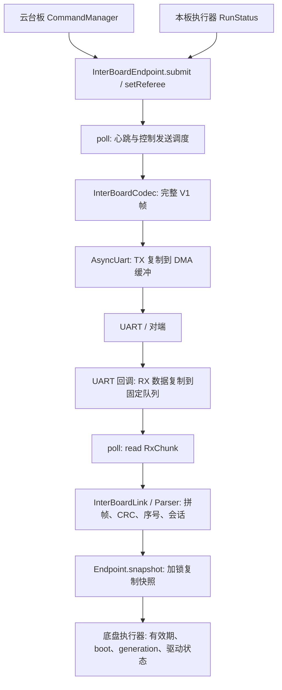
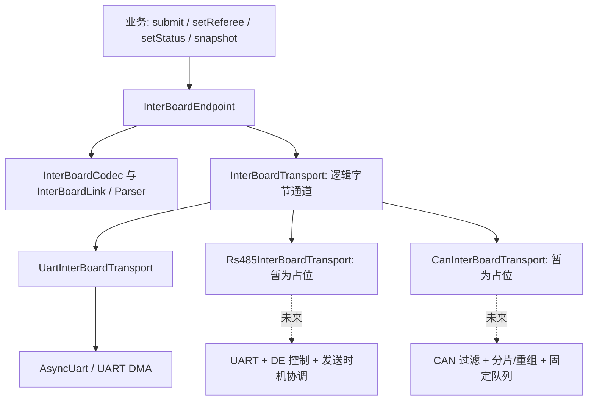

# 板间通信统一传输接口与三种后端实施指南

> 实现状态更新（2026-10-02）：用户已对本次实现任务禁用古法编程模式。UART、硬件 DE 两线 RS485 轮询/应答、经典 CAN 分片重组均已加入源码，不再是占位后端；样例和双主控应用已迁移到统一初始化配置。当前契约以[现行传输文档](../modules/communication/interboard-transports.md)和源码为准：逻辑批次上限 240 字节，默认批次超时 60 ms，RS485/CAN 使用本文后续设计时尚未定义的传输封装。下面保留原设计稿供追溯，其中“尚未实现”和示例接口描述不代表当前实现。未进行实机收发验证。

本文基于 2026-10-02 读取到的源码。**这是待手工实施的设计指南，文中的新接口尚未加入业务源码，也没有执行编译、测试或上机操作。**

按本任务的古法编程边界，只写本指南。实施时先连续完成接口、适配、调用方和构建配置，最后做一次编译；不按小步骤循环增加审查、测试或格式化。

## 1. 目标与范围

将需求理解为云台主控板与底盘主控板之间的通信：初始化时选择 UART、RS485 或 CAN，此后的业务调用保持一致。

推荐保留 `InterBoardEndpoint` 作为统一业务入口，给它注入一个 `InterBoardTransport`。现有 UART 可以做很薄的适配；RS485、CAN 第一阶段提供接口和明确返回 `-ENOTSUP` 的占位实现，暂不编写新的线协议。

这里“串口”指当前板间样例使用的 MCU UART TX/RX 点对点连接；RS485 指经差分收发器连接的通道。二者在软件上可复用 UART 驱动，但 RS485 的收发方向和总线访问需要单独处理。RS485 本身规定电气特性，并不规定业务报文；两线半双工需要协调双方发送时机。[TI RS-485 Design Guide](https://www.ti.com/lit/an/slla272d/slla272d.pdf)

本阶段假设每个端点只对应一个对端，选定后端后保持到系统重启，不做热切换、多板寻址或自动冗余。已进一步对照 MC02 手册原理图确认：板载 RS485 是 A/B 两线接口，USART 的 DE 信号连接收发器方向控制。实际使用的板卡版本、CAN 是否与电机共线，以及对端是否运行相同固件，仍需实际接线确定。

IDE 中的 IMU 文件属于另一条设备数据链。若实际目标是“同一个 IMU 可选 UART/RS485/CAN”，第 10 节说明了应该复用的另一层接口。

### 1.1 设备树和原理图核对：三种接口是否都属于 UART 设备

**MC02 的普通串口和 RS485 都使用 UART/USART 外设；CAN 使用独立的 FDCAN 外设。板上已集成 CAN、RS485 收发器，但 CAN 收发器不负责把 UART 报文转换成 CAN 帧。**

| 对外接口 | MCU 内部控制器 | 板外信号形成路径 | Zephyr 驱动 API |
| --- | --- | --- | --- |
| 普通串口 | USART1 等 UART/USART | TX/RX 引脚接串口接口 | `uart_tx()`、`uart_rx_enable()` |
| RS485 | USART2、USART3 | USART TX/RX/DE → 板载 RS485 收发器 → A/B | 同一套 UART API，外加方向/访问时机配置 |
| CAN | FDCAN1、FDCAN2、FDCAN3 | FDCAN TX/RX → 板载 CAN 收发器 → CANH/CANL | `can_send()`、`can_add_rx_filter()` |

证据位置：

- [MC02 板级设备树](../../boards/damiao/dm_mc02/dm_mc02.dts) 的 `&usart2`、`&usart3` 节点配置 `usart*_tx/rx/de` 和 `de-enable`；`can1: &fdcan1`、`can2: &fdcan2`、`can3: &fdcan3` 则配置 `fdcan*_tx/rx` 和 `bitrate`。
- 上游 SoC 文件 `../zephyr/dts/arm/st/h7/stm32h7.dtsi` 中，USART2/3 的 compatible 是 `st,stm32-usart` / `st,stm32-uart`；FDCAN1/2 的 compatible 是 `st,stm32h7-fdcan`。`stm32h723.dtsi` 中的 FDCAN3 也是后者。它们对应不同寄存器、驱动与硬件控制器。
- [MC02 使用说明书](../datasheets/达妙科技%20DM-MC-Board02电机开发板使用说明书.pdf) 印刷第 4 页（PDF 第 6 页）标出 MCU 的 CAN1/2/3 TX/RX 与 USART2/3 TX/RX/DE；印刷第 5 页（PDF 第 7 页）原理图显示 CAN 收发器左侧接 `CAN1_TX(PD01)` / `CAN1_RX(PD00)` 等，右侧为 CANH/CANL；RS485 收发器左侧接 USART2/3 TX/RX 和 DE，右侧为 A/B。这一页是两条硬件路径的直接证据。
- [RoboMaster C 型手册](../datasheets/RoboMaster%20%20开发板%20C%20型用户手册.pdf) 印刷第 10 页把 UART1/6 列为串口，并说明外接 RS485 需要电平转换；第 11 页单列 CAN1/2；第 17～18 页引脚表也分别列出 UART_TX/RX 与 CAN_TX/RX。C 型板没有 MC02 这两路板载 RS485 配置，不能混用板卡结论。

CAN 收发器上的引脚也叫 TXD/RXD，只说明数字信号的发送/接收方向，并不说明它接的是 UART。CAN 帧、ID、仲裁和硬件校验由 MCU 的 CAN 控制器负责，收发器负责连接差分总线。串口转 CAN 网关是另一种额外包含协议转换逻辑的设备，本板上述原理图不是这种连接。

Zephyr 中 `DEVICE_DT_GET(...)` 对两类设备都返回 `const device *`，这是通用设备描述符，不能据此认为它们的驱动 API 相同。现有 `async_uart.cpp` 调用 UART API，`drivers/motor/can_bus.cpp` 调用 CAN API，已经体现这一区别。

因此软件实现可以进一步收敛为**三种初始化选项、两套底层硬件收发实现**：UART 与 RS485 共用 AsyncUart，RS485 只增加必要的方向/半双工策略；CAN 单独使用 CAN 驱动。本文后面的三个后端类是对外装配形式，不要求为 RS485 重写一套 UART DMA 驱动，也不表示需要用户额外添加板上已有的收发芯片。

## 2. 当前通信链路

### 2.1 正式双主控应用



| 文件 | 当前职责 | 本任务中的复用方式 |
| --- | --- | --- |
| `include/robotics/messages/interboard.hpp` | 心跳、远程底盘控制、权限/功率约束等业务值 | 保持语义不变 |
| `include/communication/interboard/interboard_endpoint.hpp` | 业务门面、输入缓存、线程间快照 | 替换直接持有的 UART 为传输接口引用 |
| `lib/communication/interboard_endpoint.cpp` | UART 初始化重试、收发、周期发送、恢复上下文 | 收发改为接口调用；保留会话逻辑 |
| `interboard_link.hpp/.cpp` | 接收会话；拒绝同角色、重复/旧序号；缓存消息 | 不增加 UART/RS485/CAN 分支 |
| `interboard_codec.hpp/.cpp` | 业务值与 V1 完整帧之间转换 | 保留现有格式 |
| `interboard_parser.hpp/.cpp` | 字节流拼帧、长度/版本/CRC 校验、半帧超时 | 继续由 Link 使用 |
| `include/communication/async_uart.hpp`、`lib/communication/async_uart.cpp` | 异步 UART、DMA、固定队列、溢出代际 | 包在 UART 后端中 |
| `applications/sentry_gimbal/src/main.cpp` | 发布底盘命令、权限和云台状态；1 ms 通信循环 | 只调整对象装配 |
| `applications/sentry_chassis/src/main.cpp` | 板间通信和底盘执行线程 | 只调整对象装配 |

`InterBoardEndpoint` 当前对外的 `submit()`、`setReferee()`、`setStatus()`、`snapshot()` 已经不暴露线上的字节格式，适合作为稳定 API。真正锁定 UART 的位置是构造函数中的设备/DMA 参数、`AsyncUart uart_` 成员，以及 `poll()` 内的 `uart_.xxx()` 调用。

`InterBoardLink` 名字里虽然有 Link，实际上是协议和接收会话对象，没有硬件设备成员。它的发送工作由 Endpoint 调用 Codec 完成，不应该再把 CAN 控制器塞进这个类。

### 2.2 当前格式和容量

V1 使用 `A5 5A` 帧头，随后是版本、发送角色、消息 ID、payload 长度、帧序号、payload 和 CRC16。多字节整数采用小端序。声明的最大 payload 为 128 字节，完整帧上限为 142 字节。

| 消息 | payload 字节数 | 完整帧字节数 | 当前发送安排 |
| --- | ---: | ---: | --- |
| Heartbeat | 24 | 38 | Endpoint 每 20 ms 到期发送 |
| ChassisControl | 36 | 50 | 云台端每 10 ms 有发送机会；还受在线、命令新鲜度和恢复边界约束 |
| ChassisConstraint | 20 | 34 | 云台端与心跳同批发送 |
| ChassisFeedback | 32 | 46 | 底盘端与心跳同批发送 |

这些长度直接来自 `lib/communication/interboard_codec.cpp`。云台端当前一次可能拼出 `38 + 34 + 50 = 122` 字节，底盘端可能拼出 `38 + 46 = 84` 字节。因此 **Endpoint 的一次 send 是一个字节批次，可能包含多个协议帧**。

`AsyncUart` 的容量另有含义：TX 256 字节；两块 RX DMA 缓冲各 128 字节；一次 `RxChunk` 最多 64 字节；接收队列 8 项。这些不是 CAN 帧大小。

### 2.3 已有保护语义

- 只有有效心跳才能建立当前对端会话；普通消息不能凭空建立会话。
- 心跳的 `sender_boot_id` 变化会清除接收序号上下文和旧控制/约束/反馈。
- Endpoint 对掉线以及对端 boot/generation 改变有恢复边界处理。
- Endpoint 配置默认心跳超时 100 ms；`InterBoardLink::peerOnline()` 单独使用时默认 200 ms，两者不要混淆。
- 底盘执行器还检查命令新鲜度、接收方 boot_id、恢复 generation 和权限/功率约束。`online=true` 不代表电机可以直接执行命令。
- UART 的 `read()` 返回 `-EOVERFLOW` 时，Endpoint 丢弃 Parser 的半帧；新接口也必须保留这一语义。

替换传输时应保留这些已有机制；不能把“设备初始化成功”当成“对端在线”。

### 2.4 两处容易误解的现状

`samples/communication/interboard/src/main.cpp` 直接组合 `AsyncUart + InterBoardLink + Codec`，没有使用 Endpoint。只改两个正式应用，样例仍会绕过新的统一入口；需要在本次迁移清单中明确处理。

仓库的 `motor::CanBus` 是电机专用调度器，包含电机 attach、目标批次、安全输出、反馈路由、控制器启动及恢复。它不是通用的板间 CAN 字节通道。未来可借鉴其回调队列和生命周期做法，不宜通过构造一个假 Motor 来发送板间报文。

## 3. 推荐的抽象边界



这里统一的是**供现有 V1 协议使用的、有连续性约定的逻辑字节通道**。CAN 的原始帧、ID、DLC 和分片头都留在 CAN 后端。这样无需重写已有业务编解码和会话，也不会让业务线程知道 CAN 一帧只能装多少字节。

本方案不是通用 CAN 总线 API：以后给原生 CAN IMU、电机写驱动时，仍可能需要直接操作 CAN 帧。仅为了三种板间传输，不必先统一全仓库的所有驱动。

“注入”就是把已选定的后端对象引用传给 Endpoint。业务层一直调用同一个 Endpoint，只有启动装配代码选择后端。端点中的每个方法无需重复 `switch (transport_kind)`。

## 4. 第一步：声明公共传输契约

新增 `include/communication/interboard/interboard_transport.hpp`，只依赖标准整数和尺寸类型，不包含 UART/CAN 驱动头。

```cpp
#pragma once
#include <cstddef>
#include <cstdint>

namespace skywalker::communication {

enum class InterBoardTransportKind : std::uint8_t { Uart, Rs485, Can };

class InterBoardTransport {
public:
    static constexpr std::size_t kRxChunkCapacity = 64;
    static constexpr std::size_t kTxBatchCapacity = 256;

    struct RxChunk {
        std::uint8_t bytes[kRxChunkCapacity]{};
        std::uint16_t size = 0;
        std::uint64_t timestamp_ms = 0;
    };

    virtual ~InterBoardTransport() = default;
    InterBoardTransport(const InterBoardTransport &) = delete;
    InterBoardTransport &operator=(const InterBoardTransport &) = delete;

    virtual InterBoardTransportKind kind() const = 0;
    virtual int service(std::uint64_t now_ms) = 0;
    virtual int read(RxChunk &out) = 0;
    virtual int send(const std::uint8_t *bytes, std::size_t size,
                     std::uint32_t timeout_ms = 20) = 0;
    virtual bool txBusy() const = 0;

protected:
    InterBoardTransport() = default;
};

} // namespace skywalker::communication
```

### 4.1 每个方法的确定含义

| 接口 | 参数/返回值 | 状态与边界 |
| --- | --- | --- |
| 构造函数 | 接收配置、设备和必要的外部存储 | 只保存引用或值，不注册回调、不启动设备 |
| `kind()` | 返回 Uart / Rs485 / Can | 仅作装配或诊断信息；Endpoint 的业务逻辑不按它分支 |
| `service(now_ms)` | 本机单调毫秒时间；0 表示本地后端可工作；`-EAGAIN` 表示暂时未就绪；其他负值表示故障 | 首次调用执行硬件初始化，后续推进恢复。已就绪但没有收到数据仍返回 0 |
| `read(out)` | 0 表示复制了 1～64 字节；`-EAGAIN` 表示暂无数据；`-EOVERFLOW` 表示接收连续性断裂 | 只有成功才改变 out；非成功时调用者不得处理旧 out；不等待数据 |
| `send(bytes,size,timeout_ms)` | bytes 指向已编码字节批次；size 为 1～256；timeout_ms 为 1～1000；0 表示整批已被后端接收并复制 | 不允许“只接受前一部分”；调用返回后 bytes 可被复用。成功不代表对端收到、解码或执行 |
| `txBusy()` | 是否仍持有一个待发送/发送中的批次 | 不等待。false 不保证随后 send 必定成功，send 仍可返回 `-EAGAIN` |

就绪后 `send()` 的非法空指针、零长度和非法超时返回 `-EINVAL`；超过 256 字节返回 `-EMSGSIZE`；未就绪返回 `-EACCES`；暂时无法接收新批次返回 `-EAGAIN`。错误返回表示本次调用没有取得新批次所有权，不能悄悄保存一部分。

占位后端例外明确：所有带返回值的 I/O 方法均返回 `-ENOTSUP`，不访问设备、不接受发送、不产生接收数据；`txBusy()` 返回 false。不要返回 0 假装成功，也不要永远返回 `-EAGAIN` 让缺失实现看起来只是等待数据。

状态大致是 `未启动 → service 初始化 → 就绪/恢复等待/故障`。暂不增加公开的 `init()`，与现有 Endpoint 首次 `poll()` 内初始化的习惯保持一致；构造时已确定后端，首次服务只是启用硬件。

### 4.2 时间戳、丢包和线程

所有 `service/read/send/txBusy` 由一个通信线程调用；构造前后不能由另一个线程单独调用该后端的初始化。中断/驱动回调只复制数据、更新时间和标志，不调用 Parser、Endpoint 或执行器。

`timestamp_ms` 沿用设备接收时记录的本机时间，不能在 `read()` 取队列时换成当前时间。CAN 完整批次重组后可保守使用首片接收时间，让重组/排队消耗也计入有效期；必须定义并限制组包时长，不能把迟到命令标成刚到。

`-EOVERFLOW` 表示在继续发布新数据前通知上层丢弃半帧。后端内部负责淘汰旧代次队列，不能先报告溢出，再把断裂前的残留字节与新字节拼接。公共结构不暴露 `atomic_val_t generation`，它属于具体后端实现。

对象及被引用的 DMA/回调存储须静态存活。接口有虚析构函数只为 C++ 类型完整性，不承诺运行中析构安全；本阶段不支持 stop、销毁重建或运行中更换后端。

## 5. 第二步：实现很薄的 UART 适配

新增 `include/communication/interboard/uart_interboard_transport.hpp`：

```cpp
#pragma once
#include <communication/async_uart.hpp>
#include <communication/interboard/interboard_transport.hpp>

namespace skywalker::communication {
class UartInterBoardTransport final : public InterBoardTransport {
public:
    UartInterBoardTransport(const device *uart, AsyncUart::DmaBuffers &dma)
        : uart_(uart, dma) {}

    InterBoardTransportKind kind() const override {
        return InterBoardTransportKind::Uart;
    }
    int service(std::uint64_t now_ms) override;
    int read(RxChunk &out) override;
    int send(const std::uint8_t *bytes, std::size_t size,
             std::uint32_t timeout_ms = 20) override;
    bool txBusy() const override { return uart_.txBusy(); }

private:
    AsyncUart uart_;
    bool ready_ = false;
};
}
```

新增 `lib/communication/uart_interboard_transport.cpp`：

```cpp
#include <communication/interboard/uart_interboard_transport.hpp>
#include <cerrno>
#include <cstring>

namespace skywalker::communication {
int UartInterBoardTransport::service(std::uint64_t now_ms) {
    int ret = uart_.service(now_ms);
    if (ret == -EACCES)
        ret = uart_.init();
    ready_ = ret == 0;
    return ret;
}

int UartInterBoardTransport::read(RxChunk &out) {
    if (!ready_)
        return -EACCES;
    AsyncUart::RxChunk raw{};
    const int ret = uart_.read(raw);
    if (ret < 0)
        return ret;
    RxChunk next{};
    static_assert(sizeof(next.bytes) == sizeof(raw.bytes));
    next.size = raw.size;
    next.timestamp_ms = raw.timestamp_ms;
    std::memcpy(next.bytes, raw.bytes, raw.size);
    out = next;
    return 0;
}

int UartInterBoardTransport::send(const std::uint8_t *bytes,
                                 std::size_t size,
                                 std::uint32_t timeout_ms) {
    if (!ready_)
        return -EACCES;
    if (!bytes || !size || !timeout_ms || timeout_ms > 1000)
        return -EINVAL;
    if (size > kTxBatchCapacity)
        return -EMSGSIZE;
    return uart_.send(bytes, size, timeout_ms);
}
}
```

Endpoint 保留现有的硬错误 100 ms 重试节奏，因此上述适配不再增加第二套初始化重试状态。不要在调用方另外执行 `uart.init()`。

DMA 仍只由 `AsyncUart` 管理；保持每实例独占的 `static AsyncUart::DmaBuffers ... __nocache;`，不加初始化器，不把整个 Endpoint 放入 nocache 区。

现有 AsyncUart 的 TX 回调主要清理 busy 状态，没有提供完整的发送完成错误报告。因此本阶段的统一接口只承诺 send 的“接收批次”结果，不能向业务层宣传已有端到端送达保证；在线与控制有效性继续依靠现有心跳和时间戳。

## 6. 第三步：保留 RS485、CAN 接口

### 6.1 可实例化的占位基类

新增 `include/communication/interboard/reserved_interboard_transport.hpp`。目的只是让未实现后端也能参与同一套对象装配，并有确定的失败行为。

```cpp
#pragma once
#include <cerrno>
#include <communication/interboard/interboard_transport.hpp>

namespace skywalker::communication {
class ReservedInterBoardTransport : public InterBoardTransport {
public:
    int service(std::uint64_t) override { return -ENOTSUP; }
    int read(RxChunk &) override { return -ENOTSUP; }
    int send(const std::uint8_t *, std::size_t,
             std::uint32_t = 20) override { return -ENOTSUP; }
    bool txBusy() const override { return false; }
};
}
```

它仍因 `kind()` 未实现而是抽象类；实际选择下面两个有名字的具体后端。未来完成后端时直接继承 `InterBoardTransport`，保持外部方法签名即可。

### 6.2 RS485 配置和占位

新增 `include/communication/interboard/rs485_interboard_transport.hpp`：

```cpp
#pragma once
#include <communication/async_uart.hpp>
#include <communication/interboard/reserved_interboard_transport.hpp>

namespace skywalker::communication {
enum class Rs485Access : std::uint8_t {
    Unspecified, FullDuplex, Coordinator, Responder
};

class Rs485InterBoardTransport final : public ReservedInterBoardTransport {
public:
    struct Config {
        const device *uart = nullptr;
        Rs485Access access = Rs485Access::Unspecified;
        std::uint32_t turnaround_us = 0;
    };

    Rs485InterBoardTransport(const Config &config, AsyncUart::DmaBuffers &dma)
        : config_(config), dma_(dma) {}

    InterBoardTransportKind kind() const override {
        return InterBoardTransportKind::Rs485;
    }

private:
    Config config_;
    AsyncUart::DmaBuffers &dma_;
};
}
```

`Coordinator/Responder` 表示未来两线访问协议的主导方/应答方，与云台/底盘业务角色分别配置。`turnaround_us` 是释放发送后留给方向转换的保护时间，零是尚未设置；不是当前已支持任意零间隔。第一阶段整个后端返回 `-ENOTSUP`，这些字段仅保存设计意图。

MC02 已有 `rs485-2 = &usart2`、`rs485-3 = &usart3` 别名；USART2 配置 PD4(DE)/PD5(TX)/PD6(RX)，USART3 配置 PB14(DE)/PD8(TX)/PD9(RX)，两个节点均设置 `de-enable`。这是可复用的硬件 DE 配置入口。

Zephyr STM32 binding 的 `de-enable` 配合 pinctrl 启用硬件 DE，`de-assert-time` 和 `de-deassert-time` 的单位是 1/16 位时间，不是微秒。未来填写设备树时不能直接把 `turnaround_us` 填进去。[Zephyr STM32 UART binding](https://docs.zephyrproject.org/latest/build/dts/api/bindings/serial/st%2Cstm32-uart.html)

后续真正启用 RS485 前须完成：

1. MC02 按手册中的两线半双工接口设计，明确谁先发、谁何时应答、丢失应答如何恢复；只有接入其他板卡/收发器时才重新考虑四线全双工配置。
2. 为双方周期心跳、控制和反馈安排发送窗口；保留有界待发送批次，未获发送机会返回 `-EAGAIN`，不能阻塞 Endpoint 线程等总线。
3. 确定硬件 DE、自动方向收发器或 GPIO 控制的实际方式。当前配置骨架优先配合设备树硬件 DE，GPIO 方案以后按实际硬件补资源字段。
4. 确定是否接收本机回显以及处理方式，不能把本机回显作为对端数据。
5. 补齐用于发送的 DMA 配置。`dual_imu/app.overlay` 给 USART2 只配了 RX DMA，不能照搬成双向通信配置。

目前两个 Endpoint 都有自主周期发送调度，硬件 DE 只控制本机收发器，并不自动协调对端何时发送。因此把 UART 设备指针改成 USART2，尚不足以完成两线板间 RS485。

### 6.3 CAN 配置和占位

新增 `include/communication/interboard/can_interboard_transport.hpp`：

```cpp
#pragma once
#include <communication/interboard/reserved_interboard_transport.hpp>
struct device;

namespace skywalker::communication {
enum class InterBoardCanMode : std::uint8_t { Classic, Fd };

class CanInterBoardTransport final : public ReservedInterBoardTransport {
public:
    struct Config {
        const device *can = nullptr;
        std::uint32_t tx_id = 0;
        std::uint32_t rx_id = 0;
        bool extended_id = false;
        InterBoardCanMode mode = InterBoardCanMode::Classic;
        std::uint32_t reassembly_timeout_ms = 20;
    };

    explicit CanInterBoardTransport(const Config &config) : config_(config) {}

    InterBoardTransportKind kind() const override {
        return InterBoardTransportKind::Can;
    }

private:
    Config config_;
};
}
```

该头文件不引用 `AsyncUart`，占位实现也不依赖电机驱动或 `CONFIG_CAN`。`tx_id/rx_id` 是本端方向的 CAN 帧 ID；A 的 tx_id 对应 B 的 rx_id，反向另配。标准 ID 不超过 `0x7ff`，扩展 ID 不超过 `0x1fffffff`；不要直接把 V1 的 MessageId 当成 CAN ID。

默认 0 是字段默认值，并非本文分配的真实 ID；CAN ID 0 本身合法。后续实现要校验 ID 位宽、方向分配、总线中其他设备的 ID 和模式兼容性，不能靠“非零”代表配置正确。

经典 CAN 单帧数据区最多 8 字节，CAN FD 最多 64 字节。本地 Zephyr `include/zephyr/drivers/can.h` 的帧长度常量与格式定义可查；现有 V1 单帧上限 142 字节，发送批次上限 256 字节，所以采用 FD 也不能省略长批次处理。

未来 CAN 后端要遵守上述逻辑通道契约：

- `send()` 先完整复制最多 256 字节，然后分片；不能把已经发送前几片之后的失败伪装成“整批未接收”。初始返回值与后续物理发送结果分别处理。
- CAN 分片报文需要明确版本、批次标识、分片序号或偏移、完整长度、完整性判定及丢片/重复/超时规则。这里只列需求，不确定任何线上位布局。
- 接收先在后端内部完成一个批次的重组和完整性验证，再按最多 64 字节的 RxChunk 交给 Link。不能把原始分片头直接喂给 V1 Parser。
- 丢失批次、接收溢出或总线恢复会打断连续性；淘汰旧组包和旧队列，必要时向 Endpoint 返回 `-EOVERFLOW`。
- 不能混合不同发送者的字节；第一阶段只接受所配置对端的接收 ID。扩展多板网络前另行引入寻址。
- 组包耗时和等待发送时间都必须有界；20 ms 是建议初值，需结合实际速率和负载确定，不能直接声称能满足 100 ms 控制有效期。

Zephyr CAN RX 回调运行于中断上下文；接收回调只把帧和接收时间复制入固定队列。发送应使用完成回调并避免在 Endpoint 线程内等待硬件完成。[Zephyr CAN Controller](https://docs.zephyrproject.org/latest/hardware/peripherals/can/controller.html)

本地 `can.h` 还明确指出同优先级帧的排队顺序依赖硬件；需要 FIFO 的同 ID 分片应一次只提交一帧，或由明确的分片序号/重组规则消除乱序影响。不要仅凭连续调用 `can_send()` 推断线上的顺序。

**总线所有权：**本次优先预留一个独占 CAN 控制器。现有 `motor::CanBus` 会执行控制器 start/stop/recovery；其内部 owner 表只约束 CanBus 对象，不能自动保护新写的板间后端。未来若与电机共用同一控制器，应先抽出共同的控制器所有者和路由/恢复机制，而不是两个模块各自启停控制器。MC02 的多个 CAN 节点也不意味着实际线束上一定有空闲总线。

## 7. 第四步：Endpoint 改为依赖接口

### 7.1 头文件修改

在 `include/communication/interboard/interboard_endpoint.hpp`：

- 将 `#include <communication/async_uart.hpp>` 换为公共 `interboard_transport.hpp`。
- 显式加入 `<zephyr/spinlock.h>`，不要继续通过 UART 头间接获取 `k_spinlock`。
- 将 `AsyncUart uart_;` 换成 `InterBoardTransport &transport_;`。
- 构造函数替换为下列形式，成员声明顺序保持 `config_、transport_、link_`。
- 显式删除 Endpoint 的复制构造和复制赋值，避免改成引用成员后意外允许复制一个正在运行的端点。

```cpp
InterBoardEndpoint(InterBoardTransport &transport, const Config &config)
    : config_(config), transport_(transport), link_(config.role) {}

InterBoardEndpoint(const InterBoardEndpoint &) = delete;
InterBoardEndpoint &operator=(const InterBoardEndpoint &) = delete;
```

保留 `submit / setReferee / setStatus / snapshot / poll` 的签名和短锁复制逻辑。不要把锁扩大到后端 I/O。

### 7.2 接收区替换

在 `lib/communication/interboard_endpoint.cpp::poll()`，原 UART 服务和读队列区按以下结构调整。这是局部替换片段，后面的业务会话计算继续使用原实现。

```cpp
bool transport_ready = false;
if (now >= retry_ms_) {
    int ret = transport_.service(now);
    if (ret < 0 && ret != -EAGAIN) {
        error_ = ret;
        retry_ms_ = now + 100;
    }
    if (ret == 0) {
        transport_ready = true;
        error_ = 0;
        InterBoardTransport::RxChunk chunk{};
        for (unsigned budget = 0; budget < 8; ++budget) {
            ret = transport_.read(chunk);
            if (ret == -EOVERFLOW) {
                link_.discardPartial();
                continue;
            }
            if (ret == -EAGAIN)
                break;
            if (ret < 0) {
                error_ = ret;
                transport_ready = false;
                break;
            }
            link_.processRxBytes(chunk.bytes, chunk.size, chunk.timestamp_ms);
        }
    }
}
link_.processRxBytes(nullptr, 0, now);
```

最后这次零长度调用仍要保留，它推进 Parser 的半帧超时。`-EAGAIN` 不覆盖既有硬错误；第一次选用占位后端，下一次 `snapshot().error` 应是 `-ENOTSUP`，`online` 保持 false。

接收结构不改变已有 `next.online` 的心跳判断。运行期传输故障期间，对端在线值仍可能保留到心跳超时；业务调用者继续执行自己的 freshness 检查，不能将其理解为即时硬件连通状态。

### 7.3 发送区调整

将发送条件改成：

```cpp
if (transport_ready && now >= next_tx_ms_ && !transport_.txBusy()) {
    // 生成当前批次，再调用 transport_.send(...)
}
```

局部数组改用 `std::uint8_t bytes[InterBoardTransport::kTxBatchCapacity]{};`，`uart_.send` 换成 `transport_.send`。

此外要把两个发送时刻的提交移动到 send 接受批次之后。当前代码在编码前就更新 `next_tx_ms_`、`next_heartbeat_ms_`；未来半双工后端可能因没有发送窗口返回 `-EAGAIN`，此时不应把未接收的心跳当作已安排成功。

按以下伪代码完整调整原发送区，原有业务消息条件和字段填写继续沿用：

```text
如果后端可工作、达到发送时刻、没有在途批次：
    used = 0
    heartbeat_encoded = false
    encode_error = 0
    如果心跳到期：
        编码 heartbeat；成功才置 heartbeat_encoded = true
        按现有角色编码 constraint 或 feedback
    按原在线/新鲜度/恢复边界条件编码 control
    每次编码：正长度累加 used，负返回保留在 encode_error

    如果 encode_error 非零：记录错误，本轮不提交该批次
    否则如果 used > 0：
        ret = transport.send(bytes, used, 20)
        如果 ret == 0：
            next_tx_ms = now + 10
            如果 heartbeat_encoded：next_heartbeat_ms = now + 20
        否则如果 ret == -EAGAIN：
            不推进周期；下轮重新从最新业务值构造批次
        否则：
            记录 ret；设置已有的 100 ms 重试节奏
```

重新编码可以产生跳号；当前接收逻辑要求序号向前，不要求每个序号连续，因此无需回滚编码时递增的序号。不要在 Endpoint 增加无限 FIFO 保存过时的运动命令。

重连 baseline、boot_id、resume_generation、命令生产序号和 `next` 快照发布仍按原逻辑处理。后端选择不成为业务控制条件。

## 8. 第五步：启动时选择后端，保持业务调用一致

在两个正式应用的 `main.cpp` 中显式包含 UART 适配头。原 Endpoint 头移除 UART include 后，使用 `AsyncUart::DmaBuffers` 的文件也须自行包含其声明，不能依赖旧的间接 include。

云台 UART 装配示例：

```cpp
#include <communication/interboard/interboard_endpoint.hpp>
#include <communication/interboard/uart_interboard_transport.hpp>

namespace {
using namespace skywalker;
static communication::AsyncUart::DmaBuffers link_dma __nocache;
static communication::UartInterBoardTransport transport(
    board_config::interboard_uart, link_dma);
static communication::InterBoardEndpoint link(
    transport,
    {robotics::BoardRole::GimbalController,
     board_config::command_timeout_ms,
     board_config::chassis_heartbeat_timeout_ms});
}
```

底盘装配使用 `BoardRole::ChassisController` 及该应用的超时配置。现有通信线程仍调用 `link.poll(now_ms)`，控制线程继续 `link.snapshot()` / `link.setStatus(status)`；没有新增后端判断。

选择 RS485 时，仅把装配处的后端定义替换为下面形式并包含对应头。此处使用已存在的 MC02 别名，但仍是占位后端：

```cpp
static communication::AsyncUart::DmaBuffers link_dma __nocache;
static communication::Rs485InterBoardTransport transport(
    {DEVICE_DT_GET(DT_ALIAS(rs485_2)),
     communication::Rs485Access::Coordinator, 0},
    link_dma);
// InterBoardEndpoint link(transport, endpoint_config) 不变。
```

选择 CAN 时，引用装配层填写的 `CanInterBoardTransport::Config`，不需要 UART DMA：

```cpp
static communication::CanInterBoardTransport transport(board_config::interboard_can);
// board_config::interboard_can 是本次需要新增的 Config 配置值，当前尚不存在。
// InterBoardEndpoint link(transport, endpoint_config) 不变。
```

上述三个片段是互相替代的装配方案，不应同时定义三份名为 transport 的对象。

如果确实需要在同一固件中由启动配置决定类型，可额外在应用装配层写一个选择函数，返回静态 UART/RS485/CAN 对象之一的基类引用。只调用一次并永久绑定给 Endpoint。未选择的对象只构造、不调用 service，不注册硬件回调；同一物理 UART 只能由被选择的一个对象启用。无需动态内存或在业务循环内反复选择。若只需每个工程配置一种方式，上面的静态装配已经满足需求。

`samples/communication/interboard` 也应改为装配 `transport + Endpoint`。其 `p` 暂停命令生产、`g` 改 generation 的行为由本地命令和 RunStatus 维护，再交给 Endpoint。不要保留旧的 UART 收发循环同时再调用 Endpoint，否则同一设备会出现两个所有者。底层 Parser 统计若仍需展示，应另行决定诊断入口；不能把旧样例的 `link.stats()` 生搬到 Endpoint 上。

## 9. 第六步：构建依赖与实施收尾

### 9.1 文件级顺序清单

| 顺序 | 文件 | 手工修改内容 |
| --- | --- | --- |
| 1 | 新增 `include/communication/interboard/interboard_transport.hpp` | 统一逻辑通道、容量、RxChunk |
| 2 | 新增 `uart_interboard_transport.hpp` 和 `lib/communication/uart_interboard_transport.cpp` | 适配现有 AsyncUart |
| 3 | 新增 `reserved_interboard_transport.hpp`、`rs485_interboard_transport.hpp`、`can_interboard_transport.hpp` | 确定配置与占位失败语义 |
| 4 | `interboard_endpoint.hpp/.cpp` | 引用注入、公共 RxChunk、发送接受后推进周期 |
| 5 | 两个正式应用的 `src/main.cpp`、相应 `board_config.hpp` | 替换启动装配；业务调用保持统一 |
| 6 | `samples/communication/interboard/src/main.cpp` 及板级配置 | 改用 Endpoint；维护样例原本的命令/状态来源 |
| 7 | `lib/communication/CMakeLists.txt`、`lib/Kconfig` | 移除 Endpoint 对 UART 的强制编译绑定 |
| 8 | 相关通信模块文档和样例说明 | 明确 UART 可用路径、RS485/CAN 占位状态 |

该表中的业务文件本次均未修改。每一阶段的完成标准分别是：契约已声明、UART 已包裹、占位有确定返回、Endpoint 不直接使用 UART、调用方已装配、构建依赖分离；这些是实施目标，不要求逐步执行额外审查命令。

### 9.2 CMake 与 Kconfig

当前 CMake 在 `CONFIG_SKYWALKER_UART_TRANSPORT` 下才编译 `interboard_endpoint.cpp`，未来 CAN-only 目标会因此缺少 Endpoint 符号。建议新增 `SKYWALKER_INTERBOARD_ENDPOINT`，把会话/协议和 Endpoint 运行依赖分开。

在 `lib/Kconfig` 新增：

```kconfig
config SKYWALKER_INTERBOARD_ENDPOINT
    bool "Interboard endpoint with an injected transport"
    depends on SKYWALKER_INTERBOARD
    depends on ENTROPY_GENERATOR
    default y if SKYWALKER_UART_TRANSPORT
```

这里仍依赖熵源，是因为 Endpoint 使用 `sys_rand64_get()` 生成本次启动的 boot_id。不要为了 CAN-only 构建顺便把 boot_id 固定成常数。纯 Parser 用户可以不启用 Endpoint。

对应 `lib/communication/CMakeLists.txt` 的相关部分改为：

```cmake
if(CONFIG_SKYWALKER_INTERBOARD)
    zephyr_library_sources(interboard_codec.cpp interboard_parser.cpp interboard_link.cpp)
    zephyr_library_sources_ifdef(CONFIG_SKYWALKER_INTERBOARD_ENDPOINT interboard_endpoint.cpp)
    zephyr_library_sources_ifdef(CONFIG_SKYWALKER_UART_TRANSPORT uart_interboard_transport.cpp)
endif()
zephyr_library_sources_ifdef(CONFIG_SKYWALKER_UART_TRANSPORT async_uart.cpp)
```

其余遥控、视觉等编译条目保留。相关应用/样例 `prj.conf` 显式设置 `CONFIG_SKYWALKER_INTERBOARD_ENDPOINT=y`，保留原熵源配置及 RNG 节点。占位头文件暂不新增 `.cpp` 和真实驱动选项；CAN-only 用户以后可以启用 Endpoint 而不启用 UART 后端。

真正实现 RS485 后端后，它依赖 UART transport；真正实现 CAN 后端后，它依赖 `CONFIG_CAN`。没有 `CONFIG_CAN_FD_MODE` 不应宣称已支持 FD，且 `mode=Fd` 不等于板上收发器和对端自动具备 FD 能力。

### 9.3 最后一次编译

完成全部手工修改后，从仓库根目录选择一次最终编译。下面命令仅供用户执行，本次没有运行：

```bash
west build -b dm_mc02/stm32h723xx \
  -d build/interboard_transport \
  samples/communication/interboard
```

先让样例包含本阶段所需接口和装配，再做这一次编译。一次样例编译不代表两个正式应用、三种运行配置或硬件都验证过。没有明确测试要求时，不新增测试代码、不运行测试和编译产物，也不追加审查/lint/格式检查。

以下仅记录未来主动安排上机时的操作说明，不是本次要执行的测试：先在不接电机负载的双板台架断电接线，再给两块主控上电，最后观察通信日志。UART 沿用样例的 460800、8N1、TX/RX 交叉和信号参考连接；不要把 UART 电平端直接接到 RS485 A/B 或 CAN H/L。差分总线的端接、参考地/隔离及收发器供电按实际板卡资料确定。

UART 完成适配后的目标现象是业务消息和在线判断沿用原实现。RS485/CAN 占位的目标现象是 `snapshot.error == -ENOTSUP`、`online == false`，不产生硬件传输。不要为了让占位演示看起来“在线”而生成虚假心跳。

| 现象 | 优先定位 |
| --- | --- |
| 编译找不到 Endpoint 符号 | 新 Kconfig 选项和 Endpoint 的 CMake 条件 |
| Endpoint 头移除 UART 后某文件无法识别 DmaBuffers | 调用方是否显式包含 UART 适配或 AsyncUart 头 |
| 选择 CAN 却仍要求 UART DMA | 公共 Endpoint 是否残留 UART 构造参数或成员 |
| 占位后端显示在线/发送成功 | 是否错误地返回 0 或注入了模拟心跳 |
| UART 可初始化但无有效消息 | 两端速率、角色、实际接线和 DMA；设备 ready 不等于对端在线 |
| 接收断流后持续 CRC 失败 | `-EOVERFLOW` 是否传递，半帧和旧代次数据是否丢弃 |
| RS485 收单向 IMU 正常，双向板间失败 | TX DMA、DE/回显与双方发送协调尚未完成 |
| 接入板间 CAN 后电机掉线 | 是否错误共享控制器启停/恢复，或存在 ID/带宽冲突 |

## 10. 与当前打开的 IMU 代码的关系

IMU 已经有接近本需求的上层封装：

```text
Bmi088Imu 或 DmImuRs485Source
                ↓ 实现 ImuSource
           ImuReceiver(source, config)
                ↓
           start / snapshot / status
```

`ImuReceiver` 对不同来源保持统一；`DmImuCanSource` 目前只有 Config 和继承关系，没有实现 ImuSource 的纯虚方法，所以它是不能实例化的接口预留，不是能工作的 CAN IMU 驱动。

`DmImuRs485Source` 当前只接收主动上报：`AsyncUart → DmImuParser → ImuState`。它还承担单位、姿态参考和坐标变换，这些属于 IMU 协议/设备适配，不应搬入通用板间后端。MC02 双 IMU 样例的 RS485 RX 能力可以说明驱动路径的复用点，不能证明已具备板间半双工调度或 DM CAN 解码。

若后来确认需求实际是 IMU 三种接入，优先保留 `ImuSource / ImuReceiver`，在 Source 层适配具体设备协议。统一业务调用不要求所有外设共享同一个线上协议，也不要求先改造这条板间链路。

## 11. 最终实施目标

- [ ] Endpoint 只依赖 InterBoardTransport，业务方法签名保持不变。
- [ ] 后端在启动装配时确定，无运行期切换和隐式硬件回退。
- [ ] UART 复用 AsyncUart 的 DMA、队列、原始时间戳和溢出语义。
- [ ] RS485、CAN 的占位配置可被装配，所有 I/O 明确返回 `-ENOTSUP`。
- [ ] CAN 分片重组、RS485 访问协调明确列为尚未实现，不用假成功掩盖。
- [ ] Codec/Parser、boot/sequence/generation、业务有效期和本地执行约束继续保留。
- [ ] CMake 的 Endpoint 编译条件不再依赖 UART。
- [ ] 调用方和样例完成装配迁移后，才执行所选的一次编译。

上述方框表示未来手工实施目标，本次未执行这些业务改动。当前交付的是链路分析、统一接口契约、适配示例和文件级施工说明。
