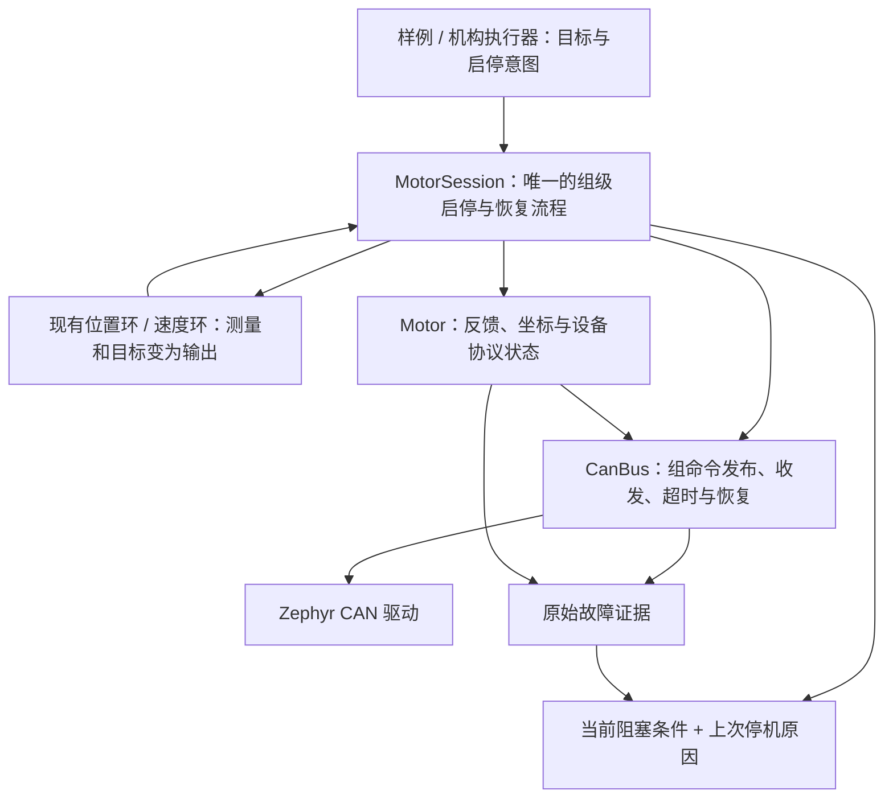

# 电机与 CAN 控制链收敛重构方案

日期：2026-10-05。范围由用户确认：先简化电机/CAN 控制链，再迁移整车。

本文最初是基于工作区源码及串口现场编写的重构方案。用户随后明确禁用古法编程模式，已实施第一批电机/CAN 控制链收敛：统一诊断、`MotorSession`、双电机及单电机速度/位置示例迁移。下面的原始问题描述保留为设计背景，后续阶段仍属于计划。

当前实现与使用边界见 [MotorSession 首批实现与接入说明](电机Session首批实现与接入说明.md)。共享 CAN 的分组发布接口、四舵轮及其他整车执行器尚未迁移；现有整车路径继续使用原接口。双电机示例中上一轮诊断用的阻塞 TX 串行等待已删除。硬件 Bus-off 根因尚未确认，不能把架构重构当成现场故障已经解决。

## 1. 推荐方向

**保留协议编解码和 CAN 后台工作线程，统一电机组的启停、参考准备和恢复入口，统一诊断结果；随后替换应用里重复的生命周期流程。**

先让一组“GM6020 位置控制 + M3508 速度控制”成为完整、易用的控制单元，再将同一个入口迁移到单电机、四舵轮和云台。第一批不同时重写线程模型、CAN 协议和整车命令仲裁。

这里的“生命周期”只指初始化、等待反馈、准备参考、使能、运行、停机及恢复这条流程。它应由一个执行对象负责，而不应要求每个样例重新组织。

| 路线 | 能解决什么 | 代价与判断 |
| --- | --- | --- |
| 只改日志和名称 | 很快改善找错误的体验 | 应用仍要管理多套状态，只适合第一步 |
| 收敛现有职责，逐个替换调用方 | 同时简化正常使用和恢复，复用已有代码 | **推荐**；每完成一个迁移，删除对应旧流程 |
| 全部改成主循环直接收发 CAN | 表面调用很短 | 主循环卡住后的独立停机、异步发送、DM 握手和共享总线又需要重新补回；当前证据不足以支持重写 |

这次串口记录的首次停机有硬件 Bus-off 与发送回调证据。重构能改善定位和恢复体验，不能保证消除造成 Bus-off 的电气、时序或底层驱动问题。上一轮的逐帧等待只是诊断性尝试，不能据此规定两路 CAN 永久禁止并行。

## 2. 当前复杂在哪里

### 2.1 状态职责暴露得过多

当前双电机样例要同时操作：

```text
RcControlAdapter.run_allowed / arm_ready
    ↓
main.engaged / running / enable_ms
    ↓
PositionMotor.reset / VelocityMotor.reset
    ↓
Group.ready / enable_pending / active
    ↓
Motor.state / reference_generation / output_permitted
    ↓
CanBus.state / commit / last_tx / recovery
```

完整 robotics 路径还存在 `RecoveryGate` 和执行器自己的 prepared、retry、hard_error 等状态。底层各层描述的对象确实不同，不能简单删除所有状态；问题在于应用必须理解它们的组合和调用顺序。

### 2.2 `ready` 不代表同一件事

- `drivers/motor/motor.cpp::readyLocked()` 判断 Disabled、稳定反馈和安全输出准备等条件。
- `drivers/motor/group.cpp::ready()` 聚合成员上述条件。
- `lib/control/motor_control.cpp::PositionMotor::reset()` 另外要求位置参考有效。
- `Motor::requestEnable()` 还会检查绑定控制器的反馈/温度/参考要求。

因此 `group.ready()==true` 之后仍可能在 reset/enable 返回 -ENODATA。这与现场“ready=1，却 enable=-61”一致，不应要求用户自行推导这些隐藏前提。

### 2.3 原因没有丢光，但缺少统一解释

现有 `Group::trip()` 已保留一轮故障的首个来源；`CanBus::enterRecovery()` 已保存重启前快照。应复用这些证据，不另造一套互不关联的故障系统。

但 `dual_speed.cpp` 的 transport 分支仍统一报告 -ENETDOWN，用户还要从 Group 的 -114、Bus 的 hw=3、Motor 的参考状态拼出结论。另一方面，`BusStatus.last_error` 是历史错误，不能当作当前总线是否故障的布尔值。

还存在职责耦合：`VelocityMotor::fail()` / `PositionMotor::fail()` 会通过 `Motor::rejectControl()` 改变电机组状态；控制器不仅计算，还会触发生命周期变化。类似测量/温度判断在控制器与电机提交边界分别出现，规则来源难以追踪。

### 2.4 恢复需要应用掌握不必要的细节

反馈恢复不等于连续角恢复，控制器 reset 也不等于重新建立坐标。当前样例需要亲自安排 reseed → reset → group.enable，并维护使能超时；多个 executor 又各自安排同类步骤。

仓库此前已经移除了 GlobalSafetyManager 等旧对象，见 [命令仲裁与执行恢复](../modules/robotics/command-recovery.md)。本轮不要重复“新增执行器包一层”的旧方案，应进一步消除样例与执行器之间的流程分叉。

## 3. 目标职责：一个使用入口，底层各守边界



`MotorSession` 是建议新增的唯一公共生命周期对象，不新增线程。它替代样例中的 engaged/running/enable_pending 协调、通用参考准备与恢复流程。旧 `Group` 初期作为其内部的整组授权屏障保留；最终只负责成员一致性、授权代次和及时撤销，不再成为业务可任意调用的第二个启停入口。

| 所属层 | 应负责 | 应移走或隐藏 |
| --- | --- | --- |
| CAN 工作线程 | 收发队列、发送回执、总线恢复、输出超时、最后提交前的有效性检查 | 遥控拨杆、业务恢复手势、控制器参数含义 |
| Motor / 协议适配 | ID/单位转换、反馈、连续位置是否可信、DJI/DM 的真实协议差异 | 样例决定是否重新解锁的策略；对 PositionMotor/VelocityMotor 具体类的依赖 |
| 控制算法 | PI/PID、斜坡、滤波、输出限幅、算法状态 reset | 发 CAN、清驱动故障、决定整组进入哪个运行状态 |
| MotorSession | 检查启动前提、建立参考、reset、一次使能请求、停机与恢复、原因归并 | CAN 硬件寄存器；遥控具体按键与手势 |
| 机构执行器 | 舵轮运动学、云台目标、功率分配等机构功能；构造组命令 | 再维护与 MotorSession 平行的一套电机恢复状态 |
| 输入适配 | 遥控解析、模式选择、明确的 Start/Stop/Acknowledge 意图 | reseed、clearFault、重启 CAN |

第一阶段保留 `CanBus` 每物理控制器一个实例、每实例一个 I/O worker 的现状；同一 CAN 不能由旧实例和新实例重复占有。状态快照跨线程按值复制；不要为了“少几把锁”直接把工作线程可写数据交给主线程。

Zephyr 的异步 `can_send()` 返回和发送回调是两个时间点，RX 回调处于中断上下文；应保留有界队列与短回调。见 [Zephyr CAN 收发说明](https://docs.zephyrproject.org/latest/hardware/peripherals/can/controller.html)。

## 4. 将使用接口收敛到什么程度

以下是**目标接口草案**，尚未实现，命名和类型是为了明确契约，不表示可直接编译。

建议位置：`include/control/motor_session.hpp`、`lib/control/motor_session.cpp`。

```cpp
enum class SessionState { Stopped, Starting, Running, Blocked };
enum class ReferenceRecovery {
    NotRequired,                 // 速度轴
    CaptureOnExplicitStart,      // 台架：每次明确启动可定义新的相对中心
    UseCalibratedAbsolute,       // 有可信单圈标定，且机构允许据此重建坐标
    RequireExternalReference,    // 丢失多圈/机构位置后必须重新回零或取得外部参考
};

class MotorSession {
public:
    Result configure();
    SessionStatus step(const SessionInput &input, core::TimeUs now_us);
    void requestStop();
    SessionStatus snapshot() const;
};
```

构造时绑定固定容量的成员表，每个成员包含名称、Motor、控制器种类、参考恢复策略和限制；第一版只实现当前需要的位置轴与速度轴。复用现有 C 控制算法与配置，不为未来电机引入插件框架、运行期动态分配或复杂模板层级。

`SessionInput` 需要清楚区分两类数据：

- **意图**：本轮是否请求停止、新 Start 事件序号、可选 Acknowledge 事件序号。
- **目标**：各轴类型明确的目标值，目标自身的原始生产时间与序号；有上游来源时，还带来源的原始时间与序号。

Start/Acknowledge 必须来自新事件，读取缓存不能制造新事件。普通目标更新不等于再次授权启动。样例可以每周期产生新目标，但 Start 事件只在操作者明确启动时递增。跨板的启动身份与恢复代次继续由通信适配层核对，不能把本地事件序号直接当作跨重启凭证。

| 接口 | 返回与状态变化 | 调用环境及边界 |
| --- | --- | --- |
| `configure()` | 成功只完成静态装配，不运动；非法 ID、重复绑定、能力/单位不匹配返回结构化配置错误 | 控制线程启动前调用；不可重复 attach/start；同配置再次调用返回已有结果 |
| `step(input, now)` | 推进一次有界控制周期，返回完整状态；缺反馈、等待握手都是正常状态，不要求应用串联负 errno | 一个控制线程独占；不得 sleep 等待发送/反馈，不在 ISR 调用 |
| `requestStop()` | 立即撤销组授权、作废未发送运动目标，安排安全输出；重复调用不重复创建停机代次 | 控制线程调用；物理急停不依赖它；其他线程需通过现有消息边界传意图 |
| `snapshot()` | 复制上次发布状态，不改变源时间、授权或恢复进度 | 可跨线程读取，必须有短锁或现有 SnapshotCache 保护 |

`Result` 仅用于静态装配或非法 API 请求；运行中的等待与故障通过 `SessionStatus` 表达。保留底层 errno 供开发定位，调用方无需逐个解释它才能保持主循环运行。

目标使用方式示意：

```cpp
// main.cpp：定时由已有应用线程调用，不新开 Session 线程。
const auto operator_input = controls.snapshot();
const auto target = makeTargets(operator_input, session.snapshot());
const auto status = session.step({operator_input, target}, now_us);
logStateChange(status);
```

此示意省略了具体结构成员，不是拷贝即可运行的 C++。应先把本节契约实现完，再将 `dual_speed.cpp` 的手工启停、reset、参考准备和恢复分支整体替换。

## 5. 状态和正常操作怎样变简单

公共状态只保留四种；总线恢复和 DM 握手仍有内部状态，但应用不用按它们分支：

| 当前状态 | 含义 | 退出条件 |
| --- | --- | --- |
| Stopped | 当前不允许运动；通信可在后台恢复 | 新 Start 事件且输入有效，开始准备 |
| Starting | 已收到一次有效启动请求，正在完成可有界推进的准备/握手 | 所有前提满足且有准备边界后的新目标，进入 Running；停止、输入失效或故障则撤销本次请求 |
| Running | 当前组正在执行新鲜有效目标 | Stop、输入过期、底层撤销或控制错误时停止 |
| Blocked | 配置、未知驱动硬故障、缺少不可自动重建的参考等需要处理 | 对应根因消除，并按原因重新配置、回零或显式确认 |

Starting 要区分 `WaitingFeedback`、`PreparingReference`、`WaitingFreshTarget`、`DriveHandshake` 等阶段。使用一个阶段枚举表达正在做的事，不再复制成多个独立布尔值。准备期间控制线程仍需不断收到新鲜输入，不能存一条启动请求无限等待后突然执行；各阶段的等待期限在配置中明确，超期给出该阶段原因并撤销请求。

正常停止是信息事件，不记录为错误。稳定反馈等待是状态，不每周期打印错误。总线发生故障时立即停机，但底层自行恢复通信；恢复到可启动状态后，台架只要求一次明确的新 Start。

建议台架的操作契约为：**停止档 → 启动档**，缺什么前提直接显示。去掉把清错、准备和正常启动混在多拨杆长按组合中的做法。机构确实要求目标归中时，只检查与该机构有关的输入，并显示具体通道与数值。急停、未知驱动硬故障和未恢复的机械参考仍有明确处理要求，不能被普通启动动作清掉。

第一批先让现有 `RcControlAdapter` 转换为 Session 意图，保留当前手势；等生命周期迁移完成后，再按上述产品操作契约单独简化台架适配器。不要直接全局修改 common 适配器，连带改变发射或其他尚未迁移样例的动作。

## 6. `ready` 改成可解释的启动前提

对外提供 `can_start` 和具体 blocker，避免继续暴露一个无上下文的 ready：

```text
can_start = false
blocker = PositionReferenceLost
member = steer
action = CaptureOnNextExplicitStart
```

`can_start` 的含义应是“此刻已满足静态/测量/参考等准备条件，可以接受启动流程”，而非承诺接下来不会遭遇异步故障。实际发布前仍要再次核对最新授权与数据期限。

对允许在明确启动时自动准备的相对轴，状态应直接给出 `action=CaptureOnNextExplicitStart`，Session 能执行该动作，不要求用户手工调用 reseed。速度轴无需位置参考；绝对角轴与多圈轴必须按机构能力区分：

| 轴类型 | 通信恢复后动作 |
| --- | --- |
| M3508 速度 | 稳定速度反馈后 reset 速度环，不因连续角丢失阻止速度控制 |
| 台架相对往复 | 新 Start 时捕获当前中心，旧中心作废；明确约定目标是本次启动相对值 |
| 有可信单圈标定的舵向 | 按标定与机械范围重新建立允许的坐标；不能把任意启动位置当整车正前方 |
| 依赖未知圈数的多圈轴 | 报告 NeedHoming / ExternalReferenceRequired；反馈重新出现并不恢复丢失圈数 |

已有 `reseedPosition()` 和控制环 reset 继续复用，由 Session 内部按策略调用。不要在 `Motor::ready()` 中一刀切加入“必须有位置参考”，否则速度控制会被不需要的数据阻塞。

## 7. 错误必须直接回答三个问题

一次停止应直接说明：**谁先出了什么问题、发生在哪一步、现在需要什么动作。**

建议在现有 `FaultInfo` / `BusRecoverySnapshot` 基础上补充固定容量、无动态字符串的结构化字段：

```cpp
struct Cause {
    std::uint64_t event_id;
    std::uint64_t occurred_ms;
    SourceId source;       // 稳定的总线/电机标识，显示名来自静态配置表
    Operation operation;   // TxTarget / PrepareReference / ResetControl / Enable ...
    Reason reason;         // CanBusOff / FeedbackStale / PositionReferenceLost ...
    int native_error;      // 保留 Zephyr/协议返回值
    std::uint64_t tx_sequence;
    std::uint32_t can_id;
};
```

`SourceId`、`Operation`、`Reason` 都需要有限枚举或固定索引定义；上面是数据形状草案。保留底层已有 TEC/REC、硬件状态和原始驱动码快照，不把它们全部重复塞进每一层。

`SessionStatus` 明确分开：

- `current_blocker`：此刻为什么不能继续、需要等待还是执行何种动作；条件恢复后更新。
- `last_stop`：上一次使运行中断的首个已观测原因；后续参考丢失等结果不能覆盖它，恢复运行后也保留供查阅。
- `stop_progress`：已撤销软件输出、停机帧已发出、设备已确认、或总线不可达；与机械是否已经静止分开。

跨 CAN 的“首个”是软件观察顺序，不宣称已经证明物理因果先后。一个根因事件由底层生产，Group 和 Session 沿用事件 ID。多成员次生错误可以记录在有限事件缓冲中，但不反复重写首个停止原因。

建议的主日志形态：

```text
STOP event=27 group=swerve source=drive bus=CAN2 motor_id=3
     reason=CAN_BUS_OFF operation=TX_TARGET frame=0x200 native=-114
     action=WAIT_BUS_RECOVERY_THEN_START
STATE group=swerve state=Stopped blocker=STEER_REFERENCE_LOST
      action=CAPTURE_ON_NEXT_START last_stop_event=27
```

上面是设计示例，不是新采集的实机输出。状态发生变化才打印主日志，每秒摘要只显示状态与计数；原始诊断用单独详细级别。每个等待阶段同时显示进度，例如 `feedback_stable=18/30 ms`，不用让操作者猜长按、稳定窗口或截止时间。

在 C 控制包装层增加精确拒绝原因，例如 InvalidDt、TargetOutOfRange、OverTemperature、MissingPosition；之后由 Session 决定状态变化。暂时保留原整数返回值给旧调用方，新路径不再把所有 -ERANGE 都显示为 ControlRejected。

## 8. 保留哪些检查，删掉哪些重复决策

| 检查/机制 | 决策来源 | 处理方式 |
| --- | --- | --- |
| ID、能力、减速比、单位匹配 | 静态装配 | configure 一次，指出具体配置项 |
| NaN、非法协议值、最终电流/力矩上限 | 编码/提交边界 | 必须保留；不能因上层算过就允许非法字节上总线 |
| 反馈过期、命令过期 | CAN worker 的最终输出边界 | 必须保留；控制线程卡住时仍能撤销目标 |
| 温度、超速、控制所需反馈字段 | 一份成员限制/要求 | 共享同一配置与判定语义；不同线程必要的再次核验不等于两套政策 |
| 目标限速、滤波、正常饱和 | 控制算法 | 合法目标可以按既有约定平滑/限幅，并报告饱和；不要把正常饱和当系统故障 |
| 参考重建与 reset 顺序 | MotorSession | 应用不再亲自编排 |
| 联动停止范围 | 固定成员组 | 舵向/驱动等真正耦合成员一起停；无关机构不因共用 CAN 就合并成一个故障组 |
| 授权代次、停止代次、异步回执匹配 | 驱动内部 | 保留并隐藏，防旧目标、旧回调恢复输出 |
| 遥控手势、是否重新 Start | 输入适配与明确的恢复策略 | 不扩散到 Motor、CanBus、控制算法 |
| 普通通信暂态的自动重试 | CanBus 内部 | 不反复要求 clearFault；重连不自动恢复运动 |
| 驱动硬故障/急停确认 | 明确原因对应的恢复动作 | 与普通重新启动分开，禁止全组无差别循环清错 |

保留两处数据期限核验的理由要写在代码旁：Session 在计算前判断能否控制，CAN worker 在真正发帧前防止排队期间数据过期。这是不同时间边界，而不是简单复制两套状态机。

## 9. 发送接口的最终形态

当前 `CanBus::commit()` 发布整个总线上的暂存目标，调用方必须协调写入与 commit。迁移整车时，共用同一 CAN 的独立机构不能各自随意全总线 commit，否则会发布另一机构尚未完成的半批目标。

目标接口采用**组范围的命令批次**：

```cpp
PublishResult CanBus::publish(const GroupCommandBatch &batch);
```

契约必须同时规定：

1. batch 标识固定成员组、授权代次、单调批次序号，以及各成员输出和原始产生/失效时间。所有字段合法后一次复制；失败时不能只更新半个 batch。
2. 返回成功仅表示接受发布，实际 TX 成功或失败通过回执记录。当前接口调用不阻塞等硬件发送。
3. CAN worker 按成员保留最近有效输出，再按 DJI 的 0x200/0x1FE 槽位合成报文；某个成员失效只将对应槽置安全值，不擦掉另一独立组仍有效的目标。
4. 因同报文另一组更新而重新发送一个槽，不能刷新这个槽自身的命令生产时间。否则一个存活线程会掩盖另一个控制线程停产。
5. 一组跨两条 CAN 的软件授权可以一起撤销，物理帧不能保证同时到达。第一条已发、第二条失败时，立即撤销整组并优先安排安全输出；已经交给硬件的残留帧按现有授权/在途语义处理。
6. 停机请求先撤销权限，再清未发送运动批次，安全报文优先；普通命令不能靠覆盖邮箱挤掉停机动作。
7. 一张固定注册表决定每个端点由谁写；拒绝两个 Session 争写同一电机。ISR 只投递事件，worker 才做协议合成与生命周期事实更新。

第一阶段**不立即重写此接口**：先在当前双 CAN、每 CAN 一个成员组的台架中，允许 Session 内部使用旧 commit，并在配置时拒绝不受支持的共享总线装配。完成上述 publish 语义后，再迁移共用 CAN 的云台/发射等组合，删除旧的应用自行 stage+commit 通道，避免长期并行两种写法。

上一轮 `commitTarget()` 的 2.5 ms 同步等待不作为 MotorSession 的默认组成部分。若实机证明某个板级时序约束必需，应作为该板的发送调度策略放入总线服务，并公开增加的最坏延迟；不能让所有控制器用忙等或逐帧轮询承担它。

## 10. 按三个交付阶段实施

### 第一阶段：让当前故障一行可解释

连续完成以下修改，不在中间扩展成全项目整理：

1. `include/drivers/motor/motor.hpp`：扩展现有 FaultInfo 的操作与来源语义，保留旧字段兼容调用方；当前阻塞与历史故障命名分开。
2. `include/drivers/motor/can_bus.hpp`、`drivers/motor/can_bus.cpp`：在已有回执/恢复事件中生产原始故障上下文；复用当前快照，不另开诊断线程。
3. `lib/control/motor_control.cpp` 与两个控制包装头：提供精确的准备/拒绝原因，区分参考、测量、周期和目标；旧 int 接口暂时映射到同一实现。
4. `samples/robotics/swerve/src/dual_speed.cpp`：采用统一原因格式，分别显示 current blocker 与 last stop，保留现场诊断证据。

完成标志：Bus-off 原因、总线、电机、操作和下一动作可以直接看到；`ready` 不再被解释为“肯定能启动”。这一阶段不改 PID、总线位时序或硬件映射。

### 第二阶段：只在双电机链中完成生命周期收敛

1. 新增 `include/control/motor_session.hpp` 与 `lib/control/motor_session.cpp`，在 `lib/control/CMakeLists.txt` 的现有电机控制开关下纳入编译。
2. 复用 `Group` 的联动授权和 `Motor::reseedPosition()`，把参考策略、reset 顺序、使能推进和重新 Start 的处理迁入 Session。原始 `Group` 不对新样例公开可变访问。
3. 用现有 `motor_position.c`、`motor_velocity.c` 作为计算内核。逐步把 C++ 包装层的“报错即改变 Group”改为返回类型明确的结果，由 Session 撤销；直到新提交边界能覆盖原保护语义，才删除旧 fail 副作用。避免迁移中出现无人停机的空档。
4. `dual_speed.cpp` 整体删除原 engaged/running、手写 reset/enable/reseed、使能超时和多处分支停机流程，改为生成意图/目标、调用 step、打印状态。
5. `board_config.hpp` 集中静态成员名称、ID、限值、参考策略和恢复等待参数。不要另引入 YAML 或运行期配置解析。
6. 当前台架入口迁移完成后，将同样入口用于单电机速度/位置样例；其行为差异只来自成员配置，而不复制另一套恢复流程。

完成标志：样例中不再直接调用 clearFault/reseedPosition/控制器 reset/group.enable，不根据底层 BusState/MotorState 手写恢复分支。调用者遇到普通等待，只显示 SessionStatus。

### 第三阶段：共享总线与整车迁移

1. 在 CanBus 实现第 9 节的组范围发布，统一控制器反馈要求与提交边界的规则来源；保持已有有界 worker 与回执机制。
2. 将 Motor 内 DJI 与 DM 的协议推进代码整理为内部函数或独立实现文件。保持现有封闭的 `std::variant` 选择；先不增加虚函数插件系统。协议真实差异留在适配内部。
3. 迁移 `include/robotics/chassis/swerve_hardware.hpp`、`lib/robotics/chassis_executor.cpp`：运动学/功率仍归底盘，电机组通用准备与恢复归 Session。
4. 再迁移 gimbal/shooter/big_yaw executor。每迁移一个机构就删除该处与 Session 重叠的恢复逻辑；发射动作和机构回零等专用流程保留。
5. 处理 `applications/sentry_chassis/src/chassis_executor.*` 与库内同名执行器的流程重复，应用封装只负责板间输入和状态适配，不复制电机恢复状态机。
6. `RecoveryGate` 中仍有用的源命令边界规则迁入统一授权路径或上游命令适配，不能在 Session 外再串联一套同义电机 Enabling/Active 状态。跨板 boot_id/恢复代次检查继续保留，不改现有线协议数值。
7. 最后收敛 `rc_controls.hpp` 的台架启停体验。旧 API 无调用方后删除；不要长期留下 legacy/v2 两套行为。

完成标志：共享物理总线只有一个收发所有者，每个电机只有一个命令写者，每个耦合机构只有一个生命周期决策者。

## 11. 关键实现顺序伪代码

放入拟新增的 `MotorSession::step()`，描述责任先后，不是现有实现：

```text
读取一次输入与成员快照
先处理 Stop、来源失效、驱动已撤销等必须立即停机的条件
    只在状态转换时撤销授权，保留首个停止原因
收集工作线程产生的原始故障事件，更新 current blocker
保持通信恢复在 CanBus；Session 不循环调用 start/clearFault
Stopped：
    仅消费新的 Start 事件；旧事件不重放
Starting：
    保持输入新鲜；推进一个明确阶段，受阶段截止时间约束
    检查稳定反馈 → 按策略准备参考 → reset 控制历史
    记录准备完成边界，等待该边界之后的新来源/目标
    只发出一次整组 enable；之后根据快照等待握手
Running：
    使用本周期完整快照计算所有成员输出
    任一成员计算失败：整组停止，本周期不提交部分新输出
    全部计算成功：发布组批次；发布失败也撤销整组
发布 SessionStatus，保持当前条件与历史原因分开
```

时间只由同一个单调时钟提供；毫秒与微秒边界显式换算。稳定窗口、命令 TTL 和发送截止时间含义不同，不能为了少参数合并成一个 timeout。保留现有工程参数作为首版基线，不在架构迁移中顺带扩大超时。

## 12. 构建与后续硬件观察

本轮仅交付设计。实施时先连续完成选定阶段；根据当前 implementation-first 规则，完成后最多做一次语法/编译检查，不自行增加审查、测试代码或运行测试。

第二阶段台架的建议构建命令：

```sh
west build -b dm_mc02/stm32h723xx samples/robotics/swerve -d ../build/swerve_session
```

这条命令尚未执行。整车迁移到哪个应用，再使用那个应用已有的构建配置，不把未确认的整车接线配置直接设为已确认。

以下是用户后续若安排实板验证时的观察目标，不是本轮已执行的测试：先保持停止档、悬空固定轮组并确认独立断电手段，再上电等待反馈；正常启动只需一个明确动作，停止后不保留旧运动目标。若仍 Bus-off，应直接显示 CAN2、目标帧和原始错误，恢复反馈后应明确显示“可重新启动”或具体参考要求。相对台架新启动可重设中心，多圈机构参考丢失仍需真实回零；总线不可达时不能把软件 Stopped 当作机械已确认停止。

## 13. 交付边界与未验证项

- [x] 已按当前源码区分真实底层保护与应用重复决策。
- [x] 已确定先诊断、再双电机生命周期、最后共享总线与整车的迁移顺序。
- [x] 已定义拟议入口、状态、参考恢复、错误与线程责任。
- [ ] 新 MotorSession、结构化诊断与组批次发布尚未实现。
- [ ] 首次 CAN Bus-off 最终根因仍未确认；前一轮发送串行化效果也未实板验证。
- [ ] 台架简化手势是设计建议，尚未应用到任何遥控样例。
- [ ] 具体阶段截止时间、额外结构内存占用与运行时最坏延迟需在实施时按现有资源配置确定。

建议首先实现第一、二阶段，并以“样例不再编排恢复、停机原因可直接解释”为交付目标。共享总线和整车迁移应复用这份契约，避免把当前繁琐流程仅仅改名后搬进更多类。
