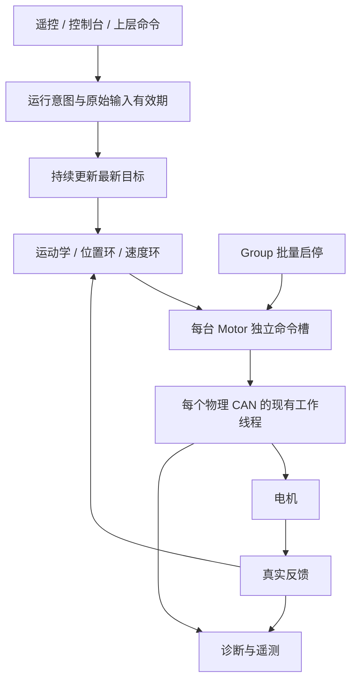

# 电机持续指令与独立自动恢复重构实施指南

本次直接实施，不保留旧 API、旧配置初始化、MotorSession、RecoveryGate 或板间 v3 协议的兼容层。用户已明确禁用本任务古法编程模式；本文与源码迁移同批交付。构建结果以任务最终报告为准，下面的人工场景尚需实板验收。

## 1. 先理解新的执行契约

上层持续提交目标，每台电机独立执行、独立等待、独立恢复。必须分别观察运行意图、最新目标和实际状态，不能再把三个概念塞进一个 active 标志。

| 信息 | 所在位置 | 含义 |
|---|---|---|
| 用户运行意图 | 命令入口、MotorSnapshot.enabled_requested | 是否要求设备运行，离线不撤销 |
| 最新合法目标 | 控制器目标、Motor 命令槽 | 新值覆盖旧值，不积压历史 |
| 实际可执行性 | MotorState、真实反馈、输出有效标志 | 本轴当前是否能执行 |
| 原始输入年龄 | CommandSnapshot/sourceStamp、板间消息 | 判断生产者是否仍在生产输入 |
| 本轴计算版本 | MotorSnapshot.enable_generation | 防止恢复后发送旧 PID 输出 |
| 坐标参考版本 | reference_generation | 判断连续位置参考是否仍可信 |
| 历史故障 | last_fault、总线历史错误 | 供定位使用，不等同于当前等待原因 |

`enabled_requested == true && state == Offline` 是合法组合。无物理电机时启动成功表示请求已保存，不表示机械已经运动。

明确保留：用户主动停止、急停、输入过期、必要数值范围、已启用的功率控制、真实位置参考。删除：组内故障传播、恢复后的重新授权、全员反馈屏障、重复温度和实测超速锁停、舵轮对齐门控、恢复 generation 协议字段。

合法的“电机不存在”指 Motor 对象、型号、CAN 配置和槽位正确，但设备没有响应。空指针、重复槽位、非法单位、非有限目标等仍是调用或配置错误。

## 2. 数据流与线程归属



不增加恢复线程，不创建替代 Session 的通用管理器。应用执行线程依次更新所有控制器，然后每个物理 CAN 每周期 commit 一次。多个机构共用 DJI CAN 时先全部暂存，再统一提交；不能每个机构自行 commit 同一物理总线。

CAN 回调只记录事件，工作线程推进协议。跨线程快照按值复制。锁内不等待反馈、不休眠、不重试。

## 3. 文件级实施顺序

连续完成以下迁移，然后进入最终统一编译，不保留双路径过渡阶段。

| 顺序 | 文件 / 目录 | 最终形态 |
|---:|---|---|
| 1 | include/drivers/motor/motor.hpp、motor_types.hpp；drivers/motor/motor.cpp | 运行意图独立，离线 setter 接受目标 |
| 2 | include/drivers/motor/group.hpp；drivers/motor/group.cpp | 仅批量 enable/disable 和统计 |
| 3 | include/drivers/motor/can_bus.hpp；drivers/motor/can_bus.cpp | Recovering 可发布，各端点限频恢复 |
| 4 | include/control/*、lib/control/motor_control.cpp | 目标接收与 PID 输出有效性分离 |
| 5 | include/robotics/swerve/*、lib/robotics/swerve.cpp、vehicle/swerve_profile.hpp | 舵向和轮驱独立推进，无对齐门控 |
| 6 | lib/robotics/{chassis,gimbal,big_yaw,shooter}_executor.cpp 及头文件 | 输入有效性直接检查，无恢复授权阶段 |
| 7 | lib/robotics/gimbal_axis.cpp、inertial_gimbal.cpp | 保留业务目标，按真实数学输入等待各轴 |
| 8 | include/communication/interboard/*、lib/communication/interboard* | v4、boot/link 边界与原始年龄 |
| 9 | samples/motor/*、samples/robotics/*、samples/communication/interboard | 调用方同批迁移 |
| 10 | 两个 sentry 实际公共入口和历史文件、现行文档 | 一套执行路径，无旧教程冒充现行行为 |

现有数值换算、PID 数学、运动学归一化、斜坡、翻转优化、CAN 位时序及厂商协议编解码继续复用。本次不顺带调 PID、机械减速比、电流上限或轮径。

## 4. Motor：请求和实际状态分开

### 4.1 公共操作

| 操作 | 参数 / 返回 | 行为 |
|---|---|---|
| enable() | 0 表示请求接受 | 保存持续运行意图；重复调用不重启握手 |
| disable() | 0 表示本地请求接受 | 撤销运行意图，取消停止前的命令和旧协议操作 |
| setCurrent/setTorque | A / N·m | 保存最新直接命令，离线也接受 |
| setMit | 厂商 MIT 命令 | 保留协议能力、数值范围校验 |
| setVelocity | rad/s | 保存最新原生速度命令 |
| setPositionVelocity | rad、rad/s | 保存最新原生位置速度命令 |
| setCurrent/setTorque(value, sampled_enable_generation) | 计算时快照版本 | 保存计算输出，实际发送时检查版本 |
| invalidateComputedEffort() | 返回调用结果 | 只作废计算输出，不 disable、不撤销意图 |
| reseedPosition(known_position_rad) | 可信已知坐标 | 更新本轴连续位置参考，不影响其他轴 |
| snapshot() | 按值快照 | 纯观测，不推进生命周期 |

删除 ready()、公共 clearFault() 和 Group 输出授权。驱动器清错由工作线程内部完成。

setter 的负返回值只表示调用错误：非有限值/非法参数为 `-EINVAL`，超过明确数值范围为 `-ERANGE`，协议不支持为 `-ENOTSUP`，producer 不匹配为 `-EACCES`，内部单调计数耗尽为 `-EOVERFLOW`。离线、握手和硬件故障不作为 setter 的调用错误。

### 4.2 最新命令与取消

每台 Motor 仍只有最新值，不建立断线命令队列。

1. 合法新值覆盖旧值，记录原始写入时间和 revision。
2. 断线保留运行意图，保留最新直接目标。
3. commit 只发布，不把目标时间改成当前时间。
4. 用户运行→停止时推进取消版本、作废旧命令、撤销输出，并取消旧使能/清错操作。
5. 重复已停 disable 幂等，不反复增加取消版本或擦掉停止后新提交的目标。
6. 后续 enable 不能复活停止前的命令；停止后新提交的命令可以在重新 enable 后执行，仍须新鲜。
7. 软件停止受理不代表机械瞬时停止；已交给硬件的帧仍可能完成。

内部保留不同用途的版本，不能把它们重新合并成恢复授权：

| 版本 | 推进时机 | 检查对象 |
|---|---|---|
| cancellation generation | 明确撤销运行意图 | 旧候选命令 |
| protocol operation generation | 取消/重试异步协议操作 | 迟到发送回调、握手确认 |
| enable_generation | 本轴真正重新进入可执行状态 | PID/运动学计算输出 |
| reference_generation | 可信坐标改变或失效 | 连续位置计算 |

由反馈计算的电流必须使用计算时的快照版本。禁止提交前再读当前版本给旧输出贴新标签。

控制封装已绑定 producer，必须通过保留身份的私有 `setCurrentFrom(this, value, sampled_generation)` / `setTorqueFrom(...)` 提交。直接使用公共重载会丢失 producer 身份。绑定只防止多个控制器竞争一个电机，不携带温度、超速、准备或恢复策略。

### 4.3 硬件异常的归属

| 异常 | 本轴处理 | 上层目标 |
|---|---|---|
| 反馈过期 | 等待反馈、协议独立恢复 | 继续接收 |
| 命令过期 | 不再发送旧目标；新命令可恢复输出 | 不锁存人工复位 |
| Enable 超时 | 按 retry_interval 重试 | 继续接收 |
| 驱动真实故障 | 限频 ClearError，故障持续则等待 | 继续接收 |
| CAN 故障 | 所在总线恢复 | 其他总线继续，故障总线也继续接收发布 |
| 无效调用 | 返回错误并记录 | 不把程序错误升级为硬件故障 |

真实温度/故障码仍可记录。删除软件层重复的温度及实测速锁停，不修改厂商固件的故障保护。

## 5. Group 与 CAN

### 5.1 Group 的全部职责

```cpp
int enable();
void disable();
GroupStatus status() const;
```

GroupStatus 只有 member_count、enabled_count、active_count、offline_count、fault_count。统计是逐成员快照的组合，不承诺全成员同一瞬间的事务视图。

enable 遍历所有成员，即使第一个返回错误也继续投递；结束后返回首个调用错误。disable 遍历所有成员。构造仍检查空成员、重复成员和容量。

删除 ready/active/clearFault、permits/trip/memberPrepared、prepared 数组、Group generation、fault latch、stopping、enable_pending、blocking_member 和成员所有权关系。一个成员故障不调用其他成员 disable。

### 5.2 发布和发送分离

CanBus::commit 在 Running 和 Recovering 都接受最新发布。未启动或配置错误可以返回调用错误。运行时异步发送错误记入总线诊断，由现有工作线程恢复；上层不撤销用户意图。

enterRecovery 保留最近发布的数据及时间，取消旧传输操作，只使本物理总线上的端点暂时不可执行。recoverController 不再全员 requestDisable；恢复 Running 后重新安排最新发送单元，各 Motor 按运行意图推进。

现有一个 in-flight 回调上下文不可在旧回调仍可能到达时复用。控制器停止、排空旧回调、重新启动的顺序必须保留。每个回调校验自身操作版本，迟到 enable 回调不能使已停止电机重新输出。

### 5.3 工作线程逐端点推进

```text
本轴没有运行意图：处理明确的停止请求
本总线不可用：等待控制器恢复，接受上层发布
真实驱动故障且重试时间已到：安排本轴清错
本轴未使能：安排本轴使能/探测/确认
协议可执行：发送新鲜、未取消、计算依据仍有效的最新命令
没有有效输出：只处理本轴零输出/等待
```

DM 的使能/探测不能依赖已经收到新鲜反馈，否则会变成“发送才能得到反馈、得到反馈才允许发送”。保留厂商 Enable、Disable、ClearError 和必要确认，不引入全组准备。

协议重试限频并轮转：到期的离线 DM 端点不能一直抢占目标帧。一次推进只做有界工作；下次唤醒时间由实际到期时间计算，禁止永久零等待忙等。停止请求有优先级，但同样不能形成无限重发。

Timing 用具名字段，删除 recovery_stable_ms：

```cpp
.timing = {
    .feedback_timeout_ms = 50,
    .command_timeout_ms = 20,
    .enable_timeout_ms = 3000,
    .retry_interval_ms = 100,
}
```

迁移旧四数初始化时，旧第三个数是稳定时间，旧第四个数才是 enable 超时。不能机械把四个数字继续填给新四字段。

### 5.4 DJI 帧按槽位构造

每个槽位分别检查运行意图、协议状态、反馈新鲜度、命令时间、取消版本及计算版本。不可输出的槽位置零，其他槽位保留各自正确电流；不能因为某个成员在停止/离线而将整帧清零。

当前单舵轮的 ID3 映射：

| 电机 | 接收反馈 ID | 控制帧 ID | 控制槽 |
|---|---|---|---|
| M3508 ID3 | 0x203 | 0x200 | 槽 2，字节 4–5 |
| GM6020 ID3 | 0x207 | 0x1FE | 槽 2，字节 4–5 |

M3508 的 1 A 按现有换算约为 819，即 0x0333；负 1 A 约为 -819，即有符号 16 位的 0xFCCD。控制电流词继续用厂商要求的大端，不要与板间小端混淆。

## 6. 控制器：目标接收与输出有效性分离

VelocityMotor::update(target, dt) 和 PositionMotor::update(target, dt) 的返回值表示目标接收调用是否成功。合法目标先保存，离线也递增 target_sequence。

Telemetry 使用 target_valid、target_sequence、output_valid。普通等待的 error 是 0，issue 表示当前原因；历史故障在 Motor 快照里。删除旧含义混杂的 valid、ControlFailurePolicy、MotorSafety、Config.safety 和 preflight。

处理顺序：

```text
配置/目标/周期参数校验
→ 保存最新目标与序号
→ 读取本轴快照
→ 所需反馈或参考不可用：作废旧计算输出，返回 0
→ 有限周期超范围：跳过积分，作废本周期输出，返回 0
→ 首次/恢复/执行代次变化：从真实测量 reset，本周期提交零计算输出
→ 正常计算最新目标，携带计算快照的 enable_generation 提交
```

NaN、Inf、负周期属于调用错误。dt=0、有限但过短/过长周期属于跳过，下一正常周期自动继续。不补算断线时间的积分。速度轴不要求连续位置参考。

### 6.1 三种位置模式

| 模式 | 必要反馈 | 恢复语义 |
|---|---|---|
| AbsoluteNearest | 绝对角、速度 | 用绝对角重建本地短程连续坐标 |
| DriverContinuous | 可信连续位置、速度 | 参考丢失只等待本轴，可信 reseed 后继续最新目标 |
| StartupRelative | 可信连续位置、速度及首次原点 | PID 重置/电机恢复不重采首次原点 |

StartupRelative 的用户原点与 PID 的数学坐标原点是不同成员。reference_generation 改变不能重新赋值 initial_position_rad。reseed 后的坐标必须与旧原点的坐标系一致。

### 6.2 为什么需要局部绝对展开

GM6020 反馈间断后，驱动多圈位置可能失效并清 FeedbackPosition，但新的绝对角仍可用。AbsoluteNearest 和舵轮不能继续要求失效的多圈字段。

本地展开规则：首次或本轴重新激活时，以当前绝对角建立局部位置；同一执行区间内，只有新的反馈 timestamp 才累计一次最短角增量。相同 timestamp 重复读取不能重复累加。间断期间不猜测圈数。

```cpp
// 示意：在 PositionMotor / SwerveModule 内部维护，不能冒充驱动多圈参考。
if (new_epoch) {
    local_position = current_absolute;
    previous_absolute = current_absolute;
    previous_stamp = feedback_stamp;
} else if (feedback_stamp > previous_stamp) {
    local_position += shortest_angle(current_absolute, previous_absolute);
    previous_absolute = current_absolute;
    previous_stamp = feedback_stamp;
}
resolved_target = local_position + shortest_angle(requested_absolute, current_absolute);
```

当前 179°、目标 -179° 时采用约 +2° 最短误差。这个方法解决绝对角跟踪，不证明停电期间转过几圈。

## 7. 舵轮逐轴推进

ModuleFeedback 用 steer_valid / drive_valid，默认 false；携带舵角 timestamp、两轴执行代次及舵向参考版本。删除 steer_continuous_rad，局部展开放在模块内。

ModuleOutput 用 steer_output_valid / drive_output_valid 和两轴 sampled generation。舵向只需要新鲜绝对角及速度；轮驱只需要新鲜速度，不要求位置参考或电流反馈。缺电流字段只影响遥测。

删除 drive_enable_error_rad、drive_disable_error_rad、drive_ready 滞回、require_all_modules_aligned、permitted 参数及 cos(alignment_error) 缩速。

```cpp
drive_target_rad_s = optimized_wheel_velocity_m_s / wheel_radius_m;
```

保留最短转角、翻转优化、斜坡、PID 限幅、运动学速度归一化及 Hold/Coast。

舵向未知时保持此前翻转选择；首次无反馈默认为不翻转，不拿默认零角当测量。舵向恢复只重置舵向环，轮驱恢复只重置速度环。首次/恢复轴本周期从真实反馈初始化并提交零 effort，另一个轴继续。

SwerveChassis::step 逐模块、逐轴推进，收集首个真正调用错误，但不能中断后续模块或回滚正常模块的控制历史。运动学启动时以零角目标初始化，不等待八台电机上线。

## 8. 样例的具体控制循环

### 8.1 recovery

按键：e 设置持续运行意图；空格停止；! 停止并锁存用户急停；r 解除用户急停且保持停止。r 不清物理驱动故障。

```cpp
for (;;) {
    processKeys(run_requested, estop);
    if (run_requested && !estop) {
        recordCallError(drive.enable());
        recordCallError(axis.update(target_rad_s, dt_s));
    } else {
        recordCallError(drive.disable());
    }
    recordCallError(bus.commit().error);
    publishTelemetry();
    waitNextCycle();
}
```

上述为职责骨架，具体初始化及对象沿用本样例。recordCallError 只能记录，不修改 run、不停其他轴、不退出循环。删除按 e 检查 ready、enable 前手动 reset、只在 active update、状态异常清 run、一次错误退出的路径。

当前 DJI 配置是 M2006/C610 CAN1 ID1，目标 2 rad/s；可选 DM 是 J4310 MIT、ID1/master11，保留既有电流/力矩限值及 MC02 电源初始化顺序。本地固定目标每周期由程序生产，不能因为没有新按键就认为目标过期。

### 8.2 单舵轮默认入口

CMake 增加 SWERVE_DUAL_SPEED 默认 OFF：OFF 编译 main.cpp，ON 编译 dual_speed.cpp。它只选择两个现行演示，不是架构兼容开关。

main.cpp 每周期读取输入、更新最新目标、解算运动学、分别推进两轴、分别暂存有效计算输出/作废无效输出、分别 commit 两路 CAN、发送遥测。

删除 suspend 大闭包、RecoveryGate、全组 seeded/ready/hard_fault、稳定时间、清错重试、恢复参考保存、drive.reseedPosition(0) 和只有 command_updated 才 commit 的限制。

capture_startup_zero 若启用，只在第一份可信舵角到达时捕获一次；不等轮驱，也不在恢复时重采。

实际配置是 GM6020/CAN1/ID3、M3508/CAN2/ID3，日志从配置生成。2421 ticks 是已有机械零点，通信 ID 改为 3 不代表机械零点也应修改。等效轮径继续使用现有约 0.192032 m 配置，它不是实测轮径；保持既有速度归一化和电流限幅。

16 通道保持 JustFloat、现有非阻塞发送和发布周期：

| 通道 | 数据 |
|---:|---|
| 0–1 | vx、vy 最新目标 |
| 2 | 优化舵向目标角 |
| 3 | 实际绝对舵角，未知为 NaN |
| 4–5 | 舵向斜坡参考、角误差，无效为 NaN |
| 6–7 | 轮驱目标/实际 rad/s，实际未知为 NaN |
| 8–9 | 舵向计算/实测电流 A |
| 10–11 | 轮驱计算/实测电流 A |
| 12–13 | 遥控 fresh、用户 requested |
| 14–15 | 舵向/轮驱 output_valid |

无效计算电流显示 0，同时有效标志为 false；未知实际电流显示 NaN。不能用全组 active 同时清掉两轴通道。

### 8.3 dual_speed 与其他 Motor 样例

删除三个 MotorSession 使用入口和对应构建登记：dji_speed_control、dji_position_control、swerve/dual_speed。

自动演示时间轴从程序/用户启动时持续推进，不因电机状态归零。断线第 10 秒到第 15 秒，恢复后使用第 15 秒的目标。

dual_speed 的 GM6020 用 AbsoluteNearest。每次用户明确停止→启动时重新捕获一次绝对中心，运行中断线不重采中心、不重置时间轴。首次无舵向反馈只等待中心，3508 继续速度控制。恢复后追踪当前正弦相位，不重放断线期间目标。

其余 samples/motor 删除 waitForReady/waitForActive、掉线 break/return、手动 clear/重新 enable 流程。DM support 中名叫 Session 的硬件存储结构可改名 Hardware，不与已删除 control::MotorSession 混淆。device_is_ready(can) 仍是主控外设初始化检查，应保留。

## 9. 执行器与真正的整车入口

删除 include/robotics/execution/recovery_gate.hpp；sourceStamp 移入 command_source.hpp，继续提取原始生产时间。

各 Executor 的 Config 直接使用 command_timeout_ms/source_timeout_us。RunStatus 不再有恢复 generation；requested 与 member_count/active_count/waiting_count 是诊断。Disabled/Recovering/Active/Blocked 由当前输入及输出情况派生，不能反向决定上层是否生产目标。

用户停止、急停、输入失效可以 disable；电机状态变化不能撤销输入。transport_ready 仅表示实际命令来源/板间链路等前提，不再合并本地 CAN Running 状态。

SwerveHardware::read 按电机填充两轴有效性，不因一个缺反馈而提前返回。stage 遍历全部电机，逐轴提交带计算版本的输出或作废计算输出。

GimbalAxis 的 Rate 目标时间轴持续推进；电机恢复只重置内部控制历史。Hold 首次需要本轴真实角度才能获得 Hold 点，不能阻断其他轴。Limited 轴仍保留必要机械范围和可信校准参考。

InertialGimbalAdapter 保留惯性目标，不因 Motor 参考/状态变化撤销输入；IMU frame_id/epoch 是真实坐标参考，不能当成被删除的恢复授权 generation。缺本轴关节测量时，仅该轴依赖该测量的补偿输出等待，通过 yaw_output_valid/pitch_output_valid 表达；不可拿假关节角参与数学计算。

保留 shooter 原有动作、热量、事件消费、卡滞等业务规则，本次只迁移电机执行契约。离线期间不积压或补执行离散动作。RcShooterRequest 删除电机执行 state/generation 变化引发的人工 release_required，保留实际用户事件及原业务约束。

两个 sentry main 都调用 samples/robotics/common/vehicle_bench.hpp。优先迁移公共真实路径：

- chassis_bench 删除 authority_started 和 Group 状态变化后的 rc_adapter.withdraw。
- vehicle_bench 删除 release_requested 和执行状态反向 controls.withdraw。
- commit 错误只记录，不能 suspend 云台、拨盘和底盘全部机构。
- BigYaw 请求发送不依赖 BigYaw 反馈 ready/valid；真实关节角是回中计算的数据前提。
- 实际板重启或链路失联仍使输入失效；Motor 掉线不改变 boot 上下文。
- 已启用功率控制仍按真实功率/预算年龄处理，删除“信息必须晚于本次电机恢复”的附加边界。

## 10. 板间 v4 的精确布局

版本常量从 3 改为 4。删除四个 resume_generation 字段，无占位，无旧版本解码，无协商。

保留帧头 A5 5A、role、message ID、小端载荷长度、线上 frame sequence 和 CRC16。载荷从整帧字节 12 开始，总长度为载荷 N+14。

| 消息 | ID | v4 载荷 | 整帧 |
|---|---|---:|---:|
| Heartbeat | 0x0001 | 20 | 34 |
| ChassisControl | 0x0101 | 32 | 46 |
| BigYawRequest | 0x0402 | 36 | 50 |
| BigYawFeedback | 0x0403 | 24 | 38 |

以下偏移从载荷首字节计算：

| 消息 | 字段布局 |
|---|---|
| Heartbeat | 0 role；1 safety_state；2 ready；3 sync_requested；4 active_reasons(u32)；8 uptime(u32)；12 boot_id(u64) |
| ChassisControl | 0 mode；1 source；2 global_action；3 reserved=0；4 vx(float)；8 vy；12 wz；16 reasons(u32)；20 producer sequence(u32)；24 receiver_boot_id(u64) |
| BigYawRequest | 0 mode；1 permission.valid；2 permission.enabled；3 reserved=0；4 rate(float)；8 source_sequence；12 source_age；16 command_age；20 receiver_boot_id(u64)；28 permission_age；32 producer sequence |
| BigYawFeedback | 0 execution_state；1 ready；2 armed；3 valid；4 actual_rate(float)；8 reasons；12 last_command_sequence；16 source_sequence；20 production_age |

其余消息长度不变，但帧头统一 v4。不能直接传 C++ 结构体内存；继续逐字段 load/store 小端。Parser 严格比较唯一版本，v3 增加 version_errors 并拒绝。

Endpoint 删除 peer_generation 和大 Yaw 独立恢复上下文。仅实际 peer boot/link 改变可以建立新的输入基线，不再根据电机反馈做发送准入。

### 10.1 不让重发续期

frame sequence 表示通信发了多少帧；producer sequence 表示原目标真正产生了多少次。接收 ChassisControl/BigYawRequest 只有 producer sequence 前进才替换缓存，所以同一目标重发不能刷新首次接收时间。

ChassisControl 没有额外 command_age 字段，不为此破坏 32 字节布局。原遥控年龄由 OperatorControl.source_age 保护，执行命令停更由 producer sequence/首次接收时间保护。

带年龄消息发送时：原年龄 + 从原提交到本次发送的 elapsed；接收使用时再加本地接收后 elapsed。只对发送副本加年龄，不能把累加后的副本回写缓存，否则重复累加。

示例：输入 1000 ms，管理 1030 ms 发布并写 source_age=30；1080 ms 发送时为 80；接收后 15 ms 使用时为 95。通信仍在 poll 不代表 source_age 可以清零。

ready/armed 是诊断；valid 表示测量是否可用。都不能决定是否发送新的目标。两板同批刷 v4，不安排混合版本运行。

## 11. 删除清单与文档迁移

删除 MotorSession 头/实现/CMake 源登记及 SessionState/Phase/Cause、RecoveryAction、重复 ReferencePolicy、CanBus::exclusivelyOwnedBy。

删除 RecoveryGate 头文件与所有调用方。删除不参与构建的九个私有文件：

```text
applications/sentry_chassis/src/chassis_executor.hpp/.cpp
applications/sentry_chassis/src/chassis_hardware.hpp/.cpp
applications/sentry_chassis/src/board_config.hpp
applications/sentry_chassis/src/latest.hpp
applications/sentry_gimbal/src/gimbal_executor.hpp/.cpp
applications/sentry_gimbal/src/board_config.hpp
```

公共 lib/robotics 中同名 Executor 是当前实现，不在历史删除清单里。旧私有 board_config 不能覆盖现行公共校准。

SampleDiagnostics 删除 WheelGeneration/BigYawGeneration，InvalidProtocol 从 10 移为 8，Kconfig 范围同步 0..8。不提供旧编号兼容。UART 接收代次、IMU 参考 epoch、Motor enable_generation 和消息序号继续保留，它们不是恢复授权字段。

现行驱动、控制、恢复、板间和集成文档统一描述新契约。MotorSession 旧指南改为迁移说明；旧开发笔记只作为历史背景并指向本文，不能继续被当作现行操作教程。

## 12. 最终编译入口

全部接口和调用方完成后统一编译，不新增或运行自动化测试，不运行编译产物。本任务中构建结果另外报告。

```bash
west build -b dm_mc02/stm32h723xx samples/motor/recovery -d build/recovery_auto
west build -b dm_mc02/stm32h723xx samples/motor/recovery -d build/recovery_auto_dm -- -DRECOVERY_DM=ON
west build -b dm_mc02/stm32h723xx samples/robotics/swerve -d build/swerve_auto
west build -b dm_mc02/stm32h723xx samples/robotics/swerve -d build/swerve_dual_auto -- -DSWERVE_DUAL_SPEED=ON
west build -b dm_mc02/stm32h723xx samples/robotics/four_swerve -d build/four_swerve_auto
west build -b dm_mc02/stm32h723xx applications/sentry_chassis -d build/sentry_chassis_auto
west build -b dm_mc02/stm32h723xx applications/sentry_gimbal -d build/sentry_gimbal_auto
```

其余改动接口的实际样例同批编译，平台依 sample.yaml。不能通过关闭新接口模块规避编译错误。若 PATH 无 west，可使用工作区 `.venv/bin/west` 的实际路径。旧测试中“成员故障撤销全组”“恢复等待新 generation”的断言不属于新契约，不能为了旧断言重新引入已删除架构。

## 13. 实板上电和人工验收

保持现有板、电源和 CAN 配置，首次恢复运动验收让轮组悬空并留出转向空间。先启动控制板及输入，按明确启动，再断开/恢复单个电机供电。MC02 控制的电源开关继续按既有初始化供电延时执行，不把此延时改成全组恢复授权。

| 场景 | 应观察到 |
|---|---|
| 无电机按 e | run/enabled_requested 为 true，目标序号持续增加 |
| 后接电机电源 | 自动执行最新目标，不再按 e |
| 运行中掉电再上电 | 本轴自动恢复，其他轴继续 |
| 断线期间改方向 | 恢复用新方向，不重放历史 |
| 一个成员长期不存在 | 其他成员仍有输出，重试限频 |
| 同 DJI 帧一个槽位不可用 | 其他槽位电流词保持正确 |
| 一路 CAN 故障 | 上层 update/commit 继续，另一总线继续 |
| DM 握手超时或故障持续 | 本轴轮转重试，不锁住上层 |
| 离线期间主动停止 | 供电恢复后不复活旧命令 |
| 急停后供电恢复 | 不启动；r 解除也保持停止 |
| 舵向掉线/恢复 | 只改变舵向有效性和历史，轮驱继续 |
| 轮驱掉线/恢复 | 舵向继续，速度环独立重置 |
| 绝对角跨 ±π | 使用最短角误差 |
| 同 timestamp 多次读取 | 局部角度只累计一次 |
| 多圈参考丢失 | 只等待该轴，可信 reseed 后继续最新目标 |
| 转向尚未对齐 | 轮驱仍接收目标，无 cos 缩速 |
| 单次周期超限 | 本周期跳过，下一正常周期自动继续 |
| 原输入停更 | 消费者停止对应输出，重发/commit 不续期 |
| 旧使能回调迟到 | 不打开已取消输出 |
| 电机反复恢复 | 板间目标流不创建新授权边界 |
| 对端发 v3 | 明确拒绝并统计版本错误 |
| 两板 v4 | 按 boot、producer sequence 和年龄通信 |

### 定位顺序

| 观察 | 优先查看 |
|---|---|
| requested=false | 用户启停、急停、原输入年龄 |
| requested=true、target_sequence不变 | 上层是否仍生产目标、是否误用执行状态门控 |
| target持续、output_valid=false | 本轴必要反馈、位置参考、dt、当前等待原因 |
| output有效、轴不动 | Motor 实际协议状态、命令年龄、计算版本、CAN 当前状态 |
| 一轴失联拖停其他轴 | 残余提前返回、整帧置零、组级撤权调用 |
| 绝对角恢复仍等参考 | 是否错误要求 FeedbackPosition/position_reference_valid |
| 短暂调度抖动需要重新启动 | 是否残余硬错误锁存或输入 withdraw |
| 总线反复 Bus-off | 电气、接线、终端、电源、位时序及底层错误快照 |

本次架构迁移不证明现场 Bus-off 根因消除，不证明机械校准正确，也不能无依据恢复丢失的多圈坐标。诊断应分别显示当前等待原因和历史错误。

## 14. 完成标准

- [ ] 合法目标在 Offline/Fault/Recovering 时继续接收。
- [ ] 控制层不读取执行状态决定是否继续生产目标。
- [ ] Group 没有授权屏障和故障传播。
- [ ] MotorSession、RecoveryGate 和兼容外壳删除。
- [ ] CAN Recovering 保留最新发布和原始时间。
- [ ] 清错/使能/恢复限频且逐轴推进。
- [ ] 停止取消旧候选与旧异步回调。
- [ ] 计算输出携带计算时版本。
- [ ] 位置原点、局部数学坐标与 PID 历史分离。
- [ ] 舵向、轮驱、四模块独立推进且无对齐门控。
- [ ] 真实停止、急停、输入超时覆盖自动恢复。
- [ ] 板间只有 v4，无 resume_generation/旧解码。
- [ ] 实际公共入口和全部样例使用同一执行契约。
- [ ] 现行文档无旧恢复授权教程。
- [ ] 最终编译结果与未做的实板验收如实报告。
