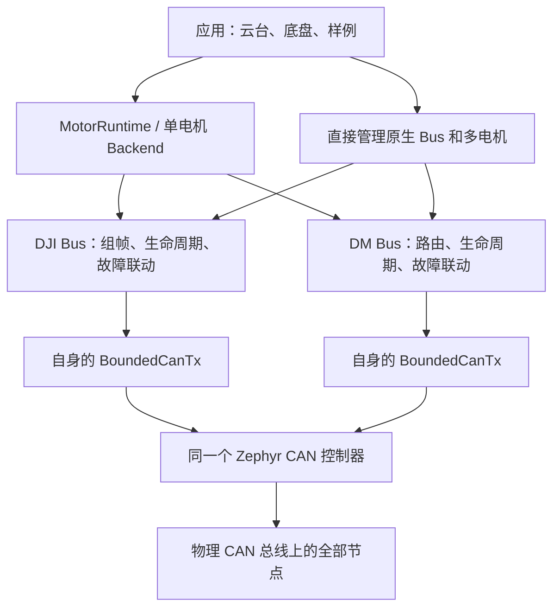

# 电机驱动复杂组合与掉线行为分析指南

分析日期：2026-09-23。依据当前工作区源码，仓库 HEAD 为 aa32bfc；包含尚未纳入 Git 的 samples/robotics/gimbal_control。Zephyr 本地版本与 west.yml 一致：6085aadeb337f27ee7411fa2ecbe8cf49164e360。

本次只读分析并生成本文，没有修改业务源码，没有编译、刷机或执行硬件故障测试。下文“会返回”“会调用”来自源码；电机实际停止时间、重新上电后的状态、通信丢失保护时间仍需实机确认。

## 1. 直接结论

**当前架构支持多电机和部分混合型号配置，但尚不具备完整的跨品牌共享 CAN 管理与可配置故障隔离能力。**

- 原生 DJI Bus 支持多台 M3508、M2006、GM6020 电流模式混挂，前提是反馈 ID 和命令槽位不冲突。一个 CAN 控制器只允许一个 DJI Bus。
- 原生 DM Bus 支持多台 DM，以及 MIT、位置-速度、速度模式混合配置；同一 Bus 内支持多个电机共享 Master ID。
- 一个 DJI Bus 和一个 DM Bus 可以初始化到同一 CAN 控制器，普通收发路径具备共存条件；但代码没有跨品牌 ID 校验、统一发送所有权、统一重启和统一恢复机制，不能据此认定各种掉线工况都得到可靠支持。
- 同一原生 Bus 中任一电机在 flush 时被判定异常，会撤销该 Bus 全部电机的命令：DJI 发所有已登记命令组的零电流帧，DM 给全部已挂电机发 Disable。
- “同一个 Bus”“同一物理 CAN”“同一应用子系统”是三个不同的故障范围。上层应用可以把停机扩大到多个 Bus；发送超时也可能通过停止 CAN 控制器波及另一个品牌。
- 现有单电机 Backend 不能直接组合成通用的共享总线多轴框架：多个 DJI Backend 同 CAN 会配置失败；多个 DM Backend 同 Master ID 会遇到重复接收过滤器问题。
- 当前没有“任意一台掉线后，其余电机按可配置策略继续运行”的通用能力，也没有移除离线电机的 detach 接口。

## 2. 当前架构与复用边界



设备树把型号、CAN、ID、限幅、减速比等固化成 motor device。公共 motor API 提供能力查询、电流/力矩写入、反馈和状态；它没有统一的品牌无关 Bus 或电机组管理器。

setCurrent/setTorque/DM 专用 setter 只更新命令缓存，真正发送依赖 Bus::flush。接收中断更新反馈缓存。电机数据使用自旋锁，但 Bus 生命周期、发送和恢复必须由应用统一串行调度；不能把电机缓存有锁理解为整个 Bus 支持多线程任意并发调用。

证据：[公共 API](/home/shm-white/skywalker_ws/skywalker_code/include/drivers/motor/motor.hpp:42)、[Backend 使用约定](/home/shm-white/skywalker_ws/skywalker_code/include/control/motor_backend.hpp:26)、[DJI flush](/home/shm-white/skywalker_ws/skywalker_code/drivers/motor/dji/dji_bus.cpp:238)、[DM flush](/home/shm-white/skywalker_ws/skywalker_code/drivers/motor/dm/dm_bus.cpp:298)。

| 组合或能力 | 当前支持程度 | 主要边界 |
| --- | --- | --- |
| 同 CAN，多台 DJI，同一个原生 Bus | 支持 | 所有成员共同 arm、flush、stop、recover |
| 同 CAN，M3508 + M2006 | 支持，需统一编号 | 同编号的反馈 ID 和命令槽均相同 |
| 同 CAN，M3508/M2006 + GM6020 电流模式 | 支持，需检查反馈 ID | 型号不同仍可能反馈 ID 冲突 |
| 同 CAN，多个独立 DjiMotorBackend | 不支持 | 第二个 DJI Bus::init 返回 -EBUSY |
| 多 CAN，各自一个 DJI Bus/Backend | 支持 | 原生驱动不会自动跨 CAN 联动；应用可以联动 |
| 同 CAN，多台 DM，同一个原生 Bus | 支持 | 支持按 Master ID + 数据内 motor ID 分发 |
| 同 CAN，DM 不同原生控制模式 | 支持配置 | 必须与驱动器实际模式一致，核对完整 ID 集合 |
| DM 原生位置/速度模式套 DmMotorBackend | 不支持 | 当前 Backend 仅接受 MIT，其他模式返回 -ENOTSUP |
| 同 CAN，多个 DM Backend，Master ID 相同 | 当前实现不可靠 | 每个 Bus 重复注册同一硬件过滤器，不能保证分发到所有对象 |
| 同 CAN，多个 DM Backend，Master ID 不同 | 普通收发有条件可行 | 缺少跨 Bus ID 校验和 CAN 控制器所有权；共用发送故障范围 |
| 同 CAN，DJI + DM | 有条件共存，架构支持不完整 | 跨品牌 ID、取消发送、重启、恢复需要统一管理 |
| 任意第三品牌 | 未实现 | 公共 API 可作为扩展入口，但没有现成协议/实例/Bus |
| 在线动态移除故障电机、剩余成员继续运行 | 未实现 | 无 detach、无成员故障策略配置 |

DJI 的 owner registry 只管理 DJI Bus；DM 仅声明单个 motor device 的 owner，未声明整个 CAN 的 owner。因此“DJI + DM 初始化成功”和“多个 DM Bus 初始化成功”是约束没有覆盖到这些组合，不能作为可靠共享的证明。

证据：[DJI CAN 所有权](/home/shm-white/skywalker_ws/skywalker_code/drivers/motor/dji/dji_bus.cpp:16)、[DM init/attach](/home/shm-white/skywalker_ws/skywalker_code/drivers/motor/dm/dm_bus.cpp:13)、[DM 电机所有权](/home/shm-white/skywalker_ws/skywalker_code/drivers/motor/dm/dm_motor.cpp:174)。

型号和能力也限制上层组合：目前 DM 仅注册 J4310-2EC V1.1 这一型号，不能推定其他 DM 型号无需适配即可使用。DJI Backend 输出单位为安培，DM MIT 为牛·米，Runtime 会检查单位；M2006 不声明温度反馈，若给它开启 Runtime 温度保护会因能力不足配置失败。AbsoluteNearest 位置控制要求绝对角能力，当前仅 GM6020 固定零点且减速比为 1:1 时声明该能力，DM 和其他 DJI Profile 不能直接替换。减速比、位置参考及上层安全参数都需要随电机组合调整。

## 3. 混挂配置必须检查哪些 ID

下表是当前代码采用的映射，不代表所有固件、所有系列电机。

| 电机/模式 | motor-id 范围 | 主控发送 ID | 电机反馈 ID |
| --- | --- | --- | --- |
| M3508 C620 / M2006 C610 | 1～8 | 1～4 用 0x200；5～8 用 0x1FF | 0x200 + motor-id |
| GM6020 电流模式 | 1～7 | 1～4 用 0x1FE；5～7 用 0x2FE | 0x204 + motor-id |
| DM MIT | 1～15 | motor-id | 配置的 master-id |
| DM 位置-速度 | 1～15 | 0x100 + motor-id | 配置的 master-id |
| DM 速度 | 1～15 | 0x200 + motor-id | 配置的 master-id |

DJI 每帧包含四个 16 bit 槽位；1～4 号槽索引为 ID-1，5～8 号为 ID-5。每次发完整帧，未填的槽位为零。DM 反馈的首字节低 4 bit 为电机编号，高 4 bit 为驱动状态。

证据：[DJI 映射](/home/shm-white/skywalker_ws/skywalker_code/drivers/motor/dji/dji_profiles.cpp:8)、[DM 控制 ID](/home/shm-white/skywalker_ws/skywalker_code/drivers/motor/dm/dm_protocol.cpp:99)、[DM 反馈分发](/home/shm-white/skywalker_ws/skywalker_code/drivers/motor/dm/dm_bus.cpp:119)。

**典型配置判断：**

| 配置 | 结论 |
| --- | --- |
| M3508 ID1 + M2006 ID2 | 可挂同一 DJI Bus，0x200 帧分别填槽 0、1 |
| M3508 ID1 + M2006 ID1 | 冲突；同一 Bus attach 返回 -EADDRINUSE |
| M3508 ID1 + GM6020 ID1 | 不冲突；反馈分别为 0x201、0x205，命令组也不同 |
| M3508 ID5 + GM6020 ID1 | 冲突；反馈都是 0x205，同一 Bus attach 拒绝 |
| 4 台 M3508 ID1～4 + 4 台 GM6020 ID1～4 | ID 布局可行；sentry_chassis 模板使用此布局 |
| GM6020 ID7 + DM MIT ID1、Master 0 | 当前映射无冲突；命令分别 0x2FE、0x001，反馈 0x20B、0x000 |
| DJI 反馈 0x201 + DM 速度 ID1 | 冲突；DM 控制 ID 也是 0x201，当前没有跨品牌拒绝逻辑 |
| GM6020 ID1 + DM Master 0x205 | 冲突；反馈进入同一 CAN ID，过滤器和解码语义互相干扰 |
| DM ID1 + ID2，同一 Master，同一 DM Bus | 支持；一个接收过滤器，再按低 4 bit 分发 |
| DM ID1 + ID2，同一 Master，各自一个 Backend | 不等价；两个 Bus 会注册重复过滤器 |
| DM 同模式、同 motor-id、不同 Master | 同一 Bus 会因控制 ID 相同拒绝；分成多个 Bus 后缺少这项全局校验 |

不要只比较 motor-id。需要按物理 CAN 列出所有设备的普通命令、特殊命令、反馈 ID，以及同线上板间通信/传感器占用的 ID。DM 的 Enable/Disable/ClearError 也发到该模式的 control ID。不同方向的帧依然使用同一物理 ID 空间。

有协议依据的共享是例外：一个 DM Bus 可以让多个 DM 电机共享 Master ID，因为它实现了帧内编号分发；一个 DJI 发送器可以把四个电机合并为同一命令 ID。跨品牌复用 ID 没有这样的统一解码规则。

MC02 板级 CAN 配置为 1 Mbit/s。所有实物节点仍需匹配位速率及协议模式，GM6020 必须确认为电流模式，DM 的模式与 PMAX/VMAX/TMAX 必须与配置一致。设备树不会把这些设置自动写入电机。

**重复过滤器是实际限制。** 本地 Zephyr CAN API 明确说明重叠过滤器的匹配优先级取决于硬件；MC02 使用的 M_CAN 在首个匹配过滤器处结束查找。本地接收实现只调用硬件给出的一个 filter index 对应的回调。因此，两个 DM Bus 共用 Master ID 时，前一个 Bus 可能收到全部帧并丢弃不属于自己的编号，后一个电机长期 Offline。[Bosch M_CAN 手册](https://www.bosch-semiconductors.com/media/ip_modules/pdf_2/m_can/mcan_users_manual_v331.pdf)、[本地 RX 回调选择](/home/shm-white/skywalker_ws/zephyr/drivers/can/can_mcan.c:763)。

跨品牌反馈 ID 冲突还可能制造“假在线”：例如 DM 正常反馈被 DJI 过滤器接收后，首两字节可能满足 DJI 编码器值小于 8192 的检查，错误更新 DJI 的反馈与时间戳。此时不是单纯收不到数据，还可能掩盖真正掉线。该结论是对现有解码条件的推导，未做实机注入验证。

## 4. 掉线检测时间与状态含义

| 检查 | Kconfig 默认值 | 当前部分应用覆盖 |
| --- | --- | --- |
| DJI 反馈超时 | 20 ms | 底盘、双轴样例仍为 20 ms |
| DJI 命令缓存超时 | 10 ms | 底盘、双轴、recovery 样例为 20 ms |
| DM 反馈超时 | 50 ms | 双轴样例未覆盖 |
| DM 命令缓存超时 | 20 ms | 双轴样例未覆盖 |
| BoundedCanTx 等待发送完成 | 2 ms | 写死在公共发送辅助类 |
| MotorRuntime 恢复稳定窗口 | 30 ms | 默认；可由 MotorSafety 修改 |
| MotorRuntime 普通恢复重试 / 进行中轮询 | 100 / 5 ms | 默认；可由 MotorSafety 修改 |

原生驱动的反馈/命令阈值是品牌级 Kconfig，不能在同一固件内为每台同品牌电机独立设置。MotorSafety 的恢复参数则可以按 Backend 配置。

**这些超时检查不是后台定时停机服务。** getState 根据查询时刻计算在线状态，snapshotCommand 在 flush 时检查反馈和命令年龄。如果控制线程不再运行、既不 flush 也不 stop，驱动不会到点自动补发零帧/Disable。MCU 卡死、任务阻塞时，最终行为依赖电机自身通信保护及系统看门狗。

正常周期执行、没有发送故障且时间戳可信时，反馈超时在“年龄大于阈值”后的下一次检查被发现，还需加调度和停机帧发送时间；不能把 20/50 ms 当成机械停止保证。若命令先停止更新，命令缓存超时可能更早触发。

状态也不是一回事：

- motor::State::Ready：反馈新鲜、未被判定故障；不代表已经 arm。DM Disabled 但反馈新鲜时也可为 Ready。
- BusState::Armed：软件允许使用当前生命周期的命令缓存。
- ExecutionState::Active：上层 Runtime 正在运行控制环。
- Fault 是锁存状态。DJI 整组故障后，仍有反馈的健康电机也返回 Fault；DM 已收到过反馈的成员也会被组故障锁存为 Fault。DM 从未收到反馈的成员优先返回 Offline。
- readFeedback 只是读取缓存，成功返回不代表新鲜；readRawFeedback/getDriveStatus 也不能替代时间戳和状态检查。

证据：[超时配置](/home/shm-white/skywalker_ws/skywalker_code/drivers/motor/Kconfig:15)、[DJI 快照校验](/home/shm-white/skywalker_ws/skywalker_code/drivers/motor/dji/dji_motor.cpp:313)、[DM 快照校验](/home/shm-white/skywalker_ws/skywalker_code/drivers/motor/dm/dm_motor.cpp:383)、[Runtime 恢复](/home/shm-white/skywalker_ws/skywalker_code/lib/control/motor_control.cpp:106)。

## 5. 复杂组合掉线行为矩阵

以下先描述原生 Bus 路径；应用提前发现异常并调用 stop 时，状态可能停留在 Safe，随后进入 Runtime 的 Waiting/Recovering，不一定先出现 Bus Fault。

| 场景 | 驱动动作 | 其他电机与恢复条件 |
| --- | --- | --- |
| DJI 同 Bus，一台反馈超时 | 下次 flush 的准备阶段失败，整 Bus Fault，清全部命令并尝试全部组零帧 | 同 Bus 其他 DJI 也撤销输出，不区分 0x200/0x1FF/0x1FE/0x2FE 组 |
| DJI 同 Bus，一台命令过期但反馈正常 | 与上项相同，常见准备错误为 -ESTALE | 不能靠只更新健康电机来自动隔离故障成员 |
| DJI 不同 Bus、不同 CAN，一台掉线 | 原生驱动只处理对应 Bus | 另一 CAN 无直接驱动联动；上层可能仍整机停 |
| DM 同 Bus，一台反馈超时 | flush 准备失败，全部成员 Disable、Bus Fault | Master ID 不同也不会隔离；恢复需要全部成员反馈满足条件 |
| DM 同 Bus，一台报告过流/过温/通信丢失等故障 | RX 先锁存该电机故障并撤销其缓存，后续 flush 触发全组 Disable | 状态故障无需等反馈超时；整组动作仍需应用线程执行 |
| DM 同 Bus，不同控制模式，其中一台异常 | 全部 Disable | MIT/位置/速度不构成独立故障范围 |
| 多个 DM Bus 共 CAN，一台掉线 | 逻辑动作只针对其 Bus | 重复过滤器、发送超时和控制器重启可能影响其他 Bus，不能承诺隔离 |
| DJI + DM 共 CAN，仅一台失去反馈，其余节点正常应答 | 异常品牌的 Bus 清零或 Disable | 不会直接调用另一品牌的 stop；另一品牌是否继续由应用决定 |
| 某品牌所有电机断电，另一品牌仍在线 | 异常品牌最终因反馈失效暂停 | 发送可能仍成功，因为其他品牌节点可以 ACK；不会仅凭发送成功判断掉线电机已停止 |
| 同 CAN 的全部应答节点消失 | 发送可能等待不到 ACK，触发发送超时及 can_stop | 整个本地 CAN 控制器受影响；停机命令无法保证到达 |
| 短路、位速率不一致等导致 CAN 错误或 bus-off | 发送返回错误，相关 Bus 进入故障，恢复由上层轮询推动 | 同控制器上的所有品牌共享故障；不把单纯缺 ACK 等同于必然 bus-off |
| 一台始终离线但已 attach | DJI arm 全组失败并零帧；DM arm 预检查失败，通常保持 Safe 且不发 Enable | 没有跳过离线成员的正常 arm 路径 |
| 暂时断线，反馈和命令年龄都未超过阈值 | 可能不触发软件停机/重置 | 物理输出取决于驱动器；不能保证每次瞬断都被识别 |
| 没有 attach 的实物电机掉线 | 不参与该 Bus 的成员检查 | 但可能影响 ACK、终端/线路；DJI 全帧中的空槽也会影响同组未管理的实物电机 |
| 应用忽略 setter 的范围/模式错误 | setter 拒绝新值，旧缓存可能继续有效直到过期 | 应用应检查返回值；setter 出错不一定立即使整个 Bus Fault |
| 控制线程完全停止 | 不再执行驱动检查和停机发送 | 超时宏不能取代设备侧通信保护 |

**发送成功不等于目标电机执行成功。** CAN 的应答只需要至少一个其他节点确认，不能识别特定电机是否在线。DJI 的 zero_sent 表示已登记零帧组全部发送成功；DM frames_sent 表示传输完成计数，均不能证明目标电机已执行停机。[Zephyr CAN 发送说明](https://docs.zephyrproject.org/latest/hardware/peripherals/can/controller.html)。

零电流、Disable 也不等于机械保持：惯性、重力轴下落、外力运动取决于机构。断线电机收不到主控停止命令，其失联保护时间不能从本仓库推出。

## 6. 恢复行为与边界

| 行为 | DJI 原生 Bus | DM 原生 Bus |
| --- | --- | --- |
| 故障处理 | 清所有缓存，置 Fault，尝试所有组零帧 | 清所有缓存，全部 Disable，置 Fault |
| stop | 正常成功到 Safe；原 Fault 保持锁存 | 正常成功到 Safe；原 Fault 保持锁存 |
| recover 入口 | 仅 Fault | Fault 或 Safe |
| recover 首阶段 | 再清缓存并发送零帧 | 全成员 ClearError + Disable，返回 -EINPROGRESS |
| recover 成功条件 | 所有已登记零帧发送成功；不在此阶段要求全部成员新鲜反馈 | 全成员在恢复起点之后有新鲜 Disabled 反馈 |
| 仍缺少一台 | recover 可先成功，但下一次 arm 仍失败 | 通常持续 -EAGAIN，约每 1000 ms 重新发恢复请求 |
| 重新 arm | 全成员反馈 Ready，先零帧，建立新 epoch | 全成员预检查；需要时发 Enable，每台最多等待约 100 ms 的 Enabled 反馈，再发中性帧 |
| 重用断线前命令 | 缓存清除并更换 epoch，旧值不能直接重用 | 同样清缓存、换 epoch |

epoch 是“第几次重新使能”的编号，用来拒绝上一次生命周期残留的命令；它没有跨品牌同步作用。

证据：[DJI recover](/home/shm-white/skywalker_ws/skywalker_code/drivers/motor/dji/dji_bus.cpp:316)、[DM recover](/home/shm-white/skywalker_ws/skywalker_code/drivers/motor/dm/dm_bus.cpp:351)、[DM 恢复反馈条件](/home/shm-white/skywalker_ws/skywalker_code/drivers/motor/dm/dm_motor.cpp:369)、[DM arm 握手](/home/shm-white/skywalker_ws/skywalker_code/drivers/motor/dm/dm_bus.cpp:199)。

有三项需要特别留意：

1. **DM 短暂重启后可能是 Disabled，但原生 Bus 仍为 Armed。** 如果反馈没有过期，原生 stageFrame/snapshotCommand 只排除故障状态，没有要求 Enabled。结果可能是继续发命令，但驱动器未使能。DmMotorBackend::read 会在 Bus Armed 时拒绝 Disabled，从而触发上层暂停/恢复；直接调用原生 Bus 的应用需要自行覆盖这一状态。
2. **多帧发送不是原子操作。** 所有成员先做快照检查，但发送按帧顺序发生。后面一帧失败时，前面的电机可能已经收到本周期目标；随后补发零帧/Disable，不能回滚已经发生的输出。DM arm 同理，前面的成员可能先 Enabled，后面的成员才超时。
3. **恢复后的位置不一定延续断线前坐标。** DJI 原生编码器累计不会自动补出断线期间的转数；Runtime 恢复会调用 resetMeasurementReference，1:1 固定零点轴按校准单圈位置重建，其余轴重置参考。DM Backend 也重置连续角展开。不能把重新联机等同于恢复全部多圈位置；上层应重建目标和积分状态。

上层 Runtime 默认等待新鲜反馈稳定约 30 ms 才进入 Ready；只有应用调用 resume 才 Active。应用是否自动调用 resume 各不相同：recovery 样例保留 run=true 时会恢复运动，双轴样例要求遥控器重新走解锁流程，底盘使用新的恢复代次和命令门控。不能概括成“整个仓库掉线后都自动继续”。

## 7. 共总线时影响故障隔离的核心缺口

**发送器假定独占 CAN，品牌 Bus 却没有统一保证这一点。**

BoundedCanTx 每个 Bus 各有一份。2 ms 内没有收到发送回调时，它调用 can_stop(can) 取消传输；下一次发送再尝试 can_start。这里停止的是 CAN 控制器，影响该控制器全部收发，并非仅取消这一台电机的帧。

本地 M_CAN 的 can_mcan_stop 遍历全部待发项，以 -ENETDOWN 完成各回调。因此在并发场景中，DJI 的一次超时可以取消 DM 的待发帧，反之亦然；即使同线程顺序调用，短暂停收、控制器停止状态和重启仍共享。各 Bus 的私有 restart_required 状态不能代表整个 CAN 的真实生命周期。

证据：[BoundedCanTx](/home/shm-white/skywalker_ws/skywalker_code/include/drivers/motor/bounded_can_tx.hpp:9)、[本地 M_CAN stop](/home/shm-white/skywalker_ws/zephyr/drivers/can/can_mcan.c:352)。

另外，**2 ms 只是完成回调的等待值，并非整个函数的严格最大耗时**：can_start/can_stop 有控制器状态切换等待，本地 M_CAN 使用 100 ms 初始化超时，内部也存在 mutex 等待。DM arm 的 100 ms Enabled 等待还会阻塞同一控制线程；若线程同时服务其他轴，可能使这些轴触发命令超时或控制周期检查失败。双轴样例明确限制 dt 不超过 20 ms。

**缺少统一资源预算。** DJI 一台电机占一个 RX filter，DM 同一 Bus 每个 Master ID 占一个 filter；多个 Bus 和其他 CAN 使用者还会共同消耗硬件资源。当前没有全总线带宽、过滤器、发送时限预算。电机数量未超数组容量不代表反馈频率和控制周期满足要求。

容量方面，DJI 默认每 Bus 12、最多 32，默认最多 3 个 DJI Bus；DM 默认每 Bus 8、最多 15，默认 Master ID 数为 4。仅按现有 DJI 三种 Profile 的唯一反馈地址推算，同一 CAN 地址池为 0x201～0x20B，最多 11 个不冲突反馈端点；把数组容量增大不能突破协议地址重叠限制。实际可用数量还受总线负载影响。

**诊断信息不够完整。** DJI 准备失败仅报告 slot，slot 在不同命令组可重复，无法单独定位电机；DM 普通发送和补救 Disable 共用 tx_error/计数，难以同时表达最初故障和每台电机的停机结果。排查时应一起记录 CAN、型号、motor ID、command/master ID、反馈年龄、命令年龄、Bus/Runtime 状态和 stop_error，不能只看一个返回码。

## 8. 当前应用到底怎么联动

**sentry_chassis：固定八台 DJI，最多两个 CAN，任意一台异常都暂停全部八台。**

DjiChassisHardware 对全部八台逐个验证反馈；任一失败，应用调用 suspend，内部 stopAllBuses。即使舵向 CAN1、驱动 CAN2，一台驱动掉线也会使两路全部撤销输出。全部电机重新就绪后才完成恢复；没有三轮继续、单轮退出等降级策略。把某节点改成 DM 也不会自动支持，因为此适配器使用 DJI describe、安培单位及 DJI Bus。

证据：[底盘读取与停机](/home/shm-white/skywalker_ws/skywalker_code/applications/sentry_chassis/src/chassis_hardware.cpp:84)、[应用异常处理](/home/shm-white/skywalker_ws/skywalker_code/applications/sentry_chassis/src/main.cpp:139)。

**gimbal_control：应用把 yaw 与 pitch 作为一个联动组。**

两轴各有 Backend，但 enabled 要求两轴都 ready；任一轴不就绪则暂停两轴，任一 update 失败也暂停两轴，并清 rearm_allowed。因此配置正确并启用后，一台掉线会使另一台也撤销输出，与是否同品牌、是否同 CAN 无关。恢复后需要新鲜遥控数据、两轴 Ready，并先拨到 Up/Down 解锁，再回 Middle；仅恢复供电、一直保持 Middle 不会自行重新运行。

当前工作区的实际配置还没有对齐：

| 项目 | 当前值 | 影响 |
| --- | --- | --- |
| app.overlay yaw | GM6020 电流模式、CAN1、ID7 | TX 0x2FE 槽 2；RX 0x20B |
| app.overlay pitch | DM MIT、CAN1、ID1、Master 0 | TX 0x001；RX 0x000，与 yaw 当前 ID 不冲突 |
| connections_configured | false | 当前直接报告未配置，两轴控制任务退出 |
| yaw_is_dm / pitch_is_dm | false / false | 只打开总开关仍会给 DM pitch 选择 DJI Backend，描述阶段返回 -ENOTSUP |
| README / 部分注释 | 仍描述两个 DJI 分别 CAN1/CAN2 | 不能用这些说明推断当前 overlay 的真实组合 |

因此，当前样例还不是“已经运行验证的 GM6020 + DM 共 CAN 方案”。若用户随后要按现有接线启用，需先亲手对齐品牌选择、力矩单位、位置参考及机械限制，再评估共享控制器的故障处理。更改 pitch_is_dm 仅修正 Backend 选择，不能解决第 7 节的共总线缺口。

证据：[双轴实际 overlay](/home/shm-white/skywalker_ws/skywalker_code/samples/robotics/gimbal_control/app.overlay:12)、[品牌选择和总开关](/home/shm-white/skywalker_ws/skywalker_code/samples/robotics/gimbal_control/src/board_config.hpp:7)、[双轴门控](/home/shm-white/skywalker_ws/skywalker_code/samples/robotics/gimbal_control/src/main.cpp:151)。

## 9. 后续若要支持复杂组合，推荐的修改顺序

以下是后续手工实施方向，本次没有实现。核心是分开“物理传输管理”和“机械子系统的联动策略”，不要通过创建更多单电机 Bus 来绕过问题。

| 顺序 | 文件/模块位置 | 建议变化与自检点 |
| --- | --- | --- |
| 1 | include/drivers/motor/ 与两品牌 Bus 的 init/attach | 每个物理 CAN 一个共享传输上下文，统一所有权、RX 路由、ID 声明、start/stop/recover；跨品牌冲突在启动前给出完整定位 |
| 2 | bounded_can_tx.hpp、dji_bus.cpp、dm_bus.cpp | 将发送取消与控制器重启交给共享上下文；控制器故障通知全部客户端；任何等待均需可评估的时间边界 |
| 3 | DM 反馈路由与 claim 逻辑 | 同一 CAN/Master 只注册一份过滤器；统一向对应电机分发；禁止跨 Bus 控制 ID 冲突 |
| 4 | Bus 生命周期/电机组接口 | 显式配置故障联动组，可跨 CAN、跨品牌；默认保留当前整组停机语义，只有机制允许时才设计降级 |
| 5 | include/control/*motor_backend*、lib/control/ | Backend 只代表电机端点，多个端点共享发送者；每周期先计算全部输出，再统一提交组帧 |
| 6 | dm_motor.cpp、DM 生命周期 | 明确 Disabled/Enabled/Unknown 的运行判据；Enable 等待拆成可轮询过程，避免阻塞其他轴控制 |
| 7 | 应用配置与报告结构 | 对齐型号/单位/能力；增加故障端点、原始错误、补救错误、恢复代次等信息 |

建议语义可先用以下伪代码表达，再落到接口；这不是当前可直接编译使用的 API：

```text
每个物理 CAN：
    由一个 owner 管理发送和控制器恢复
    注册所有协议的发送/反馈 ID；显式声明合法共享方式

每个控制周期：
    读取各电机反馈，生成“电机故障”和“控制器故障”
    对电机故障：按机械联动组撤销相应输出
    对控制器故障：撤销该控制器上全部客户端输出，并通知上层扩展联动
    对允许继续的电机计算新目标
    汇总 DJI 各命令组，未获准输出的槽位写零
    汇总 DM 命令，暂停成员发送 Disable
    由唯一 owner 串行提交；失败后不继续发送故障组的运动目标
    恢复完成后重新建立反馈参考/控制器状态，并等待应用允许运行
```

复用 DJI 的组帧、DM 的同 Master 分发、epoch 防旧命令、底盘集中管理模式是合理的；不要照搬“每个 Backend 内嵌独立 Bus”的方式来实现共享 CAN。也不要简单让 snapshotCommand 跳过离线成员：还需要处理同组槽位、故障联动、恢复条件及陈旧位置参考。

## 10. 用户后续验证清单

以下为建议验证项目，未在本次执行。单电机 recovery 样例只能验证一个端点，不能证明混合品牌/多过滤器/多 Bus 组合可靠。

| 场景 | 应记录和核对 |
| --- | --- |
| DJI 同组与不同命令组各掉一台 | 所有挂载组是否撤销，定位信息能否识别原故障电机 |
| DM 同 Bus 共 Master，不同 ID | 每个电机时间戳均更新；掉一台后全组 Disable、恢复等待全员 |
| DM 两个 Backend 共 Master | 检查后注册端点是否无反馈，验证重复过滤器问题 |
| GM6020 + DM MIT 共 CAN，分别断电 | 双方反馈、发送回调、控制器状态、应用联动范围 |
| 同线上保留一个正常节点再断另一台 | 证明发送成功不等于目标在线；看反馈超时是否按预期触发 |
| 切断全部电机供电，MCU 保持供电 | 发送超时、控制器 stop/start、stop_error 与恢复重试 |
| DM Enabled → Disabled、通信故障状态 | 原生 Bus 与 Backend 行为差异 |
| 多 CAN 底盘只掉一台 | 两个 CAN 的输出都撤销；全员恢复后才再次允许 arm |
| 反馈恢复但维持旧运动命令 | 核对具体应用的重新使能策略与代次门控 |
| 反馈正常但暂停某电机命令更新 | 命令超时是否使整个 Bus 暂停 |
| 模拟控制周期延长、DM Enable 应答变慢 | 其他轴是否周期超限、缓存过期，测量实际阻塞时长 |
| 断线期间转动电机再恢复 | 检查相对坐标、多圈丢失与目标重建，避免沿用旧位置目标 |

建议记录每个周期的 CAN 状态、motor/Bus/Runtime 状态、反馈时间戳、原始错误与 stop_error；结合 CAN 抓包区分“准备失败”“目标帧失败”“补救帧失败”“反馈未确认”。

可由用户在核对对应样例接线、配置之后运行现有构建入口；本次没有执行：

```bash
west build -b dm_mc02 samples/motor/recovery -d build/bench_recovery
west build -b dm_mc02 samples/motor/recovery -d build/bench_recovery_dm -- -DDTC_OVERLAY_FILE=dm.overlay
west build -b dm_mc02 samples/robotics/gimbal_control -d build/gimbal_control
```

构建成功只说明配置和代码可编译，不说明电机品牌、固件参数、物理接线和机械零点正确。上电验证时先固定/支撑机构并限制输出，保持 MCU 供电，先确认静止反馈，再验证低输出和单节点掉线；不要让负载 pitch 轴的失能试验以自由下落作为结果。

- [ ] 按实际物理总线整理所有 TX/RX ID，包括特殊命令。
- [ ] 区分设备存在、反馈新鲜、驱动 Enabled、Bus Armed、应用 Active。
- [ ] 明确一台掉线应停一个轴、一组机构还是全部设备。
- [ ] 明确控制器停机影响同线全部品牌。
- [ ] 对齐当前双轴样例的 overlay、Backend 选择和能力要求。
- [ ] 验证零帧/Disable 的实际接收及电机固件失联保护时间。
- [ ] 验证重新上电后的状态和位置参考，检查应用是否自动重新使能。
- [ ] 用多电机组合验证，不能只凭单电机样例推断。

未验证事项：实际电机型号/固件与设备树是否一致、断电后设备的应答/保护行为、实际总线负载与反馈频率、机械限位与零点、跨品牌掉线及恢复的实测时序。业务源码保持未修改。
