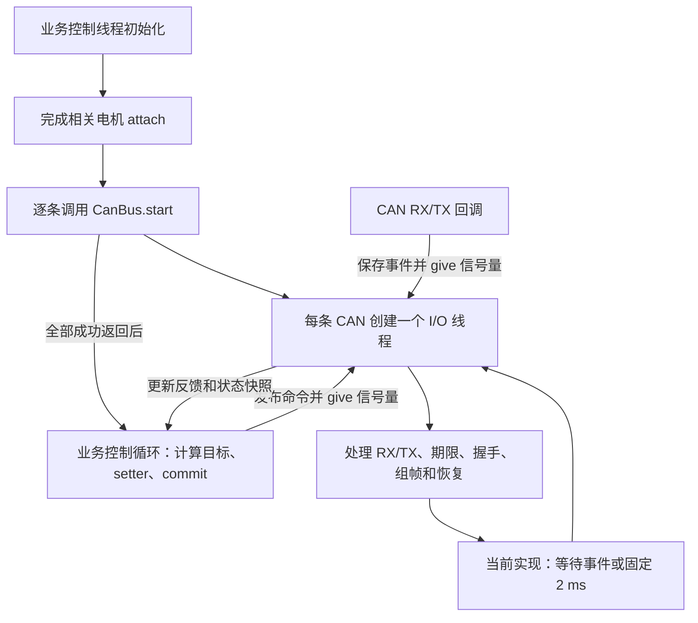
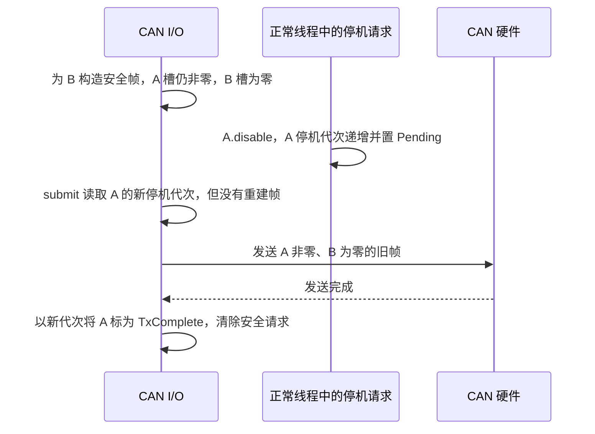

# 电机驱动实现与设计文档一致性审查

审查日期：2026-09-24。源码基线：SkyWalker `e9cc45f`；本地 Zephyr `6085aadeb33`。审查开始时工作区无未提交修改。

对照依据：[多品牌电机驱动重构架构与手工实施指南](./多品牌电机驱动重构架构与手工实施指南.md)，重点为第 5～11 章的接口、发送、线程、生命周期及故障行为契约。

本次只读检查源码及调用方，没有构建、执行测试、刷写或连接实物。下文的缺陷是根据具体代码路径和可发生的执行顺序推导的结论，不是已在硬件复现的结果。遵循古法编程模式，本次仅新增本文，修正建议仍需手工实施。

## 1. 结论

**核心架构、公开接口和单控制线程用法基本符合文档；发送与故障恢复的行为契约尚未完全符合，不能按文档宣称所有复杂组合已可靠支持。**

已经实现的不是旧驱动换名：CanBus 确实统一了两品牌的 CAN 所有权、路由、组帧和收发；Motor 承载端点；Group 可以跨 CAN 联动；控制器直接引用 Motor。没有必要推倒这套核心对象重新设计。

需要先修复以下问题，再把复杂故障组合视为验收通过：

| 编号 | 优先级 | 问题 | 主要影响 |
| --- | --- | --- | --- |
| F1 | P1 | 帧内容与停机代次分开采集，缺少发送授权时的共同校验 | DJI 非零槽位可能被误记为已完成停机，并清除待发安全动作 |
| F2 | P1 | 超时后的新反馈先覆盖旧时间戳，间断本身不触发撤销 | 本应掉线停机的 Motor/Group 可能保留 Active |
| F3 | P1 | CAN 故障清零稳定计时后，快速恢复不能重新起算 | 反馈已恢复但 ready 永久为 false，除非又发生足够长的反馈间断 |
| F4 | P2 | 发送按槽分别读取发布区，批次号也分开读取 | 同一 DJI 帧可混合两个 commit 的目标，诊断序号不对应实际数据 |
| F5 | P2 | 后续通信故障覆盖已锁存 Fault | 原本必须 clearFault 的故障可能绕过清除步骤 |
| F6 | P2 | 固定 2 ms 等待，没有最近截止时间和剩余工作判定 | 与文档调度契约不同，期限检测和队列处理可能额外延迟 |

P1 表示应优先修复的运行正确性问题；P2 表示仍需处理的契约、时序或诊断问题。编号按修复关注度排列，不是发生概率排名。

## 2. 哪些已经符合

| 文档要求 | 当前实现 | 判断与证据 |
| --- | --- | --- |
| 一个物理 CAN 一个 owner，允许多品牌共享 | owner 表按 device 查重；同一 CanBus 接受 DJI/DM Motor | 基本符合，[can_bus.cpp](/home/shm-white/skywalker_ws/skywalker_code/drivers/motor/can_bus.cpp:203) |
| attach 整批验证，失败不部分绑定 | 先检查整批容量、重复对象和既有 bus，再写入绑定 | 符合，can_bus.cpp 77～96 |
| 跨品牌 TX/RX 冲突统一拒绝 | 比较 TX/RX 交叉占用、TX 共享规则、RX 共享规则 | 基本符合，can_bus.cpp 99～167；报错信息仍不如文档完整 |
| DJI 共享命令 ID 由唯一入口组帧 | 每 command ID 建一个 TxUnit；四槽初始为零，逐电机填充 | 基本符合，can_bus.cpp 155～165、561～587；并发缺陷见 F1/F4 |
| DM 共享 Master ID 只装一个过滤器 | Route 去重，解码时按反馈中的 motor ID 分发 | 符合，can_bus.cpp 145～152、355～397 |
| setter 暂存，commit 发布；不等待 TX | staged 与 published 分离，保留 written_ms；commit 通知信号量 | 符合公开调用方式，motor.cpp 660～695、can_bus.cpp 257～286 |
| 每 CAN 一个静态 I/O 线程 | CanBus 内嵌栈、线程、固定队列；start 后创建唯一 worker | 符合线程数量和静态存储要求，can_bus.hpp 166～181、can_bus.cpp 246～253 |
| 回调只记录事件、唤醒 | RX 固定队列，TX 独立完成槽；都不运行 PID | 符合，can_bus.cpp 310～349 |
| 单在途发送，TX 回调驱动继续发送 | in_flight_.busy 限制一个；can_send 使用回调与 K_NO_WAIT | 主体符合，can_bus.cpp 625～670；授权边界见 F1 |
| Group 共享许可、成员全部准备后激活 | 预检查、prepared 数组、统一代次和权限 | 主体符合，group.cpp 91～175、263～317 |
| 单端点故障联动 Group，控制器故障影响整 CAN | raiseFault → Group.trip；enterRecovery 遍历本 CAN 端点 | 路径已实现，group.cpp 236～260、can_bus.cpp 856～874；漏检情况见 F2 |
| 停机不依赖下一次 commit | requestDisable 设置持久安全请求并 wakeBus | 符合设计入口，motor.cpp 396～424；完成确认存在 F1 |
| CAN 恢复不直接开启输出 | stop/取消完成后再 start，随后 requestDisable | 主体符合，can_bus.cpp 877～914；稳定恢复及 Fault 保留见 F3/F5 |
| PositionMotor/VelocityMotor 不再持有 Bus | configure/update/reset/telemetry；只向 Motor 暂存电流/力矩 | 基本符合，lib/control/motor_control.cpp；不再逐轴 flush/recover |
| 命令和参考代次改变时重置控制历史 | update 比较 enable_generation/reference_generation，首轮零 effort | 符合，motor_control.cpp 198～215、382～421 |

这里的“符合”表示源码路径与设计一致，不代表性能或电机固件行为已经通过硬件验收。TX 完成仍只能证明发送完成，不等于转子停止。

## 3. 当前实际线程和启动方式

驱动实现确实采用文档推荐的 **一个业务控制线程 + 每条成功启动的 CAN 一个 I/O 线程**。没有给每个 Motor、Group、品牌或 PID 创建线程。

关键位置：

- [CanBus 的静态线程、栈和队列](/home/shm-white/skywalker_ws/skywalker_code/include/drivers/motor/can_bus.hpp:166)。
- [start 在安装路由和启动 CAN 后创建线程](/home/shm-white/skywalker_ws/skywalker_code/drivers/motor/can_bus.cpp:232)。
- [RX/TX 回调记录事件并唤醒](/home/shm-white/skywalker_ws/skywalker_code/drivers/motor/can_bus.cpp:310)。
- [I/O 循环](/home/shm-white/skywalker_ws/skywalker_code/drivers/motor/can_bus.cpp:917)。



上层入口没有机械地全部放在 main：

| 工程 | 电机控制相关线程 | 加上工程其他应用线程后的数量，未计系统线程 |
| --- | --- | --- |
| mixed_topology，单 CAN | main + 1 个 I/O = 2 | 2 |
| mixed_topology，双 CAN | main + 2 个 I/O = 3 | 3 |
| 双轴 gimbal_control 样例 | gimbalTask + 1 或 2 个 I/O | 另有 remoteTask，共 3 或 4 |
| sentry_chassis | chassisTask + 1 或 2 个 I/O | 另有 linkTask，共 3 或 4 |
| sentry_gimbal | gimbalTask + 1 个 I/O | 另有 remote/referee/link/command 四个线程，共 6 |

这些数字以硬件配置通过、CAN 成功启动为前提。当前两个正式应用的 board_config.hpp 都把 connections_configured 设为 false，默认不会走到成功启动电机 CAN 的路径；不能把配置模板的启动线程数当成已接实物的运行结果。

sentry_chassis 的 main 显式启动两个应用线程，电机初始化在 chassisTask 内完成；sentry_gimbal 的应用线程静态启动，电机初始化在 gimbalTask 内完成。只要初始化和命令生产仍由同一负责人串行执行，这属于合理入口安排，不因“不是 main 亲自 start CAN”判定架构不符。

默认 I/O 优先级为 5，两个正式应用控制线程优先级为 4。优先级和线程数不能代替负载测量；文档要求可抢占线程，但 [Kconfig](/home/shm-white/skywalker_ws/skywalker_code/drivers/motor/Kconfig:35) 允许负优先级，这是配置边界尚未收紧的一处偏差。

## 4. 必须修复的行为问题

### F1：非零 DJI 安全组帧可能错误完成后来发生的停机请求（P1）

文档要求：在最终发送授权时共同检查许可、代次并保留在途槽；安全动作必须对应实际发送内容，旧帧不能结算新的停机请求。允许的残留是一帧已经取得授权的旧输出，之后仍须执行真正的安全输出。

当前实现把三个步骤分开了：

1. [buildSafety → buildTarget](/home/shm-white/skywalker_ws/skywalker_code/drivers/motor/can_bus.cpp:618) 先构造 DJI 四槽帧，健康成员保留非零目标。
2. [submit](/home/shm-white/skywalker_ws/skywalker_code/drivers/motor/can_bus.cpp:625) 只拿 TX 锁，之后才读取各电机当前 stop.request_generation；没有对已构造帧重新校验 Group/端点许可和代次。
3. [updateStopAfterTx](/home/shm-white/skywalker_ws/skywalker_code/drivers/motor/can_bus.cpp:673) 把帧覆盖的 Pending 电机记为 TxComplete，[markStopped](/home/shm-white/skywalker_ws/skywalker_code/drivers/motor/motor.cpp:544) 清除 safe_pending，markSafePrepared 再将安全准备置为成功。

可发生的具体顺序：A、B 是同一 DJI 命令帧里的两个独立电机，A 正输出非零目标，B 已请求停机。



如果没有后续普通 commit 或其他安全帧，驱动可能不再安排 A 的零槽输出。这个问题不能归入文档允许的“一帧残留”，因为残留之后必须执行的安全动作也被错误清除了。

手工修正方向：在 can_bus.hpp 增加小型私有发送候选值，保存帧、实际覆盖的端点、安全动作代次、许可代次、批次号。生成内容时就捕获对应元数据；提交前按统一顺序短锁校验并占用唯一在途槽，失配则重建。发送完成只结算该帧确实承载的安全动作；不能在 submit 才给旧字节补上“现在的代次”。CAN API 仍在锁外调用。

### F2：反馈间隔已经超时，却可能不撤销 Active/Group（P1）

文档要求：反馈失效要撤销对应 Motor/Group，恢复反馈后仍需显式 enable。

[ioMain](/home/shm-white/skywalker_ws/skywalker_code/drivers/motor/can_bus.cpp:934) 先处理 RX，再调用 checkDeadlines。两个反馈处理函数实际上都能发现间断：

- [DJI gap 分支](/home/shm-white/skywalker_ws/skywalker_code/drivers/motor/motor.cpp:820)。
- [DM gap 分支](/home/shm-white/skywalker_ws/skywalker_code/drivers/motor/motor.cpp:883)。

但它们只作废连续位置参考、重置稳定时间，然后覆盖反馈时间戳；没有因此 raiseFault(FeedbackExpired)。随后 [checkDeadlines](/home/shm-white/skywalker_ws/skywalker_code/drivers/motor/can_bus.cpp:467) 只看到新时间戳，可能认为反馈一直合格。

例如最后反馈在 t=100 ms，时限 20 ms；I/O 上次在 t=120 检查尚未超过当前代码的阈值，新反馈在 t=121 到达并先被处理。gap 为真，但到期检查看到的是 t=121，Motor 可继续保留 Active。调度延迟或积压后先处理到恢复反馈时也存在同类路径。直接电流/力矩/速度控制没有“连续位置失效就拒绝控制”的必然兜底，同 Group 的其他电机也可能没有被通知停机。

[rejectControl](/home/shm-white/skywalker_ws/skywalker_code/drivers/motor/motor.cpp:655) 又以 active() 为触发条件；反馈已经过期时 active() 为 false，所以控制层返回 -ESTALE 并不必然马上触发组撤销。不能以“上层也会读新鲜度”证明驱动路径符合契约。

手工修正方向：反馈处理保留间断事件；对 Active/Enabling 时发生的有效期断裂，先撤销旧许可和组意图，再把新帧作为恢复观测。在端点锁外调用组联动入口，保持 Group → Motor 的锁顺序。已有事实上的超时不能因新时间戳覆盖而消失。

### F3：快速 CAN 恢复之后稳定窗口可能永久不再起算（P1）

文档要求：暂态通信故障可自动探测恢复，稳定后回到可显式使能的 Disabled。

[raiseFault 的通信故障分支](/home/shm-white/skywalker_ws/skywalker_code/drivers/motor/motor.cpp:988) 把 feedback_stable_since_ms_ 清为 0，但保留 has_encoder/has_native_position 以及旧反馈时间戳。

后续 acceptDjiFeedback/acceptDmFeedback 只有“首帧”或“相邻反馈间隔超过 feedback_timeout_ms”才重新设置稳定起点。[readyLocked](/home/shm-white/skywalker_ws/skywalker_code/drivers/motor/motor.cpp:295) 则明确要求稳定起点非零。

因此，若一次发送错误或 RX 溢出触发 CAN 恢复，而恢复后的首帧距故障前最后帧仍在反馈时限内：

```text
通信故障 → stable_since = 0
快速 stop/start 后来新反馈 → 非首帧且 gap=false → stable_since 仍为 0
之后反馈持续正常 → 每帧 gap=false → ready 始终为 false
```

这是恢复速度越快反而越可能暴露的逻辑问题，不应通过加长恢复 sleep 绕过。应在恢复代次的首个合格反馈、或稳定起点为空时建立新的稳定窗口，同时保持连续位置参考失效；通信稳定与位置回零是两件不同的事。

### F4：完整 commit 快照在组帧时又被拆成不一致的逐槽读取（P2）

文档要求：commit 发布最新完整快照，发送消费该快照；批次号能够标识所用命令来源。这不要求不同 CAN 同时运动，但同一帧不能拼出一个从未发布过的组合。

[commit](/home/shm-white/skywalker_ws/skywalker_code/drivers/motor/can_bus.cpp:268) 发布整批时有锁，但 [buildTarget](/home/shm-white/skywalker_ws/skywalker_code/drivers/motor/can_bus.cpp:564) 每个 DJI 槽分别获取、释放 publication_lock；[pumpTarget](/home/shm-white/skywalker_ws/skywalker_code/drivers/motor/can_bus.cpp:830) 读取 sequence 又在更早的另一个临界区。

业务线程可在填槽之间抢占 I/O，发布新批次。结果可能是：旧批次 A/B 为 1/1，新批次为 2/2，实际组帧却为 1/2，且还标为旧 sequence。DM 单帧没有四槽混合，但 sequence 先读、命令后读同样可能不对应。

手工修正方向：在一次 publication_lock 临界区中复制本次所需命令和 sequence，锁外编码。复用固定大小局部值或 Bus 私有候选存储，不新增动态队列。新 commit 可以替换尚未授权的候选，但不能在一次编码过程中悄悄换部分字段。此修正应与 F1 使用同一份发送候选，避免重复快照结构。

### F5：已经要求 clearFault 的故障会被通信恢复覆盖（P2）

文档要求：无效命令、明确驱动故障等保持 Fault，需要显式 clearFault；恢复通信不清除这个要求。

[raiseFault](/home/shm-white/skywalker_ws/skywalker_code/drivers/motor/motor.cpp:966) 仅跳过同 reason 的重复 Fault。新的 TransportError/RxOverflow 无论当前是否 Fault，都会覆盖 last_fault 并改成 Offline。

具体顺序：无效电流命令 → Fault；随后 CAN 故障 → Offline；如果通信间断足够长，F3 的稳定起点会正常重建，安全输出和反馈恢复后可变 Disabled、ready；此时再次 enable 不再要求处理原来的 Fault。Group.last_fault 留着历史根因，并不会阻止这条使能路径。

手工修正方向：保留待显式清除的故障条件，通信有效性单独更新。不能让通信恢复把锁存故障变成普通 Disabled；如保持现有枚举，可增加一个私有故障锁存值，无需再设计一套状态机。后续运输错误仍应记入诊断，但不能代替清故障确认。

### F6：当前是事件加固定 2 ms 轮询，并非文档的截止时间调度（P2）

[ioMain 末尾](/home/shm-white/skywalker_ws/skywalker_code/drivers/motor/can_bus.cpp:962) 无条件调用 k_sem_take(..., K_MSEC(2))。事件能提前唤醒，因此不能说所有发送都只能每 2 ms 一帧；但这里确实没有计算最近的反馈、命令、握手、TX、重试或探测期限。

另一个差异是每轮只处理 kRxDepth/2 帧，然后可能在 RX 队列仍有数据、合并通知已被消费时进入等待。它没有检查文档强调的“仍有可立即处理的工作就按预算继续”。某些清故障步骤只更新软件状态就返回，也会受到同类调度延迟。

手工修正方向：在 ioMain 中区分当前可推进工作与等待中的操作；有工作按预算继续，无工作才等待最近期限。固定轮询若作为明确的简化决策保留，应同步修改文档、约束 Timing 的最小范围并实测误差，不能宣称已实现最近截止时间调度。2 ms 是请求的等待值，实际还受系统 tick 和调度影响，不是已证明的响应上界。

## 5. 架构层面尚未完整实现的部分

### 品牌生命周期逻辑仍散布在公共核心

文档第 11.1 节计划把 validate/decode/encode/stepLifecycle 集中为品牌普通函数，公共核心负责路由、调度和联动。现在的品牌目录主要留下原始字节编解码；型号工厂、describe、配置/命令校验、反馈累积集中在 motor.cpp，DM 启停和中性准备直接写在 can_bus.cpp 的 checkDeadlines/pumpTx 中。

这不妨碍当前两品牌基础运行，也没有必要为了函数名不同判定实现错误；但新增第三品牌时仍会同时扩改 CanBus、Motor 的大量分支，没有完全达到文档描述的品牌扩展边界。行为问题修好后，可把现有具体分支逐步搬到品牌普通函数；无需引入虚基类、插件管理器或新的对象层。

### 正式底盘调用方仍固定为 DJI 和一个八电机 Group

[ChassisMotorConnection](/home/shm-white/skywalker_ws/skywalker_code/applications/sentry_chassis/src/chassis_hardware.hpp:12) 仍使用 dji::Config；硬件层要求 CommandCurrent，并用 DJI Descriptor 处理电流和反馈。[构造函数](/home/shm-white/skywalker_ws/skywalker_code/applications/sentry_chassis/src/chassis_hardware.cpp:19) 固定将八台电机放进同一个 Group。

因此应区分：底层驱动允许 DJI/DM 混挂；当前正式底盘不能只替换一个工厂就变成任意品牌混合底盘，也没有直接提供“四个轮组各自容错”的配置入口。若整底盘一起停是应用策略，这本身不是驱动缺陷。要支持力矩电机或独立轮组，还需要修改调用方单位、能力检查、控制参数及 Group 配置，不能绕过单位校验强行统一。

### 诊断契约还有缺口

- Group.trip 保存组根因，但健康成员只执行 requestDisable；其 Motor.last_fault 没有记录被谁联动停止。只看单台 MotorSnapshot 不能完整解释停机原因，需要同时查询 GroupStatus。
- StopReport.tx_error 当前的写入路径主要是 0；安全发送失败主要记在 BusStatus，随后又创建新停机请求。端点停机结果的错误关联还不完整。
- validateTopology 的碰撞日志主要输出 CAN ID，没有文档要求的冲突双方名称、方向和用途；Group 容量错误也被统一映射成 -EINVAL。
- 大部分序号检查了耗尽，但 enterRecovery 的 bus_generation_ 仍直接递增，没有耗尽处理。实际触发极远，优先级低于上面的运行缺陷。

设计文档开头仍保留“新接口尚未实现”的历史措辞，如后续把它作为当前实现说明，应更新为“目标契约；已实现程度以本审查和验收记录为准”，避免把尚未通过的行为写成事实。

## 6. 建议的手工修正顺序

| 顺序 | 修改位置 | 具体工作 | 完成后应能证明 |
| --- | --- | --- | --- |
| 1 | can_bus.hpp、can_bus.cpp：buildTarget/buildSafety/submit/updateStopAfterTx | 合并 F1/F4：固定候选快照、帧对应的动作代次、最终权限校验、只结算实际安全槽 | 新停机请求不能被旧非零帧完成；同帧命令属于一个完整发布批次 |
| 2 | motor.cpp：acceptDjiFeedback/acceptDmFeedback/raiseFault/rejectControl | 修复 F2，保留并处理反馈间断事实 | 恢复帧不能抹去旧代次已过期事实；Group 必须停机并要求新 enable |
| 3 | motor.cpp：稳定起点与故障锁存 | 修复 F3/F5，分别管理通信稳定、连续参考和显式清故障要求 | 快速恢复后可重新 ready；原 Fault 不被通信恢复清除 |
| 4 | can_bus.cpp：ioMain/checkDeadlines，drivers/motor/Kconfig | 修复 F6；约束可抢占优先级与容量/栈预算 | 待处理工作不因通知合并被人为延后；期限调度与文档一致 |
| 5 | 品牌目录、motor.cpp、can_bus.cpp | 抽出实际重复的品牌校验、反馈处理及生命周期普通函数 | 增加品牌不必扩写公共调度器的大段协议流程 |
| 6 | 诊断类型及调用方 | 补联动来源/安全错误关联；按真实需求开放底盘品牌与组配置 | 用户能从状态解释停机原因，应用配置能力与说明一致 |

发送候选的实现思路如下，仅为手工实施伪代码，不是已增加的 API：

```text
一次短锁复制发布命令 + sequence，随后释放发布锁
读取候选所需的许可、端点/安全代次，生成帧和动作说明
按固定锁顺序检查这些状态仍匹配，并预留唯一提交/在途槽
    不匹配：重建候选；新安全请求不能直接绑定到旧帧
锁外调用 can_send
完成事件：只结算候选明确承载的动作及其原始代次
```

不要持锁调用 CAN、等待反馈或跨总线等待另一个 worker。F1 的修复要覆盖正常目标、安全输出、Enable 和中性准备等所有发送入口，不能只补一个 DJI 判断。

## 7. 后续验证清单，本文未执行

现有 mixed_topology 已提供 DJI 同帧、DM 共享 Master、跨 CAN 联动及隔离四种台架入口；gimbal_control 提供同 CAN 的 DJI+DM 组合。样例 README 的编译结论不能代替本次基线的构建，更不能代替这些并发行为的验证。

建议由实施者先编译实际修改涉及的入口，例如：

```bash
west build -b dm_mc02/stm32h723xx samples/motor/mixed_topology -d build/mixed_dji
west build -b dm_mc02/stm32h723xx samples/motor/mixed_topology -d build/mixed_dm -- -DMIXED_TOPOLOGY=dm_shared_master
west build -b dm_mc02/stm32h723xx samples/motor/mixed_topology -d build/mixed_isolation -- -DMIXED_TOPOLOGY=cross_can_isolation
west build -b dm_mc02/stm32h723xx samples/robotics/gimbal_control -d build/gimbal_control
west build -b dm_mc02/stm32h723xx applications/sentry_chassis -d build/sentry_chassis
west build -b dm_mc02/stm32h723xx applications/sentry_gimbal -d build/sentry_gimbal
```

若已存在这些构建目录，先确认其中的板卡与模式，避免覆盖其他实验配置。这里只列命令，没有运行或生成构建目录。

| 场景 | 实施后预期结果 |
| --- | --- |
| 构造 DJI 安全帧后、submit 前插入另一成员 disable | 新停机请求仍有真实零槽帧完成，旧非零帧不能清除它 |
| 构造第一槽后插入下一批 commit | 当前帧完全取自旧批或新批，sequence 与内容对应 |
| 反馈中断略超时限，新帧恰在期限检查前处理 | 原 Motor/Group 已撤销许可，新反馈仅启动恢复 |
| 保持新命令，延迟 I/O 处理超时间断后的 RX | 不得因队列最新反馈而保留旧 Active |
| 发送错误后快速恢复，首帧间隔小于反馈时限 | 稳定窗口重新起算，之后 ready；不自动 Active |
| 无效命令 Fault 后制造较长通信中断再恢复 | 仍需显式 clearFault；enable 不能直接通过 |
| setter 停止但继续 commit；setter 继续但停止 commit | 已发布命令均按原始时间戳过期，不能续命 |
| 同帧不同 Group，一台持续掉线 | 其槽归零；健康独立槽继续；总线故障则另按整 CAN 处理 |
| 跨 CAN Group 与两侧独立组并存 | 故障 CAN 及关联组撤销；另一 CAN 的独立组继续服务 |
| RX 队列有剩余数据且信号量通知已合并 | 有界处理继续推进，不无条件等待固定周期 |
| stop 失败或取消回调尚未终结 | 维持不可输出，不复用旧在途上下文 |

F1/F4 应优先用可控的发送替身或定点调度方式验证执行顺序；仅靠人工反复按停机键难以证明窗口已关闭。实机试验再记录 CAN 帧、软件许可、停止进度和代次。首先在动力关闭或机构可靠支撑、低限幅和可断电条件下确认主动停机，再逐项注入故障。

- [ ] F1/F2/F3 已修复且有对应验证记录。
- [ ] F4/F5/F6 的行为与最终文档一致。
- [ ] 新增逻辑没有重新引入每电机 Bus、后台 PID 或隐式恢复运动。
- [ ] 同 CAN 混合品牌、共享帧/反馈 ID、跨 CAN 联动分别验收。
- [ ] 线程栈、负载、最坏调度延迟及底层取消契约已有目标板测量。
- [ ] 当前设计说明不再把目标行为与已经验证的能力混在一起。

尚未验证：当前基线是否完整编译、线程栈实际余量、实机反馈节奏、DM 固件使能/中性命令的机械行为，以及上述并发顺序的实机复现。本文没有修改业务源码。
