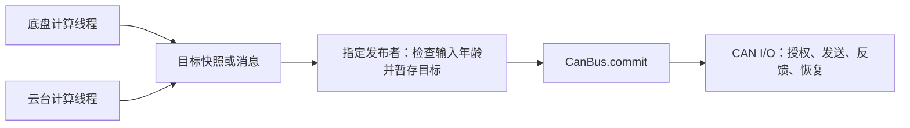

# 电机驱动审查复核与线程弹性实施指南

日期：2026-09-26。复核基线：`bc1e07b`，检查开始时工作区干净。

本文回应三个问题：原审查是否可信、修复后调用方式是否变化、能否放宽线程数量。原审查中的实施指令作为被审查内容，不作为本轮修改业务代码的授权。本轮仅只读检查并新增本文，没有实现修复、运行构建或进行硬件验证。

## 1. 复核结论

原文分析总体可靠，可以作为修复依据。它给出了具体执行顺序、区分源码推导与硬件验证，也没有要求推翻 Motor / Group / CanBus 的基本划分。

原文基线是 `e9cc45f`。对比该版本至当前 HEAD，`drivers/motor`、`include/drivers/motor`、`lib/control`、`samples/robotics/gimbal_control` 没有差异；本次也重新读取了关键函数。因此相关缺陷仍适用于当前代码。

| 原编号 | 本次判断 | 代码依据与补充 |
| --- | --- | --- |
| F1 | 成立，优先处理 | `buildSafety()` 先编码，`submit()` 后取 stop generation；`updateStopAfterTx()` 据后取的代次完成停机。帧中的非零槽位确实可能错误结算新的停机请求。还要覆盖 Target、Enable、Probe、ClearFault 的授权和操作归属，不能只补安全帧。 |
| F2 | 成立，优先处理 | 两品牌反馈处理都识别 gap，但未因此撤销旧 Active/Enabling；新时间戳覆盖旧值后，随后的期限检查可能漏掉间断。`active()` 的瞬时新鲜度检查不能代替持久撤销。 |
| F3 | 成立，优先处理 | 通信错误把稳定起点清零；非首帧且无 gap 时不重新起算，而 `readyLocked()` 又要求起点非零。持续正常反馈不一定能自行走出此状态。 |
| F4 | 成立，与 F1 一起修 | 发布时有完整快照，但编码时逐槽读，sequence 又单独读，确实可能混用两个批次。即使只有一个业务线程，它也能与 I/O 线程交错。 |
| F5 | 成立，建议与 F1～F3 同批验收 | `raiseFault()` 用通信故障覆盖 Fault 为 Offline。Group 的 `fault_latched_` 用来保留根因，`enable()` 并未把它当成必须清故障的门槛，不能认为 Group 已兜底。 |
| F6 | 调度契约偏差成立，严重程度需结合负载 | 实现是事件唤醒加固定 2 ms 等待。不能据此推断每帧至少隔 2 ms，也不能把 2 ms 当作响应上界；有通知时等待立即返回。队列余量和软件可推进步骤仍应纳入等待决策。 |

参考源码：[发送与调度](drivers/motor/can_bus.cpp)、[端点状态](drivers/motor/motor.cpp)、[组联动](drivers/motor/group.cpp)。

原文还应补充以下边界：

- “符合设计”不等于已经完整证明并发正确。尤其修复方案中的“统一锁顺序”仍需落到所有发送入口和完成路径，不能直接照几行伪代码宣布修复完成。
- F1/F2/F3/F5 是行为正确性问题；品牌代码搬家、日志细化、应用是否开放混合品牌是不同层面的工作，不必捆成一次大改。
- F5 虽标为 P2，涉及显式清故障要求被绕过，建议和主要状态机修复一起完成。
- F6 可以实现最近截止时间，也可以保留经过测量、明确容差的轮询。选择后同步说明；保留轮询不免除修复 F1～F5。
- 原文多数绝对链接指向旧的 `/home/shm-white/skywalker_ws/skywalker_code`，当前仓库在 `/home/shm-white/skywalker-zephyr/skywalker_code`；维护原文时宜改为相对链接。

## 2. 修完后调用方式是否变化

**F1～F6 可以通过私有实现修复，原则上无需改现有公开方法名称、参数、返回类型或正常调用顺序。** 这是建议采用的兼容目标，尚不是已完成实现的保证。

| 调用点 | 建议保留的契约 | 修复后可观察的变化 |
| --- | --- | --- |
| `CanBus(can)`、`attach(...)`、`start()` | 初始化时完成绑定，逐条启动并检查错误；同一物理 CAN 一个 owner | 不因修复增加用户必须手动启动的驱动线程 |
| `Group::enable()` | 返回 `int`，成功表示请求受理；后续查询 `active()` | 反馈间断后旧许可确实失效，必须重新满足使能条件 |
| `PositionMotor/VelocityMotor::update(...)` 或 Motor setter | 原参数与错误处理保留；目标先暂存 | 不让旧代次或已过期目标继续输出 |
| `CanBus::commit()` | 返回 `CommitResult {error, sequence}`；发布本 CAN 暂存快照，不等待 TX | 同帧内容与批次号一致；成功仍不是“已经发送完成” |
| `Group::disable()` | 普通线程中撤销许可并通知 I/O；不依赖下次 commit | 新停机请求必须有对应的真实安全动作，不能被旧非零帧完成 |
| `clearFault()`、`ready()` | 清故障与准备就绪分开；清故障不自动运动 | 已锁存 Fault 不再被通信恢复绕过；快速恢复后稳定计时能重建 |
| `reseedPosition(...)` | 连续位置参考失效后，按原有可信参考条件重建 | 通信恢复不等于位置参考恢复，位置控制仍可能需要此步骤 |

这里最重要的区别是：**正常调用写法可以不变，故障场景的结果会变得更严格、更符合原设计。** 如果调用方过去依赖“恢复反馈后不用重新 enable”或“通信恢复顺带清掉 Fault”，这些流程必须修正。

### 当前 gimbal_control 的具体影响

[main.cpp](samples/robotics/gimbal_control/src/main.cpp) 已按以下方式使用：

```text
同 CAN：yaw_bus.attach(yaw_drive, pitch_drive)
         yaw_bus.start()
         每轮更新两轴 → yaw_bus.commit()

不同 CAN：yaw_bus.attach(yaw_drive)，pitch_bus.attach(pitch_drive)
           两条 bus 分别 start()
           每轮更新两轴 → yaw_bus.commit() → pitch_bus.commit()
```

`pitch_bus` 不需要改成电机专属发送线程，也不需要换成其他接口。同 CAN 时继续只启动 `yaw_bus`，不能为了增加线程再启动第二个 owner 去占同一个控制器。两个 CAN 的连续 `commit()` 不提供跨总线同时发送保证，Group 也只是共同许可和故障联动。

现有样例已处理 update/commit 错误、组撤销后的重新解锁，以及显式 `clearFault()`；这些基本流程可复用。但本次没有执行样例，不能据此保证所有恢复动作已经验收。

## 3. 线程数量可以放宽

建议采用下面的设计要求，替代“全系统只能有一个业务控制线程”的硬性措辞：

> 应用可按功能、周期和负载配置多个控制线程，不规定固定总数。每个 Motor/控制器的普通目标由一个明确的写入方负责；同一 CAN 的命令收集和提交有明确的串行化规则。每个物理 CAN 保留唯一 owner 和统一发送授权入口。驱动默认每 CAN 一个 I/O 线程，额外任务按实际需要配置，并验证内存和时序预算。

“唯一写入方”可以是一个业务模块，它统一接收遥控、自动控制和其他任务的目标，再决定最终输出，并不要求整个机器人只有一个控制线程。

| 线程安排 | 建议 |
| --- | --- |
| 遥控、IMU、通信、日志各自独立 | 可以，通过快照/消息向控制层交付输入 |
| 底盘与云台各一个控制线程，各管独立 CAN | 合理，各自更新电机和 commit；初始化仍串行完成 |
| 底盘与云台各一个线程，共享 CAN | 可以，但要统一安排该 CAN 的收集与 commit，见下一节 |
| yaw 与 pitch 分别运行 PID | 可以，分别持有自己的控制器；若要求同周期配对发布，需要批次协调 |
| 两个线程并发 update/reset 同一个控制器 | 当前不应支持；内部 PID 状态没有整体并发保护，telemetry 的锁不等于算法状态的锁 |
| 多个线程交替直接写同一个 Motor | 需要明确仲裁或所有权交接，不能以“最后一次写入获胜”作为默认控制策略 |
| 多个线程各自直接向同一个 CAN 发送电机帧 | 不采用；保留统一组帧和发送授权，防止共享槽覆盖及停机乱序 |

每 CAN 一个 I/O 是当前实现和合理默认，不是线程总数上限。以后若测量证明有必要拆 RX 处理或其他任务，可以修改内部调度而保持公开接口；届时仍应把生命周期变化和实际 TX 授权串行化。没有必要仅为修 F1～F6 新增这些线程。

### 为什么多个 commit 调用方不能直接放开

`CanBus::commit()` 先逐台 `copyStaged()` 到局部数组，再取得 `publication_lock_` 发布。它的范围是整条 CAN，不是调用线程拥有的某一台 Motor。

存在两类不同问题：

1. 线程 A 更新完 yaw，线程 B 尚未更新 pitch，A 就 commit：发布的是新 yaw 加旧 pitch。两个独立轴可以明确允许“各轴最新值”语义；需要成对控制时，这不是同一轮结果。F4 修复只能保证发送忠实于该快照，不能补出尚未写入的 pitch。
2. A 复制旧暂存值后被抢占，B 复制新值并先发布，A 恢复后再发布：更大的 sequence 可能携带更旧的目标。只在最终 memcpy 周围加锁不能避免这种收集顺序倒置。

原始 `written_ms` 仍应保留，重复 commit 不刷新命令年龄；不过这只能避免旧命令无限续命，不能替代上述一致性规则。

### 可选实施方式

**方式 A：统一发布，业务多线程计算。** 最易保持当前接口。各计算线程通过项目现有 `Latest<T>` 或固定消息交付目标；指定一个发布者读取目标、调用相应 setter/update，再对每条 CAN commit。现有 `remote_state.put/get` 可参考。消息保留来源时间与有效性，发布者必须拒绝过期输入，不能持续把旧消息重新写成新命令。



计算线程可分担规划等计算；若要连 PID 也在各线程运行，则每个控制器仍只由其所属线程 update，发布者只负责 commit，并另外约定各轴完成时刻与批次屏障。简单的“各轴最新值”可不设配对屏障，需要成对更新时必须设。不要让发布者再次 update 同一个控制器。

**方式 B：应用层用同一个互斥锁串行化共享 CAN 的写入和 commit。** 不新增驱动公开 API。所有参与方必须遵守同一约定，保护一次相关暂存更新和 commit 的整个区间；只锁 commit 不足以保证多个 setter 的业务事务。

```text
各任务先准备自己的输入和目标
获取共享 CAN 的应用互斥锁
    更新自己负责的控制器或写入目标
    调用 bus.commit()，记录并检查结果
释放应用互斥锁
在锁外处理日志和后续业务
```

这是普通业务线程的互斥锁，不是长时间持有驱动 spinlock。禁止持锁等待反馈、TX 完成或其他任务产出目标。涉及多 CAN 的事务统一获取顺序，或集中协调；急停撤销不应被排在耗时的目标计算后面。该方式允许其他轴沿用上轮目标，不自动提供两个任务的同周期配对。

两种方式任选满足业务语义的一种即可。当前样例已在同一个 `gimbalTask` 中完成两轴更新和提交，维持原样就满足这一组织要求。

### 怎样判断资源够

不按线程个数一刀切，至少记录：静态 RAM/栈预留、实际栈高水位、控制周期最大抖动、I/O 最坏调度延迟、RX 队列峰值与溢出、命令年龄、TX 延迟和 CAN 带宽占用。

当前 I/O 栈默认配置为 3072 字节。云台样例显式声明 remote 栈 3072 字节、gimbal 栈 6144 字节，且两个静态 CanBus 对象各自内嵌栈。即使同 CAN 时没有 start `pitch_bus`，该对象仍在源码中预留存储。按默认值，四份栈声明大小合计 15360 字节，尚未计对齐、线程控制块、队列、协议状态和其他系统内存；最终用链接映射确认。这说明“运行线程减少一个”不等于“静态内存自动少一份”。

增加线程也不增加 CAN 物理带宽。是否提高优先级、增加处理任务或队列，应由上述测量决定。不要以线程栈能放进 RAM 就推断所有截止时间都能满足。

## 4. 建议手工实施顺序

| 顺序 | 文件 | 操作与完成条件 |
| --- | --- | --- |
| 1 | 原设计指南第 7 章、7.6 并发说明及末尾范围约束 | 将唯一业务线程改成推荐默认，写清每 Motor 单写入方、每 CAN 发布协调。线程总数由应用决定。原审查第 3 节标明其数字是当前样例统计。 |
| 2 | `include/drivers/motor/can_bus.hpp`、`drivers/motor/can_bus.cpp` | 私有发送候选共同携带帧、命令 sequence、实际安全动作、许可及操作代次；一次复制发布内容；授权时统一验证并预留在途槽，锁外发 CAN。失配重建，完成只结算候选实际承载的动作。对应 F1/F4。 |
| 3 | `drivers/motor/motor.cpp` | 把反馈 gap 作为不可被恢复帧抹掉的事件。撤销旧代次并在端点锁外联动 Group；稳定窗口为空时由合格恢复反馈重新起算，位置参考仍按独立规则处理。对应 F2/F3。 |
| 4 | `motor.hpp`、`motor.cpp`、必要时 `group.cpp` | 私有状态保留需显式清除的故障，通信错误只更新通信情况与诊断；所有恢复/ready/enable 路径都尊重锁存条件。保留公开接口。对应 F5。 |
| 5 | `can_bus.cpp`、`drivers/motor/Kconfig` | 明确立即可推进工作、最近期限、控制器状态探测期限和公平处理预算；无工作再等待。参数按实际系统优先级范围及测量配置。对应 F6。 |
| 6 | 确实需要拆线程的应用文件 | 按上一节选择发布规则，再移动任务。配置冻结后启动运行任务，同一控制器的 configure/reset/update 保持串行。 |

不要把“候选仍然匹配”拆成多次互不关联的查询后直接发送；状态能在查询间变化。共同授权的临界区要有固定锁顺序、固定上限，不能持锁调用 CAN API。若重建使当前候选作废，要保留待处理工作，不能顺便消耗掉唯一发送机会。

F2/F3 的次序也需一起设计：若先给新反馈设置稳定起点，随后 `raiseFault()` 又把它清零，新窗口仍会丢失。应明确先处理旧许可失效，再把当前合格帧计入恢复窗口，并防止并发产生的新代次被迟到的旧故障误伤。

## 5. 手工验证与完成清单

以下仅为建议，由实施者执行；本轮未运行。

```bash
west build -b dm_mc02/stm32h723xx samples/robotics/gimbal_control -d build/gimbal_review
west build -b dm_mc02/stm32h723xx samples/motor/mixed_topology -d build/mixed_review
west build -b dm_mc02/stm32h723xx samples/motor/mixed_topology -d build/mixed_dm_review -- -DMIXED_TOPOLOGY=dm_shared_master
west build -b dm_mc02/stm32h723xx samples/motor/mixed_topology -d build/mixed_cross_review -- -DMIXED_TOPOLOGY=cross_can_isolation
```

执行前确认相应输出目录未被其他实验占用。不同 CAN 拓扑需要匹配实际板级配置，不能把默认样例一次编译成功视为全部拓扑已验证。

- [ ] 不改公开接口即可编译原样例，原有错误处理仍完整。
- [ ] 定点插入 disable/commit，证明非零旧帧不完成新停机、同帧内容和 sequence 一致。
- [ ] 恢复反馈到达期限检查之前，旧 Group 许可仍被撤销。
- [ ] 快速恢复后稳定窗口重新起算；明确 Fault 经通信恢复仍需 clearFault。
- [ ] RX 积压、TX 回调、恢复和新 commit 并发时，无无谓等待或无限空转。
- [ ] 若拆业务线程，故意延迟其中一个生产者，验证其他生产者不能给它的旧输入续命。
- [ ] 需要成对更新的电机不发布半批目标；允许各轴最新值的路径在说明中明确这一语义。
- [ ] 记录栈余量、队列峰值、CPU 负载、控制抖动和 CAN 负载后决定线程配置。

先在动力关闭条件下检查帧与软件状态，再在机构可靠支撑、低输出限幅、可切断动力的条件下验证主动停机和故障恢复。TX 完成仍不代表机构已经停止。

未验证项：实际编译、目标板负载与栈余量、底层取消/回调的完整契约、DM 固件机械行为、故障注入结果。本轮业务源码未修改。
