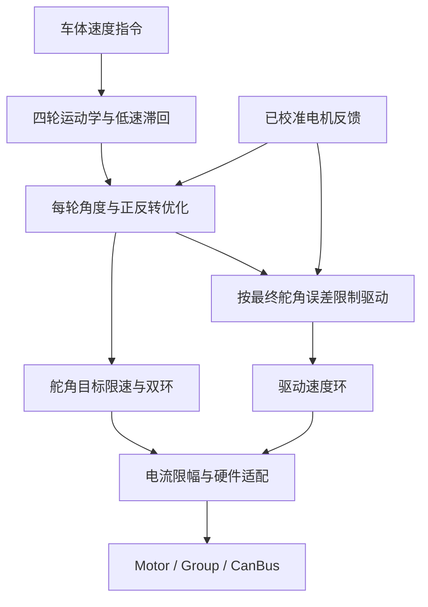

# 已调通舵轮源码与 Zephyr 项目的对照及修改建议

日期：2026-10-02。本文是源码对照与实施建议，未修改业务源码，未编译、刷写或进行实机验证。

## 1. 对照范围与结论

- 参考：用户上传的 `h7_framework-main-source.zip`。SHA-256：`46b07473fe7da0771dab0e3226346faaf7d5249878de8c3ab3cca23e13d5db6d`。附件未提供可核实的 Git 提交号，以这份压缩包为准。
- 当前项目：`SHM-white/SkyWalker_General_Embedded_Code`，读取时的 `dev@23b73065bb459b7d16675f1494e26f14b9556133`。无法覆盖尚未推送的本地修改。
- 同时核对 `main@ef18ac3316b324f26290fe5560ecd88e534b5de8`：本文涉及的舵轮算法、底盘 board_config、executor、hardware 与 main.cpp 在两个提交中相同；通讯 overlay 有差异。
- 按仓库 `ancient-programming` 技能只提供指南。这里没有实施业务代码修改。

**建议继续使用现有 Zephyr 分层，把参考工程作为这台底盘的标定与控制行为来源。优先补实车配置、单位换算和转向过程控制，无需更换 RTOS 或重写运动学。**

参考工程真正运行的链路是：

`ChassisTaskLoop → RobotChassisControl → RobotChassisKinematics / RobotSteeringUpdateTarget → DjiMotorCurrentCalculate → CAN`。

关键代码在 `Skywalker/Application/Src/app_robot.c`，不是只看名字像运动学库的 `alg_kinetics.c`。附件默认只开启底盘，云台、发射、视觉、裁判系统关闭；“简单运动已调通”不能扩展理解为整车功能都验证过。

## 2. 优先级总表

| 优先级 | 已确认的差异 | 建议与影响 |
| --- | --- | --- |
| P0 | 参考舵向 CAN1、驱动 CAN3；当前正式应用两者都在 CAN1 | 按实际接线配置 CAN1/CAN3。否则驱动反馈收不到，八电机组不能进入工作状态 |
| P0 | 当前零点均为 0、方向均为 +1；参考有逐轮标定 | 导入候选零点和驱动方向，再逐轮核对，避免四轮互相顶住 |
| P0 | 当前 connections_configured=false、GM6020 电流模式未确认；要求功率预算，但模型未标定 | 这是未完成实车适配的门禁，不是运动学故障；独立调试入口与正式整车许可分开配置 |
| P0 | 参考 M3508 用电机轴 rad/s，当前用减速后输出轴 rad/s | 统一轮径、传动比、速度上限与 PID 单位，不能直接抄 Kp |
| P1 | 当前正式应用回退缩放会同时缩小舵向和驱动电流 | 当前参数下算法限幅 0.3 A 再乘 0.15，仅剩 0.045 A；需分别设计舵向/驱动限流与缩放 |
| P1 | 当前已有 90° 翻转优化、连续角、统一轮速限幅；没有对齐门控和余弦补偿 | 保留现有能力，补转向过程中的驱动力管理 |
| P1 | 当前零速保角仅一个阈值；位置目标直接改变 | 增加低速滞回、舵角目标限速、90° 翻转滞回；明确停车时锁舵还是卸力 |
| P2 | 参考底盘闭环约 2 ms，当前每次运算后 sleep 5 ms | 先完成以上适配，再考虑固定 2 ms 调度；继续使用真实 dt |
| P2 | 参考使用板内 BMI088 补偿偏航角速度 | 基础运动稳定后再接入底盘 yaw-rate 环，先确认 IMU 安装在底盘刚体上 |

## 3. 第一批修改：实车配置

主要位置：`applications/sentry_chassis/src/board_config.hpp`。

### 3.1 电机和零点映射

以下顺序在两套代码中都是 FL、FR、RL、RR，即左前、右前、左后、右后。

| 轮位 | GM6020 ID | 舵向反馈 / 指令 | 朝车头时编码器零点 | M3508 ID | 驱动反馈 / 指令 | 驱动方向候选 |
| --- | --- | --- | --- | --- | --- | --- |
| FL 左前 | 1 | CAN1：0x205 / 0x1FE 槽 0 | 3060 | 1 | CAN3：0x201 / 0x200 槽 0 | -1 |
| FR 右前 | 2 | CAN1：0x206 / 0x1FE 槽 1 | 2421 | 2 | CAN3：0x202 / 0x200 槽 1 | +1 |
| RL 左后 | 3 | CAN1：0x207 / 0x1FE 槽 2 | 2383 | 3 | CAN3：0x203 / 0x200 槽 2 | -1 |
| RR 右后 | 4 | CAN1：0x208 / 0x1FE 槽 3 | 3097 | 4 | CAN3：0x204 / 0x200 槽 3 | +1 |

这是**附件记录的参数**。只有电机 ID、装配、零位没有改变时才能沿用；舵向四路符号在参考普通平移分支中都是 +1，但原地旋转存在额外取反分支，必须单独核实。

建议：

1. 给 board_config 增加 `can3` 设备引用，设置 `steer_can=can1`、`drive_can=can3`。
2. `steerConfig(id)` 按 `id-1` 读取零位表，仅在 ID 已校验为 1～4 的调用范围内索引。
3. 8 路 `motor_direction` 后四项先按 `{-1,+1,-1,+1}` 核对；前四项根据“物理逆时针转舵是否使归一化角增加”确定。
4. 确认这四台 GM6020 确实处于电流控制模式后，再将配置的 `current_mode_confirmed` 改为 true。软件标志本身不会切换电机固件模式。
5. 配置齐全后才把 `connections_configured` 改为 true；目前 false 会直接产生配置阻塞。

现有 `DjiChassisHardware` 已支持最多两条不同 CAN 总线，CAN1+CAN3 不需要重写硬件类。它的 `secondaryCan()` 选取第二个不同设备，并不要求第二条必须叫 CAN2。

两边底层引脚也一致：CAN1 为 PD0/PD1，CAN3 为 PD12/PD13。当前 MC02 DTS 已启用 CAN3。正式应用的板间通讯默认走 UART；若以后切换为 CAN，当前 `interboard-can=&can3` 会与驱动共用物理总线，要统一 CAN 所有权、过滤器及负载规划，不能把它误当成空闲总线。

### 3.2 坐标系统一在边界完成

| 定义 | 参考工程 | 当前 Zephyr |
| --- | --- | --- |
| 前方 | +Y | +x |
| 左方 | -X | +y |
| 正偏航 | 逆时针 | 逆时针 |
| 舵角零点 | 每轮朝参考 +Y 的编码值 | 每轮朝车头，归一化角为 0 |

速度换算是：

```text
vx_zephyr = vy_reference
vy_zephyr = -vx_reference
wz_zephyr = wz_reference
```

使用现有 Zephyr 指令时，不需要在内部反复换坐标。保留 `+x 向前、+y 向左` 的统一约定即可。

当前电机驱动已从编码器减去 `encoder_zero_ticks`，硬件适配层再统一乘方向符号。**不要在 SwerveModule 中再次减去 3060 等零点，或再减 π/2。** 同时对绝对角、连续角、角速度和输出电流使用一致方向；只反转输出容易形成正反馈。

### 3.3 几何尺寸不能当作调通值照搬

参考半长/半宽均为 0.106066 m，但原注释明确要求按实车修改。当前均为 0.2 m，也是待适配配置。

按实际舵轴中心位置填写：

```text
FL = (+半长, +半宽)
FR = (+半长, -半宽)
RL = (-半长, +半宽)
RR = (-半长, -半宽)
```

参考轮半径 0.01 m、传动比 1 的旁注是“沿用原速度换算比例”。不能据此确认真实轮半径就是 1 cm。当前 0.05 m 也须实测确认。

## 4. 第二批修改：速度单位、PID 和最终电流

### 4.1 M3508 增益必须换算

参考 `DjiMotorUpdate()`：

```text
omega_ref = rpm × 2π / 60
```

当前 `Motor::acceptDjiFeedback()`：

```text
omega_current = rpm × 2π / 60 / G
G = 3591 / 187 ≈ 19.2032
```

也就是参考按电机轴，当前按配置减速比后的输出轴。假定同一实际目标转速、无额外后级传动差异，保持相同电流响应需要：

```text
Kp_current = G × Kp_reference
           = 19.2032 × 0.0515502929687
           ≈ 0.98993 A/(rad/s)
```

这只是**单位等效值，不是直接上车的最终调参值**。参考底盘默认又将驱动电流乘 0.5，线性未饱和区实际等效增益约为 0.49497；若把这个比例折入增益和限幅，就不要再乘一次 0.5。参考原速度环限幅为 14.6484 A，默认缩放后最多约 7.3242 A，也不应直接作为首次移植限流。

若存在减速箱之后的皮带/齿轮传动，应明确选择：把总减速比计入驱动配置，使反馈成为轮轴速度；或者在模块层单独换算。二者不能重复执行。

SwerveModule 目前使用 `wheel_velocity_m_s / wheel_radius_m` 生成驱动目标，因此它要求对应反馈最终表达同一根轮轴的角速度。当前驱动层已经除过 G，运动学不要再无条件乘 G。

保持以下限制一致，避免调参后立即报 `-ERANGE`：

```text
max_wheel_velocity_m_s / wheel_radius_m
    <= requested_velocity_abs_max_rad_s
控制器 effort_abs_max
    <= 电机 current_limit_a
```

### 4.2 舵向与驱动分别配置

| 控制项 | 参考底盘实际使用值 | 当前正式应用 | 建议 |
| --- | --- | --- | --- |
| GM6020 位置环 | Kp=40，Ki=Kd=0，输出限幅 ±4 rad/s | Kp=3，限幅 ±10 rad/s | 可作为舵向初始对照，但结合实际 dt、目标限速和电流上限重调 |
| GM6020 速度环 | Kp=0.20，Ki=Kd=0，输出 ±0.8 A | 直接复制驱动环：Kp=0.03、Ki=0.1，±0.3 A | 取消 `m.steer.velocity=m.drive` 这一调参耦合，分别填写 |
| M3508 速度环 | Kp=0.0515503，Ki=Kd=0，电机轴单位 | Kp=0.03、Ki=0.1，输出轴单位 | 按上节换算，再结合限流重新整定 |
| 舵角目标推进 | 4 rad/s | 没有位置目标斜坡；已有速度参考斜坡 | 在模块层增加角度目标限速，两种斜坡含义不同 |
| 控制周期 | 2 ms，osDelayUntil | 运算后 sleep 5 ms，真实 dt 输入 | 完成参数与行为适配后，可统一为 2 ms 固定节拍 |

GM6020 两边均为直接角度/角速度与安培，纯 P 数值比 M3508 更容易迁移，但最终响应仍受目标斜坡、输出缩放、采样周期影响。

另外，两套 PID 的积分限幅定义不同：参考限制误差积分累计值，当前限制已乘 Ki 的积分输出；微分和死区实现也不同。不能整段复制 PID 配置结构体。

### 4.3 0.045 A 是隐藏在末端的限制

当前 `chassis_executor.cpp` 在无已标定功率模型的回退路径使用 `bench_effort_scale=0.15`。`DjiChassisHardware::apply()` 对舵向、驱动都乘该比例。

因此，即使电机配置允许 1.5 A，当前控制器最多输出 0.3 A，实际回退路径也只有：

```text
0.3 A × 0.15 = 0.045 A
```

这可能无法克服实车静摩擦。上述数值仅针对正式应用回退路径；单舵轮 sample 直接发送算法电流，没有这层 0.15。

建议把接口改为明确的两个缩放量，例如：

```cpp
// chassis_hardware.hpp / .cpp，拟议接口
int apply(const ChassisOutput &out,
          float steer_scale,
          float drive_scale);
```

两个比例均须有限且在 [0,1]；参数非法返回 `-EINVAL` 并撤销输出，电流越限沿用现有错误与停机处理，CAN 提交失败传播原错误。所有正常输出仍通过 Motor / Group / CanBus，禁止另开 HAL 发送旁路。

台架阶段采用显式安培上限，避免多层不透明缩放。正式功率管理可以优先削减驱动力，但必须为舵向耗电留预算；若总预算不足，也须限舵向或停机，不能把舵向排除在整车功率约束之外。

当前 `require_power_budget=true` 与 `power_model_calibrated=false` 会阻止正式应用运行。不要为了越过门禁伪造“已标定”；先使用独立台架入口，再完成真实功率模型与上游许可接入。

## 5. 第三批修改：补齐转向过程控制

主要位置：

- `include/robotics/swerve/swerve_module.hpp`
- `include/robotics/swerve/swerve_kinematics.hpp`
- `include/robotics/swerve/swerve_types.hpp`
- `lib/robotics/swerve.cpp`

当前已有可保留的能力：四轮刚体运动学、统一轮速缩放、静止保留上次方向、舵角超过 90° 时反转驱动速度、就近连续角目标、长时间旋转的位置重定位。参考工程没有同样的 90° 翻转优化，没必要用其实现整体替换。

### 5.1 推荐的数据流



### 5.2 建议增加的状态与行为

| 项目 | 参考处理 | 当前处理 | 拟议修改 |
| --- | --- | --- | --- |
| 低速舵角 | 0.05/0.10 m/s 两阈值 | 0.01 m/s 单阈值 | 增加进入/退出阈值及每轮活动状态；数值按新的真实速度尺度重定 |
| 目标角突变 | 按 4 rad/s 推进 | 直接送最终连续角给位置环 | 增加 `steer_target_rate_rad_s` 与保存的连续参考角，使用实际 dt |
| 驱动对齐 | 四舵角误差门控 + cos 补偿 | 对任意当前舵角直接下发驱动目标 | 增加最终目标误差、对齐状态及 cos 补偿 |
| 翻转边界 | 未做 90° 优化 | 90° 单阈值决定正反转 | 增加翻转状态滞回，例如 95°进入、85°退出；这是建议值 |
| 零指令 | 舵向零电流并重置 PID | 仍使能时零速保角，驱动速度环制动 | 明确 Hold 与 Coast；Disabled 继续保持当前安全撤销语义 |

对齐策略可先参考“误差 <0.10 rad 放行，>0.40 rad 撤销”，约 5.7°/22.9°。这也是起调参考，不是普适参数。

**不要原样复制参考的门控判据。** 参考 `RobotSteeringDriveReady()` 检查的是已经缓慢推进的 `given_angle` 与实测角；刚启动时 given_angle 接近实测角，门控可能很早就放行，而距离最终行进方向仍很大。它另外依赖 cos 补偿压低速度。

在你的代码中，建议对齐门控和 cos 都按“已完成 90° 优化的最终角”与实测角计算，限速后的角只用于位置环。这样“最终方向还差多少”和“控制器当前追到哪里”不会混在一起。

示意流程如下，属于设计伪代码：

```text
读取已归一化的绝对角与连续角
计算原始目标误差
根据 85°/95°滞回更新 flip 状态
得到最终优化角和带符号轮速
把最终优化角映射成最近的连续目标
从上周期参考角向目标推进，步长 <= 舵角限速 × dt
用推进后的参考角计算舵向位置/速度双环
用最终优化角与实测角之差更新 alignment_error
按误差滞回决定 drive_ready
drive_ready 时：轮速乘 clamp(cos(alignment_error), 0, 1)
未对齐时：本周期明确采用驱动零电流策略，并重置驱动环/速度斜坡
输出舵向与驱动电流
```

先采用“四轮都对齐才放行全部驱动”的简单策略，容易观察；后续再考虑每轮独立门控。若采用全轮策略，应先算齐四轮对齐状态，再决定本周期驱动环是否计算，不能先运行积分再在末端静默清零。

若选择零速制动而非零电流，须明确它会主动产生制动力，并单独处理积分。这与参考“未就绪时驱动电流清零”的行为不同。

建议在 `ModuleOutput` 增加 `alignment_error_rad`、`drive_ready`、`flipped`、限速后的参考角，以便日志区分“还在转向”和“速度环没力”。

### 5.3 新状态的接口约束

保留 `reset(feedback)` / `step(target, feedback, dt, out)` 主接口即可：

- `reset`：舵角参考从实测连续角开始，驱动放行初始 false，清理翻转/门控/积分历史。
- `step`：只能由控制线程串行调用；CAN 回调只更新电机反馈，不能直接修改舵轮内部状态。
- 参数检查：限速为正、所有阈值有限；低速退出阈值大于进入阈值；对齐撤销阈值大于放行阈值。
- 非法参数返回 `-EINVAL`，未 reset 返回 `-EACCES`，越过控制器速度/时间范围沿用 `-ERANGE`；失效反馈由硬件层现有检查处理。
- 保留现有“先算临时副本，全部成功才提交”的语义，出错时不提交一半新状态。
- 失联、禁用或位置参考重建后重新 reset，不能沿用失效前的目标和 drive_ready。

### 5.4 停车策略必须显式选择

参考在摇杆归中时对 GM6020 发零电流，再次运动从当时实测角开始。当前零速命令仍可让舵向闭环保持角度，二者都可以是有效产品行为。

建议将三种含义分开：

| 意图 | 舵向 | 驱动 |
| --- | --- | --- |
| 正常停车 Hold | 保持当前/上次舵向 | 0 速度闭环，可制动 |
| 正常停车 Coast | 0 电流、重置，恢复从实测角起步 | 0 电流 |
| Disabled / 故障 | 通过现有 Group 撤销 | 同组撤销 |

不必为了模仿参考归中行为改变板间协议的 Disabled、恢复代次和新命令要求。

## 6. 不建议照搬的参考分支

1. **只在拨轮原地旋转时反转舵角。** `RobotChassisKinematics()` 将 `wheel_spin_in_place` 传给 `RobotSteeringTargetAngle()`，只有这时额外取负。固定装配下，编码器角与实际轮朝向应是固定映射，不应随运动模式改变。这个分支可能掩盖方向、零点或轮位定义不一致；没有实车记录，不能断言具体原因。应分别观察平移、纯旋转及混合运动后，收敛成固定坐标映射。
2. **轮半径 0.01 m、传动比 1 和最大平移 5 m/s。** 源码保留了经验换算，不足以证明真实速度单位已经标定。
3. **默认关闭拨杆安全模式与裁判接入。** 这是该调试版本的选择，不是你的正式双板应用应继承的整车行为。
4. **旧车功率模型系数。** 参考注释写明来自旧车测试，且默认裁判关闭时实际只把驱动电流乘 0.5；不能当作本车已验证的功率模型。
5. **将目标速度填入 actual_velocity。** 参考 vx/vy 此处直接来自指令，并非轮速反馈解算；不能拿去当底盘实测里程计。
6. **把 RTOS 任务和全局数据整段移植。** 保留当前模块、驱动快照、组使能与故障恢复边界即可。

## 7. 文件级实施顺序

| 顺序 | 文件 | 工作内容 |
| --- | --- | --- |
| 1 | `applications/sentry_chassis/src/board_config.hpp` | CAN1/CAN3、逐轮零点/方向、实测几何、分开的 PID/电流限制、明确台架与正式许可 |
| 2 | `samples/robotics/swerve/src/board_config.hpp`、`main.cpp` | 先适配真实单模块的双总线接线；当前 sample 是两台都接 CAN1 |
| 3 | `include/robotics/swerve/*.hpp`、`lib/robotics/swerve.cpp` | 低速和翻转滞回、目标限速、对齐门控/补偿、reset 和停车策略 |
| 4 | `applications/sentry_chassis/src/chassis_hardware.hpp/.cpp` | 舵向与驱动缩放分离；保留组原子撤销、反馈检查与 CAN 提交路径 |
| 5 | `applications/sentry_chassis/src/chassis_executor.cpp` | 明确使用哪类功率/台架配置，连接新缩放参数，不绕过正式命令许可 |
| 6 | 单独的四轮台架 sample（建议新增） | 复用 SwerveChassis 与电机适配，提供有超时的速度指令、显式使能与急停 |
| 7 | `applications/sentry_chassis/src/main.cpp` | 如需对齐参考周期，再改为 2 ms 固定节拍；记录实际 dt 与超周期 |
| 8 | 后续底盘状态接口 | 基础运动稳定后接入底盘 IMU 角速度反馈 |

当前 `samples/robotics/swerve` 只驱动一套 FL 模块，尽管它会计算四轮目标。不能把它按“已有四轮台架程序”直接刷到整车。若保留 CAN1+CAN3 接线，该样例需要两个 CanBus 分别 attach/commit，并用现有 Group 绑定该模块的两台电机。

独立四轮台架入口的价值是让底盘适配不依赖上层整车命令、板间恢复握手和裁判功率链路；正式应用仍保留这些约束。台架入口也应保留电机反馈超时、指令超时、急停和故障后的显式再使能。

## 8. 后续上机观察与边界

以下为用户实施后的观察建议，本次没有执行：

- 先单模块悬空、低电流：确认前方为 0 rad，物理向左转舵时归一化角增加；驱动正轮速使车辆趋向前进。
- 再四模块悬空：确认轮位顺序、横移和旋转方向，观察优化前后目标、实测角、最终电流。
- 再低速地面平移、旋转及平移叠加旋转：若平移正常而原地旋转错误，先排查坐标/符号/轮位，不先增大 PID。
- 归中和重新给指令时，按选定的 Hold/Coast 行为工作；对齐未就绪时不能残留驱动积分。
- 任一电机反馈中断或 CAN 异常，应由现有组机制撤销输出；恢复后从新反馈重建，不沿用旧参考。
- 高频控制线程避免大量文本日志。参考遥测 10 ms 一次可借鉴，首选看电机目标、反馈、误差、原始输出和最终输出。

完成修改后，在已安装 Zephyr / west 的现有工作区中进行一次构建。以下命令从仓库根目录执行，选择所修改的目标；本次未运行：

```sh
west build -b dm_mc02/stm32h723xx samples/robotics/swerve -d ../build/swerve-port -- -DBOARD_ROOT="$PWD"
west build -b dm_mc02/stm32h723xx applications/sentry_chassis -d ../build/chassis-port -- -DBOARD_ROOT="$PWD"
```

需要现场确认的事实只有几项核心内容：压缩包是否确为当前实车使用固件、四轮装配/ID是否与表一致、真实轮径及总传动比、几何轮距、GM6020 电流模式、舵向物理正方向，以及移植后实际力矩/动态响应。源码可以证明配置与数据流，不能证明这些硬件状态。

## 9. 完成清单

- [ ] CAN1 舵向、CAN3 驱动与实际接线一致。
- [ ] FL/FR/RL/RR 的零点、方向分别核对。
- [ ] 轮径、轮位及驱动反馈处于统一物理单位。
- [ ] 舵向/驱动 PID 分开；最终电流限幅与缩放可见。
- [ ] 保留 90° 优化，加入对齐处理、滞回与目标限速。
- [ ] 明确 Hold、Coast、Disabled 的区别与恢复状态。
- [ ] 单模块、四轮台架、正式板间控制分别有清晰入口。
- [ ] 基础运动完成后，再接入底盘 IMU 和真实功率约束。

## 源码定位

参考附件：

- `Skywalker/Application/Src/app_robot.c`：38–118 行为功能开关与实车参数；251–329 行为目标角、限速与对齐门控；529–555 行为底盘 PID；733–916 行为实际运动学、控制及 CAN 输出。
- `Skywalker/Device/Src/dev_dji_motor.c`：152–220 行为角速度单位与双环计算。
- `Skywalker/Algorithm/Src/alg_pid.c`：PID 的积分、微分、死区与输出限幅语义。
- `Core/Src/fdcan.c`：两套工程对应的 CAN 引脚。

当前项目固定提交链接：

- [底盘配置与默认限制](https://github.com/SHM-white/SkyWalker_General_Embedded_Code/blob/23b73065bb459b7d16675f1494e26f14b9556133/applications/sentry_chassis/src/board_config.hpp)
- [舵轮运动学与模块控制](https://github.com/SHM-white/SkyWalker_General_Embedded_Code/blob/23b73065bb459b7d16675f1494e26f14b9556133/lib/robotics/swerve.cpp)
- [底盘执行器与许可条件](https://github.com/SHM-white/SkyWalker_General_Embedded_Code/blob/23b73065bb459b7d16675f1494e26f14b9556133/applications/sentry_chassis/src/chassis_executor.cpp)
- [硬件适配与末端电流缩放](https://github.com/SHM-white/SkyWalker_General_Embedded_Code/blob/23b73065bb459b7d16675f1494e26f14b9556133/applications/sentry_chassis/src/chassis_hardware.cpp)
- [电机反馈单位和零点处理](https://github.com/SHM-white/SkyWalker_General_Embedded_Code/blob/23b73065bb459b7d16675f1494e26f14b9556133/drivers/motor/motor.cpp#L813)
- [现有单模块 sample](https://github.com/SHM-white/SkyWalker_General_Embedded_Code/blob/23b73065bb459b7d16675f1494e26f14b9556133/samples/robotics/swerve/src/main.cpp)

