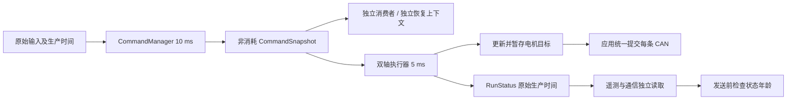

# 双主控哨兵：首个实施包与逐级实板验证

> 历史设计记录；旧 ready/Group 联锁/Session/恢复授权步骤不适用于当前实现。现行契约见[电机持续指令与独立自动恢复重构实施指南](电机持续指令与独立自动恢复重构实施指南.md)。

## 后续全部框架的代码落地

用户随后明确要求直接补齐所有框架，并将实测修改点留作源码 TODO。本轮新增入口与公共接口如下；后面的“首个实施包”计划表与 124 用例记录保留为当时的实施记录，不应当作本轮新增框架已实板通过或已重复测试的依据。

| 阶段 | 已落地入口/公共接口 | 留待确认的 TODO |
|---|---|---|
| 5 惯性控制 | InertialGimbalAdapter、inertial_gimbal，锁 Pitch 与释放配置 | 安装旋转、外置质量接纳、控制增益与误差阈值 |
| 6 共享 CAN | gimbal_shared_can，ShooterExecutor 和双轴独立 Group | 总线负载、周期与故障范围实测 |
| 7 跨板扩展 | V2 capability/request/feedback 全 codec/parser/link/endpoint；interboard 不匹配配置 | 双端升级、链路时延、断流与重启实测 |
| 8 大 Yaw | BigYawExecutor、big_yaw，独立速度环与恢复上下文 | MIT 实际模式/范围、方向、传动与低速参数 |
| 9 双 Yaw | YawCenteringController、dual_yaw_centering 双角色 | 独立中心、跟随方向、死区/迟滞/斜坡与头部稳定验收 |
| 10 单舵轮 | swerve 双 CAN + 原始输入恢复边界 | 方向、轮径、跨总线共同停机 |
| 11 四舵轮 | SwerveHardware、ChassisExecutor、four_swerve | 四轮映射、机械零点、八电机参数与地面运动 |
| 12 消息源 | command_gimbal 裁判/视觉观察/视觉执行配置 | 真实参考会话、AB 弹速/弹数反馈测量和资源接线 |
| 13 功率 | PowerMeasurement、IPowerMeasurementSource、chassis_power | 电流/电压采集、功率模型、完整限制标定 |
| 14 发射 | shooter_bench、loaded 配置、独立事件与卡滞/热量约束 | 实际热量来源、拨盘索引、摩擦弹速与实弹条件 |
| 15 整车 | vehicle_integration 双角色和分阶段配置，applications 复用入口 | 实际端口、整车联动、视觉/发射条件与性能 |

`include/robotics/vehicle/calibration.hpp` 是统一参数来源，所有确认开关默认 false。发射事件的 `fire_event_id/fire_event_stamp` 与周期命令序号分离；恢复丢弃旧单发。空载样例可显式使用相对拨盘参考；整车 loaded 条件下断流后需要真实索引参考。缺失的热量/传感器数据保持无效，等待真实适配，不能用常量伪造许可。

本轮只做最终编译验证，不运行或新增测试、不刷写实板；最终构建结果在本轮完成后追加。软件框架齐全与实物闭环验收是两个独立状态。

本次任务明确禁用古法编程模式，直接实现首个实施包。范围沿用计划中的限定：统一观测与恢复约定、实板执行骨架、CommandManager 接小 Yaw/Pitch；另补优先级相邻的三个安装位置 IMU 观测配置。后续样例在下表中逐级登记，不将规划入口视为已有固件。源码与各 sample README 是已实现 API 的依据。

## 硬件基线与标定

| 板 | 执行机构 | 姿态位置 | 规划资源 |
|---|---|---|---|
| MC02 底盘板 | 4×GM6020 舵向、4×M3508 驱动、DM4310 大 Yaw | 板载对应底盘车体 | 舵向 CAN、驱动 CAN、大 Yaw CAN；板间 UART |
| MC02 云台板 | GM6020 小 Yaw、DM4310 Pitch、2×M3508 摩擦轮、M2006 拨盘 | 板载对应大 Yaw 载体，外置对应随 Pitch 运动的头部 | DJI 共用 CAN、Pitch 独立 CAN；外置按 DM RS485 驱动 |

`command_gimbal` 默认采用 CAN1 小 Yaw、CAN2 Pitch；硬件连接默认未确认，禁止凭编译通过就开启输出。现有小 Yaw 示例安全行程由 encoder 5670—7440 ticks、两端各 100 ticks 余量计算；编码器零点 5670 不等于安全中心。中心作为独立标定量保存。Pitch 的限位、方向、MIT 范围与控制参数需要实测，不能直接把模板当成标定产物。

每次更换电机、关节传动或 IMU 安装，保存一份记录，并让后续样例沿用同一配置：

| 项目 | 底盘/载体/头部或机构 | 测量值 | 配置文件与版本 | 标定人/日期 |
|---|---|---|---|---|
| 控制器/端口、型号、ID、Master ID、模式 | | | | |
| 输出轴单位、减速比、正方向 | | | | |
| 编码器零点、回中中心、软/硬限位 | | | | |
| 最大电流/力矩/速度、温度 | | | | |
| PID、斜坡、周期与反馈时限 | | | | |
| IMU sensor_to_body、frame_id、参考建立过程 | | | | |
| 台架机械性能阈值 | | | | |

## 已实现的数据流与接口



执行线程是机构控制与电机目标的唯一写入者。应用创建 Motor、Group、CanBus，完成 attach/start；双轴机构执行器不持有物理总线，不调用 commit。每周期执行完所有机构后，每条已启动的物理 CAN 提交一次。同一 CAN 上的机构可以有独立 Group；总线故障仍影响这条总线的全部成员。

| 接口 | 契约与边界 |
|---|---|
| `CommandManager::current/snapshot` | 线程调用，复制当前快照，可多消费者读取；`-EAGAIN` 表示尚无发布，失败保持输出参数；不更新源的时间戳。对象、来源与接收器静态生命周期。 |
| `sourceStamp(frame, source)` | Remote/KeyboardMouse 保留原 remote 时间与序号；Vision 保留 selected_vision 原始微秒 stamp。最终命令仲裁序号不是原始来源更新的证据。 |
| `RecoveryGate::withdraw` | 撤销授权与旧准备边界；调用方负责 disable 和丢弃目标。硬故障进入 Blocked，显式解除后重新准备。 |
| `RecoveryGate::prepared(now_ms)` | 仅在前置条件、参考与控制历史重置全部完成后调用；递增本机构恢复代次，记录准备边界。零时限配置与代次溢出进入 Blocked。 |
| `RecoveryGate::accept` | 检查最终命令与原始输入的年龄和严格晚于边界的生产时间；等待状态不反复移动边界。Enabling/Active 阶段失效立即撤销。 |
| `RecoveryGate::enabled` | 使能握手完成后才进入 Active；不能把已撤销的 Enabling 变回 Active。 |
| `SnapshotCache<T>` | 短 spinlock 内复制完整快照，不消费，不重盖时间；线程调用，ISR 返回 `-EWOULDBLOCK`。 |
| `RunStatus::stamp` | 执行所有者在真实 update/生产时更新，通信和缓存读取不能更新。generation 是恢复上下文，stamp.sequence 是生产序号。 |
| `wireFeedback(status, now, timeout)` | 生产年龄过期、无效或未来时间时 ready/armed 撤销，输出 V1 Waiting 与 FeedbackStale。V1 布局、字段含义和枚举不增加。 |
| `InterBoardEndpoint::Config::status_timeout_ms` | 默认 100 ms，发送心跳和底盘反馈前检查本地状态生产年龄；心跳在线不代表执行所有者仍运行。 |

统一恢复顺序：立即撤销输出和旧目标 → 等总线、反馈、参考、许可与周期有效 → 准备参考并重置历史 → 更新本机构恢复上下文 → 接受准备边界后的新原始输入及仲裁命令 → 申请使能 → Enabling 期间继续监督 → Active。暂态条件恢复后自动推进；急停、硬错误和显式清除条件单独处理。

头部惯性控制尚未实现。机械 GimbalAxis 的角度是关节反馈坐标，不能直接当成头部惯性航向。后续必须增加姿态控制适配层，消费头部姿态/角速度、原始 stamp、质量和参考代次，以及小 Yaw/Pitch 机械反馈、参考和限位。机械参考变化后可按标定恢复；惯性和视觉目标必须重新建立一致参考会话。

## 首个实施包的入口与操作

1. `include/robotics/execution/` 定义恢复门、快照缓存和状态生产约定。
2. [execution_skeleton](../../samples/robotics/execution_skeleton/README.md) 启动真实 CommandManager，合成输入与独立消费者，只模拟执行状态，不连接电机。先用它观察缓存、停输入、停单消费者、恢复与周期失效。
3. [command_gimbal](../../samples/robotics/command_gimbal/README.md) 以真实 RemoteSource 和双轴 Group 运行机械控制；先配置接线、单位、方向与软限位，确认后开启硬件连接配置。
4. [dual_imu](../../samples/imu/dual_imu/README.md) 提供底盘板与云台板配置，三个 frame_id 分别标识底盘、载体、头部，输出各字段的原始时间、年龄、质量与 epoch。不融合姿态，也不自动驱动电机。
5. [interboard](../../samples/communication/interboard/README.md) 新增 `s` 暂停状态生产，保留 poll 和心跳；`p` 暂停命令生产，`g` 改变恢复代次。
6. [command_service](../../tests/command_service/README.md) 与 [execution](../../tests/execution/README.md) 为服务线程、缓存、多消费者、恢复边界和状态过期提供原生测试。CI 同时执行已有 motor/regression 与 vision_imu。

构建从仓库根目录执行，每个入口独立输出目录：

```sh
west build -p always -b dm_mc02/stm32h723xx samples/robotics/execution_skeleton -d build/execution_skeleton
west build -p always -b dm_mc02/stm32h723xx samples/robotics/command_gimbal -d build/command_gimbal
west build -p always -b dm_mc02/stm32h723xx samples/imu/dual_imu -d build/imu_gimbal
west build -p always -b dm_mc02/stm32h723xx samples/imu/dual_imu -d build/imu_chassis -- -DEXTRA_CONF_FILE=chassis.conf
west build -p always -b dm_mc02/stm32h723xx samples/communication/interboard -d build/interboard_gimbal
west build -p always -b dm_mc02/stm32h723xx samples/communication/interboard -d build/interboard_chassis -- -DEXTRA_CONF_FILE=chassis.conf
ZEPHYR_TOOLCHAIN_VARIANT=host/gnu west twister \
  -T tests/algorithms -T tests/command_manager -T tests/command_service \
  -T tests/execution -T tests/motor/regression -T tests/vision_imu \
  -p native_sim/native/64 --inline-logs -O build/first-package-tests
```

先只给主控供电，检查启动与无输出观测；断电接线，支撑云台避免 Pitch 因停机下落；确认低电流/力矩限制和可触达断电手段，再给电机动力。遥控禁用状态上电，逐轴低速验证方向，最后组合。失效场景的操作、可暂停项和 console 预期以 sample README 为准。不要在双轴实物主动运行时用手握住关节制造故障。

## 后续里程碑及文件顺序

“规划”表示未新增该入口；实际机械通过条件均须记录，不由本次软件验证代替。

| 阶段 | 入口与当前状态 | 下一步文件与实施顺序 | 主要通过条件 |
|---|---|---|---|
| 0 板级基础 | hello、can_smoke、imu 已有 | 先板配置，再独立入口；输出保持禁用 | 启动、遥测、物理总线和采集 |
| 1 实际电机 | DJI/DM 位置速度样例已有 | 保存硬件配置，再方向/反馈/限幅 | 型号、ID、模式、输出轴单位、停机 |
| 2 执行骨架 | execution_skeleton 本包新增 | 通用 gate/cache → 合成来源 → 独立消费者 | 输入和状态停产、独立恢复 |
| 3 小云台 | gimbal_control 已有；command_gimbal 本包新增 | 双轴执行器 → 双 CAN 配置 → 仲裁接入 | 限位、两轴共同停机和恢复 |
| 4 姿态参考 | dual_imu 本包增加两个安装配置 | frame/epoch → 原时间遥测 → 安装变换标定 | 人工分别转底盘/大 Yaw/小 Yaw/Pitch |
| 5 头部稳定 | inertial_gimbal 规划 | 姿态适配接口 → inertial controller → sample | 锁 Pitch 人工转载体，小 Yaw 反向补偿；再释放 Pitch |
| 6 云台共享总线 | gimbal_shared_can 规划 | 摩擦/拨盘执行器 → 应用总线统一 commit → sample | 空载五个执行机构同周期提交，故障组隔离 |
| 7 跨板契约 | interboard V1 已有，本包补状态过期；大 Yaw 扩展规划 | messages → protocol IDs/version → codec → parser → link → endpoint → 双端 sample | 旧命令、状态停产、单板重启、版本不匹配均禁用新增轴 |
| 8 大 Yaw 单轴 | 基于 dm_mit_velocity_control 规划配置 | 独立硬件配置 → 速度内环 → 连续旋转观测 | 低速正反转、反馈断流、恢复，无固定绝对零点依赖 |
| 9 双 Yaw 回中 | dual_yaw_centering 双板规划 | 云台外环 → 扩展请求/反馈 → 底盘独立执行器 | 小 Yaw 中心误差下降，头部指向保持，无持续追赶 |
| 10 单舵轮拓扑 | swerve 已有单模块，分 CAN 扩展规划 | board_config → 两 CAN attach → 统一周期提交 | 翻轮、方向、轮径换算和共同停机 |
| 11 四舵轮 | four_swerve 规划 | 四轮几何/映射 → 八电机 Group → SwerveChassis → sample | 平移、转动、组合运动、故障范围和负载 |
| 12 消息源组合 | command_gimbal 的裁判/视觉变体规划 | permissions → 视觉仅观测 → 视觉执行 | 来源切换、人工接管、目标过期、参考变化 |
| 13 底盘功率 | chassis_power 规划 | 实测功率链 → 模型标定 → 预算执行 → sample | 预算下降/过期、缩放、buffer 与舵向误差 |
| 14 发射机构 | shooter_bench 规划 | 摩擦就绪 → 拨盘分度 → 发射事件 → 业务约束 | 单发、连发、卡滞、热量、许可、云台状态 |
| 15 整车 | vehicle_integration 规划，applications 仍是骨架 | 样例稳定配置 → 手动整车 → 视觉 → 发射 → applications 收敛 | 底盘运动、回中、功率和恢复的组合影响 |

阶段 5 与 8 可以独立推进，通过后才能组合阶段 9。已有底盘固件、搜索、导航和旧固件适配均不作为首轮依赖。共享 CAN 的空载资源验证与实际发射动作验收保持独立入口。

## 后续接口契约

大 Yaw 外环位于云台板。它消费小 Yaw 相对标定中心的偏差，先经过死区、迟滞，再限速和斜坡，输出角速度请求。底盘板负责速度/扭矩内环。大 Yaw 与四舵轮必须拥有不同恢复上下文；轮控恢复不能授权大 Yaw。只有头部惯性保持通过验收后，才能开放外环。

| 大 Yaw 扩展接口 | 最小字段 |
|---|---|
| 请求 | Disabled/Follow 模式、目标 rad/s、原始生产序号与年龄、目标 boot_id、大 Yaw 独立恢复代次、有效运动许可 |
| 反馈 | 实际 rad/s、执行状态、ready 与等待原因、独立恢复代次、原始反馈生产年龄及有效性 |

保留 V1 字段和含义，新增组合使用明确扩展版本和消息 ID，双端同时升级。不能只加消息结构体；编解码、parser 队列、link 会话与 endpoint 生产/消费全部接通。版本不匹配、年龄溢出、未来时间、无效许可或错误恢复上下文均不得开放新增轴。跨板时间域不同：转发原始年龄并叠加本地接收后的时间，不直接比较两板 uptime。

单发需要独立事件编号去重。恢复时丢弃旧射击事件，不能把周期命令生产序号当成新单发事件。连发持续满足新鲜请求、摩擦就绪、云台有效、许可与热量条件。头部 IMU 断流或参考变化暂停惯性控制、回中和射击；轮控按自己的有效条件处理。

## 验收记录

每个样例固定覆盖正常、输入/执行失效、满足条件后恢复、故障影响范围四类场景。记录源序号、原始年龄、最终命令、执行状态、等待原因、恢复代次、反馈、总线错误。控制周期先采用 5 ms，仲裁 10 ms；命令时限沿用配置起点，机械性能阈值由单机构标定后固定。

| 操作 | 预期 |
|---|---|
| 停命令生产，通信继续 | 超时撤销相关执行输出 |
| 停状态生产，心跳继续 | 对端在线，但不能继续认为就绪/Active |
| 单板重启或机构恢复代次变化 | 旧上下文拒绝，新上下文新命令后恢复 |
| 头部 IMU 断流/参考变化 | 暂停依赖该参考的机构，其余按各自条件运行 |
| 大 Yaw 跟随 | 中心误差减小且指向保持 |
| 共 CAN 单机构故障 | 机构 Group 停机；物理总线故障影响全总线 |
| 功率预算下降/过期 | 按配置限幅或撤销，记录实际功率和舵向误差 |
| 摩擦未就绪/拨盘卡滞 | 阻止拨盘，恢复不重放旧单发 |

```text
样例/配置/板型：
源码版本与硬件标定版本：
接线、动力限制与安装位置：
场景及操作时间：
源序号/原始时间与年龄：
最终命令/状态/等待原因/恢复代次：
反馈与总线错误：
周期/耗时/超限次数：
撤销输出延迟/队列峰值/总线负载/栈余量：
机械阈值与实际结果：
结论：编译通过 / 原生契约通过 / 实板通过 / 待验证
记录人/日期/附带日志：
```

软件验证结果另在下方登记。所有新实板入口的实际运行、接线、Pitch 标定、IMU 安装变换和机械性能均为待验证；编译通过不改变这一状态。

## 本次软件验证登记

2026-10-02，使用工作区固定 Zephyr `6085aadeb337`（版本输出 v4.4.0-6527）、宿主 GNU 和 Zephyr SDK 1.0.1 ARM GNU 完成以下验证。没有刷写或驱动实板电机。

| 原生套件（native_sim/native/64） | 用例结果 |
|---|---|
| algorithms：含新增单舵轮/四舵轮组合契约 | 86/86 通过 |
| command_manager：同步仲裁 | 10/10 通过 |
| command_service：真实 worker、缓存与多消费者 | 2/2 通过 |
| execution：恢复边界、生产年龄、真实 V1 endpoint | 7/7 通过 |
| motor/regression：含 4 个双 CAN 云台生命周期用例 | 18/18 通过 |
| vision_imu：流转集成 | 1/1 通过 |
| 合计 | 124/124 通过 |

| MC02 构建入口/配置 | 编译 | 实板 |
|---|---|---|
| execution_skeleton | 通过 | 待验证 |
| command_gimbal：默认关闭输出、CAN1/CAN2 | 通过 | 待标定与验证 |
| dual_imu：默认载体/头部配置 | 通过 | 待安装变换与实测 |
| dual_imu：chassis.conf | 通过 | 待安装变换与实测 |
| interboard：默认 UART 配置 | 通过 | 待双板验证 |
| applications/sentry_gimbal | 通过 | 仍为应用骨架 |
| applications/sentry_chassis | 通过 | 仍为应用骨架 |

首轮发现并处理的验证问题：vision_imu 用例名补 `test_` 前缀以符合 Twister 发现规则；双消费者测试使用 yield 交错读取，避免 100 Hz 时钟将连续 1 ms 休眠推至来源过期；电机夹具补齐 DM 原始温度有效反馈，并按真实 TransportError→Offline/参考失效契约验证自动恢复，而非错误要求显式清故障。随后只重跑失败套件，已通过套件未重复执行。

本次机器上的报告：初轮原生测试 `/tmp/skywalker-first-package-tests/twister.json`，失败套件最终重跑 `/tmp/skywalker-first-package-rerun/twister.json`，样例构建 `/tmp/skywalker-first-package-mc02/twister.json`；两应用构建日志位于 `/tmp/skywalker-first-package-sentry-gimbal.log` 和 `/tmp/skywalker-first-package-sentry-chassis.log`。原生最终结果需合并初轮已通过套件与最终重跑报告。Twister 使用本地进程管理 socket，已在允许该本地 IPC 的执行环境运行；两应用的编译缓存明确放在 `/tmp`。

验收收尾：

- [x] 统一原始输入/仲裁/执行生产时间和独立恢复上下文。
- [x] 实板执行骨架与双轴 CommandManager 入口。
- [x] 三个安装位置的独立 IMU 观测配置。
- [x] 六套测试及 MC02 配置变体接入 CI，修正样例索引。
- [x] 原生契约测试与上述 MC02 编译完成。
- [ ] Pitch 限位/方向、各轴参数和 IMU 安装变换实测。
- [ ] 单机构与新样例实板验收。
- [ ] 头部惯性控制、大 Yaw 单轴和双 Yaw 回中。
- [ ] 共享 CAN、四舵轮、功率、发射与整车后续里程碑。


## 2026-10-02 本轮框架构建登记

本轮禁用古法编程模式，直接实现代码。下列入口在 `dm_mc02/stm32h723xx` 编译通过，共 30 个已登记样例配置，加两份 applications 与 `gimbal_control`，合计 33 个构建入口。未执行测试程序、烧录或实板验证；前文 124/124 是首个实施包的历史测试结果。

| 入口 | 已编译配置 | 实板状态 |
|---|---|---|
| execution_skeleton | 默认 | 待验证 |
| command_gimbal | 默认、referee、vision_observe、vision_execute | 待验证 |
| inertial_gimbal | pitch_locked、pitch_free | 待验证 |
| gimbal_shared_can | 默认空载 | 待验证 |
| interboard | 默认 V2、version_mismatch | 待双板验证，无电机输出 |
| big_yaw | 默认速度台架 | 待验证 |
| dual_yaw_centering | gimbal、chassis | 待双板验证 |
| swerve | 舵向/驱动双 CAN | 待验证 |
| four_swerve | 默认八电机组合 | 待验证 |
| chassis_power | 默认裁判与测量台架 | 待测量/模型标定 |
| shooter_bench | 默认空载、loaded | 待归位/热量接入与实板验证 |
| vehicle_integration | gimbal.manual、chassis.manual、vision_observe、vision_execute、referee、shooting、chassis.power | 待逐级整车验证 |
| dual_imu | gimbal/head、chassis | 待安装变换与参考标定 |
| command_manager、command_safety、yaw_gimbal | 各默认配置 | 本轮未重做实板验证 |
| gimbal_control | 默认机械双轴 | 本轮未重做实板验证 |
| sentry_gimbal、sentry_chassis | 各默认整车角色 | 待整车验证 |

本轮修正了编译器报告的拨盘 float/double 隐式提升和双 Yaw 启动分支缩进问题，三个失败配置重编通过；已登记的版本失配配置也单独编译通过。CI 会构建注册的阶段变体。

中央配置 `include/robotics/vehicle/calibration.hpp` 保存电机 ID、方向、减速比、零点、机械限位、回中中心、低功率参数与三个安装变换。TODO 仍包括实际接线/模式确认、控制参数标定、实测功率源和模型、发射权限与热量源、拨盘真实归位参考、实物故障恢复与周期负载测量。连接确认、安装变换、功率模型和发射条件的完成标志默认关闭。

整车运行时通过 `IPowerMeasurementSource`、`IShooterHeatSource`、拨盘归位接口接收真实测量；默认 Pending 源报告无效，有载动作等待有效数据。空载台架允许相对拨盘参考重建的配置单独存在，不能作为有载发射的标定结果。

从仓库目录构建全部登记样例（只编译）：

```sh
west twister --build-only -T samples/robotics -T samples/imu/dual_imu \
  -T samples/communication/interboard -p dm_mc02/stm32h723xx \
  --inline-logs --jobs 2 -O /tmp/skywalker-framework-mc02
west build -b dm_mc02/stm32h723xx -d /tmp/sentry-gimbal applications/sentry_gimbal
west build -b dm_mc02/stm32h723xx -d /tmp/sentry-chassis applications/sentry_chassis
west build -b dm_mc02/stm32h723xx -d /tmp/gimbal-control samples/robotics/gimbal_control
```

各 sample README 给出接线、暂停命令/执行生产、恢复、故障组范围与观测项目。后续按本指南逐级填写实板记录，不能将本轮编译状态改写成实板通过。
