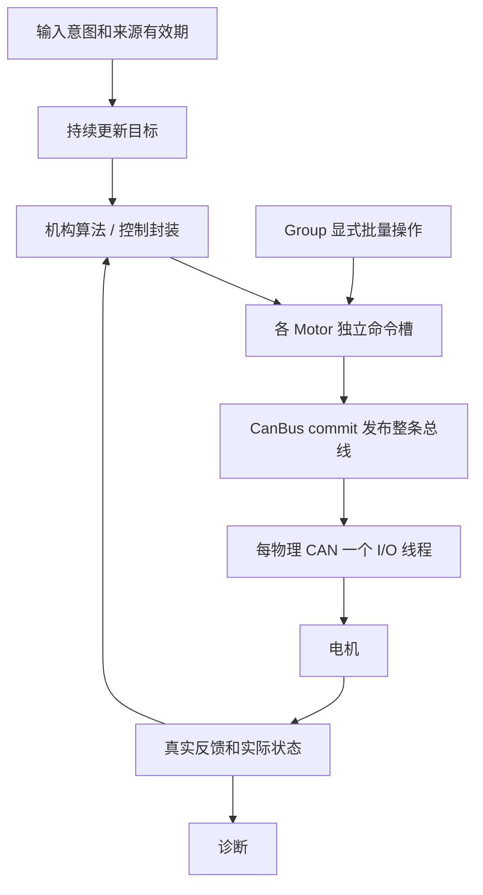

# 电机持续控制、逐轴恢复与并发调用

上层持续表达运行意图和最新目标，每台电机独立处理实际执行和恢复。设备不存在、掉线或报告故障不会要求上层重新启动，也不会由 Group 传播停机。主动停止、急停和真实输入过期由输入入口处理。

型号与字节编码见 [DJI](../modules/drivers/motor-dji.md)、[DM](../modules/drivers/motor-dm.md)，PID 封装见[电机控制](../modules/control/motor-control.md)。

## 对象职责

| 对象 | 负责内容 | 执行位置 |
| --- | --- | --- |
| 输入入口 | 用户启停、急停、命令来源年龄 | 输入／业务线程 |
| 机构算法 | 运动学、机械坐标与目标 | 业务控制线程 |
| PositionMotor／VelocityMotor | 保存目标，按本轴有效反馈计算 A／N·m | 调用 update 的线程 |
| Motor | 运行意图、最新命令、真实反馈、实际状态 | API 与所属 CAN 工作线程 |
| Group | 对固定成员批量 enable／disable，统计成员 | 调用线程，无独立生命周期 |
| CanBus | 完整发布快照、收发、各端点协议恢复 | 每物理 CAN 一个工作线程 |
| DJI／DM codec | 既有厂商协议编解码 | CAN 工作线程 |



Motor、Group 和控制器不创建线程。一个物理 CAN 只有一个 CanBus owner，DJI 与 DM 可以共享，多个 Group 可以引用端点进行明确批量操作。

## 从初始化到持续运行

1. 静态构造电机、总线和控制器。
2. 给对应物理 CanBus attach 全部端点，然后 start。
3. 配置控制器。能力／参数错误属于初始化错误。
4. 用户启动后持续 enable 和 setter/update，设备尚未有反馈也接受。
5. 每个物理 CAN 每周期 commit 一次。
6. 底层独立建立实际执行条件；反馈恢复后控制器自行重置本轴历史。

```cpp
// 所有错误都记录，但本轴等待不得跳过其他轴。
void tick(bool requested, float first_target, float second_target, float dt) {
    if (requested) {
        recordCallError(first_motor.enable());
        recordCallError(second_motor.enable());
        recordCallError(first_axis.update(first_target, dt));
        recordCallError(second_axis.update(second_target, dt));
    } else {
        recordCallError(first_motor.disable());
        recordCallError(second_motor.disable());
    }
    recordCallError(bus.commit().error);
}
```

`requested` 只由输入意图和有效期改变，不由 MotorState 改变。`recordCallError()` 是应用自己的错误记录接口。两个轴位于不同物理 CAN 时，两条总线分别 commit，不能因为第一个结果失败漏掉第二条。

本地固定目标由周期任务持续生产；没有新的控制台按键不等于命令源失联。遥控、板间或其他外部命令则保留原始生产时间，不能重复读取旧输入并重新盖上当前时间。

## 三个成功结果

| 调用 | 返回成功的含义 |
| --- | --- |
| setter／update | 目标已接受；暂不可执行也属于成功接收 |
| commit | 已发布最新总线命令快照；Recovering 期间也接受 |
| CAN TX 完成 | 这帧实际完成发送 |

这些结果均不代表机械已经到位或停止。

setter 只拒绝本次非法调用，如非有限值、超过明确数值范围、协议不支持或写入者不匹配。设备状态不作为上层命令写入的准入条件。

## 命令、取消版本与计算依据

每个端点保存最新值，后写覆盖前写，不积压掉线期间的历史目标。命令 `written_ms` 来源于 setter，commit、恢复和重复发布都不续期。

| 版本 | 变化时机 | 用途 |
| --- | --- | --- |
| cancellation generation | 用户运行→停止 | 拒绝停止之前的旧命令 |
| protocol generation | 协议尝试取消／重试 | 拒绝旧使能／清错回调 |
| enable generation | 本轴重新实际激活 | 作废以前反馈计算出的输出 |
| reference generation | 可信坐标改变／失效 | 重置依赖该坐标的控制历史 |

直接电流／力矩或原生模式目标只受命令取消版本和年龄约束。由反馈计算的电流／力矩携带计算快照的 enable generation：

```cpp
const auto sampled = motor.snapshot();
// calculate() 必须以 sampled 中的实际反馈为依据。
const float current_a = calculate(sampled.feedback);
recordCallError(motor.setCurrent(current_a, sampled.enable_generation));
```

不能在计算完后重新取当前版本给旧结果贴标签。PID 封装内部使用同样的带版本 producer 接口；反馈暂不可用时 `invalidateComputedEffort()` 作废计算输出，不撤销运行意图。

## 停止与恢复

`disable()` 在运行意图真→假时取消此前目标和协议尝试，并异步请求停止。已停止时重复调用返回成功，不推进取消版本，也不擦掉停止之后新提交的目标。重新 enable 只能使用停止之后的有效目标。

| 事件 | 本轴执行 | 上层及其他轴 |
| --- | --- | --- |
| 首次没有设备 | 限频探测／协议尝试 | 持续接收目标 |
| 反馈过期 | 本轴等待，新反馈后自动恢复 | 意图与目标生产继续 |
| 命令过期 | 采用停止输出，新目标可继续 | 不锁存硬件故障 |
| DM 驱动故障 | 自动限频清错与使能 | 其他轴照常运行 |
| Enable 超时 | 等下一次本轴重试 | 不要求用户复位 |
| 单 CAN 故障 | 恢复控制器，保留最新发布 | 其他 CAN 正常执行 |
| 多圈参考丢失 | 依赖该参考的轴等待 | 速度控制及其他轴继续 |
| 用户停止／急停 | 取消旧输出和恢复操作 | 输入意图具有最终决定权 |

DM 协议确认用 callback 顺序号区分同一毫秒内 RX／TX。协议任务与正常目标交替调度，协议端点轮转；缺失端点按 retry_interval_ms 等待，不忙等。

连续位置丢失后不能凭第一帧重新定义旧零点。可信绝对角可自动恢复；连续／相对参考等待显式提供正确坐标。`reseedPosition()` 仅更新本轴参考，不停其他轴。

### 停止报告

| StopProgress | 含义 |
| --- | --- |
| None | 当前无需要报告的停止请求 |
| Pending | 等待本次停止帧发送 |
| TxComplete | 对应停止帧发送完成 |
| DriveConfirmed | DM 在对应 TX 之后反馈 Disabled |
| Unreachable | 暂未获得所需设备确认 |

已交给硬件的一帧可能存在在途残留。迟到 Enable／Clear 回调必须匹配本轴协议版本才能改变实际状态。停止报告不等于机械刹停测量。

## 发送候选与共享 DJI 帧

commit 在短锁内发布完整命令数组和 sequence。I/O 从一次发布复制候选，捕获参与端点的状态和版本，再编码；不能逐槽重读不同批次。

提交前只锁涉及的 Motor 和 TX 上下文，确认年龄、取消版本、执行依据和协议操作仍有效。Group 不参与授权或锁排序。锁外调用 `can_send(K_NO_WAIT)`，不持锁等待硬件。

DJI 四槽分别判断可执行性，一个离线成员只将自己的槽位变为零。为某个停止端点发送的共享帧仍保留其他正常端点的非零目标。停止确认只记入实际携带停止动作的端点。

总线恢复保存 `published_` 与目标原时间；恢复后重新安排最新批次，过期目标不会复活。旧 TX 上下文必须在 `can_stop()` 终止／完成回调后才能复用。RX 队列保留接收时间、总线版本和 callback 顺序，积压反馈不能冒充新鲜测量。

## 并发约定与期限

- 同一个控制器的 configure/reset/update 串行执行。telemetry 锁只保护快照读取。
- 同一电机由一个普通目标写入者负责，producer 绑定只处理身份，不附带温度／超速授权。
- 不同线程使用不同物理 CAN 可以独立 update／commit。
- 多线程共享 CAN 时指定统一发布者，或串行化整组 setter/update 和 commit。内部短锁不提供整个业务周期的事务性。
- commit 收集整条总线，未协调会把不同周期的轴目标混在一起。
- 对必须同周期配对的轴由应用协调；独立轴不增加全员就绪屏障。

Timing 采用具名字段：feedback_timeout_ms、command_timeout_ms、enable_timeout_ms、retry_interval_ms。DJI 默认为 20、10、100、100 ms；J4310 默认为 50、20、3000、100 ms。

BusOptions 默认 TX 等待 2 ms、控制器恢复间隔 100 ms。每轮 RX 处理有界，协议工作有界，下一次等待考虑当前尝试与重试期限。控制器状态仍采用短周期探测；忙碌时有界让出 CPU。实际调度和延迟依赖板卡 tick、优先级与 CAN 负载。

## 诊断入口

先看 `enabled_requested` 和最近命令序号，确认输入入口是否持续生产；再看反馈年龄、实际 state、output_permitted、retry_count 和位置参考。最后看 BusStatus.state、last_tx 和 last_recovery。

历史错误和当前状态分别理解：总线已经 Running 时，last_recovery 保留上次故障并不表示目前仍然故障。一个成员掉线连带其他总线停止时，检查应用输入撤权或主动 disable 路径；Group 自身没有故障传播。

此文描述软件契约。实际 CAN 电气故障、模式配置、连续坐标可信来源和机械执行需要对应硬件确认；自动恢复不能修正错误接线、协议量化范围或机构坐标。
