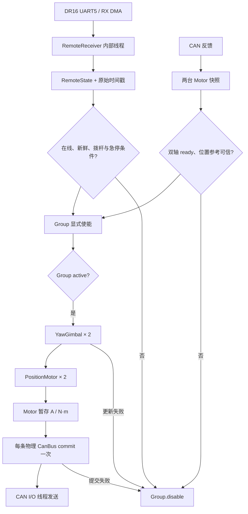
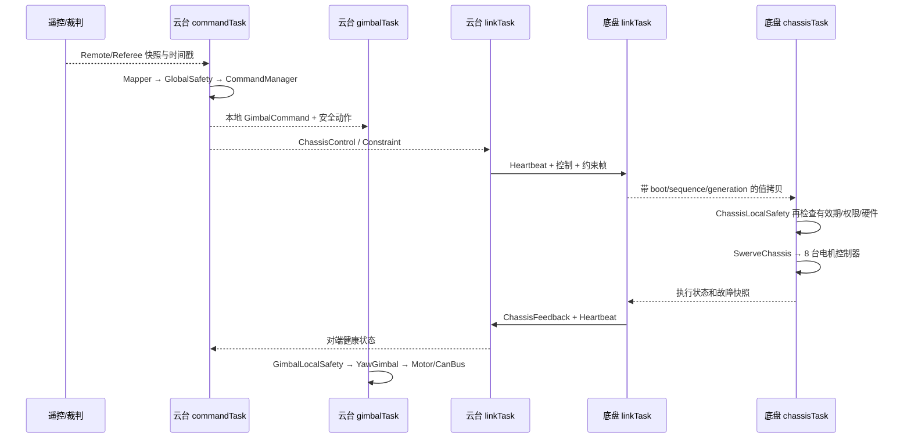

# 模块联动与调用路线

本文从实际入口追踪两条路径：遥控双轴云台样例，以及云台板到舵轮底盘应用。先读 [模块地图](README.md#模块地图)，再按一条路线顺序看初始化、周期调用和异常撤销。代码是从当前样例提取的关键片段；变量、配置和线程定义仍以所链源码为准。

## 共同规则：设备、消息、控制、执行

| 层 | 谁负责 | 进入下一层的条件 |
|---|---|---|
| 设备和协议 | 设备树、`CanBus`、`AsyncUart`、传感器驱动 | 设备 ready，接收数据有原始时间戳 |
| 消息和安全 | `RemoteReceiver`、裁判/板间解析、`GlobalSafetyManager`、本地安全 | 消息有效且未过期，权限与配置满足 |
| 控制 | `YawGimbal` / `SwerveChassis`、`PositionMotor` / `VelocityMotor` | 反馈和位置参考可信，真实 `dt_s` 在范围内 |
| 输出 | `Motor`、`Group`、`CanBus` | 显式使能后进入 active；一次控制周期一次提交 |

`ready` 表示执行器具备安全准备条件，`active` 才表示本代次允许运动。`Motor` setter 或控制器 `update()` 只暂存目标；`CanBus::commit()` 发布整条 CAN 的快照，I/O 线程随后异步发送。任何模块发现输入过期或错误，应撤销相应输出域，再由新的有效输入和显式使能恢复。完整状态图见 [电机工作链路](17-motor-workflow.md#5-停机故障和恢复)。

## 遥控到双轴云台

对应 [gimbal_control 样例](../samples/robotics/gimbal_control/README.md) 和 [实际主循环](../samples/robotics/gimbal_control/src/main.cpp)。它用一台 GM6020 yaw 和一台 DM MIT pitch 展示异品牌共总线或跨总线联动；默认 `connections_configured=false`，需核对真实硬件后才可放行。



### 初始化顺序

1. 静态创建每轴的 `Motor`、`PositionMotor`、`YawGimbal`，以及共用的 `Group`；跨 CAN 时仍先建立完整 Group。
2. 给每台电机选择其物理 `CanBus`，先 `attach()` 全部端点，再 `start()`；同 CAN 只启动一个总线。
3. 对两轴调用 `YawGimbal::begin()`，它会配置控制器；接收模块单独 `start()`。等待真实反馈、位置参考和安全条件，不把 `start()` 的返回值当作反馈已就绪。
4. 在失能状态重建必要的连续位置参考，调用两轴 `reset()`，再请求 `Group::enable()`；收到 active 状态后才执行运动命令。

关键调用关系与样例相同，省略对象构造和错误日志：

```cpp
// 对应 samples/robotics/gimbal_control/src/main.cpp 的 gimbalTask。
const bool split_buses = board_config::yaw_can != board_config::pitch_can;
int ret = split_buses ? yaw_bus.attach(yaw_drive)
                      : yaw_bus.attach(yaw_drive, pitch_drive);
if (ret == 0 && split_buses) ret = pitch_bus.attach(pitch_drive);
if (ret == 0) ret = yaw_bus.start();
if (ret == 0 && split_buses) ret = pitch_bus.start();
if (ret == 0) ret = yaw.controller.begin();
if (ret == 0) ret = pitch.controller.begin();
```

### 一个控制周期

业务线程读取自己的 `RemoteReceiver::Snapshot`，再用 `remote.online` 和 `isFresh(remote.stamp, now, command_timeout_ms)` 检查有效期。左拨杆安全位先允许重新使能，中位才请求运行；急停、任一轴反馈失效、控制周期超限或组故障都撤销整个组。以下只展示 active 后的更新和提交，门控与复位过程请读实际主循环：

```cpp
// yaw.update / pitch.update 内部构造 GimbalCommand 并调用 YawGimbal::update。
const int yr = yaw.update(yaw_rate, remote.stamp, dt);
const int pr = yr == 0 ? pitch.update(pitch_rate, remote.stamp, dt) : 0;
int submit = 0;
if (yr == 0 && pr == 0) submit = yaw_bus.commit().error;
if (yr == 0 && pr == 0 && submit == 0 && split_buses)
    submit = pitch_bus.commit().error;
if (yr < 0 || pr < 0 || submit < 0) (void)gimbal.disable();
```

同 CAN 两轴在一次 `commit()` 中发布；跨 CAN 分别提交，不能据此推断两帧同时到达。`Group` 负责共同使能/停机，不能用其中一台 `Motor::enable()` 绕开。GM6020 的 effort 是 A，DM MIT 是 N·m；输出限幅、绝对角/连续角参考和 pitch 机械支撑必须分别核对。详见 [两种型号](04-drivers-motor-dji.md)、[DM 模式](05-drivers-motor-dm.md)与[位置控制器](09-motor-wrapper.md)。

## 双主控命令与安全闭环

对应 [sentry_gimbal](../applications/sentry_gimbal/src/main.cpp) 和 [sentry_chassis](../applications/sentry_chassis/src/main.cpp)。应用分别构建、分别刷写；`applications/` 是可读的整机骨架，默认连接开关阻止未配置硬件运动。



### 云台板如何生成命令

`commandTask` 对遥控、裁判、底盘心跳和底盘反馈各取一次值拷贝，使用当前时间判断新鲜度。样例调用骨架如下；`input` 的所有安全字段、配置阻断和返回值处理仍必须按 [源码](../applications/sentry_gimbal/src/main.cpp) 填齐：

```cpp
OperatorIntent intent{};
mapper.map(remote, intent);
GlobalSafetyInputs input{};
input.now_ms = now;
input.command_source_fresh = remote.online &&
    isFresh(remote.stamp, now, board_config::command_timeout_ms);
input.chassis_heartbeat_stamp = peer.stamp;
input.chassis_feedback_stamp = feedback.stamp;
GlobalSafetyDecision decision{};
safety.evaluate(input, decision);
RobotCommand command{};
if (manager.step(intent, decision, now, command) == 0) {
    auto routed_decision = decision;
    if (decision.state != SafetyState::EmergencyStop)
        routed_decision.active_reasons &= ~EmergencyStop;
    router.route(command, routed_decision, peer);
}
```

这里的 `SafetyAction::Disable`/`Hold`/`Active` 是业务授权；它仍要经过云台或底盘的本地安全检查，不能直接解释成驱动已使能。板间协议会用 heartbeat、boot ID、帧序号和恢复代次拒绝旧控制；详见 [通信层](13-communication.md#5-boot--sequence--generation) 和 [机器人安全](14-robotics.md)。

### 底盘板如何执行

底盘 link 线程负责收发和解析，底盘控制线程消费消息值拷贝。`ChassisLocalSafety` 在本地检查对端心跳、命令、反馈、执行器和权限；通过后，`SwerveChassis` 产生四模块目标，由 `DjiChassisHardware` 更新 4 台舵向 GM6020 与 4 台驱动 M3508，并对所用总线提交。失联或故障时，本地撤销输出，不等待云台板再次发送 Disable。具体线程和配置位置见 [应用骨架](15-applications.md)。

## 选择入口与验证边界

| 只想验证 | 先运行 | 再接入 |
|---|---|---|
| UART 字节能否成为遥控/裁判/板间消息 | `samples/communication/*` | [通信层](13-communication.md)的快照和超时语义 |
| 安全状态能否按旧帧、急停、恢复变化 | `samples/robotics/command_safety` | `sentry_gimbal` 命令线程 |
| 单轴/双轴控制与停机 | `samples/robotics/yaw_gimbal`、`samples/robotics/gimbal_control` | `sentry_gimbal` 云台线程 |
| 舵轮运动学和硬件方向 | `samples/robotics/swerve` | `sentry_chassis` 四模块 |
| CAN 混挂、掉线和恢复 | `samples/motor/mixed_topology`、`samples/motor/recovery` | 两端应用的 CAN 总线 |

软件返回值、日志和回归测试只能说明当前软件状态；不能证明动力已经切断、机构已经停止或电气接线正确。上机前确认终端电阻、总线波特率、电机模式和 ID，支撑易下坠机构，先验证低限幅与物理断电路径。
