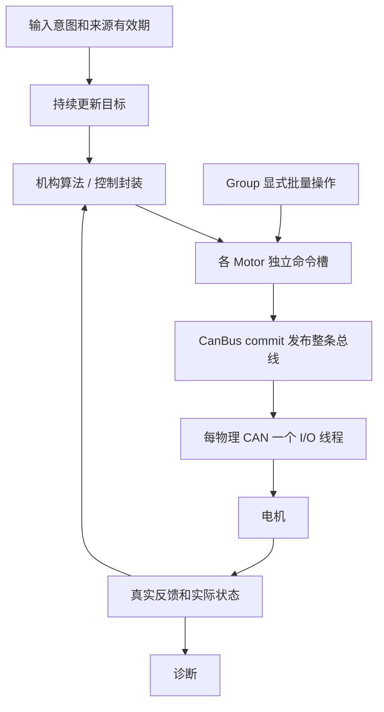

# 公共电机模型：Motor、CanBus 与 Group

当前源码基线：`main@99a97c9`（2026-10-05）。DJI 和 DM 共用同一套持续目标、异步发布和逐轴恢复模型。运行意图、实际设备状态、命令生产时间与位置参考分别管理。

本文负责公共语义；[DJI](motor-dji.md) / [DM](motor-dm.md) 负责型号和协议，[控制封装](../control/motor-control.md) 负责反馈到输出的计算，[周期工作流](../../guides/motor-workflow.md) 负责应用装配，[迁移指引](../../guides/motor-migration.md) 说明旧代码如何适配。常用签名及参数见 [DJI 接口参考](../../api/motor-dji.md)、[DM 接口参考](../../api/motor-dm.md)、[控制器接口参考](../../api/motor-control.md)。

## 对象职责

| 对象 | 负责内容 | 执行位置 |
| --- | --- | --- |
| 输入入口 | 用户启停、急停、命令来源年龄 | 输入／业务线程 |
| 机构算法 | 运动学、机械坐标与目标 | 业务控制线程 |
| PositionMotor／VelocityMotor | 保存目标，按本轴有效反馈计算 A／N·m | 调用 update 的线程 |
| Motor | 运行意图、最新命令、真实反馈、实际状态 | API 与所属 CAN 工作线程 |
| Group | 对固定成员批量 enable／disable，统计成员 | 调用线程，无独立生命周期 |
| CanBus | 完整发布快照、收发、各端点协议恢复 | 每物理 CAN 一个工作线程 |
| DJI／DM codec | 既有厂商协议编解码 | CAN 工作线程 |



Motor、Group 和控制器不创建线程。一个物理 CAN 只有一个 CanBus owner，DJI 与 DM 可以共享，多个 Group 可以引用端点进行明确批量操作。


## 命令、取消版本与计算依据

每个端点保存最新值，后写覆盖前写，不积压掉线期间的历史目标。命令 `written_ms` 来源于 setter，commit、恢复和重复发布都不续期。

| 版本 | 变化时机 | 用途 |
| --- | --- | --- |
| cancellation generation | 用户运行→停止 | 拒绝停止之前的旧命令 |
| protocol generation | 协议尝试取消／重试 | 拒绝旧使能／清错回调 |
| enable generation | 本轴重新实际激活 | 作废以前反馈计算出的输出 |
| reference generation | 可信坐标改变／失效 | 重置依赖该坐标的控制历史 |

直接电流／力矩或原生模式目标只受命令取消版本和年龄约束。由反馈计算的电流／力矩携带计算快照的 enable generation：

```cpp
const auto sampled = motor.snapshot();
// calculate() 必须以 sampled 中的实际反馈为依据。
const float current_a = calculate(sampled.feedback);
recordCallError(motor.setCurrent(current_a, sampled.enable_generation));
```

不能在计算完后重新取当前版本给旧结果贴标签。PID 封装内部使用同样的带版本 producer 接口；反馈暂不可用时 `invalidateComputedEffort()` 作废计算输出，不撤销运行意图。


## 停止与恢复

`disable()` 在运行意图真→假时取消此前目标和协议尝试，并异步请求停止。已停止时重复调用返回成功，不推进取消版本，也不擦掉停止之后新提交的目标。重新 enable 只能使用停止之后的有效目标。

| 事件 | 本轴执行 | 上层及其他轴 |
| --- | --- | --- |
| 首次没有设备 | 限频探测／协议尝试 | 持续接收目标 |
| 反馈过期 | 本轴等待，新反馈后自动恢复 | 意图与目标生产继续 |
| 命令过期 | 采用停止输出，新目标可继续 | 不锁存硬件故障 |
| DM 驱动故障 | 自动限频清错与使能 | 其他轴照常运行 |
| Enable 超时 | 等下一次本轴重试 | 不要求用户复位 |
| 单 CAN 故障 | 恢复控制器，保留最新发布 | 其他 CAN 正常执行 |
| 多圈参考丢失 | 依赖该参考的轴等待 | 速度控制及其他轴继续 |
| 用户停止／急停 | 取消旧输出和恢复操作 | 输入意图具有最终决定权 |

DM 协议确认用 callback 顺序号区分同一毫秒内 RX／TX。协议任务与正常目标交替调度，协议端点轮转；缺失端点按 retry_interval_ms 等待，不忙等。

连续位置丢失后不能凭第一帧重新定义旧零点。可信绝对角可自动恢复；连续／相对参考等待显式提供正确坐标。`reseedPosition()` 仅更新本轴参考，不停其他轴。

### 停止报告

| StopProgress | 含义 |
| --- | --- |
| None | 当前无需要报告的停止请求 |
| Pending | 等待本次停止帧发送 |
| TxComplete | 对应停止帧发送完成 |
| DriveConfirmed | DM 在对应 TX 之后反馈 Disabled |
| Unreachable | 暂未获得所需设备确认 |

已交给硬件的一帧可能存在在途残留。迟到 Enable／Clear 回调必须匹配本轴协议版本才能改变实际状态。停止报告不等于机械刹停测量。


## 发送候选与共享 DJI 帧

commit 在短锁内发布完整命令数组和 sequence。I/O 从一次发布复制候选，捕获参与端点的状态和版本，再编码；不能逐槽重读不同批次。

提交前只锁涉及的 Motor 和 TX 上下文，确认年龄、取消版本、执行依据和协议操作仍有效。Group 不参与授权或锁排序。锁外调用 `can_send(K_NO_WAIT)`，不持锁等待硬件。

DJI 四槽分别判断可执行性，一个离线成员只将自己的槽位变为零。为某个停止端点发送的共享帧仍保留其他正常端点的非零目标。停止确认只记入实际携带停止动作的端点。

总线恢复保存 `published_` 与目标原时间；恢复后重新安排最新批次，过期目标不会复活。旧 TX 上下文必须在 `can_stop()` 终止／完成回调后才能复用。RX 队列保留接收时间、总线版本和 callback 顺序，积压反馈不能冒充新鲜测量。


## 公开入口与源码所有权

| 入口 | 保存 / 返回什么 | 调用约定 |
| --- | --- | --- |
| `Motor::enable()` | 持续运行意图 | 初始化成功后持续调用；不等待 Active |
| `Motor::disable()` | 取消停止前的目标与协议尝试 | 运行→停止时推进取消版本；已停重复调用幂等 |
| 单参数 `setCurrent` / `setTorque`、原生模式 setter | 最新直接目标及写入时间 | 协议能力、单位、数值范围和 producer 身份必须匹配 |
| 双参数 `setCurrent` / `setTorque` | 本次反馈计算输出及 `sampled_enable_generation` | 传计算所用快照的代次，禁止用新快照给旧计算盖章 |
| `invalidateComputedEffort()` | 作废已有计算输出 | 不撤销运行意图；已绑定控制器时由对应 producer 处理 |
| `snapshot()` / `active()` | 当前测量与实际状态 | 供诊断及计算使用，不作为接收目标的门槛 |
| `reseedPosition(double)` | 显式可信连续位置与新参考代次 | 需要新鲜反馈和真实坐标依据；不等于设备 SaveZero |
| `CanBus::attach()` / `start()` | 拓扑注册、配置检查和 I/O 工作线程 | 一个物理 CAN 一个 owner；长期对象覆盖异步回调生命周期 |
| `CanBus::commit()` | `CommitResult {error, sequence}` | Running / Recovering 接受发布；所有轴更新后统一调用 |
| `Group::enable()` / `disable()` / `status()` | 明确批量操作与成员计数 | 无独立线程、故障传播、授权状态机或全员就绪屏障 |

`Group::disable()` 返回 `void`，`Motor::disable()` 返回 `int`；不要按同一返回类型编写错误收集代码。`Motor::stage()` 只接受匹配的 producer；控制器 `configure()` 绑定后，直接 setter 混写可能返回 `-EACCES`。

`reseedPosition()` 的非有限输入为 `-EINVAL`，超出内部表示范围为 `-ERANGE`，不支持位置为 `-ENOTSUP`，反馈过期为 `-EAGAIN`，参考代次耗尽为 `-EOVERFLOW`。成功改变连续参考并作废依赖旧反馈的计算输出。

`commit()` 在总线不是 Running / Recovering 时为 `-EACCES`，发布序号耗尽为 `-EOVERFLOW`。成功仅说明最新快照已发布，不保证每帧已发送。Motor setter 的负值表示本次非法调用，设备离线或正在恢复本身不构成拒收理由。

源码：[motor.hpp](../../../include/drivers/motor/motor.hpp)、[motor.cpp](../../../drivers/motor/motor.cpp)、[can_bus.hpp](../../../include/drivers/motor/can_bus.hpp)、[can_bus.cpp](../../../drivers/motor/can_bus.cpp)、[group.hpp](../../../include/drivers/motor/group.hpp)、[group.cpp](../../../drivers/motor/group.cpp)。
