# 多品牌电机驱动重构架构与手工实施指南

本方案基于 2026-09-23 的 SkyWalker 工作区，2026-09-24 补充模块接口契约、调用时序及线程执行模型。它是建议架构与手工实施说明，文中的新接口尚未实现；本次仅更新本文，没有修改源码或运行构建。

本轮建议先看[线程数量、启动和通信](#thread-model)，再看[模块接口总表](#module-interfaces) → [公开接口与数据](#public-interfaces) → [六条调用流程](#call-flows) → [控制层接口](#control-interfaces) → [内部实现接口](#internal-interfaces)。如果只关心能否全部放在一个线程，直接看[单线程方案的条件](#single-thread-alternative)。

**先回答线程问题：业务只需要一个控制线程；按本文推荐方案，驱动内部每条使用的 CAN 再有一个 I/O 线程。单 CAN 共 2 个，双 CAN 共 3 个，不随电机或品牌数量增加。** 这里不计 Zephyr 的 idle、日志等系统线程；CAN 中断回调也不是额外线程。完全合并成一个线程可以实现，但需要改成主动推进 I/O 的循环，其超时检查和恢复隔离能力与推荐方案不同。

## 1. 建议采用的最终形态

**三个核心对象：CanBus 管物理传输，Motor 管电机端点，Group 可选地声明一起使能、一起停机的电机集合。**

品牌只决定如何编解码、如何使能和安全撤销输出。上层不用持有 DjiBus、DmBus，也不用为每台电机创建一个独占 CAN 的 Backend。

| 对象   | 职责                                                                        | 用户什么时候需要它             |
| ------ | --------------------------------------------------------------------------- | ------------------------------ |
| CanBus | 独占一个 CAN 控制器；统一接收路由、DJI 组帧、发送、通信期限检查与控制器恢复 | 每条实际使用的 CAN 一份        |
| Motor  | 一台实物电机的配置、反馈、命令与使能状态                                    | 每台电机一份                   |
| Group  | 一组机械上必须联动的电机；可跨品牌、跨 CAN                                  | 云台双轴、完整底盘等需要联动时 |

控制层保留可选的 PositionMotor / VelocityMotor，直接引用 Motor，只负责控制算法和控制相关校验。它们不创建 Bus、不操作 CAN、不拥有另一套通信恢复状态机。

最重要的改变：**共享同一个 CAN 不再意味着必须一起停止输出；是否联动由 Group 声明。控制器本身故障则仍影响整个 CAN，并按 Group 扩散到有机械关联的其他电机。**

## 2. 上层代码应该长什么样

下面是目标 API 示例，不是可直接粘贴编译的现有代码。型号参数来自当前项目的配置形式，实际限幅、零点及 DM 协议范围仍需按实物填写。

```cpp
using namespace skywalker;

// 配置只放在一个 board_config.hpp 或硬件组合文件中。
static motor::CanBus can1{DEVICE_DT_GET(DT_NODELABEL(can1))};

static motor::Motor yaw{motor::dji::gm6020({
    .id = 7,
    .current_limit_a = 1.0f,
    .encoder_zero_ticks = 0,       // 替换为实际标定值
    .current_mode_confirmed = true // 明确确认实物使用电流模式
})};

static motor::Motor pitch{motor::dm::j4310Mit({
    .id = 1,
    .master_id = 0x11,
    .position_max_rad = 12.5f,     // 必须匹配驱动器配置
    .velocity_max_rad_s = 30.0f,
    .torque_max_nm = 10.0f,
    .torque_limit_nm = 0.5f
})};

static motor::Group gimbal{yaw, pitch};

int configureHardware() {
    int ret = can1.attach(yaw, pitch);
    if (ret < 0)
        return ret;
    return can1.start();          // 启动通信；不会自动允许运动
}

// 来自遥控/业务层的明确使能动作，不在每个循环中无条件调用。
void onEnableRequested() {
    const int ret = gimbal.enable();
    if (ret < 0)
        reportEnableError(ret);
    // 返回 0 表示请求接受；需等 active() 才能提交非零控制命令。
}

void onDisableRequested() {
    gimbal.disable();            // 立即撤销软件输出许可，安排异步安全输出
}

void controlTick(float yaw_current_a, float pitch_torque_nm) {
    if (gimbal.active()) {
        const int yr = yaw.setCurrent(yaw_current_a);
        const int pr = yr == 0 ? pitch.setTorque(pitch_torque_nm) : 0;
        if (yr < 0 || pr < 0) {
            gimbal.disable();    // 内部也会拦截无效命令，应用仍显式处理
            reportCommandError(yr, pr);
        }
    }

    const auto submit = can1.commit();
    if (submit.error < 0)
        reportSubmitError(submit.error);
    // commit 成功只代表最新命令快照已提交给发送线程。
    // 实际发送错误通过 motor.snapshot() / can1.status() 获取。
}
```

这段调用保留了三个清楚的动作：请求使能、设置带单位语义的命令、提交本周期输出。没有隐式 arm，没有 setter 中发送整组 CAN 帧，也没有将安培与牛·米混成一个无单位的 setOutput(float)。

如果希望两台独立运行，不创建 gimbal，分别调用 yaw.enable()/pitch.enable()。若希望放到不同 CAN，只改变绑定：

```cpp
// Group gimbal{yaw, pitch} 保持不变。
can1.attach(yaw);
can2.attach(pitch);
// 检查两个 attach 和 start 的返回值后开始业务循环。
// 每周期分别 commit 两条 CAN；物理发送不保证同时发生。
```

如果希望四个轮组分别容错，用四个 Group，每组包含自己的舵向和驱动电机；如果机械上任何一个轮组故障都必须整底盘停止，就把八台放入一个 Group。首版不支持重叠或嵌套 Group，避免故障传播图和相互使能规则复杂化。

## 3. 架构与数据流

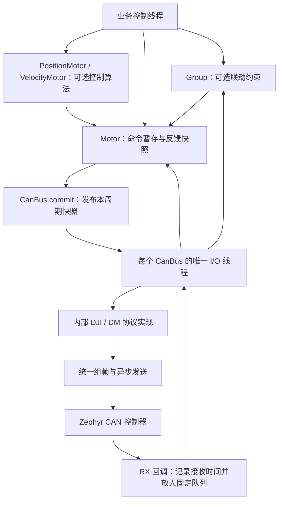

内部分成“状态与调度”和“协议函数”即可，不另建 MotorManager、Service、Session、Channel、工厂注册中心或通用插件系统。

**建议首版直接采用每 CAN 一个静态 I/O 线程。** 业务控制线程统一计算所有电机的目标；I/O 线程推进 DM 使能握手、收发和期限检查。握手采用分步状态机，等待反馈期间可以处理其他电机，不是让线程睡眠等待某一台电机。底层控制器 stop/start 仍可能耗时，将它们放入各自的 I/O 线程可避免控制循环直接等待。I/O 线程在仍能获得调度的前提下，也可以在业务漏交命令时独立执行期限检查和安全输出。

这是明确的执行模型，不提供同步/异步两套运行模式。运行期应用接口不等待 CAN 传输或电机握手；start 是初始化接口，可以等待底层初始化完成。每个 I/O 线程有固定栈、固定队列和固定容量数组，不使用堆分配。其开销是每条 CAN 一份线程栈，实施时应按板卡和最大电机数量测量后配置。

<a id="module-interfaces"></a>

### 3.1 模块接口总表：先看谁调用谁

“模块”在这里是代码职责，不意味着每一行都要再创建一个类。对业务公开的驱动对象仍然只有 CanBus、Motor、Group；协议、组帧、队列和恢复都是它们的内部实现。

| 模块与建议位置                                 | 提供的接口                                                                         | 调用方                                               | 它允许继续调用谁                                 |
| ---------------------------------------------- | ---------------------------------------------------------------------------------- | ---------------------------------------------------- | ------------------------------------------------ |
| 板级组合：应用 board_config.hpp / hardware.cpp | 构造 Motor/Group/CanBus，应用自己的 configureHardware                              | main 或硬件初始化入口                                | 型号工厂、attach/start、板级电源操作             |
| 型号配置：dji_motor.hpp、dm_motor.hpp          | gm6020/m3508/m2006、j4310Mit/j4310Velocity/j4310PositionVelocity                   | 板级组合                                             | 只构造配置值，无 I/O                             |
| 电机端点：motor.hpp / motor.cpp                | info/snapshot/ready/active，enable/disable/clearFault，五种 setter，reseedPosition | 业务、可选控制器、Group/CanBus 内部                  | 公共校验、所属 Group 的内部故障入口、CanBus 唤醒 |
| 联动组：group.hpp / group.cpp                  | ready/active/status，enable/disable/clearFault                                     | 业务；故障通知来自驱动内部                           | 成员的私有许可/请求操作、相关 CanBus 唤醒        |
| 物理总线：can_bus.hpp / can_bus.cpp            | attach/start/commit/status                                                         | 初始化与周期控制入口                                 | Motor 暂存区、协议函数；内部 I/O 调用 Zephyr CAN |
| 位置/速度控制：include/control 与 lib/control  | configure/update/reset/telemetry                                                   | 业务控制循环                                         | Motor 快照/命令，现有 C 控制算法                 |
| 品牌协议：drivers/motor/dji、dm                | validate/decode/encode/stepLifecycle                                               | CanBus 初始化与 I/O 线程；公共层只复用无状态命令校验 | 字节换算和协议私有状态，不调用 CAN               |
| 总线执行：CanBus 私有函数                      | ioMain/processRx/processTx/checkDeadlines/pumpTx/recoverController                 | 本总线 I/O 线程                                      | 协议函数、Motor/Group 内部入口、Zephyr CAN       |
| 接收/发送回调：CanBus 私有静态函数             | onRx/onTxDone                                                                      | Zephyr CAN 驱动                                      | 复制事件、记录回调入口时间、唤醒 I/O             |

主要调用链：

```text
业务直接目标 → Motor.setXXX → Motor.stage → 暂存区
业务闭环目标 → PositionMotor/VelocityMotor.update → Motor.stage（控制器身份）→ 暂存区
业务周期末 → CanBus.commit → 发布快照 → I/O → 协议编码/统一组帧 → can_send
CAN 回调 → 固定队列 → I/O → 协议解码 → Motor.snapshot → 控制器/业务读取
```

Group 不在每个正常命令的调用链中；它只约束使能许可、处理联动撤销，以及确认使能准备完成。业务不需要先向 Group 提交电流，再由 Group 转交 Motor。

### 3.2 数据属于谁

| 数据                       | 保存位置                      | 写入者                                          | 读取者与约束                                            |
| -------------------------- | ----------------------------- | ----------------------------------------------- | ------------------------------------------------------- |
| 型号、ID、限幅、Timing     | Motor 配置                    | 初始化阶段                                      | start 后冻结；协议和控制器按值读取必要信息              |
| Motor 与 CAN/Group 的绑定  | Motor/CanBus/Group 固定成员表 | 初始化阶段                                      | 通信开始后禁止改变                                      |
| 暂存命令 StagedCommand     | Motor                         | 唯一业务控制线程的 setter                       | commit 复制；与许可和代次一起校验                       |
| 已发布命令 PublishedBatch  | CanBus 固定邮箱               | commit                                          | I/O 取副本；新批次可覆盖未执行旧目标                    |
| 反馈与连续位置参考         | Motor                         | I/O 接受反馈；reseedPosition 可在禁用时重建参考 | snapshot 复制；两种写入使用同一短锁，避免解码覆盖新参考 |
| 协议握手阶段               | 每台 Motor 的私有协议状态     | 绑定 CAN 的 I/O 线程                            | enable/clearFault 只留下请求，不直接跳协议阶段          |
| Group 许可、准备位图和代次 | Group                         | Group API 与 I/O 的内部通知                     | 同一组锁保护；跨 CAN 共享的是这份许可                   |
| 唯一在途 TX 及回调上下文   | CanBus                        | I/O；回调只写完成事件                           | 确认完成/取消前不复用；不指向调用栈                     |
| RX 事件                    | CanBus 固定队列               | RX 回调                                         | I/O 消费；记录回调入口时间，不能用出队时间续新鲜度      |

MotorSnapshot 是单端点的一致副本；分别读取多台电机不等于同时采样。控制器检查每份时间戳，GroupStatus 表达组许可的一致视图，不承诺所有反馈来自同一时刻。

## 4. 配置：保留 Zephyr 硬件描述，电机组合改用 C++

建议把最终配置分工定为：

- 设备树保留 MCU CAN 引脚、位速率、外设时钟、供电 GPIO 等硬件描述。
- 应用的 C++ 配置描述电机型号、ID、限幅、减速比、零点、协议模式、时限和 Group。
- 型号工厂只构造配置值。例如 dji::gm6020、dji::m3508、dji::m2006、dm::j4310Mit；它们不创建线程、不注册回调、不发帧。
- 同一台电机只有这一份生效配置，不再同时维护设备树 motor 节点和 yaw_is_dm 之类重复的品牌开关。

这样新增或替换电机时，只改配置和命令/控制器能力约束。当前 Zephyr motor device 层可以在迁移结束后退出；Zephyr 原生 CAN device 继续使用。代价是失去 motor 节点的设备树校验，所以 CanBus::start 必须完成严格的运行前校验。

首版明确支持静态配置：Motor、Group、CanBus 不复制、不移动，生命周期覆盖应用运行；开始通信后不能 attach/detach 或更换电机模式。电机断电重连属于运行故障恢复，不等于动态更改拓扑。

品牌配置保存为一个私有 std::variant<DjiConfig, DmConfig>，运行状态也用对应的有限 variant；协议实现使用 std::visit 分派。当前只有少量品牌，这比一套大虚接口和 opaque 存储更直接。新增品牌允许显式增加一个 variant 分支，不追求无需修改公共内部类型的运行时插件扩展。

不要向应用暴露 variant，也不要把所有品牌参数塞进一个含数十个可选字段的巨型 MotorConfig。型号工厂返回内部配置值，Motor 接口保持一致。

<a id="public-interfaces"></a>

## 5. 建议公开接口与明确语义

### 5.1 数据类型：接口传递什么

以下声明展示边界，结构体字段在实现时可按固定容量展开；没有包含私有实现。所有时间使用本地单调时钟，setter 自己记录写入时间，业务不能伪造时间戳。

```cpp
struct Timing {
    uint32_t feedback_timeout_ms;
    uint32_t command_timeout_ms;
    uint32_t recovery_stable_ms;
    uint32_t enable_timeout_ms;
};

struct BusOptions {
    uint32_t tx_timeout_ms = 2;     // 等发送完成的期限，需按实测调整
    uint32_t recovery_retry_ms = 100;
};

enum class MotorState { Offline, Disabled, Enabling, Active, Fault };
enum class StopProgress { None, Pending, TxComplete, DriveConfirmed, Unreachable };
enum class BusState { Unstarted, Running, Recovering, ConfigBlocked };

enum class FaultReason {
    None, FeedbackExpired, CommandExpired, DriveFault,
    UnexpectedDisabled, InvalidCommand, ControlRejected,
    EnableTimeout, TransportError, RxOverflow
};

struct FaultInfo {
    FaultReason reason = FaultReason::None;
    int error = 0;
    const Motor *source_motor = nullptr; // 静态生命周期，仅用于定位
    uint64_t occurred_ms = 0;
};

struct MotorInfo {
    uint32_t capabilities = 0;     // 命令/反馈能力位；有效位的定义沿用现有 API
    float current_limit_a = 0;
    float torque_limit_nm = 0;     // 两项是否适用由 capabilities 决定
    Timing timing{};
};

struct StopReport {
    StopProgress progress = StopProgress::None;
    uint64_t request_generation = 0; // 避免把上次停机结果当成本次结果
    int tx_error = 0;
};

struct MotorSnapshot {
    Feedback feedback{};          // 带各字段有效位和反馈时间戳
    MotorState state = MotorState::Offline;
    bool feedback_fresh = false;
    bool output_permitted = false;
    bool position_reference_valid = false;
    uint64_t enable_generation = 0;
    uint64_t reference_generation = 0;
    FaultInfo last_fault{};
    StopReport stop{};
    uint32_t native_drive_status = 0; // 品牌原始状态，需结合能力/有效性解释
    bool native_drive_status_valid = false;
};

struct CommitResult {
    int error;                  // 提交错误；0 不代表帧已发送
    uint64_t sequence;          // 本次发布的序号
};

enum class TxPurpose { Target, SafeOutput, Enable, Probe, ClearFault };
struct TxResult {
    bool valid = false;
    uint64_t sequence = 0;      // 关联普通 commit；独立安全/握手操作为 0
    uint32_t can_id = 0;
    TxPurpose purpose = TxPurpose::Target;
    int error = 0;
    uint64_t completed_ms = 0;
};

struct BusStatus {
    BusState state = BusState::Unstarted;
    int last_error = 0;
    uint64_t latest_submitted_sequence = 0;
    TxResult last_tx{};         // 最近一帧结果，不是整批执行确认
    uint64_t superseded_batches = 0;
    uint64_t rx_overflows = 0;
};

struct GroupStatus {
    bool ready = false;
    bool active = false;
    bool enable_pending = false;
    uint64_t enable_generation = 0;
    const Motor *blocking_member = nullptr; // 首个当前阻塞成员，不等同于历史根因
    FaultInfo last_fault{};
};
```

以上是接口所需的最小字段示意，省略 include、前置声明和 private 字段。Feedback 在新实现中保留现有带单位的字段和 valid 位，并明确连续/绝对位置的定义；它不是从任意缓存直接返回的“永远有效数据”。

last_fault、last_error 是诊断历史，不等于当前仍故障；是否可运行看当前状态和许可。正常状态恢复也保留最近故障，便于定位。native_drive_status=0 不代表所有品牌均已 Disabled，未提供设备状态码的型号不能如此解释。

Timing 属于电机，BusOptions 属于物理传输；线程栈、优先级、队列和最大容量由构建配置提供。不要把所有参数全部放到业务每次调用里。

### 5.2 型号配置接口

```cpp
namespace dji {
Config gm6020(const Gm6020Options &options);
Config m3508(const M3508Options &options);
Config m2006(const M2006Options &options);
}
namespace dm {
Config j4310Mit(const J4310Options &options);
Config j4310Velocity(const J4310Options &options);
Config j4310PositionVelocity(const J4310Options &options);
}
```

各 Options 只包含该型号需要的配置，以及可选的 Timing 覆盖。工厂返回配置值，构造期间不报硬件错误；非法 ID、非有限限幅、错误减速比等由 start 统一校验并报告。GM6020 工厂固定电流模式，DM 三个工厂固定相应协议模式，应用不再另外维护 is_dm/mode 开关。

### 5.3 三个对象的公开接口

```cpp
class CanBus {
public:
    explicit CanBus(const device *can, BusOptions options = {});
    [[nodiscard]] int attach(Motor &motor);
    template<class... Motors>
    [[nodiscard]] int attach(Motor &first, Motor &second, Motors &...rest);
    // 多参数重载整批验证通过后才绑定。
    [[nodiscard]] int start();
    [[nodiscard]] CommitResult commit();
    BusStatus status() const;   // 按值返回，不暴露并发可变内部引用
};

class Motor {
public:
    explicit Motor(dji::Config config);
    explicit Motor(dm::Config config);
    // 构造重载在内部存成 variant；业务不需要接触 ModelConfig/visit。
    MotorInfo info() const;
    MotorSnapshot snapshot() const;
    bool ready() const;
    bool active() const;

    [[nodiscard]] int enable();       // 独立电机使用
    [[nodiscard]] int disable();      // 独立电机使用，重复调用有效
    [[nodiscard]] int clearFault();   // 异步请求清除可清故障；不使能

    [[nodiscard]] int setCurrent(float ampere);
    [[nodiscard]] int setTorque(float newton_meter);
    [[nodiscard]] int setMit(const MitCommand &command);
    [[nodiscard]] int setVelocity(float rad_s);
    [[nodiscard]] int setPositionVelocity(float rad, float max_rad_s);
    [[nodiscard]] int reseedPosition(double known_position_rad);
};

class Group {
public:
    // 可变参数构造只复制成员地址，不保存 initializer_list 的临时存储。
    // 固定容量，构造时不发帧；成员关系在 start 时统一校验并冻结。
    template<class... Motors> explicit Group(Motors &...members);
    bool ready() const;
    bool active() const;
    [[nodiscard]] int enable();
    void disable();                  // 即时关闭组的软件输出许可
    [[nodiscard]] int clearFault();  // 对有可清故障的成员发起处理
    GroupStatus status() const;
};
```

Timing 放入各型号配置的公共选项中，工厂给出项目可用默认值，用户可按电机覆盖。默认值可以先沿用当前 DJI 20 ms / DM 50 ms 反馈时限，但不能据此承诺实机满足时限；命令时限必须覆盖真实控制周期与调度抖动。

### 5.4 返回值、状态变化与调用条件

| 接口            | 返回和状态变化                                                                           | 边界与错误                                                                                                                                       |
| --------------- | ---------------------------------------------------------------------------------------- | ------------------------------------------------------------------------------------------------------------------------------------------------ |
| attach          | 成功绑定电机与物理 CAN，不做硬件 I/O                                                     | 已绑定/重复对象拒绝；容量不足 -ENOSPC；已 start 后 -EACCES；便利重载要么全成功要么不变                                                           |
| start           | 校验完整本地拓扑及相关 Group 成员绑定；安装路由、启动控制器和 I/O 线程；初始输出许可关闭 | 参数错误 -EINVAL/-ERANGE；冲突 -EADDRINUSE；重复控制器 owner -EBUSY；缺容量 -ENOSPC；设备不可用 -ENODEV；重复成功启动 -EALREADY                  |
| enable          | 所有条件满足时接受请求，进入 Enabling，返回 0；实际成功再变 Active                       | 离线/尚未安全就绪 -EAGAIN；未清驱动故障 -EIO；未 start -EACCES；重复 Enabling/Active 返回 -EALREADY                                              |
| disable         | 同步使已有命令失效、关闭输出许可；异步发安全命令                                         | 无需等待反馈；返回成功不能解释为转子已停止；Group.disable 不依赖健康 CAN 才能撤销许可                                                            |
| setCurrent 等   | 只暂存命令、时间戳和当前使能代次，不发送                                                 | 非 Active -EACCES；能力/模式不支持 -ENOTSUP；NaN/Inf -EINVAL；越界 -ERANGE；Active 时无效命令使所属独立电机或 Group 撤销输出，不能继续沿用旧缓存 |
| commit          | 为此 CAN 发布最新完整快照，唤醒 I/O，返回提交序号                                        | 未 start -EACCES；控制器恢复中 -EAGAIN；批次未发部分可被新批次取代；成员离线不能阻断不相关健康成员的提交                                         |
| clearFault      | 接受可清故障处理请求，返回 0；完成后至多 Disabled                                        | 输出许可尚开时 -EBUSY；不支持的清故障动作 -ENOTSUP；配置错误不能清除；不能顺带 enable                                                            |
| reseedPosition  | 禁用状态下重建软件连续参考，更新 reference_generation，不写 Flash                        | -EINVAL 非有限位置；-EBUSY 仍 Active/Enabling；-EAGAIN 反馈过期；-ENOTSUP 无位置反馈                                                             |
| snapshot/status | 按值复制一致的状态、反馈与诊断，不阻塞等待反馈                                           | 必须包含新鲜度/有效位，不能以读取成功替代在线判断                                                                                                |

已加入 Group 的 Motor.enable/disable/clearFault 返回 -EACCES，要求通过 Group 调用，避免单独使能一个成员破坏联动约束。每个 Motor 的控制命令仍由其 setter 写入；内部故障上报能够直接关闭所属 Group。驱动内部的成员停机函数不调用公开 Motor.disable，因此不会被此限制卡住。

初始化由 main 串行完成；进入运行期后，setter/commit 与普通使能请求由唯一业务控制线程调用，main 可以直接担任该线程。若另起控制线程，应在配置完成后移交命令写入权，main 不再同时写目标。snapshot/status 可跨线程只读。RX/TX 回调只操作固定容量消息入口和完成通知；不运行 PID，不等待，不调用用户业务回调。安全撤销接口可以从正常线程异步请求，不能从 ISR 调用；硬急停的硬件切断不由此接口代替。

协议能力保持真实：DJI 目前支持电流命令；DM MIT 支持力矩和 MIT 复合命令；DM 原生速度/位置模式支持对应原生命令。驱动不会在 setVelocity 中偷偷给 DJI 创建速度 PID，也不会把不具备转矩标定的 DJI 安培转换成牛·米。

### 5.5 查询接口怎样使用

| 查询               | 应用用它决定什么                                     | 明确不代表什么                                |
| ------------------ | ---------------------------------------------------- | --------------------------------------------- |
| Motor.info         | 控制方式、单位、所需反馈是否匹配                     | 不表示现在在线                                |
| Motor.snapshot     | 读取一台的反馈、许可、参考有效性及诊断               | 不刷新命令时限、不触发恢复                    |
| Motor.ready        | 当前 Disabled、反馈稳定且安全准备完成，可接受 enable | 不代表应用机械限位、遥控授权都满足            |
| Motor.active       | 当前代次已激活、有效许可打开且反馈仍新鲜             | 不保证机械已经运动                            |
| Group.ready/active | 同一组全体成员满足对应条件，且组许可状态匹配         | 不保证物理同步启停                            |
| Group.status       | 找到准备中/阻塞成员、最近联动根因                    | 健康成员被停止不等于它自身故障                |
| CanBus.status      | 查看控制器状态、最近一帧发送结果与积压/溢出          | last_tx.sequence 相同不等于此 commit 全部完成 |

commit 失败时 sequence 为 0，不发布新批次；成功序号从 1 递增。安全命令可在没有任何 commit 的情况下发送，其 TxResult.sequence=0，通过 purpose 与 Motor.stop.request_generation 定位。重新使能时旧 stop 结果失效；序号/代次到达整数上限应拒绝继续使能或发布，不能回绕后误接旧结果。

同一 commit 可以产生多个 CAN 帧，因此这里刻意只提供“提交序号 + 最近帧结果 + 错误历史”，不提供容易被误读的 waitAllMotorsApplied。没有运动事务的设备确认协议，软件就不能补出这种确认。

反馈与诊断结构至少包含：

- 反馈：位置/速度/电流/力矩/温度及各自有效位、接收时刻、在线新鲜度、驱动原始状态。
- 位置：区分连续位置和单圈绝对位置；增加 position_reference_valid 与 reference_generation，不承诺断线后仍知道多圈累计值。
- 执行：MotorState、输出许可、enable_generation、StopProgress。
- 故障：原因、原始 errno、发生时间、原故障电机标识、是否由同组其他电机触发。
- 发送：最近关联提交序号、目标发送错误、安全输出错误；CanBus 汇总提交/完成/取代计数及 RX 丢包计数。

不要把健康但被联动停止的电机标成“自身驱动器故障”；保留 source_motor 与停止原因，才能分清根因和联动结果。序号只支持固定数量的最近诊断，不承诺给每一历史 commit 保存无限长事务记录。

<a id="call-flows"></a>

### 5.6 六条模块调用流程

图中的 CanBus API 与 I/O 是同一对象在不同执行上下文中的职责，不是两个需要应用管理的对象。实线箭头表示调用或通知，虚线箭头表示返回/结果；标明异步的步骤不要求调用方等它完成。

#### 流程一：配置与通信启动

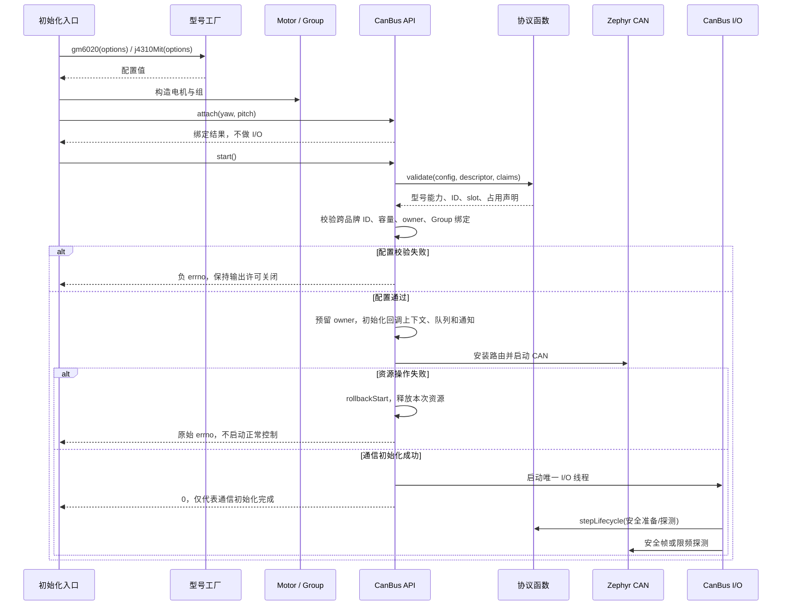

start 前先完成所有相关电机的 attach，跨 CAN 的 Group 也如此。start 的资源操作依次为 owner 预留、回调上下文/队列/通知初始化、过滤器安装、控制器启动、线程启动；任一步失败只回滚本次拥有的资源。安装过滤器后就可能收到回调，因此回调入口必须先可用，不能等线程启动后才初始化。不能停止其他 owner 的控制器。初始化阶段由 CanBus::start 调用硬件，运行阶段交给唯一 I/O 线程。

安全准备和反馈稳定在后台完成。应用观察 ready()，不把 start()==0 当成可以立即输出。DM 的首次反馈如果依赖主控探测，也由后台驱动获得，不要求业务先发送运动命令。

#### 流程二：跨 CAN、跨品牌的组使能

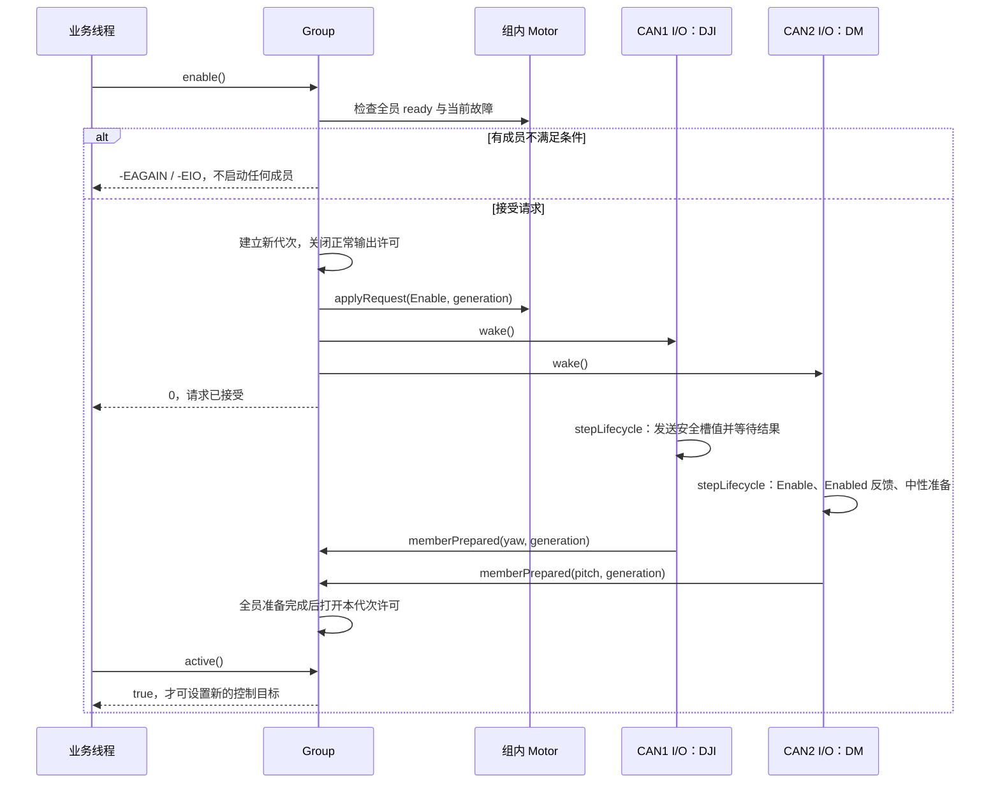

memberPrepared 必须检查“代次相同且此使能请求仍待完成”。某成员超时或用户 disable 后，迟到的 Prepared 通知不能重新打开许可。原子打开的是 Group 的共享软件许可，实际设备使能时间可以不同；已有在途帧的限制仍见第 7 章。

没有 Group 时，Motor.enable 使用同样的端点准备流程，Prepared 只打开自身许可。业务无需负责 DJI/DM 的使能差异。

#### 流程三：一个正常控制周期

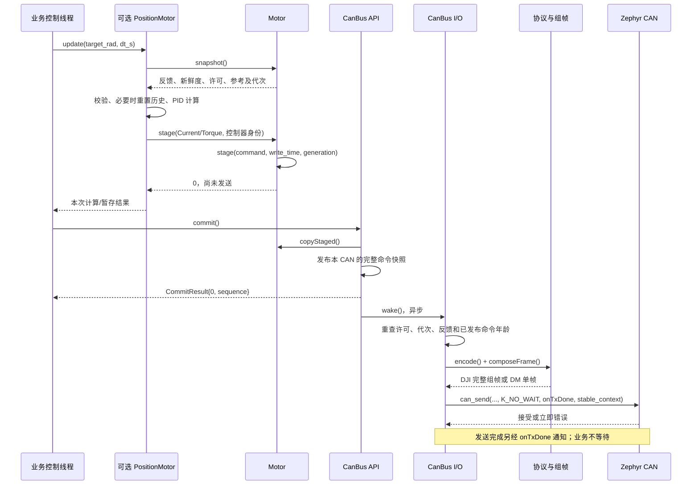

业务直接控制电流/力矩时跳过 Axis，直接调用 setter。一次 commit 可以产生多帧；I/O 保持一个硬件在途帧，收到完成通知后推进发送游标。

控制循环算出的时间步长 dt_s 只用于控制算法；驱动新鲜度采用自己的单调时间。setter 返回 0 不保证稍后 commit 仍可发：两者之间发生的故障必须由许可/代次重查拦住。

#### 流程四：反馈回到上层

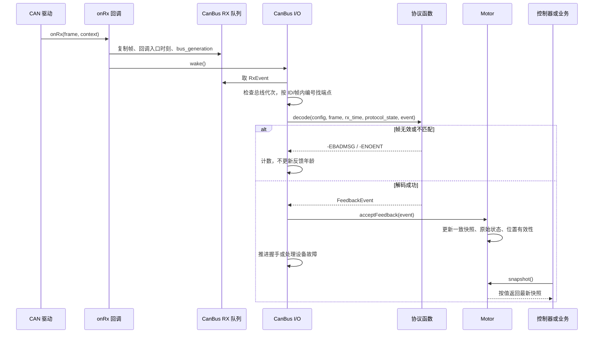

回调只拷贝固定大小数据，返回后不保留 Zephyr frame 指针。rx_time 是回调入口的接收观测时间，并非硬件精准采样时间；若以后使用硬件时间戳，需要另外明确时钟映射。

新鲜度永远按原始 rx_time 计算。RX 队列满时回调置溢出标志并唤醒线程，由 I/O 优先执行总线范围撤销，不在 ISR 中跨组遍历或发送。

#### 流程五：单电机异常与主动停机

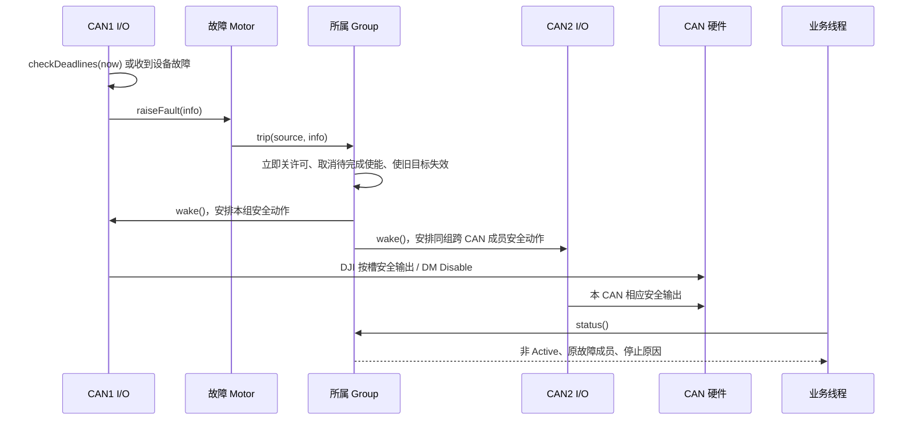

无 Group 时，raiseFault 只撤销本端点。属于其他 Group 的端点不受这次端点故障直接影响；若安全帧发送又触发控制器故障，则升级到流程六。

用户主动 Group.disable 进入同一个“关许可并唤醒安全输出”的路径，但不伪造设备故障、不覆盖已有根因。它不需要 commit；即使业务循环已停止提交目标，正常运行的 I/O 线程也会发送安全动作。健康联动成员记录“被组停止”，原故障成员保留自身错误。

#### 流程六：总线故障与恢复

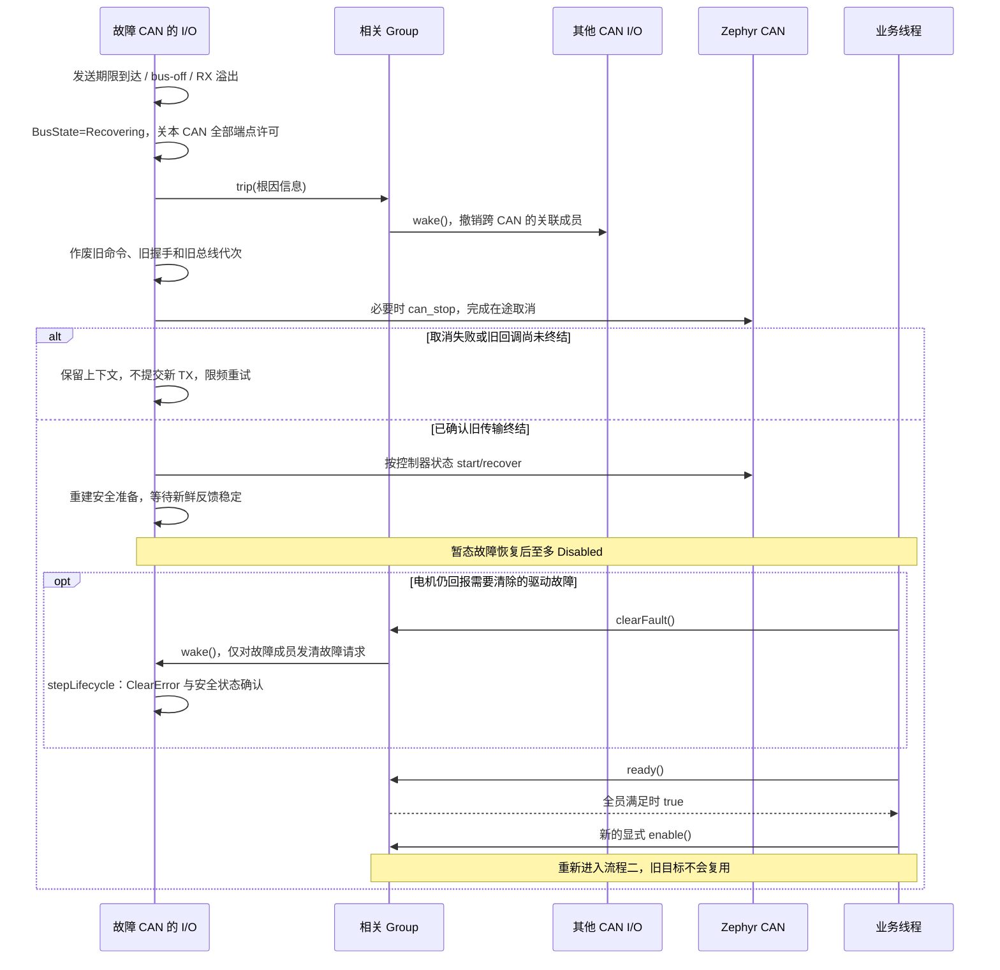

Group 的通信故障联动不要求应用线程先读取错误。反过来，恢复通信也不授权运动；业务在故障期间应清除旧的运动意图，重新检查遥控/急停/位置参考，再产生新的 enable 与目标。

仅反馈超时、但 CAN 本身健康的端点不走控制器 stop/start；其后台探测完成后回到 Disabled。这样才能保住同线不相关电机的通信。

## 6. 发送和接收：怎样保持简单又不互相覆盖

### 6.1 DJI 始终由唯一发送者组帧

CanBus 启动时按 command_id 建立固定的四槽映射；同一 command_id 的成员可以来自不同机械 Group。每次真正发送前，用已发布命令、当前许可和代次重新检查各槽：

```text
slots = {0, 0, 0, 0}
for each configured slot in this DJI command ID:
    if motor output is permitted
       and published command belongs to current enable generation
       and feedback and published command are fresh:
        slots[slot] = encoded current
    else:
        slots[slot] = 0
send one complete DJI frame
```

例如 M3508 ID1 与 M2006 ID2 同用 0x200。如果两台属于不同 Group，ID1 反馈超时后该帧应是“槽 0 为零、槽 1 保持 ID2 的有效目标”，不能套用旧 Bus 的整帧清零行为。

如果两台属于同一个 Group，许可同时关闭，两槽都为零。这样“协议必须共享一帧”和“机械必须联动停止”被分别处理。

M3508 的电流原始值换算、M2006 的不同满幅、GM6020 的命令 ID 均复用现有 Profile，不为了统一而改成同一量程。槽索引例：ID7 使用高组槽 2，即 ID-5，不能用 ID-1 越界写入。

### 6.2 DM 每个反馈 ID 只安装一个过滤器

CanBus 按反馈 ID 收到帧后，在内部按协议匹配；共享 Master ID 的 DM 帧再按 data[0] & 0x0F 找 Motor。高 4 bit 作为驱动状态，不参与电机编号。

例如 Master=0x11 的 DM ID1、ID2 只占一个硬件过滤器、两个软件端点。分属不同 Group 也不影响路由。帧长、标准/扩展格式和协议字段不合法时丢弃并计数，不更新在线时间。

RX ISR 必须记录实际接收时刻再入队，不能等线程解码时才记“现在收到”：否则积压的旧反馈会被误判为新鲜。队列溢出属于可观测的通信完整性问题；首版关闭该 CAN 的输出许可并报告 RxOverflow，不能悄悄丢包后继续认为位置连续有效。

### 6.3 统一校验 ID，占用规则只有少数固定类型

不建立通用路由 DSL。内部四种声明已足够：

| 声明              | 合法共享条件                                  |
| ----------------- | --------------------------------------------- |
| 普通独占 TX ID    | 不允许另一个端点声明                          |
| DJI 组命令 TX ID  | 相同帧格式，不同 slot，且交给同一 CanBus 组帧 |
| 普通独占 RX ID    | 不允许另一个端点声明                          |
| DM 多路反馈 RX ID | 相同协议布局，相同 Master，motor-id 不同      |

同一 CAN 内统一比较 TX 与 RX 的全部 ID，包含 Enable/Disable/ClearError 所用 ID；首版不接受未明确定义的 TX/RX 交叠。不同 CAN 可以复用编号。碰撞错误应直接打印两端名称、ID、方向和协议用途。

必须拒绝的例子：M3508 ID5 与 GM6020 ID1 的 RX 都是 0x205；DM 速度 ID1 的 TX 为 0x201，与 M3508 ID1 的 RX 冲突；两个同模式 DM ID1 即使 Master 不同，TX 仍相同。

DM ID1/ID2 共享 Master 是上述显式允许的协议分发；不同品牌共享反馈 ID 不属于合法情况。

### 6.4 一份最新命令快照，不排长队播放历史目标

每个 Motor 有暂存命令；每条 CanBus 有固定容量的“最新已发布快照”。commit 在短临界区内发布本 CAN 的完整快照和序号，I/O 线程只持有自己的工作副本。

setter 更新暂存时间，commit **不刷新没有被重新写入的命令时间戳**。I/O 的命令过期检查针对已发布命令，而非尚未 commit 的暂存区。这样不断 commit 旧命令、或不断 setter 但忘记 commit，都不能延长旧输出的有效期。

允许不同电机以不同周期更新：未更新的命令在其自身时限内可以继续使用；超过时限就撤销对应 Motor/Group。默认推荐同一控制线程在本周期写完目标后 commit 一次。

新 commit 可取代尚未交给硬件的旧目标；安全输出与 disable 意图不放进这个可覆盖的普通邮箱。它们保存在端点/Group 的许可状态和待处理安全动作中，必须优先执行。

公平性不能随新 commit 重置：轮询游标按帧组/端点保留，避免不断来新快照时永远只发送第一个 DJI 组或第一个 DM。无反馈电机的探测要限频，不能挤占健康组输出；未按期限完成发送必须报告并撤销对应许可。

<a id="thread-model"></a>

## 7. 线程数量、启动、通信与单线程选择

### 7.1 到底有几个线程，哪些对象不创建线程

**推荐模型的线程数 = 1 个业务控制线程 + 实际启动的 CAN 数。** 这是本方案参与电机控制的线程数，不是整个 Zephyr 系统的线程总数。main 本身就可以持续执行控制循环，不需要再创建一个执行同样任务的应用线程。

| 硬件组合 | 业务控制线程 | 驱动 I/O 线程 | 合计 |
| --- | --- | --- | --- |
| CAN1 上 1 台 DJI | 1 | CAN1 一个 | 2 |
| CAN1 上 4 台 DJI + 4 台 DM | 1 | CAN1 一个 | 2 |
| CAN1、CAN2 各挂若干不同品牌电机 | 1 | CAN1、CAN2 各一个 | 3 |

Motor、Group、PositionMotor、VelocityMotor、协议编解码函数都不创建线程。同一线程可以顺序计算八台电机的 PID，也可以按不同周期更新不同电机；前提是计算量和 CAN 带宽满足目标周期。增加电机数量会增加工作量，不会自动增加线程数。

**调用对象的方法，通常还是在调用者的线程里执行。** 例如 main 调用 yaw.setCurrent()，只是 main 把目标写入暂存区；调用 can1.commit()，也是 main 发布快照并通知 I/O。只有 I/O 线程被调度后，才执行组帧和 can_send。CanBus 同时包含公开方法和后台线程入口，不代表它的每个方法都自动切换线程。

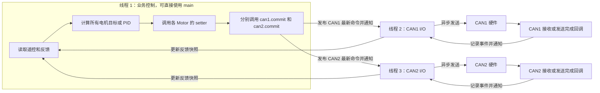

图中只有标注“线程”的三个框代表线程。RX 回调按中断上下文处理；TX 回调可能在中断或底层取消操作的调用上下文执行，两者都不单独创建线程。单核 MCU 上这些线程由调度器轮流执行，图中多条箭头不表示有多个 CPU 同时运行。

### 7.2 谁启动线程，什么时候启动

顺序是：**Zephyr 启动 main → main 完成全部绑定 → 逐个调用 CanBus.start → 每次成功 start 启动对应 I/O → main 进入控制循环。** I/O 不等业务 enable 才启动，因为它需要先收反馈、建立安全状态，才能使 ready() 成立。

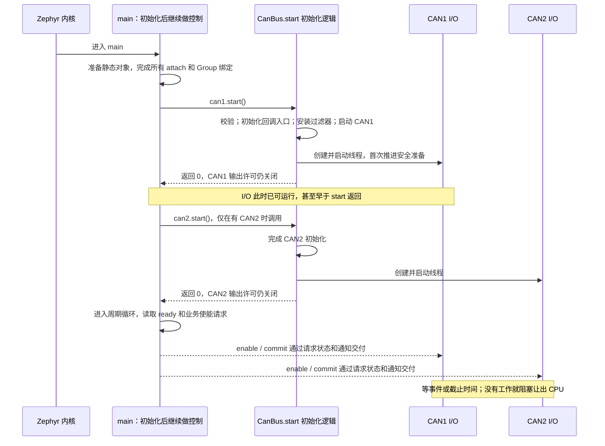

实施时把启动工作放在 drivers/motor/can_bus.cpp 的 CanBus::start，把循环放在同文件的 ioMain。每个 Bus 的线程控制块、栈、队列和事件存储使用静态生命周期；硬件及回调入口就绪后，再以 k_thread_create(..., K_NO_WAIT) 启动 ioMain。静态分配内存不等于开机自动运行线程：不要用立即启动的 K_THREAD_DEFINE 让工作线程在 attach 完成前访问拓扑。线程参数指向长期有效的 CanBus，start 返回前后均不得再修改冻结的配置。

首次启动要主动触发一轮 I/O，不能等待一个尚不存在的反馈来开启探测。重复成功 start 返回 -EALREADY，不再创建线程。enable、disable、电机重连和 CAN 故障恢复都复用已有线程；它们改变状态，不反复创建或销毁线程。初始化失败按第 5.6 节回滚，本轮不进入正常控制；已成功启动的其他 Bus 继续保持禁止运动。

上层最简单的写法如下，放在应用的 main.cpp；这是调用顺序伪代码，具体函数仍按前面的 API 实现：

```text
main:
    完成全部 Motor / Group 配置和 attach
    逐个 start 实际使用的 CAN；检查每个返回值
    循环：
        读取业务输入、Motor.snapshot、Group.status
        有新的使能动作且 ready 时，请求 enable；有停机动作就 disable
        对 Active 的电机计算目标并调用 setter，处理返回错误
        对每条 CAN 调用一次 commit，处理返回错误
        等待下一个控制周期，让出 CPU
```

这份 main 就是唯一业务控制线程。若现有应用已有 chassis_control 等控制线程，也可让 main 只初始化并在之后启动它，随后退出；两者不应各运行一份电机控制循环。遥控、传感器等已有线程通过输入快照或消息交付控制意图，普通电机命令仍由这一个控制线程统一写入。

线程栈大小、控制周期和优先级需按实机负载确定，不在设计文档中假设固定数值即可保证实时性。首版使用可抢占线程；I/O 每轮处理有限工作，并在无事可做时阻塞。不能通过无限提高 I/O 优先级来弥补处理能力不足，否则可能饿死控制线程。线程优先级也不等于 CAN 报文的仲裁优先级。

### 7.3 线程间靠什么联系

“通知”只表示有事可做，真正的数据放在固定存储里。可用 ISR 可调用的 k_sem_give 唤醒等待信号量的 I/O 线程；同类通知允许合并，但不能把事件数据仅存在一个可能被覆盖的通知位里。

| 方向 / 动作 | 数据保存在哪里 | 接收方什么时候处理 |
| --- | --- | --- |
| 控制线程 → I/O：commit | 每 CAN 一个受保护的最新命令快照，保留原始命令时间戳 | 通知后调度到 I/O 时读取；新快照可覆盖尚未发送的旧目标 |
| 控制线程 → I/O：enable / clearFault | 端点或 Group 的待处理请求与代次 | 通知相关 CAN；各 I/O 推进自己的协议步骤 |
| 任一允许的正常线程 → I/O：disable | 立即关闭的共享许可、失效代次和持久的安全动作 | 不等下次 commit；立即通知所有相关 CAN，优先安排安全输出 |
| RX 回调 → I/O | 固定容量接收队列：帧副本、接收时间、总线代次 | 无等待入队并通知；I/O 解码并更新 Motor |
| TX 回调 → I/O | 独立发送完成槽，不与 RX 共用容量 | 记录结果并通知；I/O 回收在途槽、尝试下一帧 |
| I/O → 控制线程 | 受保护的 Motor / Bus / Group 状态快照 | 控制线程下次 snapshot/status 直接复制，不等新反馈 |
| CAN1 I/O → CAN2 I/O：跨总线 Group 停机 | 共享 Group 许可、故障来源和待处理安全动作 | 先撤销许可，再通知相关 I/O；不等另一个线程执行完 |

例如 yaw 在 CAN1、pitch 在 CAN2，且同属 gimbal：CAN1 I/O 检测 yaw 掉线后，关闭 gimbal 的共同许可，并通知 CAN2 I/O 安排 pitch 安全输出。**这一段不需要控制线程先发现故障、再转发停机。** pitch 自身通信正常时，诊断记录为被 yaw 故障联动停止。若两个电机互不属于同一 Group，则单个反馈超时不会因此停止另一台。

业务线程和 I/O 不共享可随意修改的命令对象：setter 写暂存区，commit 把本 CAN 的完整快照复制到发布区；读取反馈也返回值副本。短临界区只保护这些复制及许可变化，不能持锁等待 CAN 发送、握手或其他线程。仅加 volatile 不能代替同步；线程不多也仍需处理回调并发。

### 7.4 控制线程休眠时，I/O 怎样继续工作

控制线程按控制周期运行；I/O 按**事件或最近截止时间**运行，两者不需要一一对应。以下任一条件都会让相应 I/O 获得继续运行的机会：新 commit、启停请求、RX、TX 完成、CAN 错误通知，以及反馈/命令/握手/发送/重试期限到达。最后一种靠带超时的等待返回，即使完全没有 RX 和新命令，也能发现离线或命令过期。

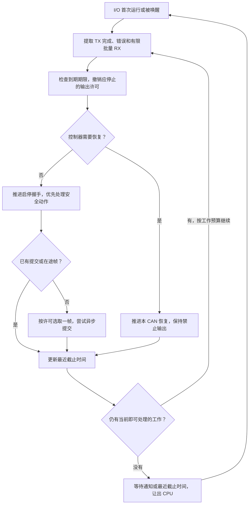

can_send 使用回调和 K_NO_WAIT，不让 I/O 等硬件邮箱或发送 ACK。底层暂不能接受时，记录状态并按有期限的策略重试或报错，不能忙等。尚在等待反馈、发送完成或重试时刻的动作不算“当前即可处理”的工作；否则会把状态机写成空转循环。

一次 commit 可能对应多帧。发送第一帧后，TX 完成通知就能驱动下一帧，不需要等业务下一个周期再 commit。DM 等待使能反馈期间，线程也照常服务同 CAN 的其他端点。命令过期看最近一次有效命令写入的时间，不能用反复 commit 来续命。

有数据后再通知；准备休眠时应按通知机制重新检查待处理状态，避免检查后、真正等待前到达的通知被丢失。正常命令可合并，RX 帧、TX 完成和安全请求分别按各自的保存规则处理。

<a id="single-thread-alternative"></a>

### 7.5 控制电机能不能只用一个线程

**只用一个业务控制线程：可以，而且这就是推荐方案。把收发、协议推进和控制计算全放进同一个线程：也可以，但这是另一种执行方案。** 电机数量和品牌数量本身不要求多线程；是否拆 I/O，主要取决于时序、阻塞操作和故障隔离要求。

| 项目 | 本文推荐：一个控制线程 + 每 CAN 一个 I/O | 合并：一个线程负责全部 |
| --- | --- | --- |
| 双 CAN 的相关线程数 | 3 | 1 |
| 上层周期循环 | 读反馈 → 算目标 → setter → commit → 等下周期 | 在控制计算之间，还必须及时推进所有 CAN 的 I/O |
| 谁检查命令和反馈过期 | 各 CAN 的 I/O，独立于业务循环推进 | 同一个线程；业务卡住后检查也停止 |
| 控制器 stop/start 耗时 | 不直接阻塞业务调用栈，仍受调度和底层实现约束 | 直接推迟所有电机控制及其他 CAN 的服务 |
| 内存与同步 | 每 CAN 多一份栈，需处理线程及回调并发 | 少线程栈，仍需处理中断回调并发 |

如果决定改选全部单线程，可保留 Motor / Group / 协议函数的模块划分，把 ioMain 的有界推进步骤提取为 CanBus::service(now)，由唯一线程轮流调用。**service 是该替代方案需要新增的接口，不属于本文已经选定的首版 API；首版不同时实现两套模式。** 它只执行当前能完成的步骤，不等待反馈、握手间隔或 TX 完成。

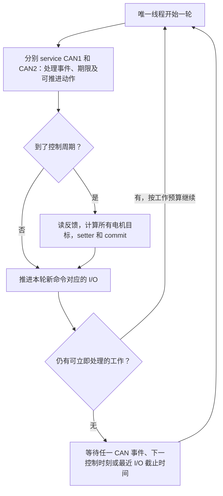

不能只删掉后台线程，然后在普通控制循环末尾固定 sleep 一个控制周期：期间会错过需要更早推进的收发和时限，也可能把每周期发送量错误地限制为一帧。单线程应在各 CAN 之间分配有限处理预算；等待时同时考虑控制时刻和 I/O 截止时间，RX/TX 回调则通知这个唯一线程。构造控制周期时使用既定的下次执行时刻，收到更多 CAN 事件也不重复执行同一个控制周期。

还要解决一个硬限制：service 内部若调用会长时间占用线程的底层 CAN 恢复函数，“接口看起来是轮询”也不会使它自动变成非阻塞。必须确认所有路径均可分步且耗时有界，或接受恢复期间其他电机一起被延迟；业务逻辑长期占用线程时也没有独立的驱动期限检查。系统完全失去调度时，两种方案都需要电机端超时保护或硬件看门狗等独立措施。

对本次“混合品牌、多 CAN、掉线后仍服务其他组合”的目标，继续建议每 CAN 一个 I/O。它的额外成本主要是静态线程栈和同步实现；应用仍只维护一个清楚的控制循环。如果后续明确以最少线程为优先目标，再整体切换为 service 方案，不把两套调度方式同时塞进首版。

### 7.6 实施时保留的超时、取消与所有权约束

每个 CanBus 的 I/O 线程负责：

1. 处理 RX 数据和 TX 完成通知。
2. 检查反馈、已发布命令及使能握手的到期时间。
3. 处理安全输出、启停握手、正常目标，始终优先满足已触发的安全撤销。
4. 管理控制器 stopped/bus-off/发送超时，统一停止、取消、重新启动。
5. 更新 Motor/Group 状态和诊断快照。

等待下一事件或最近截止时间，禁止 busy loop；不放进 Zephyr 共享系统 workqueue，避免控制器调用耗时阻塞其他系统工作。协议函数不能自行创建线程、安装额外过滤器或调用 can_start/can_stop。

首版每控制器最多一个已提交硬件的发送帧；完成后再发下一帧。TX 回调只记录结果并唤醒线程，不在回调中递归发送。普通待发目标使用有限快照和发送游标，没有无限队列。

发送完成期限作为 BusOptions 配置，与端点命令时限区分。达到期限时：

```text
关闭此 CAN 所有端点的输出许可，并通知它们所属 Group
使旧的命令批次、使能请求和恢复前 RX 数据失效
由此 CAN 的唯一 I/O 线程调用控制器停止/取消
确认待发回调已终结，才允许复用回调上下文与重新启动
按限频策略恢复 CAN、重新观察反馈、建立安全状态
保持输出许可关闭，等待新的显式 enable
```

不能只换一个软件 epoch，就假装已经取消硬件帧。如果底层 can_stop 失败或不能证明旧回调已终结，保留旧上下文，维持不可输出并报告错误；禁止重用该发送槽继续排命令。MC02 本地 M_CAN stop 的回调清理行为可复用，但移植到其他控制器时需要确认对应契约。

控制器 stop/start 的执行可能超过应用期望的控制周期，因此放在本 CAN 线程中，让其他 CAN 的 I/O 和业务线程有独立的调度机会。但“分线程”不等于硬实时隔离：若底层在高优先级线程中长时间忙等或全局关中断，其他线程仍可能被延迟；需结合底层实现和实机调度测量确认。它没有解决物理总线故障本身，系统整体失去调度也仍需独立保护。

**有界残留必须说清楚。** disable 返回时软件许可已关闭，但关闭许可之前已取得发送授权、正在提交给硬件或已在途的那一帧可能仍发送成功。发送前检查与 can_send 之间也存在并发窗口，不能只讨论“已经发出去”的帧。首版把这整个提交/在途阶段限制为每 CAN 最多一帧，在完成或发送期限到达后处理安全输出；实际边界还包含线程调度和底层取消耗时。不得把这个协议驱动作为“调用返回就已机械停止”的接口。

并发实现保留短临界区：反馈快照、命令发布和 Group 许可分别保护；不持有 spinlock 执行 CAN API、等待、日志或遍历无界容器。Group 操作先更新自己的许可/代次，再通知成员所在 I/O 线程；跨总线故障传播不能拿着一个 Bus 的锁去等待另一个 Bus。

发送前再次检查许可和代次，避免旧快照越过一次 disable/enable。整个系统应统一锁顺序，先 Group 许可、后端点元数据；对总线发布槽的访问单独完成，避免交叉嵌套。公开的单控制线程约定负责避免两套业务同时写同一电机，I/O 线程与 RX/TX 回调并发仍必须正确同步。

依据：线程启动参数与静态栈要求见本地 [kernel.h](/home/shm-white/skywalker_ws/zephyr/include/zephyr/kernel.h:404)，K_NO_WAIT 与 K_FOREVER 的调度分支见 [thread.c](/home/shm-white/skywalker_ws/zephyr/kernel/thread.c:789)。Zephyr CAN 发送完成回调与接收中断语义见[官方 CAN 文档](https://docs.zephyrproject.org/latest/hardware/peripherals/can/controller.html)；本项目实际实现应以锁定的本地 Zephyr 源码为准，不直接套用最新文档新增的 API。

## 8. 生命周期：恢复通信，显式恢复运动

Motor 只保留一套执行状态；Bus 另有通信状态；Group 不复制 Motor 状态机，仅保存成员集合、整体使能请求/代次及最近联动原因。

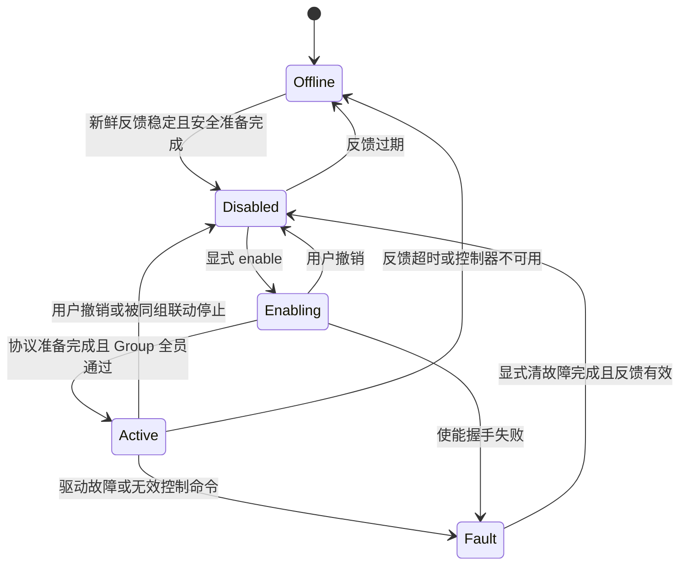

图中的 Disabled 表示驱动已撤销软件输出许可，不表示物理电机已经失能；ready() 还要检查当前反馈、稳定窗口和安全准备结果。StopProgress 单独显示安全动作 Pending、传输完成、DM 已观测 Disabled 或不可达。

### 初次启动

- 所有端点输出许可默认关闭，不能继承旧命令。
- DJI 观察新鲜反馈并安排对应安全组帧；DM 安装好反馈路由后用限频 Disable 等非运动操作探测。
- 不假定 MCU 重启时电机也重启；DM 若仍报告 Enabled，先要求其回到 Disabled，不直接收编为 Active。
- 所有条件满足，Motor 可 ready；CanBus::start 返回不代表电机已经 ready。

### 使能

- enable 必须是业务明确请求；Group 预检查所有成员，任何一个未 ready 则不启动任何成员的使能流程。
- 请求接受后更换代次、清暂存与发布的旧命令，成员进入 Enabling。
- DJI 按组发送安全槽值；同帧里其他独立 Group 的有效命令照常保留。
- DM 非阻塞地发 Enable、等待发送之后的新鲜 Enabled 观测、完成该模式要求的中性准备。每个端点有自己的截止时间。
- Group 全部准备完成，才允许发布新的应用控制目标；某成员失败则整组撤销许可，给已准备的其他成员安排安全动作。
- Active 后首个新命令有有限等待窗口，到期仍无本代次命令就撤销许可，不能无限保持 Active。

这道 Group 屏障只阻止上层运动目标提前提交，不能保证多个实物同时使能。尤其 DM 原生位置/速度模式下，“中性准备”的物理含义需要固件确认：零速度或当前位置目标不等于零力矩，Enable 是否会恢复设备内旧目标也必须确认。协议适配器应固定受支持固件的安全顺序，不能只用全零字节代替中性命令。

### 掉线与重连

- 反馈失效、命令失效都撤销对应独立电机或 Group，清除本代次目标；不存在保持 enable 意图后自动重发旧目标的路径。
- 反馈/链路等暂态故障可自动探测恢复，稳定后回到 Disabled；不会自动 Active。
- 命令超时一般回到 Disabled 并记录 CommandExpired；有持续新鲜反馈不需要为了此错误重启 CAN。
- DM 明确报告的驱动故障、无效控制命令等保持 Fault；需要 clearFault。只对确实可清的故障发 ClearError，不周期性无限清除仍存在的过温/过流原因。
- Group.clearFault 只处理故障成员，不使能任何成员；预检查必须整组已经撤销输出。离线故障成员无法确认清除时保留故障与诊断，健康成员可以保持 Disabled。

业务层急停、遥控解锁、裁判系统授权继续留在业务层。它们调用 Group.disable 并限制下一次 enable 的入口。不要在驱动里再实现一套遥控拨杆或机器人安全状态机。

### 位置参考

通用在线状态无法保证连续位置可信。断线期间的转数未知时，保留有效的单圈绝对角，但连续参考置为无效并更新 reference_generation；不要自动把新的第一帧当成旧位置的连续延伸。

提供一个小而明确的参考建立接口即可，放在 Motor 中：

```cpp
[[nodiscard]] int reseedPosition(double known_position_rad);
```

它只重新建立软件连续坐标，不写电机 Flash、不调用 DM SaveZero。仅允许已撤销输出、反馈新鲜的端点；参数非有限值返回 -EINVAL，仍 Active/Enabling 返回 -EBUSY，反馈不新鲜 -EAGAIN，不支持位置反馈 -ENOTSUP。调用者必须根据外部回零、可信绝对角或明确的“当前点作为相对零点”提供位置，成功后更新参考代次。

Motor.ready 只代表通信和使能准备就绪，不代表任意控制方式都可用。位置控制层必须额外要求其所用参考有效；纯速度控制不必因失去多圈计数而永久阻塞。控制器在 enable_generation 或 reference_generation 改变时重置积分/历史量，并由应用重新提供目标。

## 9. 不同组合下的目标行为

| 故障                                   | 没有 Group 的其他电机        | 同 Group 的其他电机              | 其他 CAN 的独立电机                |
| -------------------------------------- | ---------------------------- | -------------------------------- | ---------------------------------- |
| 某台反馈过期                           | 继续，故障台撤销输出         | 全组撤销                         | 继续                               |
| 某台命令未续期                         | 继续，过期台撤销输出         | 全组撤销                         | 继续                               |
| 某台 DM 驱动报错或意外 Disabled        | 继续，故障台退出 Active      | 全组撤销                         | 继续                               |
| 单台输入越界/NaN/控制方式不支持        | 继续，拒绝并撤销该台输出     | 全组撤销                         | 继续                               |
| CAN 无法完成发送、bus-off、RX 队列溢出 | 本 CAN 所有电机撤销输出      | Group 同时撤销跨 CAN 的相关成员  | 没有关联的继续                     |
| 反馈恢复                               | 保持 Disabled，等待新 enable | 全员 ready 后等待新 Group.enable | 不受影响                           |
| 应用停止 commit，I/O 线程仍运行        | 按各自已发布命令时限撤销     | 对过期成员执行组联动             | 若仍被其他控制流程有效更新则继续   |
| 单个电机配置冲突                       | start 前拒绝对应拓扑         | 组不能使能                       | 其他总线是否运行由业务启动策略决定 |

前提是故障台没有破坏线路本身。如果一台设备把物理 CAN 拖垮，逻辑分组不能保住同线通信。

某台突然没有反馈但同线其他节点仍可应答时，控制器未必报发送错误。因此掉线判断依赖端点反馈年龄，不能依赖 can_send 成功与否。发送完成不证明特定电机已执行；DJI 安全帧最多记录 TxComplete，DM 还可记录新鲜 Disabled 状态的 DriveConfirmed。[Zephyr 发送确认说明](https://docs.zephyrproject.org/latest/hardware/peripherals/can/controller.html)。

多帧或跨 CAN 提交不构成物理原子事务；中途失败之前发出的目标不能回滚。Group 保证的是软件许可和故障联动语义，不应在 API 中承诺所有电机同步动作或同步停止。

<a id="control-interfaces"></a>

## 10. 控制层如何保持优雅

### 10.1 控制模块公开接口

位置/速度控制器保留用户可选择的算法封装，输入直接使用 rad、rad/s 和秒；不新增一层电机通信 Backend。

```cpp
namespace skywalker::control {
class PositionMotor {
public:
    struct Config {
        control_motor_position_config loop{};
        EffortUnit effort_unit;       // 明确 Ampere 或 NewtonMeter
        MotorSafety safety{};
        PositionReference reference;
    };
    PositionMotor(motor::Motor &motor, const Config &config);
    [[nodiscard]] int configure();
    [[nodiscard]] int update(double target_position_rad, float dt_s);
    [[nodiscard]] int reset();
    PositionTelemetry telemetry() const;
};

class VelocityMotor {
public:
    struct Config {
        control_motor_velocity_config loop{};
        EffortUnit effort_unit;
        MotorSafety safety{};
    };
    VelocityMotor(motor::Motor &motor, const Config &config);
    [[nodiscard]] int configure();
    [[nodiscard]] int update(float target_velocity_rad_s, float dt_s);
    [[nodiscard]] int reset();
    VelocityTelemetry telemetry() const;
};
}
```

保留现有控制算法的参数结构；新 MotorSafety 只保存该控制器使用的速度/温度等控制限制，原 MotorSafety 中的通信恢复参数移至 Motor.Timing。Telemetry 至少包括本次使用的 MotorSnapshot、目标、dt、输出 effort 及单位、有效标志和错误；它表达“计算并暂存”的结果，不是实物执行确认。

| 接口      | 调用顺序与结果                                                     | 错误/副作用                                                                                                                                                            |
| --------- | ------------------------------------------------------------------ | ---------------------------------------------------------------------------------------------------------------------------------------------------------------------- |
| 构造      | 仅保存 Motor 引用和配置                                            | 无 I/O、不使能、不发送                                                                                                                                                 |
| configure | 在 CanBus.start 成功后、使能前调用；校验算法参数、能力、单位和限幅 | 无需等第一帧反馈；未 start -EACCES；已配置 -EALREADY；不匹配 -ENOTSUP/-EINVAL/-ERANGE；不更改 Motor 许可                                                               |
| update    | 一次 snapshot → 校验 → 控制计算 → 一次内部 Motor.stage          | 非 Active/未配置 -EACCES；反馈过期 -ESTALE；所需参考/反馈缺失 -ENODATA；非法 dt/目标 -EINVAL/-ERANGE；Active 时失败通过 raiseFault(ControlRejected) 撤销所属电机/Group |
| reset     | 禁用时依据新鲜测量重置积分、滤波与历史值                           | 仍 Active/Enabling -EBUSY；反馈不新鲜 -EAGAIN；所需参考缺失 -ENODATA；不调用 reseedPosition、不改变驱动坐标                                                            |
| telemetry | 按值返回最近一次控制结果                                           | 不执行控制、不发送；跨线程读取需要内部短锁                                                                                                                             |

configure 同时为 Motor 声明一个固定的命令生产者：同一时刻只允许一个 PositionMotor 或 VelocityMotor 绑定同一电机为控制输出源，重复绑定返回 -EBUSY。使用控制器后，业务不再对同一电机混用直接 setter；首版不做多生产者仲裁。控制器私有 stage 路径带绑定身份，直接命令路径在已绑定控制器时拒绝 -EACCES。构造本身不取得这个身份，configure 失败也不残留绑定。

新的 enable_generation/reference_generation 在 update 中被发现时，用私有 resetFrom(snapshot) 重置算法历史；这不是对公开 reset 的违规调用，也不会触发 CAN 恢复。首次本代次控制输出采用零 effort 作为起始值，后续按配置的斜率/PID 输出，当前目标仍必须由业务提供。配置为原生 DM 位置/速度模式时使用 Motor 原生 setter；这些 effort 控制器要求电流或力矩能力，不自动嵌套到设备原生闭环上。

### 10.2 应用调用示例

继续复用现有 C 控制算法，重写 C++ 包装的执行职责。以下也是目标调用示例：

```cpp
static control::PositionMotor yaw_axis{yaw, yaw_config};     // 配置标明 Ampere
static control::PositionMotor pitch_axis{pitch, pitch_config}; // 标明 NewtonMeter

// CanBus.start 成功后分别调用 configure() 并检查返回值。
// 配置阶段检查两份控制配置、所需反馈能力和位置参考方式。
// 使能入口仍只有 gimbal.enable()；Axis 不负责 CAN 生命周期。

if (gimbal.active()) {
    const int yr = yaw_axis.update(yaw_target_rad, dt_s);
    const int pr = yr == 0 ? pitch_axis.update(pitch_target_rad, dt_s) : 0;
    if (yr < 0 || pr < 0)
        gimbal.disable();
}
const auto submit = can1.commit();
// 与直接命令例子相同，处理 submit.error 和异步诊断。
```

Axis.update 读取 Motor 的一致快照、校验控制周期与反馈能力、计算 PID、暂存电流/力矩；它不发送。构造/配置只做控制参数校验；新的输出代次到来时重置控制状态，首次控制输出使用明确的启动策略。

不要保留当前每个 PositionMotor/VelocityMotor 都通过 MotorRuntime 单独 flush/stop/recover 的结构。控制算法发现非法目标、不可用参考或周期异常时，调用 Motor 内部的故障入口，按其 Group 撤销输出；不能只是返回错误却让旧缓存继续有效。

单位依然显式。PositionMotor 的控制配置声明 EffortUnit，配置时检查 Motor 能力；同一控制器不能在更换品牌后继续使用错误的电流/力矩 PID 数值。M2006 无温度反馈、DM 当前无通用绝对角能力等事实仍需正确暴露。

首版无需引入更多 EffortMotor、TransportBackend、AxisBackend 接口；直接 Motor 引用加能力检查足够。若以后确有非 CAN 执行器或主机仿真需求，再依据真实复用点抽出最小接口。

<a id="internal-interfaces"></a>

## 11. 内部实现接口：协议、端点、联动与 I/O

### 11.1 品牌实现只保留四类操作

把协议适配放在现有 drivers/motor/dji 与 drivers/motor/dm 中。使用具体 Config/State 类型的普通函数，再由私有 variant 分派，不建立协议基类继承树。

| 内部函数形态                                                   | 输入/输出                                                                                 | 错误、状态和执行限制                                                                            |
| -------------------------------------------------------------- | ----------------------------------------------------------------------------------------- | ----------------------------------------------------------------------------------------------- |
| validate(config, descriptor, claims)                           | 校验型号参数，生成能力、ID/slot 和固定容量占用声明                                        | 成功才发布输出；-EINVAL/-ERANGE/-ENOSPC；不注册过滤器、不改硬件；启动阶段调用                   |
| decode(config, frame, rx_time, protocol_state, feedback_event) | 解码反馈，保留真实 RX 时刻，输出反馈和原始驱动状态                                        | 不匹配 -ENOENT；格式错误 -EBADMSG；错误不能刷新反馈；运行在 I/O 线程                            |
| encode(config, command, contribution)                          | 返回一帧 DM 命令，或一个 DJI command_id/slot/value 贡献                                   | -ENOTSUP/-EINVAL/-ERANGE；纯编码，不自行发送，不决定其他成员的停机                              |
| stepLifecycle(config, input, state, output)                    | 接收当前时间、请求、反馈和 TX 结果；产生至多一个安全/握手动作，或 Waiting/Prepared/Failed | 不等待，不 sleep；错误携带原始 errno；只描述本端点所需动作，由 CanBus 决定发送顺序和 Group 联动 |

contribution 是内部有限联合类型，例如 DjiSlot 或 CompleteFrame；没有每帧堆分配。LifecycleOutput 也采用固定枚举加必要字段，不引入通用任务图。

不需要把 PID、Group、CAN 恢复和拓扑校验塞进品牌实现。未来新增品牌的工作量应集中在一个配置工厂、这四类函数及一个分派分支，既能复用路由/时限/联动，也不会为了所谓通用性暴露二十个虚方法。

下面以具体品牌 Config/ProtocolState 的普通函数示意签名。DJI 与 DM 各实现一组，由 CanBus 内部的 variant 分派调用；这不是要求新增一个公开 Codec 类。

```cpp
[[nodiscard]] int validate(const Config &config,
                           EndpointDescriptor &out,
                           ClaimBuffer &claims);

[[nodiscard]] int decode(const Config &config,
                         const can_frame &frame,
                         uint64_t rx_time_ms,
                         ProtocolState &state,
                         FeedbackEvent &out);

[[nodiscard]] int encode(const Config &config,
                         const Command &command,
                         TxContribution &out);

LifecycleOutput stepLifecycle(const Config &config,
                              const LifecycleInput &input,
                              ProtocolState &state);
```

| 内部值类型         | 最小内容                                                         | 用途                                              |
| ------------------ | ---------------------------------------------------------------- | ------------------------------------------------- |
| EndpointDescriptor | 协议/模式、motor ID、TX/RX ID、可选 DJI slot、能力、限幅         | start 校验与固定路由；协议状态不存入这里          |
| ClaimBuffer        | 固定容量的方向、ID、共享类型、slot/帧内编号声明                  | 交给 CanBus 做全总线冲突检查                      |
| Command            | Current / Torque / Mit / Velocity / PositionVelocity 的有限联合  | setter 统一暂存的类型化目标，没有无单位通用 float |
| FeedbackEvent      | 解码反馈、原始驱动状态及有效性、原始 rx_time                     | 一次性更新 Motor 快照，并驱动握手/故障处理        |
| TxContribution     | DjiSlot{command_id, slot, raw} 或 CompleteFrame{frame}           | 交给唯一发送者组帧                                |
| LifecycleInput     | 当前单调时间、请求与代次、最新反馈、已发生的发送事件             | 决定本次是否需要推进协议阶段                      |
| LifecycleOutput    | Waiting / Emit / Prepared / Failed，附 action、deadline 或 errno | 一次至多产出一个动作；不等待、不发送              |

LifecycleInput 的发送事件要区分 Submitted、Completed、Failed，并带 action_id 与代次。Emit 只是“希望发送”，不能据此认定硬件已接受或电机已应答；发送器稍后回送相应事件。需要反馈的握手还要等新的反馈观测，不能用 Completed 代替。

decode 不匹配/失败时不能部分覆盖 ProtocolState 或反馈输出；先在局部值中校验，再提交。validate、encode 同样成功才交付输出。跨品牌路由由 CanBus 选择，协议函数不自行猜测另一品牌的帧。

### 11.2 核心对象的内部协作接口

这些方法放在 private 或 detail 中，业务不可直接调用；friend 只授予实际需要访问的 CanBus、Group 与两个控制器。它们是方法边界，不再增加新对象层级。

```cpp
// Motor 内部
int stage(const Command &command, const ProducerIdentity &producer);
StagedCommand copyStaged() const;
void applyRequest(const LifecycleRequest &request);
void acceptFeedback(const FeedbackEvent &event);
void raiseFault(const FaultInfo &fault);

// Group 内部
void trip(Motor &source, const FaultInfo &fault);
void memberPrepared(Motor &member, uint64_t enable_generation);

// CanBus 内部
int validateTopology();
int installRoutes();
void rollbackStart();
void wake();
void ioMain();
void processRx(const RxEvent &event);
void processTx(const TxEvent &event);
void checkDeadlines(uint64_t now_ms);
void pumpTx(uint64_t now_ms);
void recoverController(uint64_t now_ms);
```

ProducerIdentity 只是固定绑定身份，用来拒绝直接命令路径与已绑定控制器的混写；没有任务调度、优先级或动态注册系统。StagedCommand 至少包含 Command、valid、写入时间、命令修订号和 enable_generation。LifecycleRequest 包含 EnsureSafe/Enable/ClearFault、请求代次与发起时刻。

| 方法                 | 谁调用                                    | 参数/结果与必须遵守的约定                                                                                                         |
| -------------------- | ----------------------------------------- | --------------------------------------------------------------------------------------------------------------------------------- |
| Motor.stage          | 公开 setter 或控制器                      | 校验身份、能力、数值、许可；成功更新整个暂存命令；返回 errno；不提交总线快照                                                      |
| Motor.copyStaged     | commit                                    | 按值复制命令和元数据；不更新时间、不标记已发送                                                                                    |
| Motor.applyRequest   | 独立 Motor 生命周期 API / Group           | 修改共享请求与许可元数据，旧目标失效；协议内部握手阶段仍由 I/O 推进                                                               |
| Motor.acceptFeedback | processRx                                 | 短锁更新反馈/位置；故障后先释放端点锁，再走 raiseFault，遵守组锁在前的顺序                                                        |
| Motor.raiseFault     | I/O / 控制器 / setter 校验失败            | 同步撤销自身或所属组许可；保存根因；唤醒安全动作；不等待传输                                                                      |
| Group.trip           | raiseFault / 控制器故障处理               | 关闭共同许可，取消 Pending enable；标记成员安全请求；锁外唤醒各 CAN                                                               |
| Group.memberPrepared | 各成员 I/O                                | 检查成员归属、代次及 enable_pending；设置准备位，全员完成才打开共享许可；迟到/重复事件忽略                                        |
| validateTopology     | start                                     | 调协议 validate，检查全部 claims/成员/容量；错误时不取得硬件控制权                                                                |
| installRoutes        | start                                     | 每个合法共享 RX ID 一条过滤器；返回原始 errno；失败由 rollbackStart 撤销本次资源                                                  |
| rollbackStart        | start 失败路径                            | 释放本次过滤器和 owner；若本次已启动控制器/线程，也先使其静止；幂等，无运动输出                                                   |
| wake                 | API/内部线程；回调使用 ISR 可用的通知路径 | 只发事件，不同步执行 ioMain；重复唤醒可合并，安全意图保存在持久元数据中                                                           |
| processRx            | ioMain                                    | 校验 bus_generation、查路由、decode、acceptFeedback；错误帧只计数，设备故障交 raiseFault                                          |
| processTx            | ioMain                                    | 按 operation_id 匹配在途操作，结算结果并更新 last_tx；向协议送 Completed/Failed；旧代次事件仍需结算原发送槽，但不得推进新代次使能 |
| checkDeadlines       | ioMain                                    | 检查每端点反馈/已发布命令/握手期限及总线 TX 期限，按端点或控制器范围撤销许可                                                      |
| pumpTx               | ioMain                                    | 处理安全/握手动作或最新普通快照；编码、组帧、发送授权重查，最多提交一个在途帧；错误自行记诊断并触发相应故障范围                   |
| recoverController    | ioMain                                    | 检查重试时刻、取消结果、控制器状态；必要时操作 stop/start/recover；失败保留不可输出状态，不阻塞业务等恢复                         |

对连续多个故障通知，Group.trip 可以合并唤醒，但不能丢失正在等待的安全动作。保留最初根因，同时记录后续控制器/安全发送错误；不要让后来的用户 disable 把原错误覆盖为“操作员关闭”。

### 11.3 Zephyr 回调边界

```cpp
// CanBus 的私有静态函数，context 指向应用全生命周期有效的存储。
static void onRx(const device *can, can_frame *frame, void *context);
static void onTxDone(const device *can, int error, void *context);

struct RxEvent {
    can_frame frame;             // 拷贝，不是指针
    uint64_t rx_time_ms;
    uint64_t bus_generation;
};
struct TxEvent {
    uint64_t bus_generation;
    uint64_t operation_id;       // 匹配在途安全/握手/普通发送动作
    int error;
    uint64_t completed_ms;
};
```

onRx 调用固定队列的无等待入队操作；失败只置溢出标志并唤醒。onTxDone 把结果放进独立完成槽并通知线程，不能与 RX 争用同一个可能已满的队列，否则会丢掉用于释放发送上下文的唯一完成信息。

RX 按中断上下文约束实现。TX 完成通知也可能在底层取消操作的调用上下文触发，不能假定总是在 ISR；无论由哪里调用，都只写完成事件并唤醒，不重入业务或协议状态机。

回调上下文中的 operation_id/bus_generation 在发送授权到完成/确认取消期间不可改变。超时之后也不能把新的编号覆盖进旧上下文，企图让迟到回调看起来属于新动作。实现依赖本地 Zephyr 的回调签名，参考 [can.h](/home/shm-white/skywalker_ws/zephyr/include/zephyr/drivers/can.h:282)；无需增加应用层 RX/TX 回调注册功能。

### 11.4 I/O 主循环如何串起这些接口

```text
ioMain:
    首次进入直接执行一轮；后续仅在没有可立即处理的工作时等待事件或最近截止时间
    优先提取 TX 完成并 processTx，再处理 RX 溢出和已到期的发送期限
    消费有限批量 RX，逐个 processRx；不能无限处理 RX 而饿死期限检查
    checkDeadlines(now)
    如果总线需要恢复：
        recoverController(now)
        本轮不发普通目标
    否则：
        读取端点的 Enable / EnsureSafe / ClearFault 请求
        stepLifecycle(input) 生成动作或 Prepared/Failed
        Prepared → Group.memberPrepared，或独立端点激活
        Failed → Motor.raiseFault
        pumpTx(now)
    计算下一次反馈/命令/握手/发送/重试的最近截止时间
    若仍有可立即处理的工作，按预算继续推进；等待中的握手/在途帧不能触发忙等
```

pumpTx 在构造 DJI 组帧前，先统一处理本轮发现的成员故障，再按当前组许可重新生成所有槽位；不能先写入 A 的旧目标、随后发现同组 B 故障，却仍把刚才的 A 值发出去。

取发送授权时一起捕获许可、端点代次和总线代次，标记唯一提交/在途槽，再释放短锁调用 can_send。若涉及多个 Group，按固定顺序获取所需短锁，避免跨 CAN 死锁。许可关闭后不再授权新帧；关闭前已授权的最多一帧仍按第 7 章的残留边界处理。

不持锁进入底层 API，也不让回调递归调用 pumpTx。所有正常命令、握手和安全输出都经过同一个发送入口，才能保证这套调用关系成立。

发送完成是否按期到达看事件里的 completed_ms，不看 I/O 晚些时候处理事件的时间。pumpTx 在底层接受帧后记录 Submitted，processTx 再交付 Completed/Failed；如果完成回调在 can_send 返回前已经发生，也按这个顺序消费协议事件。

### 11.5 必须复用和必须拆除的部分

| 现有位置                                             | 处理方式                                                                                 |
| ---------------------------------------------------- | ---------------------------------------------------------------------------------------- |
| drivers/motor/dji/dji_profiles.cpp                   | 复用 ID 映射、量程、型号能力；与配置工厂连接                                             |
| drivers/motor/dji/dji_protocol.cpp                   | 复用字节编解码和组帧；增加输入边界自检时保持协议一致                                     |
| drivers/motor/dm/dm_protocol.cpp                     | 复用 MIT/位置/速度及特殊命令编解码                                                       |
| dji_motor.cpp / dm_motor.cpp                         | 搬移反馈计算、原始状态解析和命令校验；去掉 device 专有生命周期与独立 owner；补参考有效性 |
| dji_bus.cpp                                          | 删除品牌拥有 CAN 和全 Bus fault 的职责；把四槽聚合搬到 CanBus 内部                       |
| dm_bus.cpp                                           | 搬出共享 Master 路由；把阻塞 arm/recover 改成逐步握手                                    |
| bounded_can_tx.hpp                                   | 保留“回调上下文必须长期有效、取消后才能复用”的约束；合并到 CanBus 唯一发送路径         |
| lib/control/motor_control.cpp                        | 保留控制计算、周期/温度/速度约束所需逻辑；删除重复的 CAN 生命周期包装                    |
| dji_motor_backend / dm_motor_backend                 | 迁移完成后移除单电机独占 Bus 实现                                                        |
| applications/sentry_chassis/src/chassis_hardware.cpp | 可继续作为板级集中组合入口，但引用新的 Motor/Group/CanBus                                |

细节不能机械照搬：旧 DJI enterFaultAndZero 清所有组，旧 DM disableAll 停全部成员，这两者只适合旧 Bus 作为故障范围的结构。新方案必须按许可逐槽/逐电机处理。

另一个容易误用的细节是 DM MIT 的“零力矩”：编码后的全零字节并不代表浮点零。继续用现有量化函数生成目标，且 kp/kd/torque_ff 的限制分别校验；配置的前馈力矩上限不能被解释成硬件实际总力矩上限。

## 12. 按推荐顺序手工实施

这是大重构，建议按下面三个阶段交付。每一阶段只扩大一类行为，保留可对照的旧调用方直到新路径跑通；不要长期维护两种框架。

### 阶段一：先做新核心和两品牌通信

建议目标文件：

```text
include/drivers/motor/
    motor.hpp          # Motor、反馈/诊断值类型与能力接口
    can_bus.hpp        # CanBus 对外接口
    group.hpp          # Group 对外接口
    dji_motor.hpp      # DJI 配置与型号工厂
    dm_motor.hpp       # DM 配置与型号工厂

drivers/motor/
    can_bus.cpp        # 所有权、拓扑检查、I/O、统一发送与路由
    motor.cpp          # 公共端点状态/命令/快照
    group.cpp          # 联动许可与代次
    dji/               # 复用协议和 Profile，增加非阻塞生命周期实现
    dm/                # 复用协议，增加非阻塞生命周期实现
```

私有结构放一份 internal.hpp 即可；若单文件明显过大，再按实际独立职责拆分。现阶段不预先为未来需要创建十几个空模块。

手工顺序：

1. 先定义 MotorInfo、MotorSnapshot、故障原因和协议配置，锁定单位、时间戳及代次语义。
2. 将现有纯协议文件接入工厂/variant 分派，验证 ID/slot 生成仍与原实现一致。
3. 实现 attach/start 的完整校验及回滚：start 安装第 N 个过滤器失败时，移除本次已安装过滤器、释放 CAN owner，不能留下半个系统。
4. 实现唯一 RX 路由和反馈快照；一开始只接收，不请求使能。
5. 加入 I/O 线程、单在途发送、固定快照 commit、安全动作优先级和命令期限检查。
6. 实现单个 Motor 的安全准备、使能、撤销和恢复。
7. 加入 Group 联动和跨 CAN 通知，完成 DJI 同帧不同组的逐槽处理。

各步自检点：构造不发帧；start 不自动运动；错误配置在安装线程前拒绝；失败能回滚；只有 CanBus 路径调用 can_send/start/stop；Group 故障不丢根因；恢复不重放旧目标。

启动时必须统一校验相关 Group 成员已 attach 到某条 CanBus，且同一 Motor 只属于一个 Group。跨 CAN 的两条 Bus 可以依次 start，但所有成员都准备完成之前 Group.enable 必须失败。任一启动失败时，应用可停止后续启动；先启动的总线仍保持输出许可关闭。

### 阶段二：用当前双轴与原生混合样例完成迁移

建议先迁移 samples/robotics/gimbal_control，配置集中到其 board_config.hpp。删去两个独占 Backend 的选择逻辑，创建两个 Motor、一个 CanBus 和一个 Group。供电 GPIO 控制留在板级启动流程：安装 CAN 路由后再按板卡要求打开电机供电，不藏在某个品牌 Backend 构造函数里。

之后迁移 samples/robotics/swerve，专门验证 GM6020 + M3508 同 CAN，以及“同帧不同组”的行为。若补充专用 mixed_bus 样例，应只承担组合驱动验证，避免顺带引入新控制框架。

控制层的 PositionMotor/VelocityMotor 改为引用 Motor，所有真实发送统一移到应用每周期末的 CanBus::commit。周期里的错误处理关闭相关 Group，下一周期是否允许运动仍由原业务门控决定。

自检点：只换 can.attach 绑定即可换总线；只换型号工厂及单位/能力匹配配置即可换品牌；同一 Group 的停机逻辑不需要写 DJI/DM 条件分支。

### 阶段三：迁移正式应用并删除旧架构

把 sentry_chassis 的八台电机放入一个明确的 chassis Group，保留当前全底盘联动语义；如未来要四轮分别降级，另做机械与控制算法设计，再改 Group 划分，不能只少停几个电机就认为完成降级。

逐项迁移 recovery、单电机控制及其他调用方，最后再移除旧品牌 Bus、单电机 Backend、设备树 motor 实例宏及对应绑定。更新 drivers/motor 与 lib/control 的 CMake/Kconfig，保留模型启用选项和容量/线程参数；时间阈值主要下放到端点配置。

过渡期新旧实现必须按固件构建互斥选择，不能在同一物理 CAN 上同时运行旧 Bus 与新 CanBus。旧 owner registry 无法识别新对象，因此不能把“两个模块都自称独占”当成保护。

最终自检：业务代码不直接调用 CAN 发送；型号判断不散落在机器人算法中；对外只剩一种 Motor 和一种 CanBus；旧代码不再编译进同一固件。

## 13. 后续验证与上电步骤

本次没有执行下列检查。它们是用户实施后用于证明设计语义的建议，不是已经通过的结果。

| 验证项目                          | 必须看到的结果                                               |
| --------------------------------- | ------------------------------------------------------------ |
| 启动有跨品牌 TX/RX 冲突           | start 返回 -EADDRINUSE，输出冲突双方；没有创建半套有效发送器 |
| DM 两台同 Master、不同 ID         | 一个过滤器，两个独立反馈快照持续更新                         |
| DJI 同帧两个不同 Group，掉一台    | 故障台槽位为零，健康台槽位继续有效                           |
| DJI + DM 同 Group，掉一台         | 两台均撤销许可，安全输出按各自协议安排                       |
| 同 CAN 两个独立 Group，仅反馈掉线 | 健康组继续，CAN 不因单纯反馈失效被主动重启                   |
| 控制器发送超时或 bus-off          | 本 CAN 全部撤销；跨 CAN 关联组同步撤销软件许可，独立组继续   |
| setter 停止更新但继续 commit      | 到命令时限后撤销；commit 不能续命                            |
| setter 更新但停止 commit          | 已发布命令仍过期；暂存新值不能续命                           |
| disable 后重新 enable             | 旧快照、旧回调、旧 PID 状态不能作为新代次输出使用            |
| DM Enable 应答慢或缺失            | 控制线程不等待；到期只影响对应 Group；无关 CAN 仍被服务      |
| DM 短暂重启后报告 Disabled        | 不继续显示 Active；需要重新完成使能流程                      |
| 反馈队列积压/溢出                 | 不以解码时间伪造新鲜度；溢出可见并关闭输出许可               |
| 断线期间转动多圈                  | 连续参考无效，位置控制拒绝旧参考；绝对角按能力保留           |
| 无效目标、NaN、越界               | 不继续发旧值；所属 Group 撤销并保留原始原因                  |
| MCU 重启但电机未断电              | 新应用初始不 Active，先建立安全状态                          |

每项至少记录本地时间、CAN、Motor/Group 状态、代次、提交序号、TX 与安全动作结果；用 CAN 抓包观察槽位与帧顺序。CAN ACK 不能代替特定电机状态观测；抓包器工作模式是否应答也会改变“没有其他应答节点”的实验条件。

现有工程入口在迁移相应调用方之后可用以下命令构建；接口尚未实现时，不要期待本文代码可编译：

```bash
west build -b dm_mc02 samples/robotics/gimbal_control -d build/gimbal_control
west build -b dm_mc02 samples/robotics/swerve -d build/swerve
west build -b dm_mc02 applications/sentry_chassis -d build/sentry_chassis
```

先保持电机动力关闭或机构可靠支撑，启动 MCU 并检查拓扑/过滤器配置；再打开电机电源，观察 Disabled、反馈和 ID。确认全部 ready 后低限幅使能，先测主动 disable，再分别测单台失联、全部应答消失与恢复。负载 pitch 轴必须有支撑；零电流/Disable 不保证抗重力保持。刷写和实物测试由用户在完成配置核对后执行。

## 14. 首版刻意保留的边界

- 只实现现有 DJI Profile 和 DM J4310 已支持模式，不声称任意 CAN 电机插入即用。
- 固定容量、静态对象、一个业务命令生产线程，不实现运行时热插拔和通用多写入者仲裁。
- 一个电机最多一个 Group；不实现嵌套组、依赖图或可编程故障策略语言。
- 不自动发现电机、不运行时切换模式、不远程改设备参数、不隐式写 Flash。
- 不提供长期命令 FIFO；执行最新、仍有效、属于当前代次的目标。
- 不承诺多电机物理同步或跨 CAN 原子提交。
- 电机、Bus、控制器不共用一个巨大的总状态枚举；只有必要的状态与诊断值。
- 第一版 CanBus 独占控制器的全部收发控制权。若同线还需要非电机通信，必须纳入同一 owner 的 ID 声明与发送路径；不能让旁路 can_send/stop 破坏所有权。确有使用场景时再增加一个明确的非电机端点接口。

通信恢复与驱动故障清除的区别也要保留：主控侧反馈超时可以自动重新观察；如果重连后 DM 明确回报 CommunicationLost 等故障码，它仍属于需要 clearFault 的驱动故障，不自动反复 ClearError。

容量满足不等于时序满足。实施时用实际反馈频率、实际帧占线时间和控制周期估算总线利用率，并测量最坏调度/发送延迟；为每 CAN 设置合理发送期限。不要提前实现复杂带宽调度器，也不要假定固定 2 ms 在所有组合下都适用。

## 15. 最终勾选清单

- [ ] 一个物理 CAN 只有一个 CanBus owner，所有品牌共享接收和发送路径。
- [ ] 电机组合由 C++ 单一配置源定义，设备树保留硬件配置。
- [ ] 构造不 I/O，start 不运动，enable 不阻塞，commit 不冒充执行确认。
- [ ] 单电机与 Group 的故障范围明确，控制器故障按物理范围处理。
- [ ] DJI 同帧各槽由统一发送者生成，DM 同 Master 统一分发。
- [ ] 跨品牌 TX/RX ID 在启动前统一校验，初始化失败完整回滚。
- [ ] 状态、反馈、位置参考、故障根因与安全动作结果能够分别观察。
- [ ] 旧命令不能通过重复 commit、重新使能或旧回调重新生效。
- [ ] DM Enabled/Disabled 与握手时限明确，不阻塞其他控制轴。
- [ ] 控制器取消失败时不复用未结束的回调上下文。
- [ ] 控制层只计算与暂存，所有发送由 CanBus 管理。
- [ ] 新旧架构迁移期间构建互斥，迁移完成后移除旧所有权结构。

尚未验证：新 API 的编译与内存占用、各板卡控制器取消契约、I/O 调度时延、实物电机固件在使能/失联/中性命令下的行为、实际反馈频率和机械参考恢复策略。它们需要在后续实现与上机阶段验证；本文没有把设计建议写成已经实现的能力。
