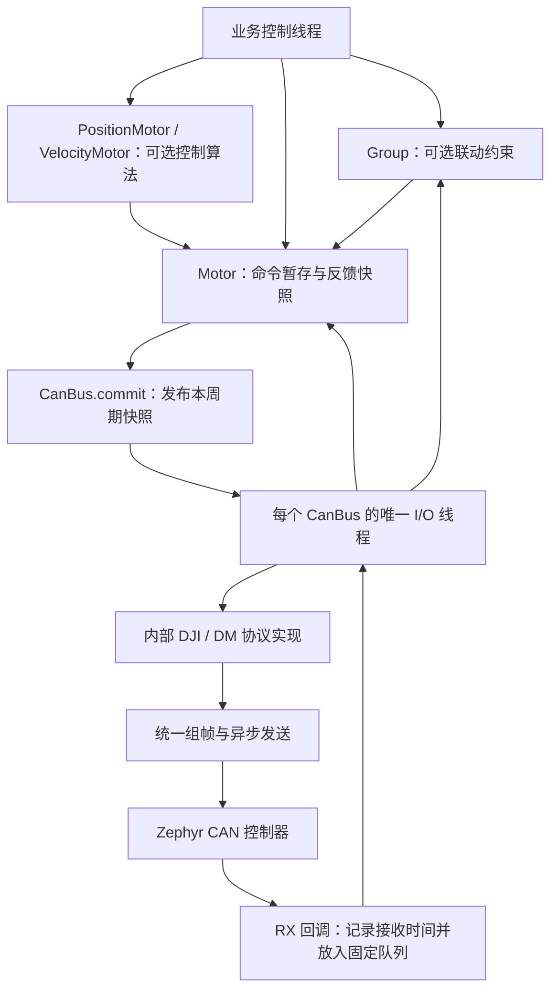
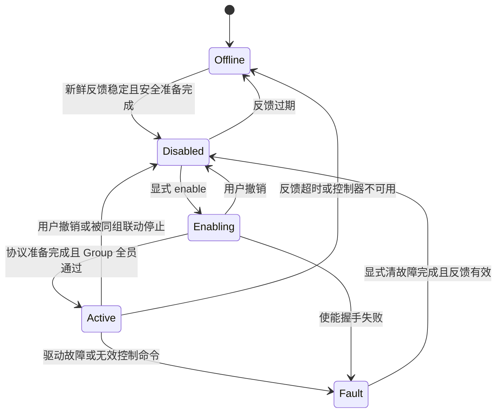

# 多品牌电机驱动重构架构与手工实施指南

本方案基于 2026-09-23 的 SkyWalker 工作区。它是建议架构与手工实施说明，文中的新接口尚未实现；本次仅新增本文，没有修改源码或运行构建。

## 1. 建议采用的最终形态

**三个核心对象：CanBus 管物理传输，Motor 管电机端点，Group 可选地声明一起使能、一起停机的电机集合。**

品牌只决定如何编解码、如何使能和安全撤销输出。上层不用持有 DjiBus、DmBus，也不用为每台电机创建一个独占 CAN 的 Backend。

| 对象 | 职责 | 用户什么时候需要它 |
| --- | --- | --- |
| CanBus | 独占一个 CAN 控制器；统一接收路由、DJI 组帧、发送、通信期限检查与控制器恢复 | 每条实际使用的 CAN 一份 |
| Motor | 一台实物电机的配置、反馈、命令与使能状态 | 每台电机一份 |
| Group | 一组机械上必须联动的电机；可跨品牌、跨 CAN | 云台双轴、完整底盘等需要联动时 |

控制层保留可选的 PositionMotor / VelocityMotor，直接引用 Motor，只负责控制算法和控制相关校验。它们不创建 Bus、不操作 CAN、不拥有另一套通信恢复状态机。

最重要的改变：**共享同一个 CAN 不再意味着必须一起停止输出；是否联动由 Group 声明。控制器本身故障则仍影响整个 CAN，并按 Group 扩散到有机械关联的其他电机。**

## 2. 上层代码应该长什么样

下面是目标 API 示例，不是可直接粘贴编译的现有代码。型号参数来自当前项目的配置形式，实际限幅、零点及 DM 协议范围仍需按实物填写。

```cpp
using namespace skywalker;

// 配置只放在一个 board_config.hpp 或硬件组合文件中。
static motor::CanBus can1{DEVICE_DT_GET(DT_NODELABEL(can1))};

static motor::Motor yaw{motor::dji::gm6020({
    .id = 7,
    .current_limit_a = 1.0f,
    .encoder_zero_ticks = 0,       // 替换为实际标定值
    .current_mode_confirmed = true // 明确确认实物使用电流模式
})};

static motor::Motor pitch{motor::dm::j4310Mit({
    .id = 1,
    .master_id = 0x11,
    .position_max_rad = 12.5f,     // 必须匹配驱动器配置
    .velocity_max_rad_s = 30.0f,
    .torque_max_nm = 10.0f,
    .torque_limit_nm = 0.5f
})};

static motor::Group gimbal{yaw, pitch};

int configureHardware() {
    int ret = can1.attach(yaw, pitch);
    if (ret < 0)
        return ret;
    return can1.start();          // 启动通信；不会自动允许运动
}

// 来自遥控/业务层的明确使能动作，不在每个循环中无条件调用。
void onEnableRequested() {
    const int ret = gimbal.enable();
    if (ret < 0)
        reportEnableError(ret);
    // 返回 0 表示请求接受；需等 active() 才能提交非零控制命令。
}

void onDisableRequested() {
    gimbal.disable();            // 立即撤销软件输出许可，安排异步安全输出
}

void controlTick(float yaw_current_a, float pitch_torque_nm) {
    if (gimbal.active()) {
        const int yr = yaw.setCurrent(yaw_current_a);
        const int pr = yr == 0 ? pitch.setTorque(pitch_torque_nm) : 0;
        if (yr < 0 || pr < 0) {
            gimbal.disable();    // 内部也会拦截无效命令，应用仍显式处理
            reportCommandError(yr, pr);
        }
    }

    const auto submit = can1.commit();
    if (submit.error < 0)
        reportSubmitError(submit.error);
    // commit 成功只代表最新命令快照已提交给发送线程。
    // 实际发送错误通过 motor.snapshot() / can1.status() 获取。
}
```

这段调用保留了三个清楚的动作：请求使能、设置带单位语义的命令、提交本周期输出。没有隐式 arm，没有 setter 中发送整组 CAN 帧，也没有将安培与牛·米混成一个无单位的 setOutput(float)。

如果希望两台独立运行，不创建 gimbal，分别调用 yaw.enable()/pitch.enable()。若希望放到不同 CAN，只改变绑定：

```cpp
// Group gimbal{yaw, pitch} 保持不变。
can1.attach(yaw);
can2.attach(pitch);
// 检查两个 attach 和 start 的返回值后开始业务循环。
// 每周期分别 commit 两条 CAN；物理发送不保证同时发生。
```

如果希望四个轮组分别容错，用四个 Group，每组包含自己的舵向和驱动电机；如果机械上任何一个轮组故障都必须整底盘停止，就把八台放入一个 Group。首版不支持重叠或嵌套 Group，避免故障传播图和相互使能规则复杂化。

## 3. 架构与数据流



内部分成“状态与调度”和“协议函数”即可，不另建 MotorManager、Service、Session、Channel、工厂注册中心或通用插件系统。

**建议首版直接采用每 CAN 一个静态 I/O 线程。** 它值得存在：DM Enable 需要等待电机反馈；控制器 stop/start 也可能耗时。让这些过程在控制线程中等待，会拖慢同线程服务的其他 CAN 和控制轴。I/O 线程还可以在业务漏交命令时独立执行期限检查和安全输出。

这是明确的执行模型，不提供同步/异步两套运行模式。应用调用不等待 CAN 传输或电机握手；每个 I/O 线程有固定栈、固定队列和固定容量数组，不使用堆分配。其开销是每条 CAN 一份线程栈，实施时应按板卡和最大电机数量测量后配置。

## 4. 配置：保留 Zephyr 硬件描述，电机组合改用 C++

建议把最终配置分工定为：

- 设备树保留 MCU CAN 引脚、位速率、外设时钟、供电 GPIO 等硬件描述。
- 应用的 C++ 配置描述电机型号、ID、限幅、减速比、零点、协议模式、时限和 Group。
- 型号工厂只构造配置值。例如 dji::gm6020、dji::m3508、dji::m2006、dm::j4310Mit；它们不创建线程、不注册回调、不发帧。
- 同一台电机只有这一份生效配置，不再同时维护设备树 motor 节点和 yaw_is_dm 之类重复的品牌开关。

这样新增或替换电机时，只改配置和命令/控制器能力约束。当前 Zephyr motor device 层可以在迁移结束后退出；Zephyr 原生 CAN device 继续使用。代价是失去 motor 节点的设备树校验，所以 CanBus::start 必须完成严格的运行前校验。

首版明确支持静态配置：Motor、Group、CanBus 不复制、不移动，生命周期覆盖应用运行；开始通信后不能 attach/detach 或更换电机模式。电机断电重连属于运行故障恢复，不等于动态更改拓扑。

品牌配置保存为一个私有 std::variant<DjiConfig, DmConfig>，运行状态也用对应的有限 variant；协议实现使用 std::visit 分派。当前只有少量品牌，这比一套大虚接口和 opaque 存储更直接。新增品牌允许显式增加一个 variant 分支，不追求无需修改公共内部类型的运行时插件扩展。

不要向应用暴露 variant，也不要把所有品牌参数塞进一个含数十个可选字段的巨型 MotorConfig。型号工厂返回内部配置值，Motor 接口保持一致。

## 5. 建议公开接口与明确语义

以下声明展示边界，结构体字段在实现时可按固定容量展开；没有包含私有实现。所有时间使用本地单调时钟，setter 自己记录写入时间，业务不能伪造时间戳。

```cpp
struct Timing {
    uint32_t feedback_timeout_ms;
    uint32_t command_timeout_ms;
    uint32_t recovery_stable_ms;
    uint32_t enable_timeout_ms;
};

enum class MotorState { Offline, Disabled, Enabling, Active, Fault };
enum class StopProgress { None, Pending, TxComplete, DriveConfirmed, Unreachable };

struct CommitResult {
    int error;                  // 提交错误；0 不代表帧已发送
    uint64_t sequence;          // 本次发布的序号
};

class CanBus {
public:
    explicit CanBus(const device *can, BusOptions options = {});
    [[nodiscard]] int attach(Motor &motor);
    // attach(a, b, ...) 只是便利重载：整批验证通过后才绑定。
    [[nodiscard]] int start();
    [[nodiscard]] CommitResult commit();
    BusStatus status() const;   // 按值返回，不暴露并发可变内部引用
};

class Motor {
public:
    explicit Motor(ModelConfig config); // ModelConfig 为工厂返回的内部类型
    MotorInfo info() const;
    MotorSnapshot snapshot() const;
    bool ready() const;
    bool active() const;

    [[nodiscard]] int enable();       // 独立电机使用
    [[nodiscard]] int disable();      // 独立电机使用，重复调用有效
    [[nodiscard]] int clearFault();   // 异步请求清除可清故障；不使能

    [[nodiscard]] int setCurrent(float ampere);
    [[nodiscard]] int setTorque(float newton_meter);
    [[nodiscard]] int setMit(const MitCommand &command);
    [[nodiscard]] int setVelocity(float rad_s);
    [[nodiscard]] int setPositionVelocity(float rad, float max_rad_s);
};

class Group {
public:
    // 可变参数构造只复制成员地址，不保存 initializer_list 的临时存储。
    // 固定容量，构造时不发帧；成员关系在 start 时统一校验并冻结。
    template<class... Motors> explicit Group(Motors &...members);
    bool ready() const;
    bool active() const;
    [[nodiscard]] int enable();
    void disable();                  // 即时关闭组的软件输出许可
    [[nodiscard]] int clearFault();  // 对有可清故障的成员发起处理
    GroupStatus status() const;
};
```

Timing 放入各型号配置的公共选项中，工厂给出项目可用默认值，用户可按电机覆盖。默认值可以先沿用当前 DJI 20 ms / DM 50 ms 反馈时限，但不能据此承诺实机满足时限；命令时限必须覆盖真实控制周期与调度抖动。

| 接口 | 返回和状态变化 | 边界与错误 |
| --- | --- | --- |
| attach | 成功绑定电机与物理 CAN，不做硬件 I/O | 已绑定/重复对象拒绝；容量不足 -ENOSPC；已 start 后 -EACCES；便利重载要么全成功要么不变 |
| start | 校验完整本地拓扑及相关 Group 成员绑定；安装路由、启动控制器和 I/O 线程；初始输出许可关闭 | 参数错误 -EINVAL/-ERANGE；冲突 -EADDRINUSE；重复控制器 owner -EBUSY；缺容量 -ENOSPC；设备不可用 -ENODEV；重复成功启动 -EALREADY |
| enable | 所有条件满足时接受请求，进入 Enabling，返回 0；实际成功再变 Active | 离线/尚未安全就绪 -EAGAIN；未清驱动故障 -EIO；未 start -EACCES；重复 Enabling/Active 返回 -EALREADY |
| disable | 同步使已有命令失效、关闭输出许可；异步发安全命令 | 无需等待反馈；返回成功不能解释为转子已停止；Group.disable 不依赖健康 CAN 才能撤销许可 |
| setCurrent 等 | 只暂存命令、时间戳和当前使能代次，不发送 | 非 Active -EACCES；能力/模式不支持 -ENOTSUP；NaN/Inf -EINVAL；越界 -ERANGE；Active 时无效命令使所属独立电机或 Group 撤销输出，不能继续沿用旧缓存 |
| commit | 为此 CAN 发布最新完整快照，唤醒 I/O，返回提交序号 | 未 start -EACCES；控制器恢复中 -EAGAIN；批次未发部分可被新批次取代；成员离线不能阻断不相关健康成员的提交 |
| clearFault | 接受可清故障处理请求，返回 0；完成后至多 Disabled | 输出许可尚开时 -EBUSY；不支持的清故障动作 -ENOTSUP；配置错误不能清除；不能顺带 enable |
| snapshot/status | 按值复制一致的状态、反馈与诊断，不阻塞等待反馈 | 必须包含新鲜度/有效位，不能以读取成功替代在线判断 |

已加入 Group 的 Motor.enable/disable/clearFault 返回 -EACCES，要求通过 Group 调用，避免单独使能一个成员破坏联动约束。每个 Motor 的控制命令仍由其 setter 写入；内部故障上报能够直接关闭所属 Group。驱动内部的成员停机函数不调用公开 Motor.disable，因此不会被此限制卡住。

配置函数与 setter/commit 由一个业务控制线程调用。snapshot/status 可跨线程只读。RX/TX 回调只操作固定容量消息入口和完成通知；不运行 PID，不等待，不调用用户业务回调。安全撤销接口可以从正常线程异步请求，不能从 ISR 调用；硬急停的硬件切断不由此接口代替。

协议能力保持真实：DJI 目前支持电流命令；DM MIT 支持力矩和 MIT 复合命令；DM 原生速度/位置模式支持对应原生命令。驱动不会在 setVelocity 中偷偷给 DJI 创建速度 PID，也不会把不具备转矩标定的 DJI 安培转换成牛·米。

### 反馈与诊断结构至少包含

- 反馈：位置/速度/电流/力矩/温度及各自有效位、接收时刻、在线新鲜度、驱动原始状态。
- 位置：区分连续位置和单圈绝对位置；增加 position_reference_valid 与 reference_generation，不承诺断线后仍知道多圈累计值。
- 执行：MotorState、输出许可、enable_generation、StopProgress。
- 故障：原因、原始 errno、发生时间、原故障电机标识、是否由同组其他电机触发。
- 发送：最近关联提交序号、目标发送错误、安全输出错误；CanBus 汇总提交/完成/取代计数及 RX 丢包计数。

不要把健康但被联动停止的电机标成“自身驱动器故障”；保留 source_motor 与停止原因，才能分清根因和联动结果。序号只支持固定数量的最近诊断，不承诺给每一历史 commit 保存无限长事务记录。

## 6. 发送和接收：怎样保持简单又不互相覆盖

### 6.1 DJI 始终由唯一发送者组帧

CanBus 启动时按 command_id 建立固定的四槽映射；同一 command_id 的成员可以来自不同机械 Group。每次真正发送前，用已发布命令、当前许可和代次重新检查各槽：

```text
slots = {0, 0, 0, 0}
for each configured slot in this DJI command ID:
    if motor output is permitted
       and published command belongs to current enable generation
       and feedback and published command are fresh:
        slots[slot] = encoded current
    else:
        slots[slot] = 0
send one complete DJI frame
```

例如 M3508 ID1 与 M2006 ID2 同用 0x200。如果两台属于不同 Group，ID1 反馈超时后该帧应是“槽 0 为零、槽 1 保持 ID2 的有效目标”，不能套用旧 Bus 的整帧清零行为。

如果两台属于同一个 Group，许可同时关闭，两槽都为零。这样“协议必须共享一帧”和“机械必须联动停止”被分别处理。

M3508 的电流原始值换算、M2006 的不同满幅、GM6020 的命令 ID 均复用现有 Profile，不为了统一而改成同一量程。槽索引例：ID7 使用高组槽 2，即 ID-5，不能用 ID-1 越界写入。

### 6.2 DM 每个反馈 ID 只安装一个过滤器

CanBus 按反馈 ID 收到帧后，在内部按协议匹配；共享 Master ID 的 DM 帧再按 data[0] & 0x0F 找 Motor。高 4 bit 作为驱动状态，不参与电机编号。

例如 Master=0x11 的 DM ID1、ID2 只占一个硬件过滤器、两个软件端点。分属不同 Group 也不影响路由。帧长、标准/扩展格式和协议字段不合法时丢弃并计数，不更新在线时间。

RX ISR 必须记录实际接收时刻再入队，不能等线程解码时才记“现在收到”：否则积压的旧反馈会被误判为新鲜。队列溢出属于可观测的通信完整性问题；首版关闭该 CAN 的输出许可并报告 RxOverflow，不能悄悄丢包后继续认为位置连续有效。

### 6.3 统一校验 ID，占用规则只有少数固定类型

不建立通用路由 DSL。内部四种声明已足够：

| 声明 | 合法共享条件 |
| --- | --- |
| 普通独占 TX ID | 不允许另一个端点声明 |
| DJI 组命令 TX ID | 相同帧格式，不同 slot，且交给同一 CanBus 组帧 |
| 普通独占 RX ID | 不允许另一个端点声明 |
| DM 多路反馈 RX ID | 相同协议布局，相同 Master，motor-id 不同 |

同一 CAN 内统一比较 TX 与 RX 的全部 ID，包含 Enable/Disable/ClearError 所用 ID；首版不接受未明确定义的 TX/RX 交叠。不同 CAN 可以复用编号。碰撞错误应直接打印两端名称、ID、方向和协议用途。

必须拒绝的例子：M3508 ID5 与 GM6020 ID1 的 RX 都是 0x205；DM 速度 ID1 的 TX 为 0x201，与 M3508 ID1 的 RX 冲突；两个同模式 DM ID1 即使 Master 不同，TX 仍相同。

DM ID1/ID2 共享 Master 是上述显式允许的协议分发；不同品牌共享反馈 ID 不属于合法情况。

### 6.4 一份最新命令快照，不排长队播放历史目标

每个 Motor 有暂存命令；每条 CanBus 有固定容量的“最新已发布快照”。commit 在短临界区内发布本 CAN 的完整快照和序号，I/O 线程只持有自己的工作副本。

setter 更新暂存时间，commit **不刷新没有被重新写入的命令时间戳**。I/O 的命令过期检查针对已发布命令，而非尚未 commit 的暂存区。这样不断 commit 旧命令、或不断 setter 但忘记 commit，都不能延长旧输出的有效期。

允许不同电机以不同周期更新：未更新的命令在其自身时限内可以继续使用；超过时限就撤销对应 Motor/Group。默认推荐同一控制线程在本周期写完目标后 commit 一次。

新 commit 可取代尚未交给硬件的旧目标；安全输出与 disable 意图不放进这个可覆盖的普通邮箱。它们保存在端点/Group 的许可状态和待处理安全动作中，必须优先执行。

公平性不能随新 commit 重置：轮询游标按帧组/端点保留，避免不断来新快照时永远只发送第一个 DJI 组或第一个 DM。无反馈电机的探测要限频，不能挤占健康组输出；未按期限完成发送必须报告并撤销对应许可。

## 7. 线程、超时与 CAN 所有权

每个 CanBus 的 I/O 线程负责：

1. 处理 RX 数据和 TX 完成通知。
2. 检查反馈、已发布命令及使能握手的到期时间。
3. 处理安全输出、启停握手、正常目标，始终优先满足已触发的安全撤销。
4. 管理控制器 stopped/bus-off/发送超时，统一停止、取消、重新启动。
5. 更新 Motor/Group 状态和诊断快照。

等待下一事件或最近截止时间，禁止 busy loop；不放进 Zephyr 共享系统 workqueue，避免控制器调用耗时阻塞其他系统工作。协议函数不能自行创建线程、安装额外过滤器或调用 can_start/can_stop。

首版每控制器最多一个已提交硬件的发送帧；完成后再发下一帧。TX 回调只记录结果并唤醒线程，不在回调中递归发送。普通待发目标使用有限快照和发送游标，没有无限队列。

发送完成期限作为 BusOptions 配置，与端点命令时限区分。达到期限时：

```text
关闭此 CAN 所有端点的输出许可，并通知它们所属 Group
使旧的命令批次、使能请求和恢复前 RX 数据失效
由此 CAN 的唯一 I/O 线程调用控制器停止/取消
确认待发回调已终结，才允许复用回调上下文与重新启动
按限频策略恢复 CAN、重新观察反馈、建立安全状态
保持输出许可关闭，等待新的显式 enable
```

不能只换一个软件 epoch，就假装已经取消硬件帧。如果底层 can_stop 失败或不能证明旧回调已终结，保留旧上下文，维持不可输出并报告错误；禁止重用该发送槽继续排命令。MC02 本地 M_CAN stop 的回调清理行为可复用，但移植到其他控制器时需要确认对应契约。

控制器 stop/start 的执行可能超过应用期望的控制周期，因此放在本 CAN 线程中；其他 CAN 的 I/O 线程仍可运行。它没有解决物理总线故障本身，MCU 全局关中断或高优先级线程饿死也仍需系统看门狗兜底。

**有界残留必须说清楚。** disable 返回时软件许可已关闭，但已经交给硬件的那一帧可能仍发送成功，不能在不停止整个控制器的情况下普遍保证撤回。首版将硬件在途数限制为一帧，并在完成或发送期限到达后处理安全输出；实际边界还包含线程调度和底层取消耗时。不得把这个协议驱动作为“调用返回就已机械停止”的接口。

并发实现保留短临界区：反馈快照、命令发布和 Group 许可分别保护；不持有 spinlock 执行 CAN API、等待、日志或遍历无界容器。Group 操作先更新自己的许可/代次，再通知成员所在 I/O 线程；跨总线故障传播不能拿着一个 Bus 的锁去等待另一个 Bus。

发送前再次检查许可和代次，避免旧快照越过一次 disable/enable。整个系统应统一锁顺序，先 Group 许可、后端点元数据；对总线发布槽的访问单独完成，避免交叉嵌套。公开的单控制线程约定负责避免两套业务同时写同一电机，I/O 线程与 RX/TX 回调并发仍必须正确同步。

依据：Zephyr CAN 发送完成回调与接收中断语义见[官方 CAN 文档](https://docs.zephyrproject.org/latest/hardware/peripherals/can/controller.html)；本项目实际实现应以锁定的本地 Zephyr 源码为准，不直接套用最新文档新增的 API。

## 8. 生命周期：恢复通信，显式恢复运动

Motor 只保留一套执行状态；Bus 另有通信状态；Group 不复制 Motor 状态机，仅保存成员集合、整体使能请求/代次及最近联动原因。



图中的 Disabled 表示驱动已撤销软件输出许可，不表示物理电机已经失能；ready() 还要检查当前反馈、稳定窗口和安全准备结果。StopProgress 单独显示安全动作 Pending、传输完成、DM 已观测 Disabled 或不可达。

### 初次启动

- 所有端点输出许可默认关闭，不能继承旧命令。
- DJI 观察新鲜反馈并安排对应安全组帧；DM 安装好反馈路由后用限频 Disable 等非运动操作探测。
- 不假定 MCU 重启时电机也重启；DM 若仍报告 Enabled，先要求其回到 Disabled，不直接收编为 Active。
- 所有条件满足，Motor 可 ready；CanBus::start 返回不代表电机已经 ready。

### 使能

- enable 必须是业务明确请求；Group 预检查所有成员，任何一个未 ready 则不启动任何成员的使能流程。
- 请求接受后更换代次、清暂存与发布的旧命令，成员进入 Enabling。
- DJI 按组发送安全槽值；同帧里其他独立 Group 的有效命令照常保留。
- DM 非阻塞地发 Enable、等待发送之后的新鲜 Enabled 观测、完成该模式要求的中性准备。每个端点有自己的截止时间。
- Group 全部准备完成，才允许发布新的应用控制目标；某成员失败则整组撤销许可，给已准备的其他成员安排安全动作。
- Active 后首个新命令有有限等待窗口，到期仍无本代次命令就撤销许可，不能无限保持 Active。

这道 Group 屏障只阻止上层运动目标提前提交，不能保证多个实物同时使能。尤其 DM 原生位置/速度模式下，“中性准备”的物理含义需要固件确认：零速度或当前位置目标不等于零力矩，Enable 是否会恢复设备内旧目标也必须确认。协议适配器应固定受支持固件的安全顺序，不能只用全零字节代替中性命令。

### 掉线与重连

- 反馈失效、命令失效都撤销对应独立电机或 Group，清除本代次目标；不存在保持 enable 意图后自动重发旧目标的路径。
- 反馈/链路等暂态故障可自动探测恢复，稳定后回到 Disabled；不会自动 Active。
- 命令超时一般回到 Disabled 并记录 CommandExpired；有持续新鲜反馈不需要为了此错误重启 CAN。
- DM 明确报告的驱动故障、无效控制命令等保持 Fault；需要 clearFault。只对确实可清的故障发 ClearError，不周期性无限清除仍存在的过温/过流原因。
- Group.clearFault 只处理故障成员，不使能任何成员；预检查必须整组已经撤销输出。离线故障成员无法确认清除时保留故障与诊断，健康成员可以保持 Disabled。

业务层急停、遥控解锁、裁判系统授权继续留在业务层。它们调用 Group.disable 并限制下一次 enable 的入口。不要在驱动里再实现一套遥控拨杆或机器人安全状态机。

### 位置参考

通用在线状态无法保证连续位置可信。断线期间的转数未知时，保留有效的单圈绝对角，但连续参考置为无效并更新 reference_generation；不要自动把新的第一帧当成旧位置的连续延伸。

提供一个小而明确的参考建立接口即可，放在 Motor 中：

```cpp
[[nodiscard]] int reseedPosition(double known_position_rad);
```

它只重新建立软件连续坐标，不写电机 Flash、不调用 DM SaveZero。仅允许已撤销输出、反馈新鲜的端点；参数非有限值返回 -EINVAL，仍 Active/Enabling 返回 -EBUSY，反馈不新鲜 -EAGAIN，不支持位置反馈 -ENOTSUP。调用者必须根据外部回零、可信绝对角或明确的“当前点作为相对零点”提供位置，成功后更新参考代次。

Motor.ready 只代表通信和使能准备就绪，不代表任意控制方式都可用。位置控制层必须额外要求其所用参考有效；纯速度控制不必因失去多圈计数而永久阻塞。控制器在 enable_generation 或 reference_generation 改变时重置积分/历史量，并由应用重新提供目标。

## 9. 不同组合下的目标行为

| 故障 | 没有 Group 的其他电机 | 同 Group 的其他电机 | 其他 CAN 的独立电机 |
| --- | --- | --- | --- |
| 某台反馈过期 | 继续，故障台撤销输出 | 全组撤销 | 继续 |
| 某台命令未续期 | 继续，过期台撤销输出 | 全组撤销 | 继续 |
| 某台 DM 驱动报错或意外 Disabled | 继续，故障台退出 Active | 全组撤销 | 继续 |
| 单台输入越界/NaN/控制方式不支持 | 继续，拒绝并撤销该台输出 | 全组撤销 | 继续 |
| CAN 无法完成发送、bus-off、RX 队列溢出 | 本 CAN 所有电机撤销输出 | Group 同时撤销跨 CAN 的相关成员 | 没有关联的继续 |
| 反馈恢复 | 保持 Disabled，等待新 enable | 全员 ready 后等待新 Group.enable | 不受影响 |
| 应用停止 commit，I/O 线程仍运行 | 按各自已发布命令时限撤销 | 对过期成员执行组联动 | 若仍被其他控制流程有效更新则继续 |
| 单个电机配置冲突 | start 前拒绝对应拓扑 | 组不能使能 | 其他总线是否运行由业务启动策略决定 |

前提是故障台没有破坏线路本身。如果一台设备把物理 CAN 拖垮，逻辑分组不能保住同线通信。

某台突然没有反馈但同线其他节点仍可应答时，控制器未必报发送错误。因此掉线判断依赖端点反馈年龄，不能依赖 can_send 成功与否。发送完成不证明特定电机已执行；DJI 安全帧最多记录 TxComplete，DM 还可记录新鲜 Disabled 状态的 DriveConfirmed。[Zephyr 发送确认说明](https://docs.zephyrproject.org/latest/hardware/peripherals/can/controller.html)。

多帧或跨 CAN 提交不构成物理原子事务；中途失败之前发出的目标不能回滚。Group 保证的是软件许可和故障联动语义，不应在 API 中承诺所有电机同步动作或同步停止。

## 10. 控制层如何保持优雅

继续复用现有 C 控制算法，重写 C++ 包装的执行职责。以下也是目标调用示例：

```cpp
static control::PositionMotor yaw_axis{yaw, yaw_config};     // 配置标明 Ampere
static control::PositionMotor pitch_axis{pitch, pitch_config}; // 标明 NewtonMeter

// 配置阶段检查两份控制配置、所需反馈能力和位置参考方式。
// 使能入口仍只有 gimbal.enable()；Axis 不负责 CAN 生命周期。

if (gimbal.active()) {
    const int yr = yaw_axis.update(yaw_target_rad, dt_s);
    const int pr = yr == 0 ? pitch_axis.update(pitch_target_rad, dt_s) : 0;
    if (yr < 0 || pr < 0)
        gimbal.disable();
}
const auto submit = can1.commit();
// 与直接命令例子相同，处理 submit.error 和异步诊断。
```

Axis.update 读取 Motor 的一致快照、校验控制周期与反馈能力、计算 PID、暂存电流/力矩；它不发送。构造/配置只做控制参数校验；新的输出代次到来时重置控制状态，首次控制输出使用明确的启动策略。

不要保留当前每个 PositionMotor/VelocityMotor 都通过 MotorRuntime 单独 flush/stop/recover 的结构。控制算法发现非法目标、不可用参考或周期异常时，调用 Motor 内部的故障入口，按其 Group 撤销输出；不能只是返回错误却让旧缓存继续有效。

单位依然显式。PositionMotor 的控制配置声明 EffortUnit，配置时检查 Motor 能力；同一控制器不能在更换品牌后继续使用错误的电流/力矩 PID 数值。M2006 无温度反馈、DM 当前无通用绝对角能力等事实仍需正确暴露。

首版无需引入更多 EffortMotor、TransportBackend、AxisBackend 接口；直接 Motor 引用加能力检查足够。若以后确有非 CAN 执行器或主机仿真需求，再依据真实复用点抽出最小接口。

## 11. 品牌实现只保留四类内部操作

把协议适配放在现有 drivers/motor/dji 与 drivers/motor/dm 中。使用具体 Config/State 类型的普通函数，再由私有 variant 分派，不建立协议基类继承树。

| 内部函数形态 | 输入/输出 | 错误、状态和执行限制 |
| --- | --- | --- |
| validate(config, descriptor, claims) | 校验型号参数，生成能力、ID/slot 和固定容量占用声明 | 成功才发布输出；-EINVAL/-ERANGE/-ENOSPC；不注册过滤器、不改硬件；启动阶段调用 |
| decode(config, frame, rx_time, protocol_state, feedback_event) | 解码反馈，保留真实 RX 时刻，输出反馈和原始驱动状态 | 不匹配 -ENOENT；格式错误 -EBADMSG；错误不能刷新反馈；运行在 I/O 线程 |
| encode(config, command, contribution) | 返回一帧 DM 命令，或一个 DJI command_id/slot/value 贡献 | -ENOTSUP/-EINVAL/-ERANGE；纯编码，不自行发送，不决定其他成员的停机 |
| stepLifecycle(config, input, state, output) | 接收当前时间、请求、反馈和 TX 结果；产生至多一个安全/握手动作，或 Waiting/Prepared/Failed | 不等待，不 sleep；错误携带原始 errno；只描述本端点所需动作，由 CanBus 决定发送顺序和 Group 联动 |

contribution 是内部有限联合类型，例如 DjiSlot 或 CompleteFrame；没有每帧堆分配。LifecycleOutput 也采用固定枚举加必要字段，不引入通用任务图。

不需要把 PID、Group、CAN 恢复和拓扑校验塞进品牌实现。未来新增品牌的工作量应集中在一个配置工厂、这四类函数及一个分派分支，既能复用路由/时限/联动，也不会为了所谓通用性暴露二十个虚方法。

### 必须复用和必须拆除的部分

| 现有位置 | 处理方式 |
| --- | --- |
| drivers/motor/dji/dji_profiles.cpp | 复用 ID 映射、量程、型号能力；与配置工厂连接 |
| drivers/motor/dji/dji_protocol.cpp | 复用字节编解码和组帧；增加输入边界自检时保持协议一致 |
| drivers/motor/dm/dm_protocol.cpp | 复用 MIT/位置/速度及特殊命令编解码 |
| dji_motor.cpp / dm_motor.cpp | 搬移反馈计算、原始状态解析和命令校验；去掉 device 专有生命周期与独立 owner；补参考有效性 |
| dji_bus.cpp | 删除品牌拥有 CAN 和全 Bus fault 的职责；把四槽聚合搬到 CanBus 内部 |
| dm_bus.cpp | 搬出共享 Master 路由；把阻塞 arm/recover 改成逐步握手 |
| bounded_can_tx.hpp | 保留“回调上下文必须长期有效、取消后才能复用”的约束；合并到 CanBus 唯一发送路径 |
| lib/control/motor_control.cpp | 保留控制计算、周期/温度/速度约束所需逻辑；删除重复的 CAN 生命周期包装 |
| dji_motor_backend / dm_motor_backend | 迁移完成后移除单电机独占 Bus 实现 |
| applications/sentry_chassis/src/chassis_hardware.cpp | 可继续作为板级集中组合入口，但引用新的 Motor/Group/CanBus |

细节不能机械照搬：旧 DJI enterFaultAndZero 清所有组，旧 DM disableAll 停全部成员，这两者只适合旧 Bus 作为故障范围的结构。新方案必须按许可逐槽/逐电机处理。

另一个容易误用的细节是 DM MIT 的“零力矩”：编码后的全零字节并不代表浮点零。继续用现有量化函数生成目标，且 kp/kd/torque_ff 的限制分别校验；配置的前馈力矩上限不能被解释成硬件实际总力矩上限。

## 12. 按推荐顺序手工实施

这是大重构，建议按下面三个阶段交付。每一阶段只扩大一类行为，保留可对照的旧调用方直到新路径跑通；不要长期维护两种框架。

### 阶段一：先做新核心和两品牌通信

建议目标文件：

```text
include/drivers/motor/
    motor.hpp          # Motor、反馈/诊断值类型与能力接口
    can_bus.hpp        # CanBus 对外接口
    group.hpp          # Group 对外接口
    dji_motor.hpp      # DJI 配置与型号工厂
    dm_motor.hpp       # DM 配置与型号工厂

drivers/motor/
    can_bus.cpp        # 所有权、拓扑检查、I/O、统一发送与路由
    motor.cpp          # 公共端点状态/命令/快照
    group.cpp          # 联动许可与代次
    dji/               # 复用协议和 Profile，增加非阻塞生命周期实现
    dm/                # 复用协议，增加非阻塞生命周期实现
```

私有结构放一份 internal.hpp 即可；若单文件明显过大，再按实际独立职责拆分。现阶段不预先为未来需要创建十几个空模块。

手工顺序：

1. 先定义 MotorInfo、MotorSnapshot、故障原因和协议配置，锁定单位、时间戳及代次语义。
2. 将现有纯协议文件接入工厂/variant 分派，验证 ID/slot 生成仍与原实现一致。
3. 实现 attach/start 的完整校验及回滚：start 安装第 N 个过滤器失败时，移除本次已安装过滤器、释放 CAN owner，不能留下半个系统。
4. 实现唯一 RX 路由和反馈快照；一开始只接收，不请求使能。
5. 加入 I/O 线程、单在途发送、固定快照 commit、安全动作优先级和命令期限检查。
6. 实现单个 Motor 的安全准备、使能、撤销和恢复。
7. 加入 Group 联动和跨 CAN 通知，完成 DJI 同帧不同组的逐槽处理。

各步自检点：构造不发帧；start 不自动运动；错误配置在安装线程前拒绝；失败能回滚；只有 CanBus 路径调用 can_send/start/stop；Group 故障不丢根因；恢复不重放旧目标。

启动时必须统一校验相关 Group 成员已 attach 到某条 CanBus，且同一 Motor 只属于一个 Group。跨 CAN 的两条 Bus 可以依次 start，但所有成员都准备完成之前 Group.enable 必须失败。任一启动失败时，应用可停止后续启动；先启动的总线仍保持输出许可关闭。

### 阶段二：用当前双轴与原生混合样例完成迁移

建议先迁移 samples/robotics/gimbal_control，配置集中到其 board_config.hpp。删去两个独占 Backend 的选择逻辑，创建两个 Motor、一个 CanBus 和一个 Group。供电 GPIO 控制留在板级启动流程：安装 CAN 路由后再按板卡要求打开电机供电，不藏在某个品牌 Backend 构造函数里。

之后迁移 samples/robotics/swerve，专门验证 GM6020 + M3508 同 CAN，以及“同帧不同组”的行为。若补充专用 mixed_bus 样例，应只承担组合驱动验证，避免顺带引入新控制框架。

控制层的 PositionMotor/VelocityMotor 改为引用 Motor，所有真实发送统一移到应用每周期末的 CanBus::commit。周期里的错误处理关闭相关 Group，下一周期是否允许运动仍由原业务门控决定。

自检点：只换 can.attach 绑定即可换总线；只换型号工厂及单位/能力匹配配置即可换品牌；同一 Group 的停机逻辑不需要写 DJI/DM 条件分支。

### 阶段三：迁移正式应用并删除旧架构

把 sentry_chassis 的八台电机放入一个明确的 chassis Group，保留当前全底盘联动语义；如未来要四轮分别降级，另做机械与控制算法设计，再改 Group 划分，不能只少停几个电机就认为完成降级。

逐项迁移 recovery、单电机控制及其他调用方，最后再移除旧品牌 Bus、单电机 Backend、设备树 motor 实例宏及对应绑定。更新 drivers/motor 与 lib/control 的 CMake/Kconfig，保留模型启用选项和容量/线程参数；时间阈值主要下放到端点配置。

过渡期新旧实现必须按固件构建互斥选择，不能在同一物理 CAN 上同时运行旧 Bus 与新 CanBus。旧 owner registry 无法识别新对象，因此不能把“两个模块都自称独占”当成保护。

最终自检：业务代码不直接调用 CAN 发送；型号判断不散落在机器人算法中；对外只剩一种 Motor 和一种 CanBus；旧代码不再编译进同一固件。

## 13. 后续验证与上电步骤

本次没有执行下列检查。它们是用户实施后用于证明设计语义的建议，不是已经通过的结果。

| 验证项目 | 必须看到的结果 |
| --- | --- |
| 启动有跨品牌 TX/RX 冲突 | start 返回 -EADDRINUSE，输出冲突双方；没有创建半套有效发送器 |
| DM 两台同 Master、不同 ID | 一个过滤器，两个独立反馈快照持续更新 |
| DJI 同帧两个不同 Group，掉一台 | 故障台槽位为零，健康台槽位继续有效 |
| DJI + DM 同 Group，掉一台 | 两台均撤销许可，安全输出按各自协议安排 |
| 同 CAN 两个独立 Group，仅反馈掉线 | 健康组继续，CAN 不因单纯反馈失效被主动重启 |
| 控制器发送超时或 bus-off | 本 CAN 全部撤销；跨 CAN 关联组同步撤销软件许可，独立组继续 |
| setter 停止更新但继续 commit | 到命令时限后撤销；commit 不能续命 |
| setter 更新但停止 commit | 已发布命令仍过期；暂存新值不能续命 |
| disable 后重新 enable | 旧快照、旧回调、旧 PID 状态不能作为新代次输出使用 |
| DM Enable 应答慢或缺失 | 控制线程不等待；到期只影响对应 Group；无关 CAN 仍被服务 |
| DM 短暂重启后报告 Disabled | 不继续显示 Active；需要重新完成使能流程 |
| 反馈队列积压/溢出 | 不以解码时间伪造新鲜度；溢出可见并关闭输出许可 |
| 断线期间转动多圈 | 连续参考无效，位置控制拒绝旧参考；绝对角按能力保留 |
| 无效目标、NaN、越界 | 不继续发旧值；所属 Group 撤销并保留原始原因 |
| MCU 重启但电机未断电 | 新应用初始不 Active，先建立安全状态 |

每项至少记录本地时间、CAN、Motor/Group 状态、代次、提交序号、TX 与安全动作结果；用 CAN 抓包观察槽位与帧顺序。CAN ACK 不能代替特定电机状态观测；抓包器工作模式是否应答也会改变“没有其他应答节点”的实验条件。

现有工程入口在迁移相应调用方之后可用以下命令构建；接口尚未实现时，不要期待本文代码可编译：

```bash
west build -b dm_mc02 samples/robotics/gimbal_control -d build/gimbal_control
west build -b dm_mc02 samples/robotics/swerve -d build/swerve
west build -b dm_mc02 applications/sentry_chassis -d build/sentry_chassis
```

先保持电机动力关闭或机构可靠支撑，启动 MCU 并检查拓扑/过滤器配置；再打开电机电源，观察 Disabled、反馈和 ID。确认全部 ready 后低限幅使能，先测主动 disable，再分别测单台失联、全部应答消失与恢复。负载 pitch 轴必须有支撑；零电流/Disable 不保证抗重力保持。刷写和实物测试由用户在完成配置核对后执行。

## 14. 首版刻意保留的边界

- 只实现现有 DJI Profile 和 DM J4310 已支持模式，不声称任意 CAN 电机插入即用。
- 固定容量、静态对象、一个业务命令生产线程，不实现运行时热插拔和通用多写入者仲裁。
- 一个电机最多一个 Group；不实现嵌套组、依赖图或可编程故障策略语言。
- 不自动发现电机、不运行时切换模式、不远程改设备参数、不隐式写 Flash。
- 不提供长期命令 FIFO；执行最新、仍有效、属于当前代次的目标。
- 不承诺多电机物理同步或跨 CAN 原子提交。
- 电机、Bus、控制器不共用一个巨大的总状态枚举；只有必要的状态与诊断值。
- 第一版 CanBus 独占控制器的全部收发控制权。若同线还需要非电机通信，必须纳入同一 owner 的 ID 声明与发送路径；不能让旁路 can_send/stop 破坏所有权。确有使用场景时再增加一个明确的非电机端点接口。

通信恢复与驱动故障清除的区别也要保留：主控侧反馈超时可以自动重新观察；如果重连后 DM 明确回报 CommunicationLost 等故障码，它仍属于需要 clearFault 的驱动故障，不自动反复 ClearError。

容量满足不等于时序满足。实施时用实际反馈频率、实际帧占线时间和控制周期估算总线利用率，并测量最坏调度/发送延迟；为每 CAN 设置合理发送期限。不要提前实现复杂带宽调度器，也不要假定固定 2 ms 在所有组合下都适用。

## 15. 最终勾选清单

- [ ] 一个物理 CAN 只有一个 CanBus owner，所有品牌共享接收和发送路径。
- [ ] 电机组合由 C++ 单一配置源定义，设备树保留硬件配置。
- [ ] 构造不 I/O，start 不运动，enable 不阻塞，commit 不冒充执行确认。
- [ ] 单电机与 Group 的故障范围明确，控制器故障按物理范围处理。
- [ ] DJI 同帧各槽由统一发送者生成，DM 同 Master 统一分发。
- [ ] 跨品牌 TX/RX ID 在启动前统一校验，初始化失败完整回滚。
- [ ] 状态、反馈、位置参考、故障根因与安全动作结果能够分别观察。
- [ ] 旧命令不能通过重复 commit、重新使能或旧回调重新生效。
- [ ] DM Enabled/Disabled 与握手时限明确，不阻塞其他控制轴。
- [ ] 控制器取消失败时不复用未结束的回调上下文。
- [ ] 控制层只计算与暂存，所有发送由 CanBus 管理。
- [ ] 新旧架构迁移期间构建互斥，迁移完成后移除旧所有权结构。

尚未验证：新 API 的编译与内存占用、各板卡控制器取消契约、I/O 调度时延、实物电机固件在使能/失联/中性命令下的行为、实际反馈频率和机械参考恢复策略。它们需要在后续实现与上机阶段验证；本文没有把设计建议写成已经实现的能力。
